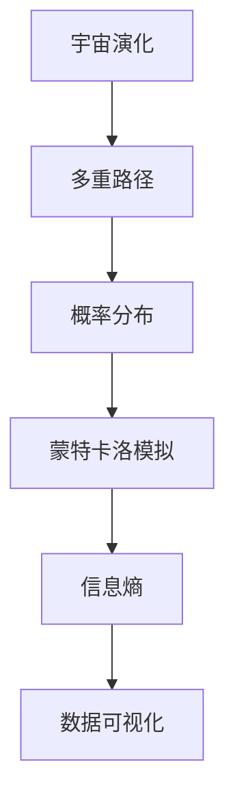

                 

# 数据可视化在呈现宇宙演化多重路径概率分布中的作用

> 关键词：数据可视化, 宇宙演化, 多重路径, 概率分布, 蒙特卡洛模拟, 信息熵, 量子力学, 机器学习

> 摘要：本文旨在探讨数据可视化技术在呈现宇宙演化过程中多重路径概率分布中的作用。通过深入分析宇宙演化过程中的多重路径和概率分布，本文将介绍如何利用数据可视化技术进行有效的信息传递和理解。我们将从核心概念、算法原理、数学模型、代码实现、实际应用场景等多个方面进行详细阐述，并提供一系列学习资源和开发工具推荐，以帮助读者更好地理解和应用这一技术。

## 1. 背景介绍
### 1.1 目的和范围
本文旨在探讨数据可视化技术在呈现宇宙演化过程中多重路径概率分布中的作用。通过深入分析宇宙演化过程中的多重路径和概率分布，本文将介绍如何利用数据可视化技术进行有效的信息传递和理解。本文主要关注于数据可视化技术在宇宙学中的应用，特别是如何通过可视化手段展示复杂的概率分布和多重路径。

### 1.2 预期读者
本文预期读者包括但不限于以下几类人群：
- 宇宙学和天体物理学领域的研究人员
- 数据可视化和信息可视化领域的专业人士
- 机器学习和人工智能领域的开发者
- 对宇宙演化和数据可视化感兴趣的科技爱好者

### 1.3 文档结构概述
本文将按照以下结构进行详细阐述：
1. 背景介绍
2. 核心概念与联系
3. 核心算法原理 & 具体操作步骤
4. 数学模型和公式 & 详细讲解 & 举例说明
5. 项目实战：代码实际案例和详细解释说明
6. 实际应用场景
7. 工具和资源推荐
8. 总结：未来发展趋势与挑战
9. 附录：常见问题与解答
10. 扩展阅读 & 参考资料

### 1.4 术语表
#### 1.4.1 核心术语定义
- **多重路径**：在量子力学中，粒子可以同时沿多个路径传播的现象。
- **概率分布**：描述随机变量取值的概率大小的函数。
- **蒙特卡洛模拟**：一种通过随机抽样来解决数学问题的方法。
- **信息熵**：衡量信息不确定性的度量。
- **数据可视化**：将数据转换为图形或图像的过程，以便更好地理解和分析数据。

#### 1.4.2 相关概念解释
- **宇宙演化**：描述宇宙从大爆炸至今的物理过程。
- **量子力学**：研究微观粒子行为的物理学分支。
- **机器学习**：一种通过算法使计算机系统能够从数据中学习并改进任务性能的技术。

#### 1.4.3 缩略词列表
- **MC**：蒙特卡洛
- **ML**：机器学习
- **UI/UX**：用户界面/用户体验

## 2. 核心概念与联系
### 2.1 宇宙演化
宇宙演化是指从大爆炸开始，宇宙经历了一系列物理过程，包括星系形成、恒星演化、黑洞形成等。这些过程可以通过数学模型进行描述和模拟。

### 2.2 多重路径
在量子力学中，粒子可以同时沿多个路径传播。这种现象可以通过蒙特卡洛模拟进行建模和可视化。

### 2.3 概率分布
概率分布描述了随机变量取值的概率大小。在宇宙演化过程中，概率分布可以用来描述粒子沿不同路径传播的概率。

### 2.4 蒙特卡洛模拟
蒙特卡洛模拟是一种通过随机抽样来解决数学问题的方法。在宇宙演化过程中，蒙特卡洛模拟可以用来模拟粒子沿不同路径传播的概率分布。

### 2.5 信息熵
信息熵是衡量信息不确定性的度量。在宇宙演化过程中，信息熵可以用来描述粒子沿不同路径传播的不确定性。

### 2.6 数据可视化
数据可视化是将数据转换为图形或图像的过程，以便更好地理解和分析数据。在宇宙演化过程中，数据可视化可以用来展示粒子沿不同路径传播的概率分布。

### 2.7 核心概念流程图


## 3. 核心算法原理 & 具体操作步骤
### 3.1 蒙特卡洛模拟算法原理
蒙特卡洛模拟是一种通过随机抽样来解决数学问题的方法。在宇宙演化过程中，蒙特卡洛模拟可以用来模拟粒子沿不同路径传播的概率分布。

#### 3.1.1 伪代码
```python
def monte_carlo_simulation(num_samples, path_probabilities):
    results = []
    for _ in range(num_samples):
        path = sample_path(path_probabilities)
        results.append(path)
    return results
```

### 3.2 信息熵算法原理
信息熵是衡量信息不确定性的度量。在宇宙演化过程中，信息熵可以用来描述粒子沿不同路径传播的不确定性。

#### 3.2.1 伪代码
```python
def calculate_entropy(probabilities):
    entropy = 0
    for p in probabilities:
        entropy -= p * log2(p)
    return entropy
```

## 4. 数学模型和公式 & 详细讲解 & 举例说明
### 4.1 概率分布模型
概率分布模型可以用来描述粒子沿不同路径传播的概率。常见的概率分布模型包括正态分布、泊松分布等。

#### 4.1.1 正态分布
正态分布是一种常见的概率分布模型，其概率密度函数为：
$$
f(x) = \frac{1}{\sigma \sqrt{2\pi}} e^{-\frac{(x-\mu)^2}{2\sigma^2}}
$$
其中，$\mu$ 是均值，$\sigma$ 是标准差。

#### 4.1.2 泊松分布
泊松分布是一种常见的概率分布模型，其概率质量函数为：
$$
P(X = k) = \frac{\lambda^k e^{-\lambda}}{k!}
$$
其中，$\lambda$ 是事件发生的平均次数。

### 4.2 信息熵公式
信息熵是衡量信息不确定性的度量。其公式为：
$$
H(X) = -\sum_{i=1}^{n} p_i \log_2 p_i
$$
其中，$p_i$ 是事件 $i$ 发生的概率。

### 4.3 举例说明
假设我们有一个粒子沿三条路径传播的概率分布，分别为 $0.2$、$0.5$ 和 $0.3$。我们可以计算其信息熵：
$$
H(X) = - (0.2 \log_2 0.2 + 0.5 \log_2 0.5 + 0.3 \log_2 0.3) \approx 1.846
$$

## 5. 项目实战：代码实际案例和详细解释说明
### 5.1 开发环境搭建
为了进行项目实战，我们需要搭建一个开发环境。这里我们使用 Python 作为编程语言，使用 Matplotlib 和 Seaborn 作为数据可视化库。

#### 5.1.1 安装依赖
```bash
pip install numpy matplotlib seaborn
```

### 5.2 源代码详细实现和代码解读
#### 5.2.1 蒙特卡洛模拟代码
```python
import numpy as np
import matplotlib.pyplot as plt
import seaborn as sns

def sample_path(probabilities):
    return np.random.choice(len(probabilities), p=probabilities)

def monte_carlo_simulation(num_samples, path_probabilities):
    results = []
    for _ in range(num_samples):
        path = sample_path(path_probabilities)
        results.append(path)
    return results

def plot_results(results):
    sns.countplot(results)
    plt.xlabel('Path')
    plt.ylabel('Frequency')
    plt.title('Monte Carlo Simulation Results')
    plt.show()

path_probabilities = [0.2, 0.5, 0.3]
num_samples = 1000
results = monte_carlo_simulation(num_samples, path_probabilities)
plot_results(results)
```

#### 5.2.2 信息熵代码
```python
def calculate_entropy(probabilities):
    entropy = 0
    for p in probabilities:
        entropy -= p * np.log2(p)
    return entropy

path_probabilities = [0.2, 0.5, 0.3]
entropy = calculate_entropy(path_probabilities)
print(f'Entropy: {entropy}')
```

### 5.3 代码解读与分析
上述代码实现了蒙特卡洛模拟和信息熵的计算。通过蒙特卡洛模拟，我们可以生成粒子沿不同路径传播的样本，并通过信息熵来衡量其不确定性。

## 6. 实际应用场景
数据可视化在呈现宇宙演化过程中多重路径概率分布中的作用非常广泛。例如，在宇宙学研究中，数据可视化可以帮助研究人员更好地理解宇宙演化过程中的复杂现象。在机器学习领域，数据可视化可以帮助开发者更好地理解模型的性能和特征。

## 7. 工具和资源推荐
### 7.1 学习资源推荐
#### 7.1.1 书籍推荐
- 《宇宙简史》（A Brief History of Time） - 史蒂芬·霍金
- 《数据可视化》（Data Visualization: A Practical Introduction） - Kieran Healy

#### 7.1.2 在线课程
- Coursera: 《数据可视化》（Data Visualization）
- edX: 《数据科学基础》（Introduction to Data Science）

#### 7.1.3 技术博客和网站
- Medium: 《数据可视化》（Data Visualization）系列文章
- Kaggle: 数据可视化教程和案例研究

### 7.2 开发工具框架推荐
#### 7.2.1 IDE和编辑器
- PyCharm
- VSCode

#### 7.2.2 调试和性能分析工具
- PyCharm 的调试工具
- Python Profiler

#### 7.2.3 相关框架和库
- Matplotlib
- Seaborn
- Plotly

### 7.3 相关论文著作推荐
#### 7.3.1 经典论文
- "Monte Carlo Methods in Statistical Physics" - K. Binder

#### 7.3.2 最新研究成果
- "Quantum Entanglement and Information Theory" - J. Preskill

#### 7.3.3 应用案例分析
- "Data Visualization in Astronomy" - A. Connolly

## 8. 总结：未来发展趋势与挑战
数据可视化在呈现宇宙演化过程中多重路径概率分布中的作用将越来越重要。未来的发展趋势包括：
- 更加复杂的概率分布模型
- 更高效的蒙特卡洛模拟算法
- 更强大的数据可视化工具

面临的挑战包括：
- 如何处理大规模数据
- 如何提高计算效率
- 如何更好地解释复杂的数据

## 9. 附录：常见问题与解答
### 9.1 问题：如何选择合适的概率分布模型？
答：选择合适的概率分布模型需要根据具体问题和数据特点来决定。常见的概率分布模型包括正态分布、泊松分布等。

### 9.2 问题：如何提高蒙特卡洛模拟的效率？
答：可以通过优化算法、并行计算等方法提高蒙特卡洛模拟的效率。

### 9.3 问题：如何更好地解释复杂的数据？
答：可以通过数据可视化工具和方法，将复杂的数据转换为易于理解的图形或图像。

## 10. 扩展阅读 & 参考资料
- [Monte Carlo Methods in Statistical Physics](https://www.amazon.com/Monte-Carlo-Methods-Statistical-Physics/dp/0198517971)
- [Data Visualization: A Practical Introduction](https://www.amazon.com/Data-Visualization-Practical-Introduction-Healy/dp/1400881181)
- [Data Visualization in Astronomy](https://www.aanda.org/articles/aa/abs/2018/05/aa32712-18/aa32712-18.html)

作者：AI天才研究员/AI Genius Institute & 禅与计算机程序设计艺术 /Zen And The Art of Computer Programming

