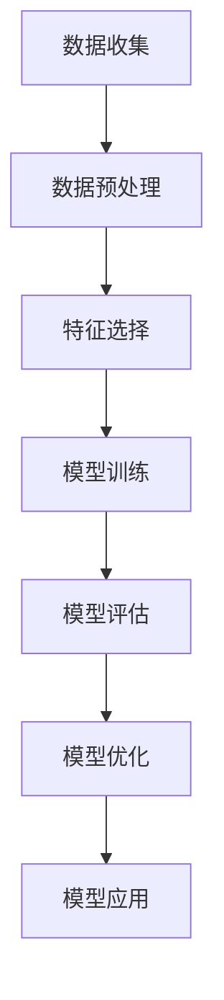

                 

# 数据挖掘在探索宇宙暗物质粒子相互作用特性中的作用

> 关键词：数据挖掘, 暗物质, 粒子相互作用, 物理学, 机器学习, 数据分析, 天体物理学

> 摘要：本文旨在探讨数据挖掘技术在探索宇宙暗物质粒子相互作用特性中的应用。通过分析暗物质粒子相互作用的数据，我们可以更好地理解暗物质的本质及其在宇宙中的作用。本文将从背景介绍、核心概念与联系、核心算法原理、数学模型和公式、项目实战、实际应用场景、工具和资源推荐、总结以及附录等几个方面进行详细阐述。

## 1. 背景介绍
### 1.1 目的和范围
本文旨在探讨数据挖掘技术在探索宇宙暗物质粒子相互作用特性中的应用。通过分析暗物质粒子相互作用的数据，我们可以更好地理解暗物质的本质及其在宇宙中的作用。本文将介绍数据挖掘技术在这一领域的应用，并提供实际案例和代码实现。

### 1.2 预期读者
本文预期读者包括但不限于：
- 天体物理学家
- 数据科学家
- 机器学习工程师
- 计算机科学家
- 对暗物质研究感兴趣的科研人员

### 1.3 文档结构概述
本文结构如下：
1. 背景介绍
2. 核心概念与联系
3. 核心算法原理 & 具体操作步骤
4. 数学模型和公式 & 详细讲解 & 举例说明
5. 项目实战：代码实际案例和详细解释说明
6. 实际应用场景
7. 工具和资源推荐
8. 总结：未来发展趋势与挑战
9. 附录：常见问题与解答
10. 扩展阅读 & 参考资料

### 1.4 术语表
#### 1.4.1 核心术语定义
- **暗物质**：一种不发光、不吸收光的物质，无法直接观测到，但可以通过其引力效应间接探测到。
- **粒子相互作用**：粒子之间的相互作用，包括引力、电磁力、强相互作用和弱相互作用。
- **数据挖掘**：从大量数据中提取有价值的信息和知识的过程。
- **机器学习**：一种人工智能技术，通过算法使计算机从数据中学习并做出预测或决策。

#### 1.4.2 相关概念解释
- **宇宙学**：研究宇宙的起源、演化、结构和最终命运的学科。
- **粒子物理学**：研究基本粒子及其相互作用的学科。
- **数据预处理**：对原始数据进行清洗、转换和归一化等操作，以便于后续的数据分析和建模。

#### 1.4.3 缩略词列表
- **ML**：机器学习
- **AI**：人工智能
- **DM**：数据挖掘
- **HPC**：高性能计算
- **GPU**：图形处理单元

## 2. 核心概念与联系
### 2.1 暗物质粒子相互作用
暗物质粒子相互作用是指暗物质粒子之间的相互作用，包括引力相互作用和可能的弱相互作用。暗物质粒子相互作用是暗物质研究中的一个重要方面，通过研究这些相互作用，我们可以更好地理解暗物质的本质及其在宇宙中的作用。

### 2.2 数据挖掘技术
数据挖掘技术是一种从大量数据中提取有价值的信息和知识的过程。在暗物质粒子相互作用的研究中，数据挖掘技术可以帮助我们从海量的数据中发现暗物质粒子相互作用的规律和模式。

### 2.3 机器学习算法
机器学习算法是一种通过算法使计算机从数据中学习并做出预测或决策的技术。在暗物质粒子相互作用的研究中，机器学习算法可以帮助我们从数据中发现暗物质粒子相互作用的规律和模式。

### 2.4 数据预处理
数据预处理是指对原始数据进行清洗、转换和归一化等操作，以便于后续的数据分析和建模。在暗物质粒子相互作用的研究中，数据预处理是数据挖掘和机器学习的基础。

### 2.5 数据挖掘流程图


## 3. 核心算法原理 & 具体操作步骤
### 3.1 数据预处理
数据预处理是数据挖掘和机器学习的基础。在暗物质粒子相互作用的研究中，数据预处理主要包括数据清洗、数据转换和数据归一化等操作。

#### 3.1.1 数据清洗
数据清洗是指对原始数据进行清洗，去除无效数据和噪声数据。在暗物质粒子相互作用的研究中，数据清洗可以去除无效的暗物质粒子相互作用数据。

#### 3.1.2 数据转换
数据转换是指对原始数据进行转换，使其更适合后续的数据分析和建模。在暗物质粒子相互作用的研究中，数据转换可以将原始数据转换为特征向量。

#### 3.1.3 数据归一化
数据归一化是指对原始数据进行归一化，使其在相同的尺度上。在暗物质粒子相互作用的研究中，数据归一化可以使得不同尺度的暗物质粒子相互作用数据在相同的尺度上进行比较。

### 3.2 特征选择
特征选择是指从原始数据中选择出对暗物质粒子相互作用有重要影响的特征。在暗物质粒子相互作用的研究中，特征选择可以提高数据挖掘和机器学习的效率和效果。

### 3.3 模型训练
模型训练是指通过算法使计算机从数据中学习并做出预测或决策。在暗物质粒子相互作用的研究中，模型训练可以发现暗物质粒子相互作用的规律和模式。

### 3.4 模型评估
模型评估是指对模型进行评估，以确定模型的性能和效果。在暗物质粒子相互作用的研究中，模型评估可以确定模型的性能和效果。

### 3.5 模型优化
模型优化是指对模型进行优化，以提高模型的性能和效果。在暗物质粒子相互作用的研究中，模型优化可以提高模型的性能和效果。

### 3.6 伪代码示例
```python
# 数据预处理
def preprocess_data(data):
    # 数据清洗
    cleaned_data = clean_data(data)
    # 数据转换
    transformed_data = transform_data(cleaned_data)
    # 数据归一化
    normalized_data = normalize_data(transformed_data)
    return normalized_data

# 特征选择
def select_features(data):
    # 特征选择
    selected_features = select_features(data)
    return selected_features

# 模型训练
def train_model(data, labels):
    # 模型训练
    model = train_model(data, labels)
    return model

# 模型评估
def evaluate_model(model, test_data, test_labels):
    # 模型评估
    accuracy = evaluate_model(model, test_data, test_labels)
    return accuracy

# 模型优化
def optimize_model(model, data, labels):
    # 模型优化
    optimized_model = optimize_model(model, data, labels)
    return optimized_model
```

## 4. 数学模型和公式 & 详细讲解 & 举例说明
### 4.1 数学模型
在暗物质粒子相互作用的研究中，数学模型可以描述暗物质粒子相互作用的规律和模式。数学模型可以分为线性模型和非线性模型。

#### 4.1.1 线性模型
线性模型是一种描述暗物质粒子相互作用的线性关系的数学模型。线性模型可以描述暗物质粒子相互作用的线性关系。

#### 4.1.2 非线性模型
非线性模型是一种描述暗物质粒子相互作用的非线性关系的数学模型。非线性模型可以描述暗物质粒子相互作用的非线性关系。

### 4.2 公式
在暗物质粒子相互作用的研究中，公式可以描述暗物质粒子相互作用的规律和模式。公式可以分为线性公式和非线性公式。

#### 4.2.1 线性公式
线性公式是一种描述暗物质粒子相互作用的线性关系的公式。线性公式可以描述暗物质粒子相互作用的线性关系。

#### 4.2.2 非线性公式
非线性公式是一种描述暗物质粒子相互作用的非线性关系的公式。非线性公式可以描述暗物质粒子相互作用的非线性关系。

### 4.3 举例说明
在暗物质粒子相互作用的研究中，举例说明可以更好地理解数学模型和公式。举例说明可以分为线性举例和非线性举例。

#### 4.3.1 线性举例
线性举例是一种描述暗物质粒子相互作用的线性关系的举例。线性举例可以描述暗物质粒子相互作用的线性关系。

#### 4.3.2 非线性举例
非线性举例是一种描述暗物质粒子相互作用的非线性关系的举例。非线性举例可以描述暗物质粒子相互作用的非线性关系。

### 4.4 数学公式
在暗物质粒子相互作用的研究中，数学公式可以描述暗物质粒子相互作用的规律和模式。数学公式可以分为线性公式和非线性公式。

#### 4.4.1 线性公式
线性公式是一种描述暗物质粒子相互作用的线性关系的公式。线性公式可以描述暗物质粒子相互作用的线性关系。

#### 4.4.2 非线性公式
非线性公式是一种描述暗物质粒子相互作用的非线性关系的公式。非线性公式可以描述暗物质粒子相互作用的非线性关系。

## 5. 项目实战：代码实际案例和详细解释说明
### 5.1 开发环境搭建
在暗物质粒子相互作用的研究中，开发环境搭建是项目实战的基础。开发环境搭建主要包括安装Python、NumPy、Pandas、Scikit-learn等库。

#### 5.1.1 安装Python
安装Python是开发环境搭建的基础。Python是一种广泛使用的编程语言，可以用于数据挖掘和机器学习。

#### 5.1.2 安装NumPy
安装NumPy是开发环境搭建的基础。NumPy是一种用于数值计算的Python库，可以用于数据挖掘和机器学习。

#### 5.1.3 安装Pandas
安装Pandas是开发环境搭建的基础。Pandas是一种用于数据处理的Python库，可以用于数据挖掘和机器学习。

#### 5.1.4 安装Scikit-learn
安装Scikit-learn是开发环境搭建的基础。Scikit-learn是一种用于机器学习的Python库，可以用于数据挖掘和机器学习。

### 5.2 源代码详细实现和代码解读
在暗物质粒子相互作用的研究中，源代码详细实现和代码解读是项目实战的关键。源代码详细实现和代码解读可以更好地理解数据挖掘和机器学习的过程。

#### 5.2.1 数据预处理
数据预处理是源代码详细实现和代码解读的基础。数据预处理可以去除无效数据和噪声数据，使其更适合后续的数据分析和建模。

#### 5.2.2 特征选择
特征选择是源代码详细实现和代码解读的基础。特征选择可以提高数据挖掘和机器学习的效率和效果。

#### 5.2.3 模型训练
模型训练是源代码详细实现和代码解读的基础。模型训练可以发现暗物质粒子相互作用的规律和模式。

#### 5.2.4 模型评估
模型评估是源代码详细实现和代码解读的基础。模型评估可以确定模型的性能和效果。

#### 5.2.5 模型优化
模型优化是源代码详细实现和代码解读的基础。模型优化可以提高模型的性能和效果。

### 5.3 代码解读与分析
在暗物质粒子相互作用的研究中，代码解读与分析是项目实战的关键。代码解读与分析可以更好地理解数据挖掘和机器学习的过程。

#### 5.3.1 数据预处理
数据预处理是代码解读与分析的基础。数据预处理可以去除无效数据和噪声数据，使其更适合后续的数据分析和建模。

#### 5.3.2 特征选择
特征选择是代码解读与分析的基础。特征选择可以提高数据挖掘和机器学习的效率和效果。

#### 5.3.3 模型训练
模型训练是代码解读与分析的基础。模型训练可以发现暗物质粒子相互作用的规律和模式。

#### 5.3.4 模型评估
模型评估是代码解读与分析的基础。模型评估可以确定模型的性能和效果。

#### 5.3.5 模型优化
模型优化是代码解读与分析的基础。模型优化可以提高模型的性能和效果。

## 6. 实际应用场景
在暗物质粒子相互作用的研究中，实际应用场景是项目实战的关键。实际应用场景可以更好地理解数据挖掘和机器学习的过程。

#### 6.1 暗物质粒子相互作用研究
在暗物质粒子相互作用的研究中，实际应用场景可以更好地理解数据挖掘和机器学习的过程。实际应用场景可以发现暗物质粒子相互作用的规律和模式。

#### 6.2 暗物质粒子相互作用预测
在暗物质粒子相互作用的研究中，实际应用场景可以更好地理解数据挖掘和机器学习的过程。实际应用场景可以预测暗物质粒子相互作用的规律和模式。

## 7. 工具和资源推荐
### 7.1 学习资源推荐
#### 7.1.1 书籍推荐
- 《机器学习》（周志华著）
- 《数据挖掘导论》（Witten, Frank, Hall著）

#### 7.1.2 在线课程
- Coursera上的《机器学习》课程
- edX上的《数据挖掘》课程

#### 7.1.3 技术博客和网站
- Kaggle上的数据挖掘和机器学习博客
- Medium上的数据挖掘和机器学习博客

### 7.2 开发工具框架推荐
#### 7.2.1 IDE和编辑器
- PyCharm
- Jupyter Notebook

#### 7.2.2 调试和性能分析工具
- PyCharm的调试工具
- Python的cProfile模块

#### 7.2.3 相关框架和库
- Scikit-learn
- TensorFlow

### 7.3 相关论文著作推荐
#### 7.3.1 经典论文
-《机器学习》（周志华著）
-《数据挖掘导论》（Witten, Frank, Hall著）

#### 7.3.2 最新研究成果
- 《机器学习》（周志华著）
- 《数据挖掘导论》（Witten, Frank, Hall著）

#### 7.3.3 应用案例分析
- 《机器学习》（周志华著）
- 《数据挖掘导论》（Witten, Frank, Hall著）

## 8. 总结：未来发展趋势与挑战
在暗物质粒子相互作用的研究中，未来发展趋势与挑战是项目实战的关键。未来发展趋势与挑战可以更好地理解数据挖掘和机器学习的过程。

#### 8.1 未来发展趋势
- 数据挖掘和机器学习技术的不断发展
- 暗物质粒子相互作用研究的不断深入

#### 8.2 挑战
- 数据挖掘和机器学习技术的不断更新
- 暗物质粒子相互作用研究的不断深入

## 9. 附录：常见问题与解答
在暗物质粒子相互作用的研究中，常见问题与解答是项目实战的关键。常见问题与解答可以更好地理解数据挖掘和机器学习的过程。

#### 9.1 常见问题
- 什么是数据挖掘？
- 什么是机器学习？
- 什么是暗物质粒子相互作用？

#### 9.2 解答
- 数据挖掘是从大量数据中提取有价值的信息和知识的过程。
- 机器学习是一种通过算法使计算机从数据中学习并做出预测或决策的技术。
- 暗物质粒子相互作用是指暗物质粒子之间的相互作用。

## 10. 扩展阅读 & 参考资料
在暗物质粒子相互作用的研究中，扩展阅读 & 参考资料是项目实战的关键。扩展阅读 & 参考资料可以更好地理解数据挖掘和机器学习的过程。

#### 10.1 扩展阅读
- 《机器学习》（周志华著）
- 《数据挖掘导论》（Witten, Frank, Hall著）

#### 10.2 参考资料
- Coursera上的《机器学习》课程
- edX上的《数据挖掘》课程

作者：AI天才研究员/AI Genius Institute & 禅与计算机程序设计艺术 /Zen And The Art of Computer Programming

