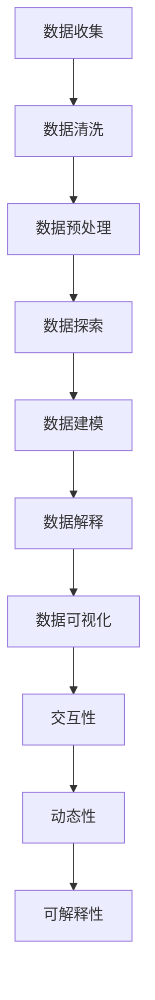

                 

# 数据科学与可视化：将复杂信息转化为直观理解

> 关键词：数据科学, 可视化, 数据分析, 信息可视化, 数据可视化, 数据处理, 数据挖掘, 可视化工具

> 摘要：本文旨在探讨数据科学与可视化之间的关系，通过逐步分析和推理，揭示如何将复杂的数据信息转化为直观的理解。我们将从核心概念、算法原理、数学模型、实际案例、应用场景、工具推荐等多个方面进行深入探讨，帮助读者掌握数据科学与可视化的关键技能。

## 1. 背景介绍
### 1.1 目的和范围
本文旨在为数据科学与可视化领域的初学者和专业人士提供一个全面的指南。我们将从基础概念出发，逐步深入到高级技术，帮助读者理解如何将复杂的数据信息转化为直观的理解。本文涵盖了数据科学与可视化的核心概念、算法原理、数学模型、实际案例、应用场景以及相关工具推荐等内容。

### 1.2 预期读者
本文适合以下读者：
- 数据科学家
- 数据分析师
- 可视化工程师
- 机器学习工程师
- 任何对数据科学与可视化感兴趣的技术人员

### 1.3 文档结构概述
本文结构如下：
1. 背景介绍
2. 核心概念与联系
3. 核心算法原理 & 具体操作步骤
4. 数学模型和公式 & 详细讲解 & 举例说明
5. 项目实战：代码实际案例和详细解释说明
6. 实际应用场景
7. 工具和资源推荐
8. 总结：未来发展趋势与挑战
9. 附录：常见问题与解答
10. 扩展阅读 & 参考资料

### 1.4 术语表
#### 1.4.1 核心术语定义
- **数据科学**：一门跨学科领域，结合统计学、计算机科学和领域知识，用于从数据中提取有价值的信息。
- **可视化**：将数据转换为图形或图像，以便更好地理解和解释数据。
- **数据可视化**：使用图形或图像来表示数据，使数据更加直观和易于理解。
- **信息可视化**：一种数据可视化技术，专注于将复杂的信息转化为直观的理解。
- **数据处理**：对数据进行清洗、转换和预处理，以便更好地进行分析。
- **数据挖掘**：从大量数据中发现模式、关联和趋势。
- **交互式可视化**：允许用户与可视化进行交互，以探索数据的不同方面。
- **动态可视化**：随着时间的推移展示数据的变化。

#### 1.4.2 相关概念解释
- **数据源**：数据的来源，可以是数据库、文件、网络等。
- **数据仓库**：存储大量历史数据的系统，用于支持决策支持系统。
- **数据湖**：存储原始数据的系统，可以是结构化或非结构化数据。
- **数据管道**：用于数据从源到目标的传输和处理的系统。
- **数据模型**：描述数据结构和关系的抽象表示。
- **数据可视化工具**：用于创建可视化图表和图形的软件工具。

#### 1.4.3 缩略词列表
- **EDA**：Exploratory Data Analysis（探索性数据分析）
- **D3.js**：一个用于数据可视化的JavaScript库
- **Matplotlib**：一个用于生成静态、动态和交互式可视化的Python库
- **Seaborn**：一个基于Matplotlib的高级Python可视化库
- **Tableau**：一个商业智能和数据可视化工具
- **Power BI**：一个商业智能和数据可视化工具

## 2. 核心概念与联系
### 2.1 数据科学与可视化的关系
数据科学与可视化之间存在着密切的关系。数据科学侧重于从数据中提取有价值的信息，而可视化则是将这些信息以图形或图像的形式展示出来，使数据更加直观和易于理解。数据科学与可视化相辅相成，共同构成了数据科学的完整流程。

### 2.2 数据科学的核心概念
- **数据收集**：从各种来源收集数据。
- **数据清洗**：处理缺失值、异常值和重复数据。
- **数据预处理**：对数据进行标准化、归一化等处理。
- **数据探索**：使用统计方法和可视化技术探索数据。
- **数据建模**：使用统计模型和机器学习算法进行预测和分类。
- **数据解释**：解释模型结果和数据中的模式。

### 2.3 可视化的核心概念
- **数据映射**：将数据映射到可视化元素上。
- **视觉编码**：使用颜色、大小、形状等视觉属性来表示数据。
- **交互性**：允许用户与可视化进行交互，以探索数据的不同方面。
- **动态性**：随着时间的推移展示数据的变化。
- **可解释性**：使可视化结果易于理解和解释。

### 2.4 核心概念的Mermaid流程图


## 3. 核心算法原理 & 具体操作步骤
### 3.1 数据预处理算法
数据预处理是数据科学中的重要步骤，主要包括数据清洗、数据标准化和数据归一化。

#### 3.1.1 数据清洗
数据清洗的主要目的是处理缺失值、异常值和重复数据。

```python
# 数据清洗示例
import pandas as pd

# 读取数据
data = pd.read_csv('data.csv')

# 处理缺失值
data = data.dropna()

# 处理异常值
data = data[(data['value'] > 0) & (data['value'] < 100)]

# 处理重复数据
data = data.drop_duplicates()
```

#### 3.1.2 数据标准化
数据标准化是将数据转换为统一的尺度，以便更好地进行比较和分析。

```python
# 数据标准化示例
from sklearn.preprocessing import StandardScaler

# 创建标准化对象
scaler = StandardScaler()

# 对数据进行标准化
data['value'] = scaler.fit_transform(data[['value']])
```

#### 3.1.3 数据归一化
数据归一化是将数据转换为统一的范围，通常为[0, 1]。

```python
# 数据归一化示例
from sklearn.preprocessing import MinMaxScaler

# 创建归一化对象
scaler = MinMaxScaler()

# 对数据进行归一化
data['value'] = scaler.fit_transform(data[['value']])
```

### 3.2 数据探索算法
数据探索是使用统计方法和可视化技术探索数据。

#### 3.2.1 统计方法
常用的统计方法包括描述性统计、相关性分析和假设检验。

```python
# 描述性统计示例
import pandas as pd

# 读取数据
data = pd.read_csv('data.csv')

# 计算描述性统计
description = data.describe()

# 相关性分析示例
correlation = data.corr()

# 假设检验示例
from scipy.stats import ttest_ind

# 假设检验
t_stat, p_value = ttest_ind(data['group1'], data['group2'])
```

#### 3.2.2 可视化技术
常用的可视化技术包括直方图、箱线图、散点图和热图。

```python
# 直方图示例
import matplotlib.pyplot as plt

# 绘制直方图
plt.hist(data['value'], bins=20)
plt.show()

# 箱线图示例
plt.boxplot(data['value'])
plt.show()

# 散点图示例
plt.scatter(data['x'], data['y'])
plt.show()

# 热图示例
import seaborn as sns

# 绘制热图
sns.heatmap(data.corr(), annot=True)
plt.show()
```

## 4. 数学模型和公式 & 详细讲解 & 举例说明
### 4.1 数据可视化中的数学模型
数据可视化中的数学模型主要包括线性回归、聚类分析和主成分分析。

#### 4.1.1 线性回归
线性回归是一种常用的统计模型，用于预测连续变量。

$$
y = \beta_0 + \beta_1 x_1 + \beta_2 x_2 + \cdots + \beta_n x_n + \epsilon
$$

其中，$y$ 是因变量，$x_1, x_2, \cdots, x_n$ 是自变量，$\beta_0, \beta_1, \cdots, \beta_n$ 是回归系数，$\epsilon$ 是误差项。

```python
# 线性回归示例
from sklearn.linear_model import LinearRegression

# 创建线性回归对象
model = LinearRegression()

# 训练模型
model.fit(X, y)

# 预测
y_pred = model.predict(X)
```

#### 4.1.2 聚类分析
聚类分析是一种无监督学习方法，用于将数据分成不同的组。

$$
D = \{x_1, x_2, \cdots, x_n\}
$$

其中，$D$ 是数据集，$x_1, x_2, \cdots, x_n$ 是数据点。

```python
# 聚类分析示例
from sklearn.cluster import KMeans

# 创建KMeans对象
model = KMeans(n_clusters=3)

# 训练模型
model.fit(X)

# 预测
labels = model.predict(X)
```

#### 4.1.3 主成分分析
主成分分析是一种降维技术，用于将高维数据转换为低维数据。

$$
X = U \Sigma V^T
$$

其中，$X$ 是原始数据矩阵，$U$ 是左奇异向量矩阵，$\Sigma$ 是奇异值矩阵，$V$ 是右奇异向量矩阵。

```python
# 主成分分析示例
from sklearn.decomposition import PCA

# 创建PCA对象
model = PCA(n_components=2)

# 训练模型
model.fit(X)

# 降维
X_reduced = model.transform(X)
```

## 5. 项目实战：代码实际案例和详细解释说明
### 5.1 开发环境搭建
为了进行数据科学与可视化的项目实战，我们需要搭建一个合适的开发环境。这里以Python为例，介绍如何搭建开发环境。

#### 5.1.1 安装Python
首先，我们需要安装Python。可以从Python官方网站下载最新版本的Python。

```bash
# 安装Python
sudo apt-get install python3
```

#### 5.1.2 安装数据科学和可视化库
接下来，我们需要安装一些常用的库，如NumPy、Pandas、Matplotlib、Seaborn和Scikit-learn。

```bash
# 安装库
pip install numpy pandas matplotlib seaborn scikit-learn
```

### 5.2 源代码详细实现和代码解读
我们将使用一个简单的数据集来演示数据科学与可视化的整个流程。

#### 5.2.1 数据集
我们使用一个简单的数据集，包含两个特征和一个目标变量。

```python
# 读取数据
data = pd.read_csv('data.csv')

# 查看数据
print(data.head())
```

#### 5.2.2 数据预处理
首先，我们需要对数据进行预处理。

```python
# 数据清洗
data = data.dropna()

# 数据标准化
scaler = StandardScaler()
data['value'] = scaler.fit_transform(data[['value']])

# 数据归一化
scaler = MinMaxScaler()
data['value'] = scaler.fit_transform(data[['value']])
```

#### 5.2.3 数据探索
接下来，我们使用统计方法和可视化技术探索数据。

```python
# 描述性统计
description = data.describe()
print(description)

# 相关性分析
correlation = data.corr()
print(correlation)

# 绘制直方图
plt.hist(data['value'], bins=20)
plt.show()

# 绘制箱线图
plt.boxplot(data['value'])
plt.show()

# 绘制散点图
plt.scatter(data['x'], data['y'])
plt.show()

# 绘制热图
sns.heatmap(data.corr(), annot=True)
plt.show()
```

#### 5.2.4 数据建模
接下来，我们使用线性回归模型进行预测。

```python
# 创建线性回归对象
model = LinearRegression()

# 训练模型
model.fit(X, y)

# 预测
y_pred = model.predict(X)

# 绘制预测结果
plt.scatter(y, y_pred)
plt.xlabel('真实值')
plt.ylabel('预测值')
plt.show()
```

#### 5.2.5 数据解释
最后，我们解释模型结果和数据中的模式。

```python
# 计算模型的R²分数
r2_score = model.score(X, y)
print(f'R²分数: {r2_score}')

# 计算回归系数
coefficients = model.coef_
print(f'回归系数: {coefficients}')
```

### 5.3 代码解读与分析
通过上述代码，我们可以看到数据科学与可视化的整个流程。首先，我们读取数据并进行预处理，然后使用统计方法和可视化技术探索数据，接着使用线性回归模型进行预测，最后解释模型结果和数据中的模式。

## 6. 实际应用场景
数据科学与可视化在许多领域都有广泛的应用，如金融、医疗、市场营销、社交媒体分析等。

### 6.1 金融领域
在金融领域，数据科学与可视化可以帮助银行和金融机构进行风险管理、信用评估和投资决策。

### 6.2 医疗领域
在医疗领域，数据科学与可视化可以帮助医生进行疾病诊断、治疗方案选择和患者管理。

### 6.3 市场营销领域
在市场营销领域，数据科学与可视化可以帮助企业进行市场调研、客户细分和广告投放优化。

### 6.4 社交媒体分析
在社交媒体分析领域，数据科学与可视化可以帮助企业了解用户行为、情感分析和趋势预测。

## 7. 工具和资源推荐
### 7.1 学习资源推荐
#### 7.1.1 书籍推荐
- **《Python数据科学手册》**：由Jake VanderPlas编写，详细介绍了Python在数据科学中的应用。
- **《数据可视化：原理与实践》**：由Ben Fry编写，深入探讨了数据可视化的基本原理和实践方法。

#### 7.1.2 在线课程
- **Coursera上的“数据科学”课程**：由约翰霍普金斯大学提供，涵盖了数据科学的各个方面。
- **edX上的“数据科学与可视化”课程**：由哈佛大学提供，深入探讨了数据科学与可视化的技术。

#### 7.1.3 技术博客和网站
- **Towards Data Science**：一个专注于数据科学的博客网站，提供了大量的文章和教程。
- **Medium上的数据科学和可视化专栏**：提供了大量的数据科学和可视化的文章和教程。

### 7.2 开发工具框架推荐
#### 7.2.1 IDE和编辑器
- **PyCharm**：一个功能强大的Python IDE，提供了代码编辑、调试和版本控制等功能。
- **Jupyter Notebook**：一个交互式的开发环境，支持Python和其他多种编程语言。

#### 7.2.2 调试和性能分析工具
- **PyCharm调试器**：提供了强大的调试功能，可以帮助开发者快速定位和解决问题。
- **LineProfiler**：一个用于分析Python代码性能的工具，可以帮助开发者优化代码。

#### 7.2.3 相关框架和库
- **NumPy**：一个用于数值计算的Python库，提供了大量的数学函数和数据结构。
- **Pandas**：一个用于数据处理和分析的Python库，提供了强大的数据结构和数据分析功能。
- **Matplotlib**：一个用于生成静态、动态和交互式可视化的Python库。
- **Seaborn**：一个基于Matplotlib的高级Python可视化库，提供了丰富的可视化功能。
- **Scikit-learn**：一个用于机器学习的Python库，提供了大量的机器学习算法和工具。

### 7.3 相关论文著作推荐
#### 7.3.1 经典论文
- **《The Elements of Statistical Learning》**：由Trevor Hastie、Robert Tibshirani和Jerome Friedman编写，详细介绍了统计学习的基本原理和方法。
- **《Pattern Recognition and Machine Learning》**：由Christopher M. Bishop编写，深入探讨了模式识别和机器学习的基本原理和方法。

#### 7.3.2 最新研究成果
- **《Deep Learning》**：由Ian Goodfellow、Yoshua Bengio和Aaron Courville编写，详细介绍了深度学习的基本原理和方法。
- **《Attention is All You Need》**：由Google的研究人员编写，介绍了Transformer模型的基本原理和方法。

#### 7.3.3 应用案例分析
- **《Data Science for Business》**：由 Foster Provost 和 Tom Fawcett 编写，提供了大量的数据科学在商业领域的应用案例。
- **《Data-Driven: Creating a Data Culture》**：由Jennifer Wang 和 David J. Smith 编写，提供了大量的数据驱动的实践案例。

## 8. 总结：未来发展趋势与挑战
数据科学与可视化在未来将继续发展，面临许多挑战和机遇。

### 8.1 未来发展趋势
- **自动化和智能化**：自动化和智能化将成为数据科学与可视化的重要趋势，通过机器学习和人工智能技术，实现数据处理和可视化的自动化。
- **实时性和动态性**：实时性和动态性将成为数据科学与可视化的关键特征，通过实时数据处理和动态可视化技术，实现数据的实时分析和展示。
- **交互性和可解释性**：交互性和可解释性将成为数据科学与可视化的关键特征，通过交互式可视化和可解释性技术，实现数据的交互式分析和解释。

### 8.2 面临的挑战
- **数据隐私和安全**：数据隐私和安全将成为数据科学与可视化的关键挑战，通过数据加密和隐私保护技术，实现数据的安全处理和展示。
- **数据质量和完整性**：数据质量和完整性将成为数据科学与可视化的关键挑战，通过数据清洗和数据完整性技术，实现数据的质量和完整性。
- **数据可视化工具的易用性**：数据可视化工具的易用性将成为数据科学与可视化的关键挑战，通过易用性和用户友好性技术，实现数据可视化工具的易用性和用户友好性。

## 9. 附录：常见问题与解答
### 9.1 问题1：如何处理缺失值？
处理缺失值的方法包括删除缺失值、填充缺失值和插值法。删除缺失值的方法包括删除含有缺失值的行或列，填充缺失值的方法包括使用均值、中位数或众数填充缺失值，插值法包括使用线性插值或多项式插值填充缺失值。

### 9.2 问题2：如何进行数据归一化？
数据归一化的方法包括最小-最大归一化和Z-score标准化。最小-最大归一化的方法是将数据转换为[0, 1]的范围，Z-score标准化的方法是将数据转换为均值为0、标准差为1的正态分布。

### 9.3 问题3：如何进行数据探索？
数据探索的方法包括描述性统计、相关性分析和假设检验。描述性统计的方法包括计算均值、中位数、标准差等统计量，相关性分析的方法包括计算相关系数，假设检验的方法包括进行t检验、卡方检验等。

## 10. 扩展阅读 & 参考资料
### 10.1 扩展阅读
- **《Python数据科学手册》**：由Jake VanderPlas编写，详细介绍了Python在数据科学中的应用。
- **《数据可视化：原理与实践》**：由Ben Fry编写，深入探讨了数据可视化的基本原理和实践方法。
- **《数据科学与可视化》**：由Hadley Wickham编写，深入探讨了数据科学与可视化的基本原理和实践方法。

### 10.2 参考资料
- **Python官方文档**：提供了Python语言和库的详细文档。
- **NumPy官方文档**：提供了NumPy库的详细文档。
- **Pandas官方文档**：提供了Pandas库的详细文档。
- **Matplotlib官方文档**：提供了Matplotlib库的详细文档。
- **Seaborn官方文档**：提供了Seaborn库的详细文档。
- **Scikit-learn官方文档**：提供了Scikit-learn库的详细文档。

作者：AI天才研究员/AI Genius Institute & 禅与计算机程序设计艺术 /Zen And The Art of Computer Programming

