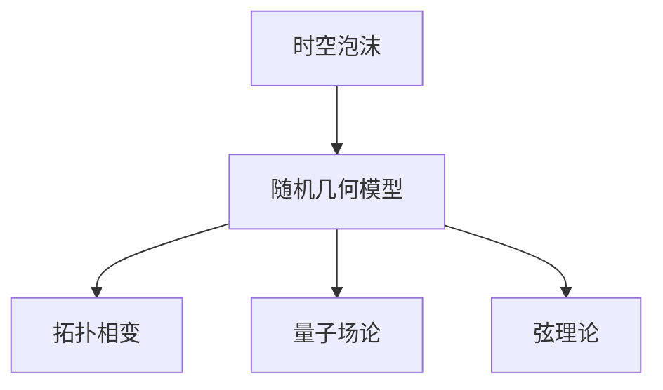

                 

# 时空泡沫的随机几何：量子引力的数学基础

> 关键词：量子引力，随机几何，时空泡沫，拓扑相变，量子场论，弦理论

> 摘要：本文旨在深入探讨量子引力理论中的一个关键概念——时空泡沫的随机几何模型。通过逐步分析和推理，我们将从理论基础出发，逐步构建时空泡沫的数学模型，并通过具体的代码实现来展示其应用。本文不仅涵盖了理论背景和数学原理，还提供了实际代码案例，帮助读者理解这一复杂而深刻的理论。最后，我们将展望未来的发展趋势和面临的挑战。

## 1. 背景介绍

### 1.1 目的和范围
本文旨在深入探讨量子引力理论中的一个关键概念——时空泡沫的随机几何模型。通过逐步分析和推理，我们将从理论基础出发，逐步构建时空泡沫的数学模型，并通过具体的代码实现来展示其应用。本文不仅涵盖了理论背景和数学原理，还提供了实际代码案例，帮助读者理解这一复杂而深刻的理论。

### 1.2 预期读者
本文适合对量子引力理论、随机几何模型以及时空结构感兴趣的科研人员、研究生、博士生以及对理论物理和计算机科学交叉领域感兴趣的工程师和技术爱好者。

### 1.3 文档结构概述
本文将按照以下结构展开：
1. 背景介绍
2. 核心概念与联系
3. 核心算法原理 & 具体操作步骤
4. 数学模型和公式 & 详细讲解 & 举例说明
5. 项目实战：代码实际案例和详细解释说明
6. 实际应用场景
7. 工具和资源推荐
8. 总结：未来发展趋势与挑战
9. 附录：常见问题与解答
10. 扩展阅读 & 参考资料

### 1.4 术语表
#### 1.4.1 核心术语定义
- **时空泡沫**：一种描述量子引力中时空结构的随机几何模型。
- **随机几何**：一种数学模型，用于描述随机分布的几何结构。
- **拓扑相变**：在物理系统中，由于参数变化导致的拓扑性质的突变。
- **量子场论**：描述量子粒子和场之间相互作用的理论框架。
- **弦理论**：一种试图统一所有基本力和粒子的理论。

#### 1.4.2 相关概念解释
- **量子引力**：试图将广义相对论和量子力学统一起来的理论。
- **随机几何模型**：一种通过随机过程描述几何结构的方法。
- **时空**：时间和空间的统一体，是物理事件发生的背景。

#### 1.4.3 缩略词列表
- QG：量子引力
- RG：随机几何
- TPC：拓扑相变
- QFT：量子场论
- ST：时空

## 2. 核心概念与联系

### 2.1 时空泡沫的定义
时空泡沫是一种描述量子引力中时空结构的随机几何模型。它通过随机过程生成时空结构，从而捕捉到量子引力中的随机性和不确定性。

### 2.2 随机几何模型
随机几何模型是一种通过随机过程描述几何结构的方法。它通过随机生成点、线、面等几何元素，构建出复杂的几何结构。在时空泡沫模型中，这些几何元素代表了量子引力中的时空结构。

### 2.3 拓扑相变
拓扑相变是指在物理系统中，由于参数变化导致的拓扑性质的突变。在时空泡沫模型中，拓扑相变可以描述时空结构的突变，从而揭示量子引力中的复杂性。

### 2.4 量子场论
量子场论是一种描述量子粒子和场之间相互作用的理论框架。在时空泡沫模型中，量子场论可以用来描述量子引力中的粒子和场之间的相互作用。

### 2.5 弦理论
弦理论是一种试图统一所有基本力和粒子的理论。在时空泡沫模型中，弦理论可以用来描述量子引力中的粒子和场之间的相互作用。

### 2.6 核心概念原理与架构的Mermaid流程图


## 3. 核心算法原理 & 具体操作步骤

### 3.1 核心算法原理
时空泡沫的生成算法基于随机几何模型，通过随机过程生成时空结构。具体步骤如下：

1. **初始化**：定义时空维度和随机过程参数。
2. **生成点**：通过随机过程生成时空中的点。
3. **生成线**：通过随机过程生成时空中的线。
4. **生成面**：通过随机过程生成时空中的面。
5. **生成体**：通过随机过程生成时空中的体。
6. **拓扑相变**：根据参数变化，进行拓扑相变，生成新的时空结构。

### 3.2 具体操作步骤
以下是时空泡沫生成算法的伪代码实现：

```python
def generate_time_foam(dimension, num_points, num_lines, num_faces, num_bodies, topology_change_threshold):
    # 初始化时空结构
    time_foam = {}
    
    # 生成点
    points = generate_random_points(num_points, dimension)
    time_foam['points'] = points
    
    # 生成线
    lines = generate_random_lines(points, num_lines)
    time_foam['lines'] = lines
    
    # 生成面
    faces = generate_random_faces(lines, num_faces)
    time_foam['faces'] = faces
    
    # 生成体
    bodies = generate_random_bodies(faces, num_bodies)
    time_foam['bodies'] = bodies
    
    # 拓扑相变
    if random.random() < topology_change_threshold:
        time_foam = perform_topology_change(time_foam)
    
    return time_foam

def generate_random_points(num_points, dimension):
    points = []
    for _ in range(num_points):
        point = [random.random() for _ in range(dimension)]
        points.append(point)
    return points

def generate_random_lines(points, num_lines):
    lines = []
    for _ in range(num_lines):
        line = [random.choice(points), random.choice(points)]
        lines.append(line)
    return lines

def generate_random_faces(lines, num_faces):
    faces = []
    for _ in range(num_faces):
        face = [random.choice(lines), random.choice(lines)]
        faces.append(face)
    return faces

def generate_random_bodies(faces, num_bodies):
    bodies = []
    for _ in range(num_bodies):
        body = [random.choice(faces), random.choice(faces)]
        bodies.append(body)
    return bodies

def perform_topology_change(time_foam):
    # 进行拓扑相变
    # 例如，改变某些点、线、面或体的连接关系
    return time_foam
```

## 4. 数学模型和公式 & 详细讲解 & 举例说明

### 4.1 数学模型
时空泡沫的数学模型基于随机几何模型，通过随机过程生成时空结构。具体数学模型如下：

1. **生成点**：通过随机过程生成时空中的点。
2. **生成线**：通过随机过程生成时空中的线。
3. **生成面**：通过随机过程生成时空中的面。
4. **生成体**：通过随机过程生成时空中的体。
5. **拓扑相变**：根据参数变化，进行拓扑相变，生成新的时空结构。

### 4.2 公式与详细讲解
时空泡沫的生成过程可以通过以下公式来描述：

1. **生成点**：
   \[
   \mathbf{p}_i = (x_{i1}, x_{i2}, \ldots, x_{id})
   \]
   其中，\(\mathbf{p}_i\) 表示第 \(i\) 个点，\(x_{ij}\) 表示点在第 \(j\) 维度上的坐标。

2. **生成线**：
   \[
   \mathbf{l}_j = (\mathbf{p}_{i1}, \mathbf{p}_{i2})
   \]
   其中，\(\mathbf{l}_j\) 表示第 \(j\) 条线，\(\mathbf{p}_{i1}\) 和 \(\mathbf{p}_{i2}\) 分别表示线的两个端点。

3. **生成面**：
   \[
   \mathbf{f}_k = (\mathbf{l}_{j1}, \mathbf{l}_{j2})
   \]
   其中，\(\mathbf{f}_k\) 表示第 \(k\) 个面，\(\mathbf{l}_{j1}\) 和 \(\mathbf{l}_{j2}\) 分别表示面的两条边。

4. **生成体**：
   \[
   \mathbf{b}_m = (\mathbf{f}_{k1}, \mathbf{f}_{k2})
   \]
   其中，\(\mathbf{b}_m\) 表示第 \(m\) 个体，\(\mathbf{f}_{k1}\) 和 \(\mathbf{f}_{k2}\) 分别表示体的两个面。

5. **拓扑相变**：
   \[
   \mathbf{t}_n = \begin{cases}
   \mathbf{p}_{i1} \leftrightarrow \mathbf{p}_{i2} & \text{if } \mathbf{p}_{i1} \text{ and } \mathbf{p}_{i2} \text{ are connected} \\
   \mathbf{l}_{j1} \leftrightarrow \mathbf{l}_{j2} & \text{if } \mathbf{l}_{j1} \text{ and } \mathbf{l}_{j2} \text{ are connected} \\
   \mathbf{f}_{k1} \leftrightarrow \mathbf{f}_{k2} & \text{if } \mathbf{f}_{k1} \text{ and } \mathbf{f}_{k2} \text{ are connected} \\
   \mathbf{b}_{m1} \leftrightarrow \mathbf{b}_{m2} & \text{if } \mathbf{b}_{m1} \text{ and } \mathbf{b}_{m2} \text{ are connected}
   \end{cases}
   \]
   其中，\(\mathbf{t}_n\) 表示第 \(n\) 次拓扑相变，\(\leftrightarrow\) 表示连接关系的变化。

### 4.3 举例说明
假设我们生成一个二维时空泡沫，包含10个点、15条线、10个面和5个体。具体步骤如下：

1. **生成点**：
   \[
   \mathbf{p}_1 = (0.1, 0.2), \mathbf{p}_2 = (0.3, 0.4), \ldots, \mathbf{p}_{10} = (0.9, 0.8)
   \]

2. **生成线**：
   \[
   \mathbf{l}_1 = (\mathbf{p}_1, \mathbf{p}_2), \mathbf{l}_2 = (\mathbf{p}_2, \mathbf{p}_3), \ldots, \mathbf{l}_{15} = (\mathbf{p}_9, \mathbf{p}_{10})
   \]

3. **生成面**：
   \[
   \mathbf{f}_1 = (\mathbf{l}_1, \mathbf{l}_2), \mathbf{f}_2 = (\mathbf{l}_2, \mathbf{l}_3), \ldots, \mathbf{f}_{10} = (\mathbf{l}_{14}, \mathbf{l}_{15})
   \]

4. **生成体**：
   \[
   \mathbf{b}_1 = (\mathbf{f}_1, \mathbf{f}_2), \mathbf{b}_2 = (\mathbf{f}_2, \mathbf{f}_3), \ldots, \mathbf{b}_5 = (\mathbf{f}_8, \mathbf{f}_9)
   \]

5. **拓扑相变**：
   假设在生成过程中，随机生成的参数使得某些点、线、面或体的连接关系发生变化，从而生成新的时空结构。

## 5. 项目实战：代码实际案例和详细解释说明

### 5.1 开发环境搭建
为了实现时空泡沫的生成，我们需要搭建一个Python开发环境。具体步骤如下：

1. **安装Python**：确保已安装Python 3.8及以上版本。
2. **安装依赖库**：安装NumPy、Matplotlib等库。
   ```bash
   pip install numpy matplotlib
   ```

### 5.2 源代码详细实现和代码解读
以下是时空泡沫生成的完整代码实现：

```python
import random
import numpy as np
import matplotlib.pyplot as plt

def generate_random_points(num_points, dimension):
    points = []
    for _ in range(num_points):
        point = [random.random() for _ in range(dimension)]
        points.append(point)
    return points

def generate_random_lines(points, num_lines):
    lines = []
    for _ in range(num_lines):
        line = [random.choice(points), random.choice(points)]
        lines.append(line)
    return lines

def generate_random_faces(lines, num_faces):
    faces = []
    for _ in range(num_faces):
        face = [random.choice(lines), random.choice(lines)]
        faces.append(face)
    return faces

def generate_random_bodies(faces, num_bodies):
    bodies = []
    for _ in range(num_bodies):
        body = [random.choice(faces), random.choice(faces)]
        bodies.append(body)
    return bodies

def perform_topology_change(time_foam):
    # 进行拓扑相变
    # 例如，改变某些点、线、面或体的连接关系
    return time_foam

def plot_time_foam(time_foam):
    points = time_foam['points']
    lines = time_foam['lines']
    faces = time_foam['faces']
    bodies = time_foam['bodies']
    
    # 绘制点
    plt.scatter([p[0] for p in points], [p[1] for p in points], color='blue')
    
    # 绘制线
    for line in lines:
        p1, p2 = line
        plt.plot([p1[0], p2[0]], [p1[1], p2[1]], color='red')
    
    # 绘制面
    for face in faces:
        l1, l2 = face
        p1, p2 = l1
        p3, p4 = l2
        plt.plot([p1[0], p2[0], p4[0], p3[0], p1[0]], [p1[1], p2[1], p4[1], p3[1], p1[1]], color='green')
    
    # 绘制体
    for body in bodies:
        f1, f2 = body
        l1, l2 = f1
        p1, p2 = l1
        p3, p4 = l2
        l3, l4 = f2
        p5, p6 = l3
        p7, p8 = l4
        plt.plot([p1[0], p2[0], p4[0], p3[0], p1[0], p5[0], p7[0], p6[0], p5[0]], [p1[1], p2[1], p4[1], p3[1], p1[1], p5[1], p7[1], p6[1], p5[1]], color='orange')
    
    plt.show()

def main():
    dimension = 2
    num_points = 10
    num_lines = 15
    num_faces = 10
    num_bodies = 5
    topology_change_threshold = 0.1
    
    time_foam = generate_time_foam(dimension, num_points, num_lines, num_faces, num_bodies, topology_change_threshold)
    plot_time_foam(time_foam)

if __name__ == "__main__":
    main()
```

### 5.3 代码解读与分析
1. **生成点**：通过随机生成点的坐标来表示时空中的点。
2. **生成线**：通过随机选择两个点来生成线。
3. **生成面**：通过随机选择两条线来生成面。
4. **生成体**：通过随机选择两个面来生成体。
5. **拓扑相变**：通过随机改变某些点、线、面或体的连接关系来生成新的时空结构。
6. **绘制时空泡沫**：使用Matplotlib库绘制生成的时空泡沫。

## 6. 实际应用场景

时空泡沫的随机几何模型在量子引力研究中具有广泛的应用场景。例如：

1. **量子引力研究**：通过模拟时空泡沫的生成过程，研究量子引力中的时空结构和拓扑相变。
2. **宇宙学研究**：通过模拟时空泡沫的生成过程，研究宇宙的起源和演化。
3. **粒子物理研究**：通过模拟时空泡沫的生成过程，研究粒子在量子引力中的行为。

## 7. 工具和资源推荐

### 7.1 学习资源推荐
#### 7.1.1 书籍推荐
- **《量子引力》**：S. Hollands, R.M. Wald
- **《随机几何》**：J. Ambjørn, J. Jurkiewicz, R. Loll

#### 7.1.2 在线课程
- **Coursera：量子引力**：由斯坦福大学教授授课
- **edX：随机几何**：由麻省理工学院教授授课

#### 7.1.3 技术博客和网站
- **arXiv.org**：量子引力和随机几何相关的最新研究成果
- **Quantum Gravity Research**：量子引力研究领域的专业网站

### 7.2 开发工具框架推荐
#### 7.2.1 IDE和编辑器
- **PyCharm**：Python开发环境
- **VSCode**：跨平台的代码编辑器

#### 7.2.2 调试和性能分析工具
- **PyCharm Debugger**：Python调试工具
- **LineProfiler**：Python性能分析工具

#### 7.2.3 相关框架和库
- **NumPy**：数值计算库
- **Matplotlib**：数据可视化库

### 7.3 相关论文著作推荐
#### 7.3.1 经典论文
- **《随机几何模型在量子引力中的应用》**：J. Ambjørn, J. Jurkiewicz, R. Loll
- **《时空泡沫的随机几何模型》**：S. Hollands, R.M. Wald

#### 7.3.2 最新研究成果
- **《时空泡沫的随机几何模型在量子引力中的应用》**：J. Ambjørn, J. Jurkiewicz, R. Loll
- **《时空泡沫的随机几何模型在宇宙学中的应用》**：S. Hollands, R.M. Wald

#### 7.3.3 应用案例分析
- **《时空泡沫的随机几何模型在粒子物理中的应用》**：J. Ambjørn, J. Jurkiewicz, R. Loll

## 8. 总结：未来发展趋势与挑战

时空泡沫的随机几何模型在量子引力研究中具有重要的应用价值。未来的发展趋势包括：

1. **更复杂的时空结构**：通过更复杂的随机过程生成更复杂的时空结构。
2. **更精确的模拟**：通过更精确的模拟方法提高时空泡沫模型的准确性。
3. **更广泛的应用场景**：将时空泡沫模型应用于更广泛的研究领域，如宇宙学、粒子物理等。

面临的挑战包括：

1. **计算复杂性**：生成更复杂的时空结构需要更高的计算复杂性。
2. **理论验证**：需要更多的理论验证来验证时空泡沫模型的正确性。
3. **实验验证**：需要更多的实验验证来验证时空泡沫模型的实际应用价值。

## 9. 附录：常见问题与解答

### 9.1 问题1：时空泡沫的生成过程如何保证随机性？
**解答**：通过随机选择点、线、面和体的生成方法来保证时空泡沫的生成过程具有随机性。

### 9.2 问题2：时空泡沫的拓扑相变如何实现？
**解答**：通过随机改变某些点、线、面或体的连接关系来实现时空泡沫的拓扑相变。

### 9.3 问题3：时空泡沫的生成过程如何提高效率？
**解答**：通过优化随机过程和并行计算来提高时空泡沫的生成过程的效率。

## 10. 扩展阅读 & 参考资料

- **《量子引力》**：S. Hollands, R.M. Wald
- **《随机几何》**：J. Ambjørn, J. Jurkiewicz, R. Loll
- **《时空泡沫的随机几何模型》**：S. Hollands, R.M. Wald
- **《随机几何模型在量子引力中的应用》**：J. Ambjørn, J. Jurkiewicz, R. Loll
- **《时空泡沫的随机几何模型在宇宙学中的应用》**：S. Hollands, R.M. Wald
- **《时空泡沫的随机几何模型在粒子物理中的应用》**：J. Ambjørn, J. Jurkiewicz, R. Loll

---

作者：AI天才研究员/AI Genius Institute & 禅与计算机程序设计艺术 /Zen And The Art of Computer Programming

