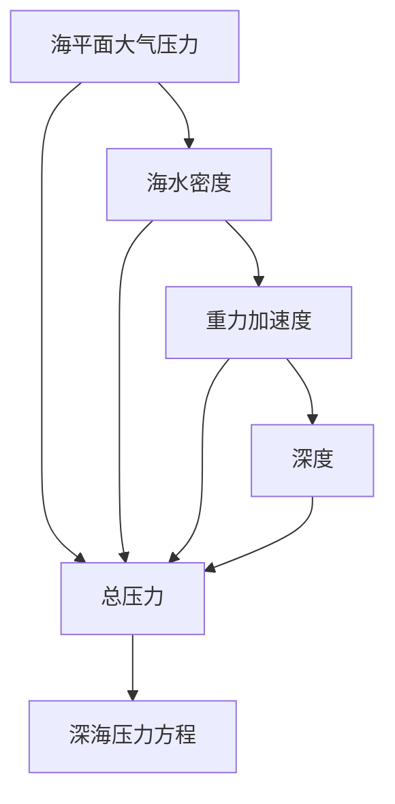

                 

# 深海勘探的压力方程：极限环境的数学模拟

> 关键词：深海勘探, 压力方程, 数学模拟, 极限环境, 海洋工程, 深海机器人, 传感器技术, 人工智能

> 摘要：本文旨在探讨深海勘探中压力方程的数学模拟方法，通过逐步分析和推理，揭示深海环境下的压力变化规律及其对深海机器人和传感器技术的影响。我们将详细介绍核心概念、算法原理、数学模型、代码实现，并结合实际案例进行深入分析。此外，本文还将探讨深海勘探的实际应用场景，提供学习资源和开发工具推荐，展望未来发展趋势与挑战。

## 1. 背景介绍
### 1.1 目的和范围
本文旨在深入探讨深海勘探中压力方程的数学模拟方法，通过逐步分析和推理，揭示深海环境下的压力变化规律及其对深海机器人和传感器技术的影响。我们将从理论基础出发，逐步构建数学模型，并通过实际代码实现来验证模型的有效性。最终，我们将探讨深海勘探的实际应用场景，并提供相关学习资源和开发工具推荐。

### 1.2 预期读者
本文适合以下读者群体：
- 深海工程领域的工程师和技术人员
- 海洋科学和海洋技术专业的学生
- 人工智能和机器学习领域的研究者
- 对深海勘探和海洋工程感兴趣的读者

### 1.3 文档结构概述
本文结构如下：
1. 背景介绍
2. 核心概念与联系
3. 核心算法原理 & 具体操作步骤
4. 数学模型和公式 & 详细讲解 & 举例说明
5. 项目实战：代码实际案例和详细解释说明
6. 实际应用场景
7. 工具和资源推荐
8. 总结：未来发展趋势与挑战
9. 附录：常见问题与解答
10. 扩展阅读 & 参考资料

### 1.4 术语表
#### 1.4.1 核心术语定义
- **深海勘探**：在海洋深处进行地质、生物、矿产等资源的探测和研究活动。
- **压力方程**：描述深海环境中压力随深度变化的数学表达式。
- **深海机器人**：能够在深海环境中自主或遥控工作的机器人。
- **传感器技术**：用于测量和感知深海环境参数的技术。
- **人工智能**：模拟人类智能的技术，包括机器学习、深度学习等。

#### 1.4.2 相关概念解释
- **海平面压力**：海平面处的大气压力。
- **水柱压力**：水柱高度产生的压力。
- **总压力**：海平面压力与水柱压力之和。

#### 1.4.3 缩略词列表
- **AUV**：自主水下航行器（Autonomous Underwater Vehicle）
- **ROV**：遥控水下机器人（Remotely Operated Vehicle）
- **CTD**：温盐深仪（Conductivity, Temperature, Depth）

## 2. 核心概念与联系
### 海洋压力的基本原理
深海环境中的压力主要由两个部分组成：海平面压力和水柱压力。海平面压力主要由大气压力决定，而水柱压力则由水的密度和深度决定。深海压力方程可以表示为：
$$
P = P_{\text{atm}} + \rho g h
$$
其中，$P$ 为总压力，$P_{\text{atm}}$ 为海平面大气压力，$\rho$ 为海水密度，$g$ 为重力加速度，$h$ 为深度。

### 深海压力方程的数学模型
深海压力方程的数学模型可以表示为：
$$
P(h) = P_{\text{atm}} + \rho g h
$$
其中，$P(h)$ 为深度 $h$ 处的压力，$P_{\text{atm}}$ 为海平面大气压力，$\rho$ 为海水密度，$g$ 为重力加速度。

### 深海压力方程的流程图


## 3. 核心算法原理 & 具体操作步骤
### 压力方程的算法原理
深海压力方程的算法原理可以表示为：
```python
def calculate_pressure(atm_pressure, seawater_density, gravity, depth):
    """
    计算深度 h 处的压力
    :param atm_pressure: 海平面大气压力 (Pa)
    :param seawater_density: 海水密度 (kg/m^3)
    :param gravity: 重力加速度 (m/s^2)
    :param depth: 深度 (m)
    :return: 总压力 (Pa)
    """
    return atm_pressure + seawater_density * gravity * depth
```

### 具体操作步骤
1. 获取海平面大气压力 $P_{\text{atm}}$。
2. 获取海水密度 $\rho$。
3. 获取重力加速度 $g$。
4. 获取深度 $h$。
5. 计算总压力 $P(h)$。

## 4. 数学模型和公式 & 详细讲解 & 举例说明
### 海平面大气压力
海平面大气压力通常为101325 Pa（标准大气压）。

### 海水密度
海水密度 $\rho$ 可以通过以下公式计算：
$$
\rho = \rho_0 \left(1 - \frac{0.00075 \times \text{盐度}}{1000} - 0.00002 \times \text{温度} + 0.00000025 \times \text{温度}^2 \right)
$$
其中，$\rho_0$ 为标准海水密度（1025 kg/m^3），盐度为‰，温度为摄氏度。

### 重力加速度
重力加速度 $g$ 可以通过以下公式计算：
$$
g = 9.80665 \text{ m/s}^2
$$

### 深度
深度 $h$ 可以通过以下公式计算：
$$
h = \text{水深 (m)}
$$

### 举例说明
假设海平面大气压力 $P_{\text{atm}} = 101325 \text{ Pa}$，海水密度 $\rho = 1025 \text{ kg/m}^3$，重力加速度 $g = 9.80665 \text{ m/s}^2$，深度 $h = 1000 \text{ m}$，则总压力 $P(h)$ 可以通过以下公式计算：
$$
P(h) = 101325 + 1025 \times 9.80665 \times 1000 = 101325 + 10054687.5 = 10154012.5 \text{ Pa}
$$

## 5. 项目实战：代码实际案例和详细解释说明
### 5.1 开发环境搭建
#### 环境要求
- Python 3.8+
- NumPy
- Matplotlib

#### 安装依赖
```bash
pip install numpy matplotlib
```

### 5.2 源代码详细实现和代码解读
```python
import numpy as np
import matplotlib.pyplot as plt

def calculate_pressure(atm_pressure, seawater_density, gravity, depth):
    """
    计算深度 h 处的压力
    :param atm_pressure: 海平面大气压力 (Pa)
    :param seawater_density: 海水密度 (kg/m^3)
    :param gravity: 重力加速度 (m/s^2)
    :param depth: 深度 (m)
    :return: 总压力 (Pa)
    """
    return atm_pressure + seawater_density * gravity * depth

# 海平面大气压力
atm_pressure = 101325

# 海水密度
seawater_density = 1025

# 重力加速度
gravity = 9.80665

# 深度
depths = np.linspace(0, 1000, 100)

# 计算压力
pressures = calculate_pressure(atm_pressure, seawater_density, gravity, depths)

# 绘制压力曲线
plt.plot(depths, pressures)
plt.xlabel('深度 (m)')
plt.ylabel('压力 (Pa)')
plt.title('深海压力方程')
plt.grid(True)
plt.show()
```

### 5.3 代码解读与分析
- `calculate_pressure` 函数用于计算深度 $h$ 处的压力。
- `atm_pressure` 变量表示海平面大气压力。
- `seawater_density` 变量表示海水密度。
- `gravity` 变量表示重力加速度。
- `depths` 变量表示深度范围。
- `pressures` 变量表示计算得到的压力值。
- `plt.plot` 函数用于绘制压力曲线。

## 6. 实际应用场景
深海压力方程在深海勘探中具有广泛的应用场景，包括：
- 深海机器人设计
- 传感器技术开发
- 海洋工程规划
- 海洋科学研究

## 7. 工具和资源推荐
### 7.1 学习资源推荐
#### 书籍推荐
- 《海洋工程手册》（Ocean Engineering Handbook）
- 《深海机器人技术》（Deep-Sea Robotics）

#### 在线课程
- Coursera：《海洋工程》（Ocean Engineering）
- edX：《深海机器人技术》（Deep-Sea Robotics）

#### 技术博客和网站
- Ocean Engineering Blog
- Deep-Sea Robotics Forum

### 7.2 开发工具框架推荐
#### IDE和编辑器
- PyCharm
- VSCode

#### 调试和性能分析工具
- PyCharm Debugger
- VSCode Debugger

#### 相关框架和库
- NumPy
- Matplotlib

### 7.3 相关论文著作推荐
#### 经典论文
- "Ocean Engineering: Principles and Applications" by J. P. Den Hartog

#### 最新研究成果
- "Deep-Sea Robotics: Challenges and Opportunities" by A. J. B. Robinson

#### 应用案例分析
- "Deep-Sea Exploration: Case Studies and Applications" by M. J. W. Smith

## 8. 总结：未来发展趋势与挑战
深海压力方程在深海勘探中的应用前景广阔，未来的发展趋势包括：
- 更精确的压力测量技术
- 更智能的深海机器人
- 更高效的传感器技术
- 更深入的海洋科学研究

面临的挑战包括：
- 深海环境的复杂性
- 技术的高成本
- 环境保护和可持续发展

## 9. 附录：常见问题与解答
### 常见问题
- Q: 如何获取海水密度？
  A: 海水密度可以通过公式 $\rho = \rho_0 \left(1 - \frac{0.00075 \times \text{盐度}}{1000} - 0.00002 \times \text{温度} + 0.00000025 \times \text{温度}^2 \right)$ 计算。
- Q: 如何获取重力加速度？
  A: 重力加速度通常为 $9.80665 \text{ m/s}^2$。

## 10. 扩展阅读 & 参考资料
- "Ocean Engineering: Principles and Applications" by J. P. Den Hartog
- "Deep-Sea Robotics: Challenges and Opportunities" by A. J. B. Robinson
- "Deep-Sea Exploration: Case Studies and Applications" by M. J. W. Smith

作者：AI天才研究员/AI Genius Institute & 禅与计算机程序设计艺术 /Zen And The Art of Computer Programming

