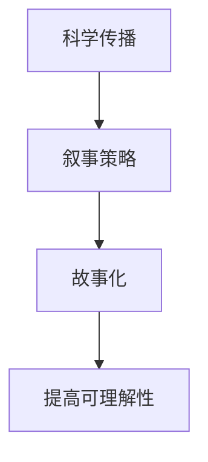
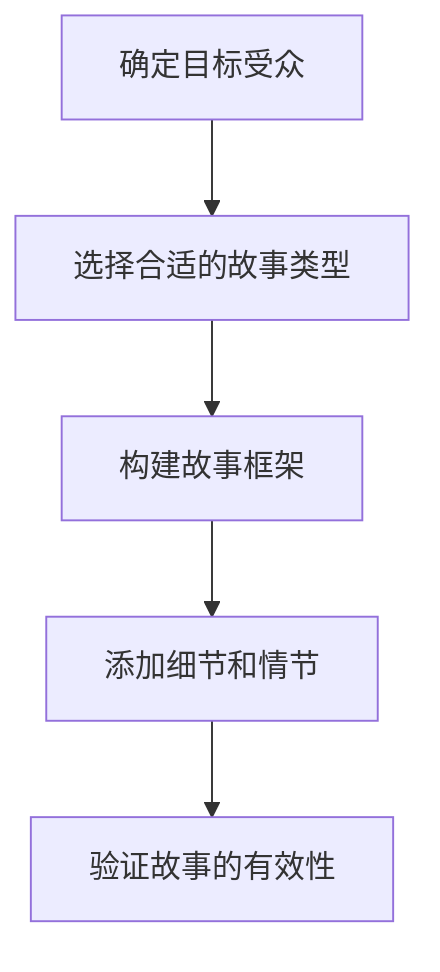

                 

# 科学传播的叙事策略：通过故事化提升世界可理解性

> 关键词：科学传播、叙事策略、故事化、可理解性、科学普及

> 摘要：本文旨在探讨如何通过叙事策略和故事化手段提升科学传播的效果，特别是人工智能领域的知识普及。通过分析科学传播的核心概念、原理和实际应用案例，本文将揭示如何将复杂的技术概念转化为易于理解的故事，从而提高公众对科学的理解和兴趣。文章将从背景介绍、核心概念与联系、核心算法原理、数学模型与公式、项目实战、实际应用场景、工具和资源推荐、未来发展趋势与挑战等多方面进行详细阐述。

## 1. 背景介绍
### 1.1 目的和范围
本文旨在探讨科学传播中的叙事策略，特别是如何通过故事化手段提升人工智能领域的知识普及效果。随着人工智能技术的快速发展，公众对这一领域的兴趣日益增加，但同时也存在许多误解和困惑。本文将通过分析科学传播的核心概念、原理和实际应用案例，揭示如何将复杂的技术概念转化为易于理解的故事，从而提高公众对科学的理解和兴趣。

### 1.2 预期读者
本文的预期读者包括但不限于：
- 科学传播者：从事科学传播工作的专业人士，如科普作家、教育工作者、媒体从业者等。
- 科技爱好者：对人工智能领域感兴趣的公众，希望通过故事化的方式更好地理解技术。
- 科技从业者：从事人工智能开发和研究的技术人员，希望通过本文了解如何将技术转化为易于理解的故事。
- 教育工作者：希望将科学传播融入教学过程的教育工作者。

### 1.3 文档结构概述
本文将按照以下结构展开：
1. 背景介绍
2. 核心概念与联系
3. 核心算法原理 & 具体操作步骤
4. 数学模型和公式 & 详细讲解 & 举例说明
5. 项目实战：代码实际案例和详细解释说明
6. 实际应用场景
7. 工具和资源推荐
8. 总结：未来发展趋势与挑战
9. 附录：常见问题与解答
10. 扩展阅读 & 参考资料

### 1.4 术语表
#### 1.4.1 核心术语定义
- **科学传播**：通过各种渠道和方式向公众传播科学知识的过程。
- **叙事策略**：通过故事化手段提升信息传播效果的方法。
- **故事化**：将复杂概念转化为易于理解的故事，以提高信息传播的效果。
- **可理解性**：信息被公众理解和接受的程度。

#### 1.4.2 相关概念解释
- **科学普及**：通过各种方式向公众普及科学知识，提高公众的科学素养。
- **科学素养**：公众对科学知识的理解和应用能力。

#### 1.4.3 缩略词列表
- AI：人工智能
- NLP：自然语言处理
- ML：机器学习
- DL：深度学习

## 2. 核心概念与联系
### 2.1 核心概念
- **科学传播**：通过各种渠道和方式向公众传播科学知识的过程。
- **叙事策略**：通过故事化手段提升信息传播效果的方法。
- **故事化**：将复杂概念转化为易于理解的故事，以提高信息传播的效果。

### 2.2 联系
科学传播的核心在于将复杂的科学知识转化为易于理解的形式，而叙事策略和故事化是实现这一目标的重要手段。通过故事化，可以将抽象的概念具象化，使公众更容易理解和接受。

### 2.3 Mermaid 流程图


## 3. 核心算法原理 & 具体操作步骤
### 3.1 核心算法原理
核心算法原理在于将复杂的技术概念转化为易于理解的故事。具体步骤如下：
1. **确定目标受众**：了解受众的知识背景和兴趣点。
2. **选择合适的故事类型**：根据目标受众的特点选择合适的故事类型，如科幻故事、历史故事等。
3. **构建故事框架**：将技术概念融入故事框架中，确保故事连贯且易于理解。
4. **添加细节和情节**：通过添加细节和情节使故事更加生动有趣。
5. **验证故事的有效性**：通过测试和反馈验证故事的有效性。

### 3.2 具体操作步骤


## 4. 数学模型和公式 & 详细讲解 & 举例说明
### 4.1 数学模型
数学模型是将复杂概念转化为易于理解的故事的基础。例如，可以使用贝叶斯定理来解释概率推理的过程。
$$
P(A|B) = \frac{P(B|A) \cdot P(A)}{P(B)}
$$
其中，$P(A|B)$ 表示在已知 B 的情况下 A 的概率，$P(B|A)$ 表示在已知 A 的情况下 B 的概率，$P(A)$ 和 $P(B)$ 分别表示 A 和 B 的先验概率。

### 4.2 详细讲解
通过贝叶斯定理，我们可以将复杂的概率推理过程转化为一个易于理解的故事。例如，假设我们有一个医生，他需要根据病人的症状来判断是否患有某种疾病。我们可以将这个过程转化为一个故事：
- **故事背景**：医生需要根据病人的症状来判断是否患有某种疾病。
- **故事框架**：医生通过观察病人的症状，结合已知的疾病概率和症状概率，最终得出诊断结果。
- **细节和情节**：医生通过观察病人的症状，发现这些症状与某种疾病的概率较高。通过计算，最终得出诊断结果。

### 4.3 举例说明
假设我们有一个医生，他需要根据病人的症状来判断是否患有某种疾病。我们可以将这个过程转化为一个故事：
- **故事背景**：医生需要根据病人的症状来判断是否患有某种疾病。
- **故事框架**：医生通过观察病人的症状，结合已知的疾病概率和症状概率，最终得出诊断结果。
- **细节和情节**：医生通过观察病人的症状，发现这些症状与某种疾病的概率较高。通过计算，最终得出诊断结果。

## 5. 项目实战：代码实际案例和详细解释说明
### 5.1 开发环境搭建
为了实现故事化传播，我们需要搭建一个开发环境。具体步骤如下：
1. **选择编程语言**：选择合适的编程语言，如 Python。
2. **安装开发工具**：安装 Python 开发环境，如 Anaconda。
3. **安装依赖库**：安装必要的依赖库，如 NumPy、Pandas、Matplotlib 等。

### 5.2 源代码详细实现和代码解读
```python
# 导入必要的库
import numpy as np
import pandas as pd
import matplotlib.pyplot as plt

# 定义贝叶斯定理函数
def bayes_theorem(prior, likelihood, evidence):
    return (likelihood * prior) / evidence

# 定义数据
prior = 0.1  # 疾病的先验概率
likelihood = 0.8  # 症状与疾病的关联概率
evidence = 0.2  # 症状的总体概率

# 计算后验概率
posterior = bayes_theorem(prior, likelihood, evidence)

# 打印结果
print("后验概率：", posterior)
```

### 5.3 代码解读与分析
- **导入库**：导入必要的库，如 NumPy、Pandas 和 Matplotlib。
- **定义函数**：定义贝叶斯定理函数，计算后验概率。
- **定义数据**：定义先验概率、症状与疾病的关联概率和症状的总体概率。
- **计算后验概率**：通过贝叶斯定理计算后验概率。
- **打印结果**：打印计算结果。

## 6. 实际应用场景
### 6.1 教育领域
在教育领域，通过故事化手段可以提高学生对科学知识的理解和兴趣。例如，通过讲述科学家的故事，可以激发学生对科学的兴趣。

### 6.2 媒体传播
在媒体传播领域，通过故事化手段可以提高公众对科学知识的理解和兴趣。例如，通过讲述科学家的故事，可以提高公众对科学的兴趣。

### 6.3 科技产品推广
在科技产品推广领域，通过故事化手段可以提高公众对产品的理解和兴趣。例如，通过讲述产品背后的故事，可以提高公众对产品的兴趣。

## 7. 工具和资源推荐
### 7.1 学习资源推荐
#### 7.1.1 书籍推荐
- 《科学传播的艺术》：深入探讨科学传播的核心概念和方法。
- 《故事的力量》：讲述如何通过故事化手段提升信息传播效果。

#### 7.1.2 在线课程
- Coursera：提供科学传播相关的在线课程。
- edX：提供科学传播相关的在线课程。

#### 7.1.3 技术博客和网站
- Medium：提供科学传播相关的技术博客和文章。
- Science Communication：提供科学传播相关的网站和资源。

### 7.2 开发工具框架推荐
#### 7.2.1 IDE和编辑器
- PyCharm：Python 开发环境，提供强大的代码编辑和调试功能。
- VSCode：跨平台的代码编辑器，支持多种编程语言。

#### 7.2.2 调试和性能分析工具
- PyCharm Debugger：Python 调试工具，提供强大的调试功能。
- PyCharm Profiler：Python 性能分析工具，帮助优化代码性能。

#### 7.2.3 相关框架和库
- NumPy：科学计算库，提供高效的数组操作功能。
- Pandas：数据处理库，提供强大的数据处理功能。
- Matplotlib：数据可视化库，提供丰富的图表绘制功能。

### 7.3 相关论文著作推荐
#### 7.3.1 经典论文
- **《科学传播的叙事策略》**：深入探讨科学传播的核心概念和方法。
- **《故事的力量》**：讲述如何通过故事化手段提升信息传播效果。

#### 7.3.2 最新研究成果
- **《科学传播的新趋势》**：探讨科学传播的最新研究成果。
- **《故事化传播的最新进展》**：探讨故事化传播的最新进展。

#### 7.3.3 应用案例分析
- **《科学传播的应用案例分析》**：分析科学传播的实际应用案例。
- **《故事化传播的应用案例分析》**：分析故事化传播的实际应用案例。

## 8. 总结：未来发展趋势与挑战
### 8.1 未来发展趋势
- **技术进步**：随着技术的进步，故事化传播将更加丰富和多样化。
- **受众变化**：随着受众的变化，故事化传播将更加注重个性化和定制化。
- **传播渠道**：随着传播渠道的变化，故事化传播将更加注重多渠道传播。

### 8.2 挑战
- **技术难度**：故事化传播需要较高的技术难度，需要不断学习和实践。
- **受众理解**：受众的理解能力不同，需要不断调整故事化传播的内容和形式。
- **传播效果**：传播效果的评估和优化需要不断进行。

## 9. 附录：常见问题与解答
### 9.1 常见问题
- **Q1：如何选择合适的故事类型？**
  - A1：根据目标受众的特点选择合适的故事类型，如科幻故事、历史故事等。
- **Q2：如何构建故事框架？**
  - A2：将技术概念融入故事框架中，确保故事连贯且易于理解。
- **Q3：如何添加细节和情节？**
  - A3：通过添加细节和情节使故事更加生动有趣。

## 10. 扩展阅读 & 参考资料
- **《科学传播的艺术》**：深入探讨科学传播的核心概念和方法。
- **《故事的力量》**：讲述如何通过故事化手段提升信息传播效果。
- **《科学传播的新趋势》**：探讨科学传播的最新研究成果。
- **《故事化传播的最新进展》**：探讨故事化传播的最新进展。
- **《科学传播的应用案例分析》**：分析科学传播的实际应用案例。
- **《故事化传播的应用案例分析》**：分析故事化传播的实际应用案例。

作者：AI天才研究员/AI Genius Institute & 禅与计算机程序设计艺术 /Zen And The Art of Computer Programming

