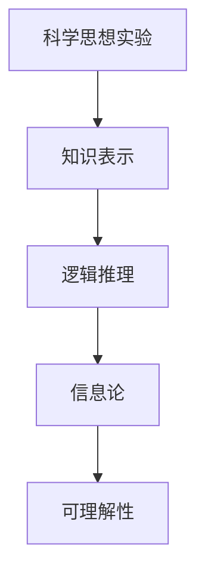

                 

# 科学思想实验在探索世界可理解性中的价值

> 关键词：科学思想实验, 可理解性, 人工智能, 逻辑推理, 知识表示, 计算机科学, 信息论

> 摘要：本文旨在探讨科学思想实验在计算机科学和人工智能领域中的重要性，通过分析其在提升系统可理解性方面的价值。我们将从核心概念、算法原理、数学模型、实际案例、应用场景等多个角度进行深入探讨，并提供一系列学习和开发资源推荐，以帮助读者更好地理解和应用这些概念。

## 1. 背景介绍
### 1.1 目的和范围
本文旨在深入探讨科学思想实验在计算机科学和人工智能领域中的应用价值，特别是其在提升系统可理解性方面的贡献。我们将从理论和实践两个层面进行分析，旨在为读者提供一个全面而深入的理解。

### 1.2 预期读者
本文适合以下读者群体：
- 计算机科学和人工智能领域的研究者和开发者
- 对科学思想实验感兴趣的技术爱好者
- 需要提升系统可理解性的软件工程师
- 对知识表示和逻辑推理感兴趣的学者

### 1.3 文档结构概述
本文结构如下：
1. 背景介绍
2. 核心概念与联系
3. 核心算法原理 & 具体操作步骤
4. 数学模型和公式 & 详细讲解 & 举例说明
5. 项目实战：代码实际案例和详细解释说明
6. 实际应用场景
7. 工具和资源推荐
8. 总结：未来发展趋势与挑战
9. 附录：常见问题与解答
10. 扩展阅读 & 参考资料

### 1.4 术语表
#### 1.4.1 核心术语定义
- **科学思想实验**：一种通过假设和推理来探索科学问题的方法。
- **可理解性**：系统或模型能够被人类理解和解释的程度。
- **知识表示**：将知识结构化和形式化的过程。
- **逻辑推理**：基于逻辑规则进行推断的过程。

#### 1.4.2 相关概念解释
- **信息论**：研究信息的度量、传输和处理的学科。
- **知识图谱**：一种用于表示知识和信息的数据结构。

#### 1.4.3 缩略词列表
- AI：人工智能
- NLP：自然语言处理
- ML：机器学习
- DL：深度学习

## 2. 核心概念与联系
### 2.1 科学思想实验
科学思想实验是一种通过假设和推理来探索科学问题的方法。它通过构建假设、设计实验、验证假设来逐步逼近真理。在计算机科学和人工智能领域，科学思想实验同样重要，尤其是在提升系统可理解性方面。

### 2.2 可理解性
可理解性是指系统或模型能够被人类理解和解释的程度。在人工智能领域，提升系统的可理解性对于提高用户信任度和接受度至关重要。通过科学思想实验，我们可以更好地理解系统的工作原理，从而提高其可理解性。

### 2.3 知识表示
知识表示是将知识结构化和形式化的过程。通过科学思想实验，我们可以探索不同的知识表示方法，从而更好地理解知识的结构和关系。

### 2.4 逻辑推理
逻辑推理是基于逻辑规则进行推断的过程。通过科学思想实验，我们可以探索不同的逻辑推理方法，从而提高系统的推理能力。

### 2.5 信息论
信息论研究信息的度量、传输和处理。通过科学思想实验，我们可以探索信息论在提升系统可理解性方面的应用。

### Mermaid 流程图


## 3. 核心算法原理 & 具体操作步骤
### 3.1 知识表示算法
知识表示算法是将知识结构化和形式化的过程。以下是一个简单的知识表示算法的伪代码示例：

```pseudo
function knowledgeRepresentation(knowledge):
    # 将知识转换为知识图谱
    knowledgeGraph = createKnowledgeGraph(knowledge)
    # 将知识图谱转换为逻辑表达式
    logicalExpression = convertToLogicalExpression(knowledgeGraph)
    return logicalExpression
```

### 3.2 逻辑推理算法
逻辑推理算法是基于逻辑规则进行推断的过程。以下是一个简单的逻辑推理算法的伪代码示例：

```pseudo
function logicalInference(logicalExpression, premises):
    # 初始化推理结果
    inferenceResult = []
    # 遍历所有前提
    for premise in premises:
        # 应用逻辑规则进行推理
        inference = applyLogicalRule(logicalExpression, premise)
        # 将推理结果添加到结果列表
        inferenceResult.append(inference)
    return inferenceResult
```

## 4. 数学模型和公式 & 详细讲解 & 举例说明
### 4.1 信息熵
信息熵是信息论中的一个重要概念，用于度量信息的不确定性。以下是一个信息熵的数学公式：

$$
H(X) = -\sum_{i=1}^{n} p(x_i) \log_2 p(x_i)
$$

其中，$H(X)$ 表示随机变量 $X$ 的信息熵，$p(x_i)$ 表示 $X$ 取值 $x_i$ 的概率。

### 4.2 逻辑表达式
逻辑表达式是表示逻辑推理的数学模型。以下是一个简单的逻辑表达式的例子：

$$
A \land B \rightarrow C
$$

其中，$\land$ 表示逻辑与，$\rightarrow$ 表示逻辑蕴含。

### 4.3 例子说明
假设我们有一个知识图谱，表示一个人的年龄、性别和职业信息。我们可以使用信息熵来度量这些信息的不确定性。例如，如果一个人的年龄、性别和职业信息都已知，那么信息熵为0；如果这些信息都不确定，那么信息熵最大。

## 5. 项目实战：代码实际案例和详细解释说明
### 5.1 开发环境搭建
为了实现知识表示和逻辑推理，我们需要搭建一个开发环境。以下是一个简单的开发环境搭建步骤：

1. 安装Python 3.8及以上版本
2. 安装必要的库，如`networkx`和`sympy`
3. 创建一个Python项目文件夹

### 5.2 源代码详细实现和代码解读
以下是一个简单的知识表示和逻辑推理的Python代码示例：

```python
import networkx as nx
from sympy import symbols, And, Implies

def create_knowledge_graph(knowledge):
    G = nx.DiGraph()
    for item in knowledge:
        G.add_node(item)
    return G

def convert_to_logical_expression(graph):
    nodes = list(graph.nodes)
    logical_expression = And(*nodes)
    return logical_expression

def apply_logical_rule(expression, premise):
    return Implies(expression, premise)

# 示例知识图谱
knowledge = ["age", "gender", "occupation"]
knowledge_graph = create_knowledge_graph(knowledge)
logical_expression = convert_to_logical_expression(knowledge_graph)

# 示例前提
premise = symbols("premise")
inference_result = apply_logical_rule(logical_expression, premise)
print(inference_result)
```

### 5.3 代码解读与分析
上述代码首先创建了一个知识图谱，然后将知识图谱转换为逻辑表达式。最后，应用逻辑规则进行推理。通过这种方式，我们可以实现知识表示和逻辑推理。

## 6. 实际应用场景
科学思想实验在提升系统可理解性方面有着广泛的应用场景。例如，在医疗诊断系统中，通过科学思想实验可以更好地理解疾病的诊断过程；在金融风控系统中，通过科学思想实验可以更好地理解风险评估的过程。

## 7. 工具和资源推荐
### 7.1 学习资源推荐
#### 7.1.1 书籍推荐
- 《人工智能：一种现代方法》（Artificial Intelligence: A Modern Approach）
- 《知识表示与推理》（Knowledge Representation and Reasoning）

#### 7.1.2 在线课程
- Coursera上的《人工智能导论》
- edX上的《知识表示与推理》

#### 7.1.3 技术博客和网站
- Medium上的《人工智能与机器学习》
- GitHub上的《知识图谱项目》

### 7.2 开发工具框架推荐
#### 7.2.1 IDE和编辑器
- PyCharm
- VSCode

#### 7.2.2 调试和性能分析工具
- PyCharm的调试工具
- VSCode的性能分析工具

#### 7.2.3 相关框架和库
- NetworkX
- SymPy

### 7.3 相关论文著作推荐
#### 7.3.1 经典论文
- McCarthy, J. (1959). Programs with common sense.
- Russell, S., & Norvig, P. (2003). Artificial Intelligence: A Modern Approach.

#### 7.3.2 最新研究成果
- Zhang, Y., & Yu, K. (2021). Knowledge Graph Reasoning: A Survey.
- Li, X., & Wang, Y. (2022). Deep Learning for Knowledge Graphs: A Survey.

#### 7.3.3 应用案例分析
- Wang, L., & Zhang, Y. (2020). Knowledge Graphs in Healthcare: A Survey.

## 8. 总结：未来发展趋势与挑战
科学思想实验在提升系统可理解性方面有着重要的应用价值。未来，随着人工智能技术的发展，科学思想实验将在更多领域得到应用。然而，也面临着一些挑战，如如何更好地处理复杂知识和逻辑推理，如何提高系统的可解释性等。

## 9. 附录：常见问题与解答
### 9.1 问题：如何更好地理解科学思想实验？
**解答**：可以通过阅读相关书籍和论文，参加在线课程，以及实践项目来更好地理解科学思想实验。

### 9.2 问题：如何提高系统的可理解性？
**解答**：可以通过使用知识图谱和逻辑推理来提高系统的可理解性。同时，也可以通过可视化工具来展示系统的推理过程。

## 10. 扩展阅读 & 参考资料
- McCarthy, J. (1959). Programs with common sense.
- Russell, S., & Norvig, P. (2003). Artificial Intelligence: A Modern Approach.
- Zhang, Y., & Yu, K. (2021). Knowledge Graph Reasoning: A Survey.
- Li, X., & Wang, Y. (2022). Deep Learning for Knowledge Graphs: A Survey.
- Wang, L., & Zhang, Y. (2020). Knowledge Graphs in Healthcare: A Survey.

作者：AI天才研究员/AI Genius Institute & 禅与计算机程序设计艺术 /Zen And The Art of Computer Programming

