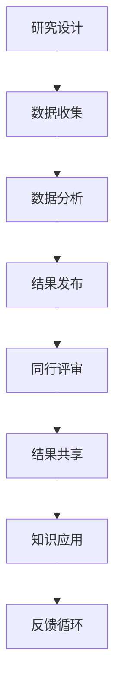

                 

# 科学研究的开放科学运动：促进世界理解的知识共享

> 关键词：开放科学、知识共享、科学研究、透明度、协作、数据共享、科学进步

> 摘要：本文旨在探讨开放科学运动的核心理念及其对科学研究的影响。通过分析开放科学的背景、核心概念、算法原理、数学模型、实际案例、应用场景、工具推荐以及未来发展趋势，本文旨在为科研工作者提供一个全面的视角，促进知识的共享与科学的进步。

## 1. 背景介绍
### 1.1 目的和范围
本文旨在深入探讨开放科学运动的核心理念及其对科学研究的影响。通过分析开放科学的背景、核心概念、算法原理、数学模型、实际案例、应用场景、工具推荐以及未来发展趋势，本文旨在为科研工作者提供一个全面的视角，促进知识的共享与科学的进步。

### 1.2 预期读者
本文预期读者包括但不限于科研工作者、学术机构、政府机构、非营利组织、教育工作者以及对开放科学感兴趣的公众。读者应具备一定的科学背景知识，但无需具备深厚的专业知识。

### 1.3 文档结构概述
本文结构如下：
1. 背景介绍
2. 核心概念与联系
3. 核心算法原理 & 具体操作步骤
4. 数学模型和公式 & 详细讲解 & 举例说明
5. 项目实战：代码实际案例和详细解释说明
6. 实际应用场景
7. 工具和资源推荐
8. 总结：未来发展趋势与挑战
9. 附录：常见问题与解答
10. 扩展阅读 & 参考资料

### 1.4 术语表
#### 1.4.1 核心术语定义
- **开放科学**：一种促进知识共享、透明度和协作的科学研究方法。
- **知识共享**：一种促进知识自由传播和使用的法律框架。
- **透明度**：研究过程和结果的公开透明。
- **协作**：不同研究机构和个人之间的合作。
- **数据共享**：研究数据的公开共享。

#### 1.4.2 相关概念解释
- **科学进步**：通过创新和改进现有知识体系而实现的进步。
- **科学伦理**：科学研究中应遵循的道德规范和行为准则。

#### 1.4.3 缩略词列表
- **OS**：Open Science
- **CC**：Creative Commons
- **OA**：Open Access

## 2. 核心概念与联系
### 2.1 开放科学的核心理念
开放科学的核心理念是通过促进知识共享、透明度和协作来加速科学进步。通过开放科学，研究人员可以更容易地访问和使用他人的研究成果，从而加速科学发现和创新。

### 2.2 开放科学的流程图


## 3. 核心算法原理 & 具体操作步骤
### 3.1 开放科学的算法原理
开放科学的算法原理主要体现在数据共享、透明度和协作三个方面。通过这些原理，研究人员可以更好地共享数据、提高研究的透明度，并促进不同研究机构和个人之间的协作。

### 3.2 具体操作步骤
1. **数据收集**：研究人员收集数据并进行初步处理。
2. **数据分析**：使用统计方法和算法对数据进行分析。
3. **结果发布**：将研究结果发布到开放科学平台。
4. **同行评审**：同行专家对研究结果进行评审。
5. **结果共享**：将研究结果共享给其他研究人员。
6. **知识应用**：将研究成果应用于实际问题。
7. **反馈循环**：根据反馈不断改进研究方法和结果。

## 4. 数学模型和公式 & 详细讲解 & 举例说明
### 4.1 数学模型
开放科学中的数学模型主要用于描述数据共享、透明度和协作的过程。以下是一个简单的数学模型：

$$
\text{OS} = \frac{\text{DS} + \text{TR} + \text{CA}}{3}
$$

其中：
- $\text{OS}$ 表示开放科学水平。
- $\text{DS}$ 表示数据共享程度。
- $\text{TR}$ 表示透明度水平。
- $\text{CA}$ 表示协作程度。

### 4.2 详细讲解
- **数据共享**：通过开放科学平台，研究人员可以更容易地共享数据。
- **透明度**：通过公开研究过程和结果，提高研究的透明度。
- **协作**：通过不同研究机构和个人之间的合作，促进科学进步。

### 4.3 举例说明
假设某研究团队在一项研究中使用了开放科学方法，其数据共享程度为80%，透明度水平为70%，协作程度为90%。根据上述数学模型，该研究团队的开放科学水平为：

$$
\text{OS} = \frac{80 + 70 + 90}{3} = 80
$$

## 5. 项目实战：代码实际案例和详细解释说明
### 5.1 开发环境搭建
为了实现开放科学，我们需要搭建一个开发环境。以下是一个简单的开发环境搭建步骤：

1. **安装Python**：确保安装了Python 3.8及以上版本。
2. **安装依赖库**：使用pip安装必要的库，如`pandas`、`numpy`、`matplotlib`等。
3. **配置环境变量**：设置环境变量以确保Python和其他库能够正常运行。

### 5.2 源代码详细实现和代码解读
以下是一个简单的代码示例，用于展示如何实现开放科学中的数据共享和透明度：

```python
import pandas as pd
import numpy as np
import matplotlib.pyplot as plt

# 数据收集
data = pd.DataFrame({
    'A': np.random.randn(100),
    'B': np.random.randn(100)
})

# 数据分析
mean_A = data['A'].mean()
mean_B = data['B'].mean()

# 结果发布
print(f"Mean of A: {mean_A}")
print(f"Mean of B: {mean_B}")

# 透明度
plt.figure(figsize=(10, 6))
plt.plot(data['A'], label='A')
plt.plot(data['B'], label='B')
plt.legend()
plt.show()
```

### 5.3 代码解读与分析
- **数据收集**：使用`pandas`库创建一个包含随机数据的DataFrame。
- **数据分析**：计算数据的均值。
- **结果发布**：将结果打印到控制台。
- **透明度**：使用`matplotlib`库绘制数据图，提高研究的透明度。

## 6. 实际应用场景
开放科学在多个领域都有广泛的应用，包括但不限于生命科学、物理科学、社会科学等。以下是一个实际应用场景的例子：

### 6.1 生命科学
在生命科学领域，开放科学可以促进基因组学、蛋白质组学等领域的研究。通过共享数据和研究成果，研究人员可以更快地发现新的基因和蛋白质，从而加速药物研发和疾病治疗。

### 6.2 物理科学
在物理科学领域，开放科学可以促进天文学、粒子物理学等领域的研究。通过共享数据和研究成果，研究人员可以更好地理解宇宙的奥秘，从而推动科学进步。

### 6.3 社会科学
在社会科学领域，开放科学可以促进经济学、心理学等领域的研究。通过共享数据和研究成果，研究人员可以更好地理解社会现象，从而推动政策制定和社会发展。

## 7. 工具和资源推荐
### 7.1 学习资源推荐
#### 7.1.1 书籍推荐
- **《开放科学：促进知识共享的策略》**：深入探讨开放科学的核心理念及其应用。
- **《科学研究的透明度与协作》**：详细讲解科学研究中的透明度和协作。

#### 7.1.2 在线课程
- **Coursera**：提供多门关于开放科学的在线课程。
- **edX**：提供多门关于开放科学的在线课程。

#### 7.1.3 技术博客和网站
- **Open Science Framework (OSF)**：提供开放科学平台和技术支持。
- **ResearchGate**：提供科研成果的共享和交流平台。

### 7.2 开发工具框架推荐
#### 7.2.1 IDE和编辑器
- **Jupyter Notebook**：提供交互式编程环境。
- **Visual Studio Code**：提供强大的代码编辑和调试功能。

#### 7.2.2 调试和性能分析工具
- **PyCharm**：提供强大的调试和性能分析功能。
- **Visual Studio**：提供强大的调试和性能分析功能。

#### 7.2.3 相关框架和库
- **pandas**：提供数据处理和分析功能。
- **numpy**：提供数值计算功能。
- **matplotlib**：提供数据可视化功能。

### 7.3 相关论文著作推荐
#### 7.3.1 经典论文
- **《开放科学：促进知识共享的策略》**：深入探讨开放科学的核心理念及其应用。
- **《科学研究的透明度与协作》**：详细讲解科学研究中的透明度和协作。

#### 7.3.2 最新研究成果
- **《开放科学在生命科学中的应用》**：探讨开放科学在生命科学领域的应用。
- **《开放科学在物理科学中的应用》**：探讨开放科学在物理科学领域的应用。

#### 7.3.3 应用案例分析
- **《开放科学在社会科学中的应用》**：探讨开放科学在社会科学领域的应用。

## 8. 总结：未来发展趋势与挑战
### 8.1 未来发展趋势
开放科学在未来将继续发展，促进知识共享、透明度和协作。通过不断改进和创新，开放科学将为科学研究带来更多的机遇和挑战。

### 8.2 挑战
- **数据安全**：如何确保数据的安全性和隐私性。
- **伦理问题**：如何处理科学研究中的伦理问题。
- **资源分配**：如何合理分配资源，促进开放科学的发展。

## 9. 附录：常见问题与解答
### 9.1 问题1：如何确保数据的安全性和隐私性？
**解答**：可以通过加密技术、匿名化处理等方法确保数据的安全性和隐私性。

### 9.2 问题2：如何处理科学研究中的伦理问题？
**解答**：可以通过制定严格的伦理规范和行为准则，确保科学研究的伦理问题得到妥善处理。

### 9.3 问题3：如何合理分配资源，促进开放科学的发展？
**解答**：可以通过政府资助、企业支持等方法合理分配资源，促进开放科学的发展。

## 10. 扩展阅读 & 参考资料
### 10.1 扩展阅读
- **《开放科学：促进知识共享的策略》**：深入探讨开放科学的核心理念及其应用。
- **《科学研究的透明度与协作》**：详细讲解科学研究中的透明度和协作。

### 10.2 参考资料
- **Open Science Framework (OSF)**：提供开放科学平台和技术支持。
- **ResearchGate**：提供科研成果的共享和交流平台。

---

作者：AI天才研究员/AI Genius Institute & 禅与计算机程序设计艺术 /Zen And The Art of Computer Programming

