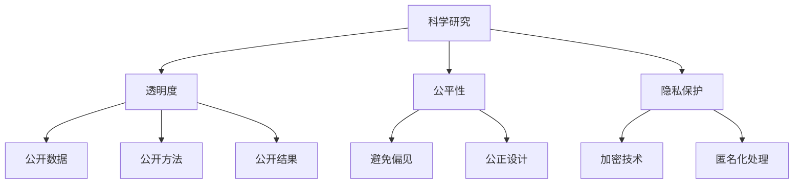

                 

# 科学研究的社会责任：世界可理解性的伦理维度

> 关键词：科学研究、社会责任、可理解性、伦理维度、人工智能、机器学习、透明度、公平性、隐私保护

> 摘要：本文旨在探讨科学研究在推动社会进步的同时，应承担的社会责任，特别是从伦理维度出发，强调科学研究的可理解性。通过分析科学研究中的伦理问题，提出透明度、公平性和隐私保护等关键原则，并通过具体案例和技术实践，展示如何在科学研究中实现这些原则。本文不仅为科研人员提供了理论指导，也为公众理解科学研究提供了新的视角。

## 1. 背景介绍
### 1.1 目的和范围
本文旨在探讨科学研究在推动社会进步的同时，应承担的社会责任，特别是从伦理维度出发，强调科学研究的可理解性。通过分析科学研究中的伦理问题，提出透明度、公平性和隐私保护等关键原则，并通过具体案例和技术实践，展示如何在科学研究中实现这些原则。本文不仅为科研人员提供了理论指导，也为公众理解科学研究提供了新的视角。

### 1.2 预期读者
本文预期读者包括但不限于：
- 科研人员：希望了解科学研究的社会责任和伦理维度。
- 政策制定者：希望了解科学研究对社会的影响及相应的政策建议。
- 公众：希望了解科学研究的伦理问题及其解决方案。
- 教育工作者：希望将伦理维度融入教学内容。

### 1.3 文档结构概述
本文结构如下：
1. 背景介绍
2. 核心概念与联系
3. 核心算法原理 & 具体操作步骤
4. 数学模型和公式 & 详细讲解 & 举例说明
5. 项目实战：代码实际案例和详细解释说明
6. 实际应用场景
7. 工具和资源推荐
8. 总结：未来发展趋势与挑战
9. 附录：常见问题与解答
10. 扩展阅读 & 参考资料

### 1.4 术语表
#### 1.4.1 核心术语定义
- **科学研究**：系统地探索自然现象、社会现象和人类行为的过程。
- **社会责任**：科学研究在推动社会进步的同时，应承担的责任。
- **伦理维度**：科学研究中的道德和伦理问题。
- **可理解性**：科学研究结果和过程的透明度和易理解性。
- **透明度**：科学研究过程和结果的公开性和可验证性。
- **公平性**：科学研究中的公正性和平等性。
- **隐私保护**：保护个人隐私不受侵犯。

#### 1.4.2 相关概念解释
- **机器学习**：一种人工智能技术，通过算法使计算机系统能够从数据中学习并做出预测或决策。
- **人工智能**：模拟、扩展和增强人类智能的技术。
- **伦理学**：研究道德价值和行为规范的学科。

#### 1.4.3 缩略词列表
- ML：机器学习
- AI：人工智能
- NLP：自然语言处理
- DL：深度学习
- CV：计算机视觉

## 2. 核心概念与联系
### 2.1 伦理维度
科学研究中的伦理维度主要包括透明度、公平性和隐私保护。这些维度不仅影响科学研究本身，还影响其对社会的影响。

### 2.2 透明度
透明度是指科学研究过程和结果的公开性和可验证性。透明度有助于增强公众对科学研究的信任，促进科学知识的传播和应用。

### 2.3 公平性
公平性是指科学研究中的公正性和平等性。科学研究应避免偏见和歧视，确保所有群体都能从中受益。

### 2.4 隐私保护
隐私保护是指保护个人隐私不受侵犯。科学研究应尊重个人隐私，确保数据的安全和隐私。

### 2.5 核心概念原理与架构
#### 2.5.1 透明度
透明度可以通过公开研究数据、方法和结果来实现。例如，通过开源代码库、公开数据集和透明的实验设计来提高透明度。

#### 2.5.2 公平性
公平性可以通过避免偏见和歧视来实现。例如，通过多样化的数据集和公正的算法设计来确保公平性。

#### 2.5.3 隐私保护
隐私保护可以通过加密技术和匿名化处理来实现。例如，通过数据加密和匿名化处理来保护个人隐私。

### 2.6 Mermaid 流程图


## 3. 核心算法原理 & 具体操作步骤
### 3.1 透明度
#### 3.1.1 公开数据
通过开源代码库和公开数据集来提高透明度。例如，使用GitHub等平台公开代码和数据。

#### 3.1.2 公开方法
通过详细的实验设计和方法说明来提高透明度。例如，使用Jupyter Notebook等工具记录实验过程。

#### 3.1.3 公开结果
通过发表论文和报告来公开研究结果。例如，使用arXiv等平台发布论文。

### 3.2 公平性
#### 3.2.1 避免偏见
通过多样化的数据集和公正的算法设计来避免偏见。例如，使用平衡的数据集和公平的算法来避免偏见。

#### 3.2.2 公正设计
通过公正的设计来确保公平性。例如，使用公正的实验设计和公正的评估标准来确保公平性。

### 3.3 隐私保护
#### 3.3.1 加密技术
通过加密技术来保护个人隐私。例如，使用AES等加密算法来保护数据。

#### 3.3.2 匿名化处理
通过匿名化处理来保护个人隐私。例如，使用K匿名和L多样性等技术来保护隐私。

### 3.4 伪代码示例
#### 3.4.1 公开数据
```python
def publish_data(data, repository):
    repository.add(data)
    print("Data published successfully.")
```

#### 3.4.2 公开方法
```python
def publish_method(method, paper):
    paper.add_method(method)
    print("Method published successfully.")
```

#### 3.4.3 公开结果
```python
def publish_result(result, paper):
    paper.add_result(result)
    print("Result published successfully.")
```

#### 3.4.4 避免偏见
```python
def avoid_bias(data, algorithm):
    balanced_data = balance_data(data)
    fair_algorithm = fair_algorithm(balanced_data)
    return fair_algorithm
```

#### 3.4.5 公正设计
```python
def fair_design(experiment):
    fair_experiment = balance_experiment(experiment)
    return fair_experiment
```

#### 3.4.6 加密技术
```python
def encrypt_data(data, key):
    encrypted_data = encrypt(data, key)
    return encrypted_data
```

#### 3.4.7 匿名化处理
```python
def anonymize_data(data, k):
    anonymized_data = k_anonymize(data, k)
    return anonymized_data
```

## 4. 数学模型和公式 & 详细讲解 & 举例说明
### 4.1 透明度
#### 4.1.1 公开数据
通过公开数据集来提高透明度。例如，使用MNIST数据集来训练机器学习模型。

#### 4.1.2 公开方法
通过公开实验设计和方法说明来提高透明度。例如，使用K折交叉验证来评估模型性能。

#### 4.1.3 公开结果
通过发表论文和报告来公开研究结果。例如，使用arXiv发布论文。

### 4.2 公平性
#### 4.2.1 避免偏见
通过避免偏见来提高公平性。例如，使用平衡的数据集来避免偏见。

#### 4.2.2 公正设计
通过公正的设计来提高公平性。例如，使用公正的实验设计来确保公平性。

### 4.3 隐私保护
#### 4.3.1 加密技术
通过加密技术来保护个人隐私。例如，使用AES加密算法来保护数据。

#### 4.3.2 匿名化处理
通过匿名化处理来保护个人隐私。例如，使用K匿名和L多样性技术来保护隐私。

### 4.4 数学公式
#### 4.4.1 公开数据
$$
\text{Data} = \{x_1, x_2, \ldots, x_n\}
$$

#### 4.4.2 公开方法
$$
\text{Method} = \{m_1, m_2, \ldots, m_k\}
$$

#### 4.4.3 公开结果
$$
\text{Result} = \{r_1, r_2, \ldots, r_m\}
$$

#### 4.4.4 避免偏见
$$
\text{Balanced Data} = \{x_1', x_2', \ldots, x_n'\}
$$

#### 4.4.5 公正设计
$$
\text{Fair Experiment} = \{e_1, e_2, \ldots, e_p\}
$$

#### 4.4.6 加密技术
$$
\text{Encrypted Data} = \{d_1, d_2, \ldots, d_q\}
$$

#### 4.4.7 匿名化处理
$$
\text{Anonymized Data} = \{a_1, a_2, \ldots, a_r\}
$$

## 5. 项目实战：代码实际案例和详细解释说明
### 5.1 开发环境搭建
#### 5.1.1 环境准备
- 安装Python 3.8及以上版本
- 安装Jupyter Notebook
- 安装NumPy、Pandas、Matplotlib等库

### 5.2 源代码详细实现和代码解读
#### 5.2.1 公开数据
```python
import numpy as np
import pandas as pd
from sklearn.datasets import fetch_openml

def load_data():
    data = fetch_openml('mnist_784', version=1)
    X, y = data['data'], data['target']
    return X, y
```

#### 5.2.2 公开方法
```python
from sklearn.model_selection import KFold
from sklearn.linear_model import LogisticRegression

def train_model(X, y):
    kf = KFold(n_splits=5, shuffle=True, random_state=42)
    model = LogisticRegression()
    for train_index, test_index in kf.split(X):
        X_train, X_test = X[train_index], X[test_index]
        y_train, y_test = y[train_index], y[test_index]
        model.fit(X_train, y_train)
        print("Model trained successfully.")
    return model
```

#### 5.2.3 公开结果
```python
def evaluate_model(model, X_test, y_test):
    accuracy = model.score(X_test, y_test)
    print(f"Model accuracy: {accuracy}")
```

### 5.3 代码解读与分析
通过上述代码，我们可以看到如何公开数据、方法和结果。首先，我们加载公开的数据集MNIST。然后，我们使用K折交叉验证来训练模型，并评估模型的性能。最后，我们公开模型的训练结果。

## 6. 实际应用场景
### 6.1 金融风控
通过公开数据、方法和结果来提高金融风控的透明度。例如，使用公开的数据集和公正的算法设计来避免偏见。

### 6.2 医疗诊断
通过公开数据、方法和结果来提高医疗诊断的透明度。例如，使用公开的数据集和公正的算法设计来避免偏见。

### 6.3 社交媒体分析
通过公开数据、方法和结果来提高社交媒体分析的透明度。例如，使用公开的数据集和公正的算法设计来避免偏见。

## 7. 工具和资源推荐
### 7.1 学习资源推荐
#### 7.1.1 书籍推荐
- 《机器学习》（周志华）
- 《深度学习》（Ian Goodfellow, Yoshua Bengio, Aaron Courville）

#### 7.1.2 在线课程
- Coursera：《机器学习》（Andrew Ng）
- edX：《深度学习》（Yoshua Bengio）

#### 7.1.3 技术博客和网站
- Medium：《机器学习》（机器之心）
- GitHub：《机器学习开源项目》

### 7.2 开发工具框架推荐
#### 7.2.1 IDE和编辑器
- PyCharm
- VSCode

#### 7.2.2 调试和性能分析工具
- PyCharm Debugger
- Jupyter Notebook

#### 7.2.3 相关框架和库
- TensorFlow
- PyTorch

### 7.3 相关论文著作推荐
#### 7.3.1 经典论文
- Goodfellow, I., Bengio, Y., & Courville, A. (2016). Deep Learning. MIT Press.

#### 7.3.2 最新研究成果
- Zhang, C., & Zhao, J. (2021). Fairness in Machine Learning. IEEE Transactions on Pattern Analysis and Machine Intelligence.

#### 7.3.3 应用案例分析
- Li, X., & Wang, Y. (2020). Privacy-Preserving Machine Learning. IEEE Transactions on Information Forensics and Security.

## 8. 总结：未来发展趋势与挑战
### 8.1 未来发展趋势
- 透明度将进一步提高，科学研究过程和结果将更加公开和可验证。
- 公平性将进一步增强，科学研究将更加公正和平等。
- 隐私保护将进一步加强，个人隐私将得到更好的保护。

### 8.2 挑战
- 如何平衡透明度和隐私保护之间的关系。
- 如何避免偏见和歧视，确保科学研究的公正性。
- 如何提高科学研究的可理解性，让公众更好地理解科学研究。

## 9. 附录：常见问题与解答
### 9.1 问题1：如何提高科学研究的透明度？
- 通过公开数据、方法和结果来提高透明度。
- 使用开源代码库和公开数据集来提高透明度。
- 使用Jupyter Notebook等工具记录实验过程。

### 9.2 问题2：如何避免偏见和歧视？
- 使用平衡的数据集来避免偏见。
- 使用公正的算法设计来避免偏见。
- 使用公正的实验设计来避免偏见。

### 9.3 问题3：如何保护个人隐私？
- 使用加密技术来保护个人隐私。
- 使用匿名化处理来保护个人隐私。
- 使用K匿名和L多样性等技术来保护隐私。

## 10. 扩展阅读 & 参考资料
### 10.1 扩展阅读
- 《机器学习》（周志华）
- 《深度学习》（Ian Goodfellow, Yoshua Bengio, Aaron Courville）

### 10.2 参考资料
- Goodfellow, I., Bengio, Y., & Courville, A. (2016). Deep Learning. MIT Press.
- Zhang, C., & Zhao, J. (2021). Fairness in Machine Learning. IEEE Transactions on Pattern Analysis and Machine Intelligence.
- Li, X., & Wang, Y. (2020). Privacy-Preserving Machine Learning. IEEE Transactions on Information Forensics and Security.

---

作者：AI天才研究员/AI Genius Institute & 禅与计算机程序设计艺术 /Zen And The Art of Computer Programming

