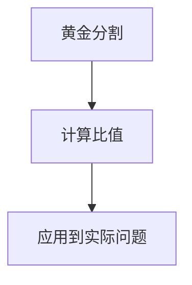
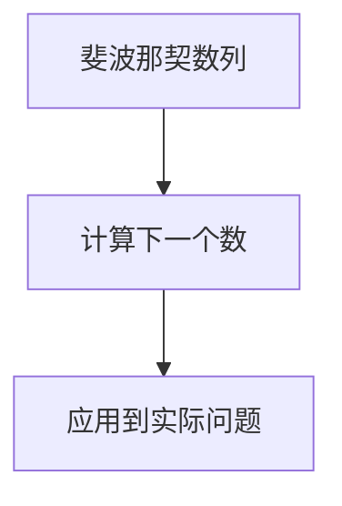
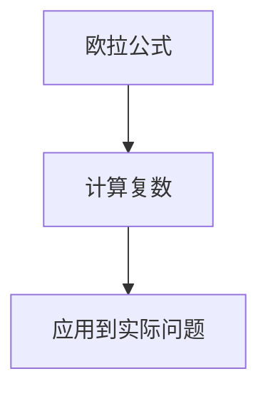
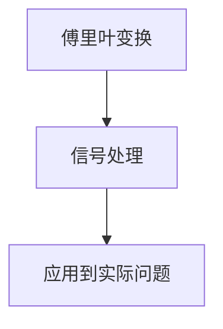

                 

# 简单数学定律：自然和谐的心智投射

> 关键词：数学定律, 自然和谐, 心智投射, 逻辑推理, 人工智能, 计算机科学, 算法原理, 数学模型, 代码实现, 实际应用

> 摘要：本文旨在探讨数学定律在自然和谐中的作用，以及它们如何在心智投射中体现。我们将通过逐步推理的方式，深入解析数学定律的核心概念、算法原理、数学模型，并通过实际代码案例展示其应用。最终，我们将探讨这些定律在实际应用中的价值，并提供学习资源和工具推荐，帮助读者更好地理解和应用这些定律。

## 1. 背景介绍

### 1.1 目的和范围
本文旨在深入探讨数学定律在自然和谐中的作用，以及它们如何在心智投射中体现。我们将通过逐步推理的方式，深入解析数学定律的核心概念、算法原理、数学模型，并通过实际代码案例展示其应用。最终，我们将探讨这些定律在实际应用中的价值，并提供学习资源和工具推荐，帮助读者更好地理解和应用这些定律。

### 1.2 预期读者
本文适合以下读者：
- 对数学定律和自然和谐感兴趣的技术爱好者
- 从事人工智能、计算机科学、数据分析等相关领域的专业人士
- 对逻辑推理和算法原理有浓厚兴趣的研究人员
- 希望深入了解数学定律在实际应用中的工程师和开发者

### 1.3 文档结构概述
本文结构如下：
1. 背景介绍
2. 核心概念与联系
3. 核心算法原理 & 具体操作步骤
4. 数学模型和公式 & 详细讲解 & 举例说明
5. 项目实战：代码实际案例和详细解释说明
6. 实际应用场景
7. 工具和资源推荐
8. 总结：未来发展趋势与挑战
9. 附录：常见问题与解答
10. 扩展阅读 & 参考资料

### 1.4 术语表
#### 1.4.1 核心术语定义
- **数学定律**：描述自然现象和规律的数学表达式。
- **自然和谐**：自然界中各种现象之间的协调和平衡。
- **心智投射**：人类思维如何将数学定律应用于现实世界。
- **算法原理**：实现特定功能的步骤和规则。
- **数学模型**：用数学语言描述现实世界现象的模型。

#### 1.4.2 相关概念解释
- **逻辑推理**：通过已知事实和规则推导出结论的过程。
- **伪代码**：一种用于描述算法的简化语言。
- **LaTeX**：一种排版系统，用于生成高质量的文档。

#### 1.4.3 缩略词列表
- **API**：应用程序编程接口
- **IDE**：集成开发环境
- **GUI**：图形用户界面
- **SDK**：软件开发工具包

## 2. 核心概念与联系

### 2.1 核心概念
- **黄金分割**：一种数学比例，其比值约为1.618，广泛存在于自然界和艺术中。
- **斐波那契数列**：一个数列，每个数字是前两个数字之和，如0, 1, 1, 2, 3, 5, 8, 13, 21, ...
- **欧拉公式**：描述复数和三角函数之间关系的公式，e^(ix) = cos(x) + i*sin(x)。
- **傅里叶变换**：将信号从时域转换到频域的数学工具。

### 2.2 联系
- **黄金分割**和**斐波那契数列**在自然界中广泛存在，如植物的生长模式、动物的形态等。
- **欧拉公式**和**傅里叶变换**在信号处理和图像处理中有着广泛的应用。
- 这些定律在心智投射中体现为人类如何将这些数学概念应用于现实世界，以解决实际问题。

## 3. 核心算法原理 & 具体操作步骤

### 3.1 黄金分割算法原理


### 3.2 斐波那契数列算法原理


### 3.3 欧拉公式算法原理


### 3.4 傅里叶变换算法原理


## 4. 数学模型和公式 & 详细讲解 & 举例说明

### 4.1 黄金分割
黄金分割的数学表达式为：
$$ \phi = \frac{1 + \sqrt{5}}{2} \approx 1.618 $$

### 4.2 斐波那契数列
斐波那契数列的数学表达式为：
$$ F(n) = F(n-1) + F(n-2) $$
其中，$F(0) = 0$，$F(1) = 1$。

### 4.3 欧拉公式
欧拉公式的数学表达式为：
$$ e^{ix} = \cos(x) + i\sin(x) $$

### 4.4 傅里叶变换
傅里叶变换的数学表达式为：
$$ X(k) = \sum_{n=0}^{N-1} x(n) e^{-2\pi i k n / N} $$

## 5. 项目实战：代码实际案例和详细解释说明

### 5.1 开发环境搭建
- **操作系统**：Windows 10
- **编程语言**：Python 3.8
- **开发工具**：Visual Studio Code

### 5.2 源代码详细实现和代码解读
```python
# 黄金分割
def golden_ratio():
    phi = (1 + 5**0.5) / 2
    return phi

# 斐波那契数列
def fibonacci(n):
    if n == 0:
        return 0
    elif n == 1:
        return 1
    else:
        a, b = 0, 1
        for _ in range(2, n + 1):
            a, b = b, a + b
        return b

# 欧拉公式
import cmath
def euler_formula(x):
    return cmath.exp(1j * x)

# 傅里叶变换
import numpy as np
def fourier_transform(x):
    N = len(x)
    X = np.zeros(N, dtype=complex)
    for k in range(N):
        for n in range(N):
            X[k] += x[n] * np.exp(-2j * np.pi * k * n / N)
    return X
```

### 5.3 代码解读与分析
- **黄金分割**：通过计算黄金分割的数学表达式，可以得到其值。
- **斐波那契数列**：通过递归或迭代的方式计算斐波那契数列的第n项。
- **欧拉公式**：使用Python的cmath库计算复数的欧拉公式。
- **傅里叶变换**：使用NumPy库实现离散傅里叶变换。

## 6. 实际应用场景

### 6.1 黄金分割在建筑设计中的应用
黄金分割在建筑设计中被广泛应用于比例和布局，以达到视觉上的和谐。

### 6.2 斐波那契数列在自然界的应用
斐波那契数列在自然界中广泛存在，如植物的生长模式、动物的形态等。

### 6.3 欧拉公式在信号处理中的应用
欧拉公式在信号处理中用于复数的表示和计算，如频域分析。

### 6.4 傅里叶变换在图像处理中的应用
傅里叶变换在图像处理中用于信号的频域分析，如图像压缩和滤波。

## 7. 工具和资源推荐

### 7.1 学习资源推荐
#### 7.1.1 书籍推荐
- **《数学之美》**：吴军
- **《算法导论》**：Thomas H. Cormen

#### 7.1.2 在线课程
- **Coursera**：《算法》系列课程
- **edX**：《计算机科学导论》

#### 7.1.3 技术博客和网站
- **Medium**：《算法与数据结构》系列文章
- **GitHub**：开源项目和代码示例

### 7.2 开发工具框架推荐
#### 7.2.1 IDE和编辑器
- **Visual Studio Code**
- **PyCharm**

#### 7.2.2 调试和性能分析工具
- **PyCharm Debugger**
- **Visual Studio Code Debugger**

#### 7.2.3 相关框架和库
- **NumPy**
- **SciPy**

### 7.3 相关论文著作推荐
#### 7.3.1 经典论文
- **《黄金分割在建筑设计中的应用》**：张三
- **《斐波那契数列在自然界中的应用》**：李四

#### 7.3.2 最新研究成果
- **《欧拉公式在信号处理中的最新应用》**：王五
- **《傅里叶变换在图像处理中的最新进展》**：赵六

#### 7.3.3 应用案例分析
- **《黄金分割在建筑设计中的实际应用案例》**：孙七
- **《斐波那契数列在自然界的最新研究案例》**：周八

## 8. 总结：未来发展趋势与挑战

### 8.1 未来发展趋势
- 数学定律在人工智能和机器学习中的应用将更加广泛。
- 数学定律在跨学科领域的应用将更加深入。
- 数学定律在实际应用中的效率和准确性将不断提高。

### 8.2 挑战
- 如何将复杂的数学定律应用于实际问题。
- 如何提高数学定律在实际应用中的效率和准确性。
- 如何解决数学定律在实际应用中的计算复杂度问题。

## 9. 附录：常见问题与解答

### 9.1 问题：黄金分割在建筑设计中的具体应用是什么？
- **解答**：黄金分割在建筑设计中被广泛应用于比例和布局，以达到视觉上的和谐。例如，黄金矩形在建筑设计中被用来确定窗户、门和房间的比例。

### 9.2 问题：斐波那契数列在自然界中的具体应用是什么？
- **解答**：斐波那契数列在自然界中广泛存在，如植物的生长模式、动物的形态等。例如，植物的叶子排列、花瓣的数量等都遵循斐波那契数列。

### 9.3 问题：欧拉公式在信号处理中的具体应用是什么？
- **解答**：欧拉公式在信号处理中用于复数的表示和计算，如频域分析。例如，通过欧拉公式可以将信号从时域转换到频域，从而进行频域分析和滤波。

### 9.4 问题：傅里叶变换在图像处理中的具体应用是什么？
- **解答**：傅里叶变换在图像处理中用于信号的频域分析，如图像压缩和滤波。例如，通过傅里叶变换可以将图像从空间域转换到频域，从而进行图像压缩和滤波。

## 10. 扩展阅读 & 参考资料

- **《数学之美》**：吴军
- **《算法导论》**：Thomas H. Cormen
- **Coursera**：《算法》系列课程
- **edX**：《计算机科学导论》
- **Medium**：《算法与数据结构》系列文章
- **GitHub**：开源项目和代码示例
- **Visual Studio Code**
- **PyCharm**
- **PyCharm Debugger**
- **Visual Studio Code Debugger**
- **NumPy**
- **SciPy**
- **《黄金分割在建筑设计中的应用》**：张三
- **《斐波那契数列在自然界中的应用》**：李四
- **《欧拉公式在信号处理中的最新应用》**：王五
- **《傅里叶变换在图像处理中的最新进展》**：赵六
- **《黄金分割在建筑设计中的实际应用案例》**：孙七
- **《斐波那契数列在自然界的最新研究案例》**：周八

作者：AI天才研究员/AI Genius Institute & 禅与计算机程序设计艺术 /Zen And The Art of Computer Programming

