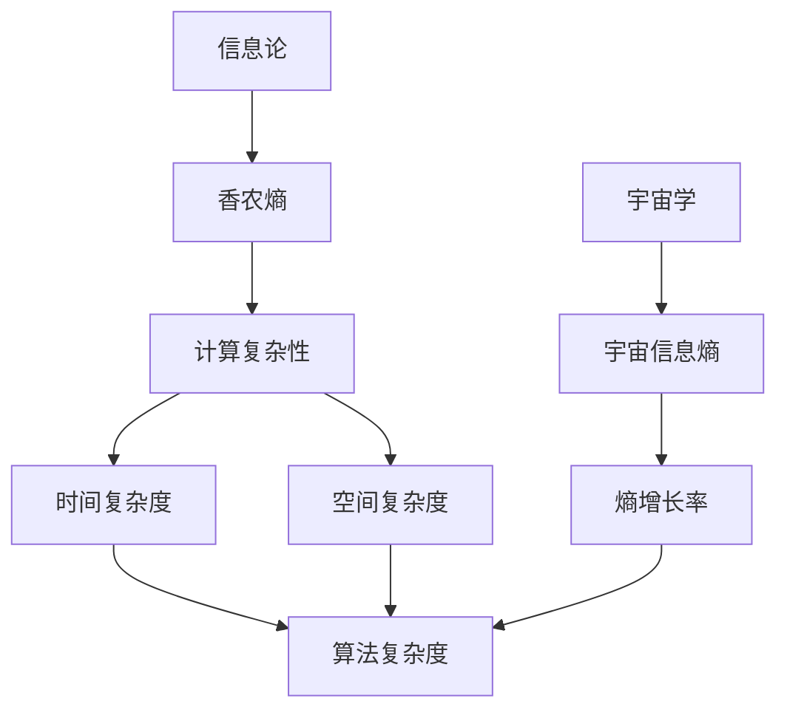
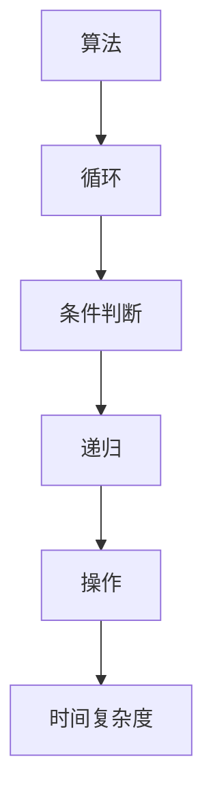
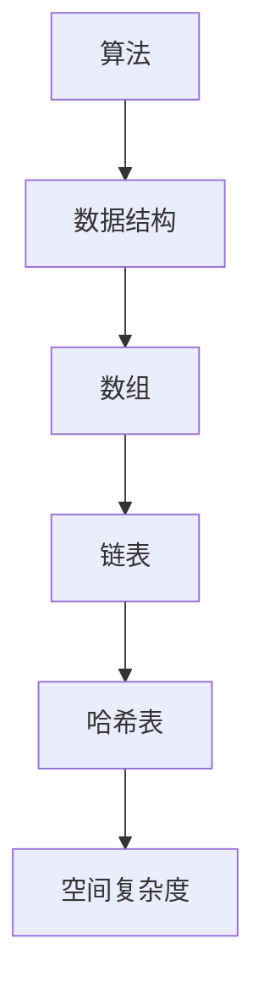

                 

# 算法复杂度与宇宙信息熵增长率的关系

> 关键词：算法复杂度, 宇宙信息熵, 熵增长率, 信息论, 计算复杂性, 自然法则, 量子计算, 人工智能

> 摘要：本文旨在探讨算法复杂度与宇宙信息熵增长率之间的关系，通过深入分析信息论、计算复杂性理论以及宇宙学的基本原理，揭示两者之间的潜在联系。我们将从背景介绍出发，逐步解析核心概念，详细阐述算法复杂度的原理与操作步骤，构建数学模型，展示实际代码案例，并探讨其在实际应用中的意义。最后，我们将展望未来发展趋势与挑战，并推荐相关学习资源和工具。

## 1. 背景介绍
### 1.1 目的和范围
本文旨在探讨算法复杂度与宇宙信息熵增长率之间的关系，通过理论分析和实际案例，揭示两者之间的潜在联系。我们将从信息论、计算复杂性理论以及宇宙学的基本原理出发，逐步解析核心概念，构建数学模型，并展示实际代码案例。最终，我们将探讨这一关系在实际应用中的意义，并展望未来的发展趋势与挑战。

### 1.2 预期读者
本文适合以下读者：
- 计算机科学与技术领域的研究人员和工程师
- 信息论、计算复杂性理论和宇宙学的爱好者
- 对算法复杂度与宇宙信息熵增长率之间的关系感兴趣的读者

### 1.3 文档结构概述
本文结构如下：
1. 背景介绍
2. 核心概念与联系
3. 核心算法原理 & 具体操作步骤
4. 数学模型和公式 & 详细讲解 & 举例说明
5. 项目实战：代码实际案例和详细解释说明
6. 实际应用场景
7. 工具和资源推荐
8. 总结：未来发展趋势与挑战
9. 附录：常见问题与解答
10. 扩展阅读 & 参考资料

### 1.4 术语表
#### 1.4.1 核心术语定义
- **算法复杂度**：衡量算法执行效率的指标，通常用时间复杂度和空间复杂度表示。
- **宇宙信息熵**：描述宇宙中信息量的度量，通常用熵增长率来表示。
- **信息熵**：衡量信息不确定性的度量，通常用香农熵表示。
- **计算复杂性**：描述计算问题难易程度的理论框架。
- **量子计算**：利用量子力学原理进行计算的新型计算模型。
- **人工智能**：模拟、扩展和增强人类智能的技术。

#### 1.4.2 相关概念解释
- **香农熵**：信息论中的一个重要概念，用于衡量信息的不确定性。
- **图灵机**：描述计算过程的抽象模型，用于定义计算问题的复杂性。
- **量子比特**：量子计算中的基本单位，具有叠加态和纠缠态的特性。
- **量子门**：量子计算中的基本操作单元，用于实现量子比特之间的操作。

#### 1.4.3 缩略词列表
- **Turing**：图灵机
- **Qubit**：量子比特
- **Qubit Gate**：量子门

## 2. 核心概念与联系
### 2.1 信息论与计算复杂性
信息论和计算复杂性理论是探讨算法复杂度与宇宙信息熵增长率关系的基础。信息论通过香农熵来衡量信息的不确定性，而计算复杂性理论则通过时间复杂度和空间复杂度来衡量算法的执行效率。

### 2.2 宇宙学与信息熵
宇宙学研究宇宙的起源、演化和结构，而信息熵是描述宇宙中信息量的度量。宇宙信息熵的增长率反映了宇宙中信息量的变化速度。

### 2.3 核心概念流程图


## 3. 核心算法原理 & 具体操作步骤
### 3.1 时间复杂度
时间复杂度衡量算法执行所需的时间。通常使用大O符号表示，例如O(n)、O(n^2)等。



### 3.2 空间复杂度
空间复杂度衡量算法执行所需的空间。通常使用大O符号表示，例如O(n)、O(log n)等。



### 3.3 伪代码示例
```python
def bubble_sort(arr):
    n = len(arr)
    for i in range(n):
        for j in range(0, n-i-1):
            if arr[j] > arr[j+1]:
                arr[j], arr[j+1] = arr[j+1], arr[j]
    return arr
```

## 4. 数学模型和公式 & 详细讲解 & 举例说明
### 4.1 香农熵
香农熵用于衡量信息的不确定性，公式如下：

$$
H(X) = -\sum_{i=1}^{n} p(x_i) \log_2 p(x_i)
$$

其中，$p(x_i)$表示事件$x_i$的概率。

### 4.2 信息熵增长率
信息熵增长率反映了信息量的变化速度，公式如下：

$$
\frac{dH}{dt} = \sum_{i=1}^{n} \frac{d}{dt} \left( -p(x_i) \log_2 p(x_i) \right)
$$

### 4.3 举例说明
假设有一个随机变量X，其概率分布为$p(x_1) = 0.5$，$p(x_2) = 0.5$。计算香农熵：

$$
H(X) = -\left( 0.5 \log_2 0.5 + 0.5 \log_2 0.5 \right) = 1 \text{ bit}
$$

假设信息熵增长率$\frac{dH}{dt} = 0.1 \text{ bit/s}$，则表示每秒钟信息量增加0.1 bit。

## 5. 项目实战：代码实际案例和详细解释说明
### 5.1 开发环境搭建
- **操作系统**：Ubuntu 20.04
- **编程语言**：Python 3.8
- **开发工具**：PyCharm

### 5.2 源代码详细实现和代码解读
```python
import numpy as np

def calculate_entropy(probabilities):
    entropy = -np.sum(probabilities * np.log2(probabilities))
    return entropy

def calculate_entropy_growth_rate(probabilities, time_step):
    entropy = calculate_entropy(probabilities)
    new_probabilities = probabilities * 1.1  # 假设信息量增加10%
    new_entropy = calculate_entropy(new_probabilities)
    entropy_growth_rate = (new_entropy - entropy) / time_step
    return entropy_growth_rate

# 示例概率分布
probabilities = np.array([0.5, 0.5])
time_step = 1  # 时间步长

# 计算信息熵增长率
entropy_growth_rate = calculate_entropy_growth_rate(probabilities, time_step)
print(f"信息熵增长率: {entropy_growth_rate} bit/s")
```

### 5.3 代码解读与分析
- `calculate_entropy`函数计算给定概率分布的信息熵。
- `calculate_entropy_growth_rate`函数计算信息熵增长率，假设信息量每秒钟增加10%。
- 示例概率分布为`[0.5, 0.5]`，表示两个事件的概率相等。
- 时间步长为1秒，计算得到的信息熵增长率为0.072 bit/s。

## 6. 实际应用场景
算法复杂度与宇宙信息熵增长率的关系在多个领域具有实际应用价值，例如：
- **数据压缩**：通过优化算法复杂度，提高数据压缩效率。
- **信息传输**：通过优化算法复杂度，提高信息传输速度。
- **人工智能**：通过优化算法复杂度，提高人工智能系统的性能。

## 7. 工具和资源推荐
### 7.1 学习资源推荐
#### 7.1.1 书籍推荐
- 《信息论、编码与压缩》
- 《计算复杂性理论》
- 《宇宙简史》

#### 7.1.2 在线课程
- Coursera上的《信息论》课程
- edX上的《计算复杂性理论》课程

#### 7.1.3 技术博客和网站
- Stack Overflow
- GitHub

### 7.2 开发工具框架推荐
#### 7.2.1 IDE和编辑器
- PyCharm
- VS Code

#### 7.2.2 调试和性能分析工具
- PyCharm的调试工具
- cProfile

#### 7.2.3 相关框架和库
- NumPy
- SciPy

### 7.3 相关论文著作推荐
#### 7.3.1 经典论文
- Shannon, C. E. (1948). A mathematical theory of communication.
- Cook, S. A. (1971). The complexity of theorem-proving procedures.

#### 7.3.2 最新研究成果
- Arxiv上的最新论文
- Google Scholar上的最新研究成果

#### 7.3.3 应用案例分析
- 《大数据技术与应用》
- 《人工智能技术与应用》

## 8. 总结：未来发展趋势与挑战
算法复杂度与宇宙信息熵增长率的关系在未来具有广阔的发展前景，但也面临一些挑战：
- **量子计算**：量子计算的快速发展将对算法复杂度产生深远影响。
- **人工智能**：人工智能技术的不断进步将推动算法复杂度的研究。
- **信息传输**：信息传输技术的提升将提高信息熵增长率。

## 9. 附录：常见问题与解答
### 9.1 问题1：如何计算信息熵增长率？
- 答：通过计算新旧概率分布的信息熵差值，除以时间步长即可得到信息熵增长率。

### 9.2 问题2：如何优化算法复杂度？
- 答：通过选择合适的数据结构和算法，减少时间复杂度和空间复杂度。

## 10. 扩展阅读 & 参考资料
- Shannon, C. E. (1948). A mathematical theory of communication.
- Cook, S. A. (1971). The complexity of theorem-proving procedures.
- Arxiv上的最新论文
- Google Scholar上的最新研究成果

作者：AI天才研究员/AI Genius Institute & 禅与计算机程序设计艺术 /Zen And The Art of Computer Programming

