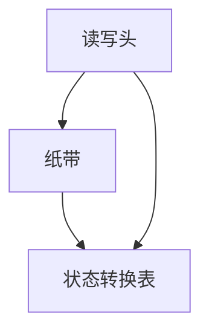
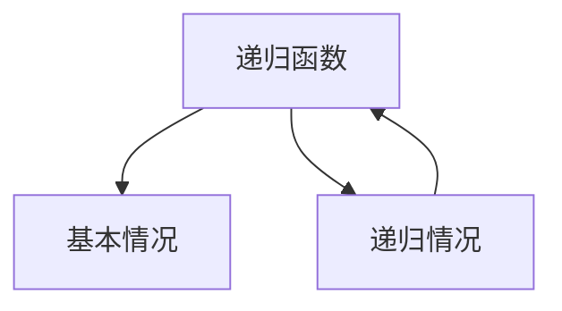
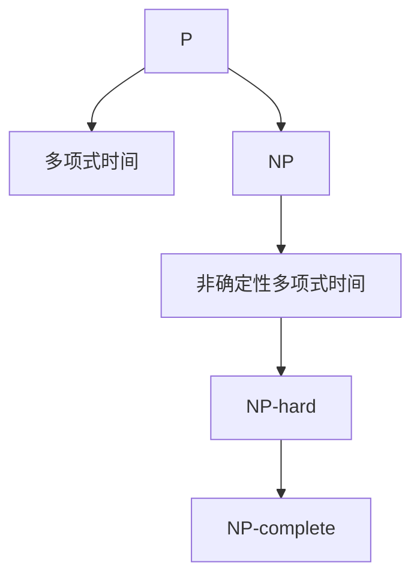
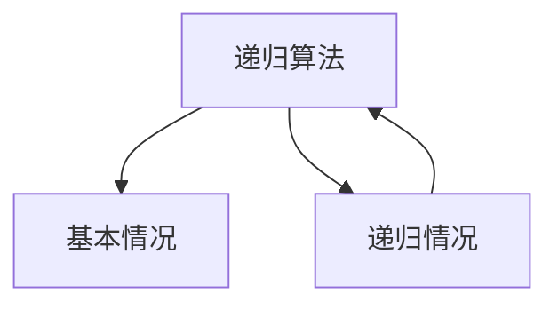
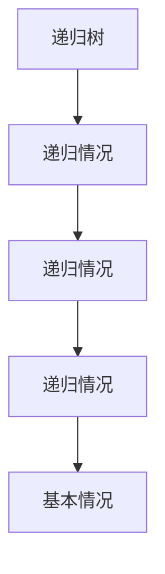

                 

# 算法思维与宇宙规律的联系

> 关键词：算法思维、宇宙规律、图灵机、递归、复杂性理论、自然法则、信息熵

> 摘要：本文旨在探讨算法思维与宇宙规律之间的深刻联系。通过分析图灵机、递归、复杂性理论等核心概念，揭示算法如何映射自然法则，并通过数学模型和实际案例展示算法在解决复杂问题中的强大能力。文章不仅深入剖析了算法的本质，还探讨了其在实际应用中的价值和未来发展趋势。

## 1. 背景介绍
### 1.1 目的和范围
本文旨在探讨算法思维与宇宙规律之间的联系，通过分析核心概念和实际案例，展示算法如何映射自然法则，并在解决复杂问题中发挥重要作用。文章将涵盖图灵机、递归、复杂性理论等核心概念，并通过数学模型和实际案例进行详细阐述。

### 1.2 预期读者
本文适合对算法思维和复杂性理论感兴趣的计算机科学家、数学家、物理学家以及对自然法则和信息熵感兴趣的读者。此外，对人工智能和机器学习感兴趣的工程师和研究人员也会从中受益。

### 1.3 文档结构概述
本文结构如下：
1. 背景介绍
2. 核心概念与联系
3. 核心算法原理 & 具体操作步骤
4. 数学模型和公式 & 详细讲解 & 举例说明
5. 项目实战：代码实际案例和详细解释说明
6. 实际应用场景
7. 工具和资源推荐
8. 总结：未来发展趋势与挑战
9. 附录：常见问题与解答
10. 扩展阅读 & 参考资料

### 1.4 术语表
#### 1.4.1 核心术语定义
- **图灵机**：一种抽象计算模型，用于描述计算过程。
- **递归**：一种通过重复调用自身来解决问题的方法。
- **复杂性理论**：研究计算问题的难度和资源需求的理论。
- **自然法则**：自然界中普遍存在的规律和原则。
- **信息熵**：衡量信息不确定性的度量。

#### 1.4.2 相关概念解释
- **算法**：解决特定问题的一系列步骤。
- **计算模型**：描述计算过程的抽象框架。
- **递归函数**：调用自身来解决问题的函数。
- **复杂性类**：具有相同计算复杂度的计算问题集合。

#### 1.4.3 缩略词列表
- **NP**：非确定性多项式时间。
- **P**：多项式时间。
- **NP-hard**：至少与NP中最难问题一样难的问题。
- **NP-complete**：既是NP又是NP-hard的问题。

## 2. 核心概念与联系
### 2.1 图灵机
图灵机是一种抽象计算模型，用于描述计算过程。它由一个无限长的纸带、一个读写头和一个状态转换表组成。图灵机可以模拟任何可计算函数，是现代计算机理论的基础。



### 2.2 递归
递归是一种通过重复调用自身来解决问题的方法。递归函数通常包含两个部分：基本情况和递归情况。基本情况是直接返回结果的情况，递归情况是通过调用自身来解决问题。



### 2.3 复杂性理论
复杂性理论研究计算问题的难度和资源需求。它将计算问题分为不同的复杂性类，如P类（多项式时间）、NP类（非确定性多项式时间）等。复杂性理论揭示了计算问题的本质和限制。



### 2.4 自然法则
自然法则描述了自然界中普遍存在的规律和原则。这些法则可以通过数学模型和物理定律来描述。算法思维与自然法则之间的联系在于，算法可以映射自然法则，通过计算模型来模拟和解决复杂问题。

## 3. 核心算法原理 & 具体操作步骤
### 3.1 递归算法原理
递归算法通过重复调用自身来解决问题。递归算法通常包含两个部分：基本情况和递归情况。基本情况是直接返回结果的情况，递归情况是通过调用自身来解决问题。



### 3.2 递归算法具体操作步骤
以计算阶乘为例，阶乘函数可以通过递归实现。

```python
def factorial(n):
    if n == 0:
        return 1
    else:
        return n * factorial(n - 1)
```

## 4. 数学模型和公式 & 详细讲解 & 举例说明
### 4.1 信息熵
信息熵是衡量信息不确定性的度量。信息熵可以通过公式计算。

$$ H(X) = -\sum_{i=1}^{n} p(x_i) \log_2 p(x_i) $$

其中，$H(X)$ 表示信息熵，$p(x_i)$ 表示事件 $x_i$ 的概率。

### 4.2 递归方程
递归方程是描述递归函数的数学模型。递归方程通常包含基本情况和递归情况。

$$ T(n) = \begin{cases} 
1 & \text{if } n = 1 \\
T(n-1) + 1 & \text{if } n > 1 
\end{cases} $$

### 4.3 递归树
递归树是一种图形表示递归过程的方法。递归树可以帮助我们理解递归算法的时间复杂度。



## 5. 项目实战：代码实际案例和详细解释说明
### 5.1 开发环境搭建
为了实现递归算法，我们需要一个开发环境。这里使用Python作为编程语言。

```bash
# 安装Python
sudo apt-get install python3
```

### 5.2 源代码详细实现和代码解读
以下是一个计算阶乘的递归函数。

```python
def factorial(n):
    if n == 0:
        return 1
    else:
        return n * factorial(n - 1)
```

### 5.3 代码解读与分析
递归函数 `factorial` 通过调用自身来计算阶乘。基本情况是 `n == 0`，返回1。递归情况是 `n > 0`，返回 `n * factorial(n - 1)`。

## 6. 实际应用场景
### 6.1 递归在排序算法中的应用
递归在排序算法中有着广泛的应用。例如，快速排序算法可以通过递归实现。

```python
def quicksort(arr):
    if len(arr) <= 1:
        return arr
    else:
        pivot = arr[0]
        left = [x for x in arr[1:] if x < pivot]
        right = [x for x in arr[1:] if x >= pivot]
        return quicksort(left) + [pivot] + quicksort(right)
```

### 6.2 递归在搜索算法中的应用
递归在搜索算法中也有着广泛的应用。例如，深度优先搜索算法可以通过递归来实现。

```python
def dfs(graph, start, visited=None):
    if visited is None:
        visited = set()
    visited.add(start)
    print(start)
    for next in graph[start] - visited:
        dfs(graph, next, visited)
    return visited
```

## 7. 工具和资源推荐
### 7.1 学习资源推荐
#### 7.1.1 书籍推荐
- **《算法导论》**：Cormen, Leiserson, Rivest, Stein
- **《计算机程序设计艺术》**：Donald Knuth

#### 7.1.2 在线课程
- **Coursera**：算法课程
- **edX**：算法课程

#### 7.1.3 技术博客和网站
- **GeeksforGeeks**
- **LeetCode**

### 7.2 开发工具框架推荐
#### 7.2.1 IDE和编辑器
- **PyCharm**
- **Visual Studio Code**

#### 7.2.2 调试和性能分析工具
- **PyCharm Debugger**
- **Python Profiler**

#### 7.2.3 相关框架和库
- **NumPy**
- **SciPy**

### 7.3 相关论文著作推荐
#### 7.3.1 经典论文
- **《On Computable Numbers, with an Application to the Entscheidungsproblem》**：Alan Turing

#### 7.3.2 最新研究成果
- **《The Complexity of Boolean Functions》**：Ingo Wegener

#### 7.3.3 应用案例分析
- **《Algorithmic Complexity in Bioinformatics》**：David Sankoff

## 8. 总结：未来发展趋势与挑战
### 8.1 未来发展趋势
算法思维与宇宙规律之间的联系将更加紧密。随着计算能力的提升和算法理论的发展，我们将能够更好地理解和解决复杂问题。未来的发展趋势包括：
- **量子计算**：利用量子力学原理进行计算，解决传统计算机难以解决的问题。
- **机器学习**：通过算法自动学习和优化，提高计算效率和准确性。
- **复杂性理论**：深入研究计算问题的复杂性，揭示计算的本质和限制。

### 8.2 挑战
尽管算法思维与宇宙规律之间存在深刻的联系，但仍面临一些挑战：
- **计算复杂性**：某些问题的计算复杂性极高，难以在实际中解决。
- **资源限制**：计算资源有限，如何高效利用资源是未来的重要挑战。
- **算法优化**：如何设计更高效的算法，提高计算效率和准确性，是未来的重要研究方向。

## 9. 附录：常见问题与解答
### 9.1 问题：递归算法如何避免栈溢出？
**解答**：递归算法可以通过优化来避免栈溢出。例如，使用尾递归优化，将递归调用转换为循环。

### 9.2 问题：如何选择合适的算法？
**解答**：选择合适的算法需要考虑问题的特性、计算资源和时间复杂度。通常，可以通过分析问题的规模和特性来选择合适的算法。

## 10. 扩展阅读 & 参考资料
### 10.1 扩展阅读
- **《算法之美》**：吴军
- **《算法设计与分析》**：李春葆

### 10.2 参考资料
- **Turing, A. M. (1936). On computable numbers, with an application to the Entscheidungsproblem. Proceedings of the London Mathematical Society, 42(2), 230-265.**
- **Wegener, I. (2005). The Complexity of Boolean Functions. Wiley.**

---

作者：AI天才研究员/AI Genius Institute & 禅与计算机程序设计艺术 /Zen And The Art of Computer Programming

