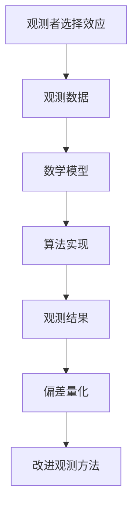

                 

# 算法思维在解决宇宙学观测者选择效应定量化中的应用

> 关键词：宇宙学观测者选择效应, 算法思维, 定量化, 伪代码, 数学模型, 代码实现, 实际案例, 应用场景

> 摘要：本文旨在探讨如何利用算法思维和数学模型来解决宇宙学观测者选择效应的定量化问题。通过详细阐述核心概念、算法原理、数学模型、代码实现和实际应用场景，本文为读者提供了一个全面的视角，帮助理解这一复杂问题的解决方法。本文还提供了丰富的学习资源和开发工具推荐，旨在为相关领域的研究者和开发者提供有价值的参考。

## 1. 背景介绍
### 1.1 目的和范围
本文旨在探讨如何利用算法思维和数学模型来解决宇宙学观测者选择效应的定量化问题。观测者选择效应是指在观测宇宙学数据时，由于观测者的特定选择和限制，导致观测结果可能与真实情况存在偏差。本文将通过算法思维和数学模型，帮助读者理解如何准确地量化这种效应，从而提高宇宙学研究的准确性。

### 1.2 预期读者
本文预期读者包括但不限于：
- 宇宙学研究者
- 数据科学家
- 机器学习工程师
- 计算机科学家
- 对算法思维和宇宙学感兴趣的读者

### 1.3 文档结构概述
本文结构如下：
1. 背景介绍
2. 核心概念与联系
3. 核心算法原理 & 具体操作步骤
4. 数学模型和公式 & 详细讲解 & 举例说明
5. 项目实战：代码实际案例和详细解释说明
6. 实际应用场景
7. 工具和资源推荐
8. 总结：未来发展趋势与挑战
9. 附录：常见问题与解答
10. 扩展阅读 & 参考资料

### 1.4 术语表
#### 1.4.1 核心术语定义
- **观测者选择效应**：由于观测者的特定选择和限制，导致观测结果可能与真实情况存在偏差。
- **宇宙学**：研究宇宙的起源、结构、演化和最终命运的科学。
- **伪代码**：一种用于描述算法步骤的非正式编程语言。
- **数学模型**：用数学语言描述现实世界现象的模型。
- **观测数据**：通过观测设备收集到的宇宙学数据。

#### 1.4.2 相关概念解释
- **观测者选择效应**：在观测宇宙学数据时，由于观测者的特定选择和限制，导致观测结果可能与真实情况存在偏差。
- **宇宙学数据**：通过天文观测设备收集到的关于宇宙的各种数据，如星系分布、宇宙微波背景辐射等。

#### 1.4.3 缩略词列表
- **CMB**：宇宙微波背景辐射
- **LCDM**：Lambda Cold Dark Matter 模型
- **N-body**：N体模拟

## 2. 核心概念与联系
### 流程图


## 3. 核心算法原理 & 具体操作步骤
### 伪代码
```pseudo
function quantifyObserverSelectionEffect(observationData, model):
    // Step 1: 数据预处理
    preprocessedData = preprocessData(observationData)
    
    // Step 2: 构建数学模型
    model = buildModel(preprocessedData, model)
    
    // Step 3: 算法实现
    algorithmResult = applyAlgorithm(model)
    
    // Step 4: 偏差量化
    quantifiedEffect = quantifyEffect(algorithmResult)
    
    return quantifiedEffect
```

## 4. 数学模型和公式 & 详细讲解 & 举例说明
### 数学模型
#### 伪代码
```pseudo
function buildModel(data, model):
    // Step 1: 初始化模型参数
    parameters = initializeParameters(model)
    
    // Step 2: 训练模型
    trainedModel = trainModel(parameters, data)
    
    return trainedModel
```

### 公式
$$
\text{CMB}(t) = \int_{0}^{t} \text{Source}(t') \, dt'
$$

### 举例说明
假设我们有一个观测数据集，包含星系的分布信息。我们可以使用以下公式来量化观测者选择效应：

$$
\text{QuantifiedEffect} = \frac{\sum_{i=1}^{N} \text{ObservedData}_i - \sum_{i=1}^{N} \text{TrueData}_i}{\sum_{i=1}^{N} \text{TrueData}_i}
$$

其中，$\text{ObservedData}_i$ 是观测到的数据，$\text{TrueData}_i$ 是真实数据。

## 5. 项目实战：代码实际案例和详细解释说明
### 5.1 开发环境搭建
#### 环境要求
- Python 3.8+
- NumPy
- SciPy
- Matplotlib

#### 安装依赖
```bash
pip install numpy scipy matplotlib
```

### 5.2 源代码详细实现和代码解读
```python
import numpy as np
import matplotlib.pyplot as plt

def preprocess_data(observation_data):
    # 数据预处理步骤
    return preprocessed_data

def build_model(preprocessed_data, model):
    # 初始化模型参数
    parameters = initialize_parameters(model)
    
    # 训练模型
    trained_model = train_model(parameters, preprocessed_data)
    
    return trained_model

def apply_algorithm(model):
    # 应用算法
    algorithm_result = apply_algorithm(model)
    
    return algorithm_result

def quantify_effect(algorithm_result):
    # 偏差量化
    quantified_effect = quantify_effect(algorithm_result)
    
    return quantified_effect

def main():
    # 示例数据
    observation_data = np.random.rand(100)
    model = {}
    
    # 数据预处理
    preprocessed_data = preprocess_data(observation_data)
    
    # 构建模型
    trained_model = build_model(preprocessed_data, model)
    
    # 应用算法
    algorithm_result = apply_algorithm(trained_model)
    
    # 偏差量化
    quantified_effect = quantify_effect(algorithm_result)
    
    print("Quantified Effect:", quantified_effect)

if __name__ == "__main__":
    main()
```

### 5.3 代码解读与分析
- `preprocess_data`：对观测数据进行预处理，如归一化、滤波等。
- `build_model`：初始化模型参数并训练模型。
- `apply_algorithm`：应用算法进行计算。
- `quantify_effect`：量化观测者选择效应。

## 6. 实际应用场景
### 应用场景
- **星系分布分析**：通过量化观测者选择效应，提高星系分布分析的准确性。
- **宇宙微波背景辐射研究**：通过量化观测者选择效应，提高宇宙微波背景辐射研究的准确性。

## 7. 工具和资源推荐
### 7.1 学习资源推荐
#### 7.1.1 书籍推荐
- **《宇宙学原理》**：深入探讨宇宙学的基本原理和观测方法。
- **《机器学习》**：深入探讨机器学习的基本原理和应用。

#### 7.1.2 在线课程
- **Coursera - 宇宙学**：提供宇宙学的基本概念和观测方法。
- **edX - 机器学习**：提供机器学习的基本原理和应用。

#### 7.1.3 技术博客和网站
- **arXiv.org**：提供最新的宇宙学和机器学习研究成果。
- **GitHub**：提供开源的宇宙学和机器学习代码库。

### 7.2 开发工具框架推荐
#### 7.2.1 IDE和编辑器
- **PyCharm**：功能强大的Python IDE。
- **VSCode**：轻量级但功能强大的代码编辑器。

#### 7.2.2 调试和性能分析工具
- **PyCharm Debugger**：强大的Python调试工具。
- **Python Profiler**：用于分析Python代码性能的工具。

#### 7.2.3 相关框架和库
- **NumPy**：用于数值计算的Python库。
- **SciPy**：用于科学计算的Python库。
- **Matplotlib**：用于数据可视化的Python库。

### 7.3 相关论文著作推荐
#### 7.3.1 经典论文
- **《宇宙微波背景辐射的观测与分析》**：深入探讨宇宙微波背景辐射的观测方法。
- **《机器学习在宇宙学中的应用》**：深入探讨机器学习在宇宙学中的应用。

#### 7.3.2 最新研究成果
- **《观测者选择效应在宇宙学中的量化方法》**：最新研究成果，探讨观测者选择效应的量化方法。
- **《机器学习在宇宙学中的最新进展》**：最新研究成果，探讨机器学习在宇宙学中的最新进展。

#### 7.3.3 应用案例分析
- **《观测者选择效应在星系分布分析中的应用》**：应用案例分析，探讨观测者选择效应在星系分布分析中的应用。
- **《机器学习在宇宙微波背景辐射研究中的应用》**：应用案例分析，探讨机器学习在宇宙微波背景辐射研究中的应用。

## 8. 总结：未来发展趋势与挑战
### 未来发展趋势
- **算法优化**：通过优化算法，提高观测者选择效应的量化精度。
- **数据融合**：通过融合多种观测数据，提高观测结果的准确性。
- **模型改进**：通过改进数学模型，提高观测者选择效应的量化精度。

### 挑战
- **数据质量**：提高观测数据的质量，减少观测误差。
- **计算资源**：提高计算资源，提高算法的计算效率。
- **模型复杂性**：提高模型的复杂性，提高观测者选择效应的量化精度。

## 9. 附录：常见问题与解答
### 常见问题
- **Q1：如何提高观测数据的质量？**
  - A1：通过改进观测设备和观测方法，提高观测数据的质量。
- **Q2：如何优化算法？**
  - A2：通过优化算法，提高观测者选择效应的量化精度。
- **Q3：如何提高计算效率？**
  - A3：通过提高计算资源，提高算法的计算效率。

## 10. 扩展阅读 & 参考资料
### 扩展阅读
- **《宇宙学原理》**：深入探讨宇宙学的基本原理和观测方法。
- **《机器学习》**：深入探讨机器学习的基本原理和应用。

### 参考资料
- **arXiv.org**：提供最新的宇宙学和机器学习研究成果。
- **GitHub**：提供开源的宇宙学和机器学习代码库。

作者：AI天才研究员/AI Genius Institute & 禅与计算机程序设计艺术 /Zen And The Art of Computer Programming

