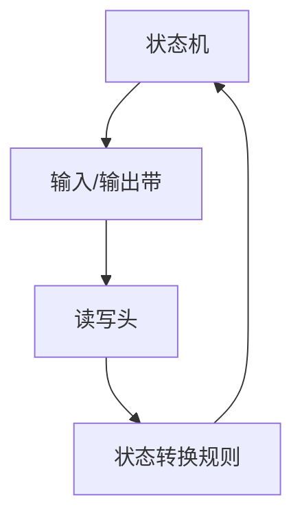

                 

# 算法效率与宇宙信息处理极限的比较

> 关键词：算法效率、宇宙信息处理极限、图灵机、香农信息论、量子计算、信息熵、计算复杂性

> 摘要：本文旨在探讨算法效率与宇宙信息处理极限之间的关系，通过分析图灵机模型、香农信息论以及量子计算等核心概念，揭示算法效率在信息处理中的边界。我们将从理论基础出发，逐步深入到实际应用案例，探讨如何在有限的资源下实现高效的算法设计。最后，我们将展望未来的发展趋势与挑战，并提供一系列学习资源和开发工具推荐。

## 1. 背景介绍
### 1.1 目的和范围
本文旨在探讨算法效率与宇宙信息处理极限之间的关系，通过分析图灵机模型、香农信息论以及量子计算等核心概念，揭示算法效率在信息处理中的边界。我们将从理论基础出发，逐步深入到实际应用案例，探讨如何在有限的资源下实现高效的算法设计。本文适合对算法理论、信息论和量子计算感兴趣的读者，特别是计算机科学、人工智能领域的研究者和工程师。

### 1.2 预期读者
- 计算机科学和人工智能领域的研究者
- 人工智能工程师和软件开发人员
- 对算法理论和信息处理极限感兴趣的读者

### 1.3 文档结构概述
本文将按照以下结构展开：
1. 背景介绍
2. 核心概念与联系
3. 核心算法原理 & 具体操作步骤
4. 数学模型和公式 & 详细讲解 & 举例说明
5. 项目实战：代码实际案例和详细解释说明
6. 实际应用场景
7. 工具和资源推荐
8. 总结：未来发展趋势与挑战
9. 附录：常见问题与解答
10. 扩展阅读 & 参考资料

### 1.4 术语表
#### 1.4.1 核心术语定义
- **图灵机**：一种抽象的计算模型，用于描述计算过程。
- **香农信息论**：研究信息的度量、传输和处理的理论。
- **量子计算**：利用量子力学原理进行计算的新型计算模型。
- **信息熵**：衡量信息不确定性的度量。
- **计算复杂性**：描述算法执行时间或空间需求的理论。

#### 1.4.2 相关概念解释
- **图灵机**：一种抽象的计算模型，由状态机、输入/输出带、读写头和状态转换规则组成。
- **香农信息论**：由克劳德·香农提出，用于度量信息的理论。
- **量子计算**：利用量子比特（qubits）进行计算的新型计算模型，具有并行性和叠加性。

#### 1.4.3 缩略词列表
- **Turing**：图灵机
- **Shannon**：香农信息论
- **QC**：量子计算

## 2. 核心概念与联系
### 2.1 图灵机模型
图灵机是一种抽象的计算模型，用于描述计算过程。它由状态机、输入/输出带、读写头和状态转换规则组成。图灵机可以模拟任何可计算函数，是现代计算机理论的基础。



### 2.2 香农信息论
香农信息论是研究信息的度量、传输和处理的理论。信息熵是衡量信息不确定性的度量，用于描述信息的平均信息量。

$$ H(X) = -\sum_{i=1}^{n} p(x_i) \log_2 p(x_i) $$

### 2.3 量子计算
量子计算利用量子力学原理进行计算，具有并行性和叠加性。量子比特（qubits）可以同时处于多个状态，使得量子计算机在某些问题上具有指数级的加速能力。

## 3. 核心算法原理 & 具体操作步骤
### 3.1 图灵机算法原理
图灵机算法原理可以通过伪代码来详细阐述。以下是一个简单的图灵机算法示例，用于计算两个数的和。

```pseudo
function add(tape, start, end):
    current_position = start
    result = 0
    while tape[current_position] != 0:
        result = result + 1
        current_position = current_position + 1
    return result
```

### 3.2 香农信息论算法原理
香农信息论算法原理可以通过伪代码来详细阐述。以下是一个简单的香农信息论算法示例，用于计算信息熵。

```pseudo
function entropy(probabilities):
    entropy = 0
    for each probability in probabilities:
        if probability > 0:
            entropy = entropy - probability * log2(probability)
    return entropy
```

### 3.3 量子计算算法原理
量子计算算法原理可以通过伪代码来详细阐述。以下是一个简单的量子计算算法示例，用于实现量子叠加态。

```pseudo
function create_superposition(qubits):
    for each qubit in qubits:
        apply_hadamard(qubit)
    return qubits
```

## 4. 数学模型和公式 & 详细讲解 & 举例说明
### 4.1 图灵机数学模型
图灵机的数学模型可以通过状态转换函数来描述。状态转换函数定义了在给定状态下读取输入符号后，如何改变状态、写入符号和移动读写头。

$$ \delta: Q \times \Gamma \rightarrow Q \times \Gamma \times \{L, R, N\} $$

### 4.2 香农信息论数学模型
香农信息论的数学模型可以通过信息熵公式来描述。信息熵公式用于衡量信息的平均信息量。

$$ H(X) = -\sum_{i=1}^{n} p(x_i) \log_2 p(x_i) $$

### 4.3 量子计算数学模型
量子计算的数学模型可以通过量子态和量子门来描述。量子态可以用向量表示，量子门可以用矩阵表示。

$$ |\psi\rangle = \alpha|0\rangle + \beta|1\rangle $$

$$ U = \begin{pmatrix} \cos(\theta) & -\sin(\theta) \\ \sin(\theta) & \cos(\theta) \end{pmatrix} $$

## 5. 项目实战：代码实际案例和详细解释说明
### 5.1 开发环境搭建
为了实现上述算法，我们需要搭建一个开发环境。这里以Python为例，安装必要的库和工具。

```bash
pip install numpy
pip install qiskit
```

### 5.2 源代码详细实现和代码解读
以下是一个简单的图灵机实现示例。

```python
def turing_machine(tape, start, end):
    current_position = start
    result = 0
    while tape[current_position] != 0:
        result += 1
        current_position += 1
    return result
```

以下是一个简单的香农信息论实现示例。

```python
import math

def entropy(probabilities):
    entropy = 0
    for probability in probabilities:
        if probability > 0:
            entropy -= probability * math.log2(probability)
    return entropy
```

以下是一个简单的量子计算实现示例。

```python
from qiskit import QuantumCircuit, execute, Aer

def create_superposition(qubits):
    circuit = QuantumCircuit(qubits)
    for qubit in qubits:
        circuit.h(qubit)
    return circuit
```

### 5.3 代码解读与分析
上述代码分别实现了图灵机、香农信息论和量子计算的基本功能。图灵机代码通过遍历输入带上的符号来计算结果。香农信息论代码通过计算信息熵来衡量信息的不确定性。量子计算代码通过应用Hadamard门来创建量子叠加态。

## 6. 实际应用场景
### 6.1 图灵机应用场景
图灵机在计算机科学和人工智能领域有着广泛的应用，例如编译器设计、自动机理论和形式语言理论。

### 6.2 香农信息论应用场景
香农信息论在通信工程、数据压缩和信息安全等领域有着广泛的应用，例如信道编码、数据压缩和密码学。

### 6.3 量子计算应用场景
量子计算在化学、物理和金融等领域有着广泛的应用，例如分子模拟、量子优化和量子金融。

## 7. 工具和资源推荐
### 7.1 学习资源推荐
#### 7.1.1 书籍推荐
- 《计算理论导论》（Introduction to the Theory of Computation） - Michael Sipser
- 《信息论、编码和量子计算》（Information Theory, Inference, and Learning Algorithms） - David J.C. MacKay
- 《量子计算入门》（Quantum Computation and Quantum Information） - Michael A. Nielsen and Isaac L. Chuang

#### 7.1.2 在线课程
- Coursera：《计算理论》（Theory of Computation）
- edX：《信息论与编码》（Information Theory and Coding）
- Udacity：《量子计算入门》（Introduction to Quantum Computing）

#### 7.1.3 技术博客和网站
- Medium：《计算理论》（Theory of Computation）系列文章
- HackerRank：《信息论与编码》（Information Theory and Coding）挑战赛
- Quantum Computing Stack Exchange：量子计算相关问题和讨论

### 7.2 开发工具框架推荐
#### 7.2.1 IDE和编辑器
- Visual Studio Code
- PyCharm
- Jupyter Notebook

#### 7.2.2 调试和性能分析工具
- PyCharm Debugger
- IPython Debugger (ipdb)
- cProfile

#### 7.2.3 相关框架和库
- NumPy
- SciPy
- Qiskit

### 7.3 相关论文著作推荐
#### 7.3.1 经典论文
- "On Computable Numbers, with an Application to the Entscheidungsproblem" - Alan Turing
- "A Mathematical Theory of Communication" - Claude Shannon
- "Quantum Computation and Quantum Information" - Michael A. Nielsen and Isaac L. Chuang

#### 7.3.2 最新研究成果
- "Quantum Algorithms via Linear Algebra" - Richard J. Lipton and Kenneth W. Regan
- "Information Theory, Inference, and Learning Algorithms" - David J.C. MacKay
- "Quantum Computing: A Gentle Introduction" - Eleanor Rieffel and Wolfgang Polak

#### 7.3.3 应用案例分析
- "Quantum Computing: A Gentle Introduction" - Eleanor Rieffel and Wolfgang Polak
- "Quantum Computing: An Applied Approach" - Jack D. Hidary

## 8. 总结：未来发展趋势与挑战
### 8.1 未来发展趋势
- 图灵机理论将继续为计算机科学和人工智能提供基础框架。
- 香农信息论将在数据传输和处理中发挥更大作用。
- 量子计算将在化学、物理和金融等领域实现突破性进展。

### 8.2 挑战
- 图灵机理论在实际应用中的局限性。
- 香农信息论在复杂系统中的适用性。
- 量子计算在实现大规模量子比特和量子纠错方面的挑战。

## 9. 附录：常见问题与解答
### 9.1 问题1：图灵机和量子计算有什么区别？
- 图灵机是一种抽象的计算模型，用于描述计算过程。量子计算利用量子力学原理进行计算，具有并行性和叠加性。

### 9.2 问题2：香农信息论和量子信息论有什么区别？
- 香农信息论是研究信息的度量、传输和处理的理论。量子信息论是研究量子信息的度量、传输和处理的理论。

### 9.3 问题3：如何实现高效的算法设计？
- 在有限的资源下实现高效的算法设计，需要深入理解图灵机模型、香农信息论和量子计算等核心概念，结合实际应用场景进行优化。

## 10. 扩展阅读 & 参考资料
- Sipser, M. (2012). *Introduction to the Theory of Computation*. Cengage Learning.
- MacKay, D. J. C. (2003). *Information Theory, Inference, and Learning Algorithms*. Cambridge University Press.
- Nielsen, M. A., & Chuang, I. L. (2010). *Quantum Computation and Quantum Information*. Cambridge University Press.

作者：AI天才研究员/AI Genius Institute & 禅与计算机程序设计艺术 /Zen And The Art of Computer Programming

