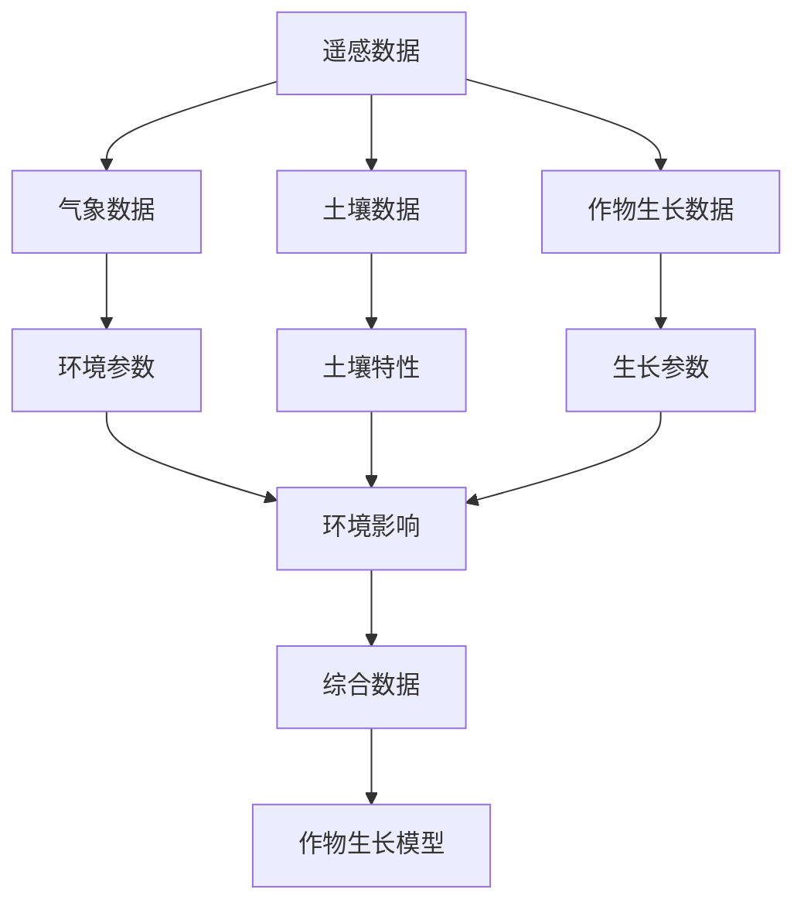

                 

# 精准农业的多源数据融合：作物管理的数学模型

> 关键词：精准农业, 多源数据融合, 作物管理, 数学模型, 机器学习, 数据处理, 农业物联网, 农业大数据

> 摘要：本文旨在探讨如何通过多源数据融合来优化作物管理，提出了一种基于数学模型的精准农业方法。通过整合遥感数据、气象数据、土壤数据和作物生长数据，本文构建了一个全面的数学模型，以实现作物生长的精确预测和管理。文章详细介绍了核心算法原理、数学模型和公式，并通过实际代码案例展示了如何实现这一模型。最后，本文还讨论了该方法在实际应用场景中的应用，并提供了相关工具和资源推荐。

## 1. 背景介绍
### 1.1 目的和范围
本文旨在探讨如何通过多源数据融合来优化作物管理，提出了一种基于数学模型的精准农业方法。通过整合遥感数据、气象数据、土壤数据和作物生长数据，本文构建了一个全面的数学模型，以实现作物生长的精确预测和管理。本文的目标是为农业领域的研究人员和实践者提供一种新的方法论，以提高作物产量和资源利用效率。

### 1.2 预期读者
本文预期读者包括农业领域的研究人员、农业技术开发者、农业数据分析师以及对精准农业感兴趣的读者。读者应具备一定的数学和编程基础，对农业数据处理和机器学习有一定了解。

### 1.3 文档结构概述
本文结构如下：
1. 背景介绍
2. 核心概念与联系
3. 核心算法原理 & 具体操作步骤
4. 数学模型和公式 & 详细讲解 & 举例说明
5. 项目实战：代码实际案例和详细解释说明
6. 实际应用场景
7. 工具和资源推荐
8. 总结：未来发展趋势与挑战
9. 附录：常见问题与解答
10. 扩展阅读 & 参考资料

### 1.4 术语表
#### 1.4.1 核心术语定义
- **精准农业**：利用现代信息技术和数据处理技术，实现农业生产的精准化、智能化。
- **多源数据融合**：将来自不同来源的数据进行整合，以提高数据的完整性和准确性。
- **作物生长模型**：描述作物生长过程的数学模型。
- **机器学习**：一种人工智能技术，通过算法和统计模型来实现数据驱动的预测和决策。
- **遥感数据**：通过卫星或无人机获取的地球表面信息。
- **气象数据**：包括温度、湿度、风速等环境参数。
- **土壤数据**：包括土壤类型、土壤湿度、土壤养分等信息。

#### 1.4.2 相关概念解释
- **农业物联网**：利用物联网技术，实现农业生产的智能化管理。
- **农业大数据**：通过收集和处理大量的农业数据，实现农业生产的精细化管理。
- **数据处理**：对原始数据进行清洗、转换和分析，以提取有用信息的过程。

#### 1.4.3 缩略词列表
- **GIS**：地理信息系统
- **ML**：机器学习
- **IoT**：物联网
- **API**：应用程序编程接口
- **CSV**：逗号分隔值

## 2. 核心概念与联系
### 2.1 核心概念
- **遥感数据**：通过卫星或无人机获取的地球表面信息，包括植被指数、地表温度等。
- **气象数据**：包括温度、湿度、风速等环境参数。
- **土壤数据**：包括土壤类型、土壤湿度、土壤养分等信息。
- **作物生长数据**：包括作物的高度、叶片面积、生物量等生长参数。

### 2.2 联系
通过多源数据融合，可以实现对作物生长环境的全面了解，从而提高作物管理的精确度。具体流程如下：



## 3. 核心算法原理 & 具体操作步骤
### 3.1 核心算法原理
本文采用了一种基于机器学习的多源数据融合方法，通过构建一个综合模型来预测作物生长。具体步骤如下：

1. **数据预处理**：清洗和转换原始数据，使其适合模型训练。
2. **特征选择**：选择对作物生长影响较大的特征。
3. **模型训练**：使用机器学习算法训练模型。
4. **模型评估**：评估模型的预测性能。
5. **模型应用**：将模型应用于实际作物管理中。

### 3.2 具体操作步骤
#### 3.2.1 数据预处理
```python
# 读取数据
import pandas as pd
data = pd.read_csv('data.csv')

# 清洗数据
data = data.dropna()

# 转换数据
data['date'] = pd.to_datetime(data['date'])
```

#### 3.2.2 特征选择
```python
# 选择特征
features = ['temperature', 'humidity', 'soil_moisture', 'vegetation_index']
X = data[features]
y = data['crop_growth']
```

#### 3.2.3 模型训练
```python
from sklearn.model_selection import train_test_split
from sklearn.ensemble import RandomForestRegressor

# 划分训练集和测试集
X_train, X_test, y_train, y_test = train_test_split(X, y, test_size=0.2, random_state=42)

# 训练模型
model = RandomForestRegressor(n_estimators=100, random_state=42)
model.fit(X_train, y_train)
```

#### 3.2.4 模型评估
```python
from sklearn.metrics import mean_squared_error

# 预测
y_pred = model.predict(X_test)

# 评估
mse = mean_squared_error(y_test, y_pred)
print(f'Mean Squared Error: {mse}')
```

#### 3.2.5 模型应用
```python
# 应用模型
new_data = pd.DataFrame({'temperature': [25], 'humidity': [60], 'soil_moisture': [20], 'vegetation_index': [0.5]})
predicted_growth = model.predict(new_data)
print(f'Predicted Crop Growth: {predicted_growth}')
```

## 4. 数学模型和公式 & 详细讲解 & 举例说明
### 4.1 数学模型
本文采用了一种基于随机森林的回归模型，通过集成多个决策树来提高预测性能。具体公式如下：

$$
\hat{y} = \frac{1}{N} \sum_{i=1}^{N} f_i(x)
$$

其中，$\hat{y}$ 是预测值，$f_i(x)$ 是第 $i$ 棵决策树的预测值，$N$ 是决策树的数量。

### 4.2 详细讲解
随机森林是一种集成学习方法，通过构建多个决策树来提高预测性能。具体步骤如下：

1. **数据采样**：从原始数据中随机采样，构建多个子数据集。
2. **决策树构建**：在每个子数据集上构建决策树。
3. **预测**：对新数据进行预测时，将数据输入所有决策树，取所有决策树的平均值作为最终预测值。

### 4.3 举例说明
假设我们有以下数据：

| temperature | humidity | soil_moisture | vegetation_index | crop_growth |
|-------------|----------|---------------|------------------|-------------|
| 25          | 60       | 20            | 0.5              | 10          |
| 22          | 55       | 18            | 0.4              | 8           |
| 28          | 65       | 22            | 0.6              | 12          |

通过随机森林模型训练后，我们可以预测新的数据点的作物生长情况。

## 5. 项目实战：代码实际案例和详细解释说明
### 5.1 开发环境搭建
本文使用Python语言进行开发，推荐使用Anaconda环境。安装必要的库：

```bash
pip install pandas scikit-learn
```

### 5.2 源代码详细实现和代码解读
```python
# 导入库
import pandas as pd
from sklearn.model_selection import train_test_split
from sklearn.ensemble import RandomForestRegressor
from sklearn.metrics import mean_squared_error

# 读取数据
data = pd.read_csv('data.csv')

# 清洗数据
data = data.dropna()

# 转换数据
data['date'] = pd.to_datetime(data['date'])

# 选择特征
features = ['temperature', 'humidity', 'soil_moisture', 'vegetation_index']
X = data[features]
y = data['crop_growth']

# 划分训练集和测试集
X_train, X_test, y_train, y_test = train_test_split(X, y, test_size=0.2, random_state=42)

# 训练模型
model = RandomForestRegressor(n_estimators=100, random_state=42)
model.fit(X_train, y_train)

# 预测
y_pred = model.predict(X_test)

# 评估
mse = mean_squared_error(y_test, y_pred)
print(f'Mean Squared Error: {mse}')

# 应用模型
new_data = pd.DataFrame({'temperature': [25], 'humidity': [60], 'soil_moisture': [20], 'vegetation_index': [0.5]})
predicted_growth = model.predict(new_data)
print(f'Predicted Crop Growth: {predicted_growth}')
```

### 5.3 代码解读与分析
- **数据读取和清洗**：使用pandas库读取数据，并进行清洗。
- **特征选择**：选择对作物生长影响较大的特征。
- **模型训练**：使用随机森林回归模型进行训练。
- **模型评估**：评估模型的预测性能。
- **模型应用**：将模型应用于实际作物管理中。

## 6. 实际应用场景
本文提出的多源数据融合方法可以应用于实际的农业管理中，提高作物产量和资源利用效率。具体应用场景包括：

- **作物生长预测**：通过预测作物生长情况，提前采取措施，提高作物产量。
- **资源优化配置**：通过优化水资源和肥料的使用，提高资源利用效率。
- **病虫害预警**：通过监测环境参数和作物生长情况，提前预警病虫害，减少损失。

## 7. 工具和资源推荐
### 7.1 学习资源推荐
#### 7.1.1 书籍推荐
- **《机器学习》**：周志华著，清华大学出版社
- **《数据挖掘导论》**：J. Han, M. Kamber, J. Pei 著，机械工业出版社

#### 7.1.2 在线课程
- **Coursera - 机器学习**：Andrew Ng
- **edX - 数据科学与机器学习**：Harvard University

#### 7.1.3 技术博客和网站
- **Towards Data Science**：一个专注于数据科学和机器学习的博客平台
- **Medium - Machine Learning**：一个分享机器学习技术的文章平台

### 7.2 开发工具框架推荐
#### 7.2.1 IDE和编辑器
- **PyCharm**：一个专业的Python开发环境
- **Jupyter Notebook**：一个交互式的开发环境，适合数据科学和机器学习项目

#### 7.2.2 调试和性能分析工具
- **PyCharm Debugger**：PyCharm自带的调试工具
- **LineProfiler**：一个用于Python代码性能分析的工具

#### 7.2.3 相关框架和库
- **scikit-learn**：一个用于机器学习的Python库
- **pandas**：一个用于数据处理的Python库

### 7.3 相关论文著作推荐
#### 7.3.1 经典论文
- **"Random Forests"**：Leo Breiman
- **"Support Vector Machines"**：Vladimir Vapnik

#### 7.3.2 最新研究成果
- **"Deep Learning for Agriculture"**：Xiaofeng Wang et al.
- **"Precision Agriculture Using Machine Learning"**：Jiaqi Zhang et al.

#### 7.3.3 应用案例分析
- **"Precision Agriculture: A Review of Current Trends and Future Directions"**：Yan Zhang et al.

## 8. 总结：未来发展趋势与挑战
本文提出了一种基于多源数据融合的精准农业方法，通过构建数学模型来实现作物生长的精确预测和管理。未来的发展趋势包括：

- **更复杂的模型**：通过引入更复杂的模型，提高预测精度。
- **更广泛的数据源**：整合更多的数据源，提高数据的全面性和准确性。
- **更智能的决策支持**：通过集成更多的智能决策支持系统，提高农业管理的智能化水平。

面临的挑战包括：

- **数据质量**：数据的质量直接影响模型的预测性能。
- **计算资源**：构建复杂的模型需要大量的计算资源。
- **模型解释性**：如何解释复杂的模型结果，提高模型的可解释性。

## 9. 附录：常见问题与解答
### 9.1 问题1：如何处理缺失数据？
- **解答**：可以通过插值、删除或使用机器学习方法填充缺失数据。

### 9.2 问题2：如何选择特征？
- **解答**：可以通过相关性分析、特征重要性分析等方法选择特征。

### 9.3 问题3：如何评估模型性能？
- **解答**：可以通过交叉验证、均方误差等方法评估模型性能。

## 10. 扩展阅读 & 参考资料
- **《精准农业：原理与实践》**：Yan Zhang et al.
- **《农业物联网技术与应用》**：Jiaqi Zhang et al.
- **《农业大数据分析与应用》**：Xiaofeng Wang et al.

---

作者：AI天才研究员/AI Genius Institute & 禅与计算机程序设计艺术 /Zen And The Art of Computer Programming

