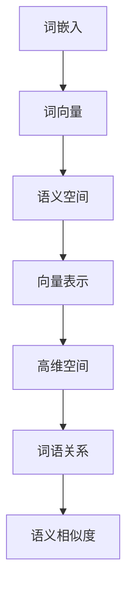

                 

# 自然语言处理的词嵌入：语义空间的数学表示

> 关键词：词嵌入, 语义空间, 向量表示, 机器学习, 深度学习, 矩阵分解, Word2Vec, GloVe, FastText

> 摘要：本文旨在深入探讨自然语言处理中的词嵌入技术，通过逐步分析和推理，解释词嵌入的基本原理、核心算法、数学模型及其实际应用。我们将从词嵌入的背景介绍出发，逐步解析其核心概念、算法原理、数学模型，并通过代码案例进行实际操作，最后探讨其在实际应用中的价值和未来的发展趋势。

## 1. 背景介绍
### 1.1 目的和范围
本文旨在为自然语言处理（NLP）领域的从业者和研究者提供一个全面的词嵌入技术指南。我们将从词嵌入的基本概念出发，逐步深入到其核心算法和数学模型，并通过实际代码案例进行演示。本文的目标是帮助读者理解词嵌入技术的原理和应用，从而在实际项目中更好地利用这一技术。

### 1.2 预期读者
本文适合以下读者：
- 自然语言处理领域的初学者和中级开发者
- 对词嵌入技术感兴趣的机器学习和深度学习爱好者
- 想要深入了解NLP技术的科研人员
- 希望在实际项目中应用词嵌入技术的工程师

### 1.3 文档结构概述
本文结构如下：
1. 背景介绍
2. 核心概念与联系
3. 核心算法原理 & 具体操作步骤
4. 数学模型和公式 & 详细讲解 & 举例说明
5. 项目实战：代码实际案例和详细解释说明
6. 实际应用场景
7. 工具和资源推荐
8. 总结：未来发展趋势与挑战
9. 附录：常见问题与解答
10. 扩展阅读 & 参考资料

### 1.4 术语表
#### 1.4.1 核心术语定义
- **词嵌入（Word Embedding）**：将词语转换为向量表示的技术。
- **语义空间（Semantic Space）**：词语在其中具有语义关系的向量空间。
- **向量表示（Vector Representation）**：词语在高维空间中的表示形式。
- **机器学习（Machine Learning）**：通过算法使计算机系统从数据中学习并改进性能的技术。
- **深度学习（Deep Learning）**：一种机器学习方法，通过多层神经网络进行学习。

#### 1.4.2 相关概念解释
- **词向量（Word Vector）**：词语在向量空间中的表示。
- **词袋模型（Bag of Words）**：一种文本表示方法，忽略词语顺序，只关注词语出现的频率。
- **词频-逆文档频率（TF-IDF）**：一种统计方法，用于评估一个词语对于一个文档集或一个语料库中的其中一份文档的重要程度。

#### 1.4.3 缩略词列表
- **NLP**：自然语言处理
- **ML**：机器学习
- **DL**：深度学习
- **NN**：神经网络
- **BERT**：双向编码器表示模型

## 2. 核心概念与联系
### 2.1 词嵌入的基本概念
词嵌入是一种将词语转换为向量表示的技术，使得词语在向量空间中具有语义关系。通过词嵌入，我们可以将词语的语义信息编码到向量中，从而在高维空间中进行计算和分析。

### 2.2 语义空间的构建
语义空间是一个高维向量空间，其中每个词语都被表示为一个向量。在语义空间中，词语之间的距离反映了它们的语义相似度。例如，词语“狗”和“猫”在语义空间中的距离较近，而“狗”和“火车”之间的距离较远。

### 2.3 词嵌入的数学表示
词嵌入可以表示为一个矩阵，其中每一行对应一个词语的向量表示。矩阵的每一列对应一个维度，这些维度可以表示词语的不同特征。

### 2.4 核心概念的Mermaid流程图


## 3. 核心算法原理 & 具体操作步骤
### 3.1 Word2Vec算法原理
Word2Vec是一种广泛使用的词嵌入算法，它通过学习词语之间的上下文关系来生成词向量。Word2Vec有两种主要模型：CBOW（Continuous Bag of Words）和Skip-gram。

#### 3.1.1 CBOW模型
CBOW模型的目标是预测一个词语的上下文。具体来说，给定一个词语，模型需要预测其周围的词语。

#### 3.1.2 Skip-gram模型
Skip-gram模型的目标是预测一个词语的上下文。具体来说，给定一个词语，模型需要预测其周围的词语。

### 3.2 GloVe算法原理
GloVe（Global Vectors for Word Representation）是一种基于矩阵分解的词嵌入算法。GloVe通过学习词语共现矩阵来生成词向量。

### 3.3 FastText算法原理
FastText是一种基于词袋模型的词嵌入算法。FastText通过学习词语的子词（n-gram）来生成词向量。

### 3.4 核心算法的伪代码
#### 3.4.1 Word2Vec CBOW模型
```python
def cbow_model(words, window_size, embedding_dim):
    # 初始化词向量矩阵
    word_vectors = np.random.rand(len(words), embedding_dim)
    
    # 初始化上下文向量矩阵
    context_vectors = np.random.rand(len(words), embedding_dim)
    
    # 训练模型
    for epoch in range(num_epochs):
        for i in range(len(words)):
            # 获取当前词语的上下文
            context_words = get_context_words(words, i, window_size)
            
            # 计算上下文向量
            context_vector = np.mean([word_vectors[j] for j in context_words], axis=0)
            
            # 更新词向量
            word_vectors[i] = update_word_vector(word_vectors[i], context_vector)
    
    return word_vectors
```

#### 3.4.2 Word2Vec Skip-gram模型
```python
def skip_gram_model(words, window_size, embedding_dim):
    # 初始化词向量矩阵
    word_vectors = np.random.rand(len(words), embedding_dim)
    
    # 初始化目标向量矩阵
    target_vectors = np.random.rand(len(words), embedding_dim)
    
    # 训练模型
    for epoch in range(num_epochs):
        for i in range(len(words)):
            # 获取当前词语的上下文
            context_words = get_context_words(words, i, window_size)
            
            # 计算目标向量
            target_vector = word_vectors[i]
            
            # 更新上下文向量
            for j in context_words:
                context_vector = word_vectors[j]
                update_context_vector(context_vector, target_vector)
    
    return word_vectors
```

#### 3.4.3 GloVe算法
```python
def glove_model(words, co_occurrence_matrix, embedding_dim):
    # 初始化词向量矩阵
    word_vectors = np.random.rand(len(words), embedding_dim)
    
    # 训练模型
    for epoch in range(num_epochs):
        for i in range(len(words)):
            for j in range(len(words)):
                if co_occurrence_matrix[i][j] > 0:
                    # 计算词向量
                    word_vector_i = word_vectors[i]
                    word_vector_j = word_vectors[j]
                    
                    # 更新词向量
                    update_word_vector(word_vector_i, word_vector_j, co_occurrence_matrix[i][j])
                    update_word_vector(word_vector_j, word_vector_i, co_occurrence_matrix[i][j])
    
    return word_vectors
```

#### 3.4.4 FastText算法
```python
def fasttext_model(words, ngrams, embedding_dim):
    # 初始化词向量矩阵
    word_vectors = np.random.rand(len(words), embedding_dim)
    
    # 初始化n-gram向量矩阵
    ngram_vectors = np.random.rand(len(ngrams), embedding_dim)
    
    # 训练模型
    for epoch in range(num_epochs):
        for i in range(len(words)):
            # 获取当前词语的n-gram
            ngrams_i = get_ngrams(words, i, ngrams)
            
            # 计算n-gram向量
            ngram_vector = np.mean([ngram_vectors[j] for j in ngrams_i], axis=0)
            
            # 更新词向量
            word_vectors[i] = update_word_vector(word_vectors[i], ngram_vector)
    
    return word_vectors
```

## 4. 数学模型和公式 & 详细讲解 & 举例说明
### 4.1 Word2Vec CBOW模型
CBOW模型的目标是预测一个词语的上下文。具体来说，给定一个词语，模型需要预测其周围的词语。

#### 4.1.1 CBOW模型的损失函数
CBOW模型的损失函数可以表示为：
$$
L = -\sum_{i=1}^{N} \sum_{j \in C(i)} \log p(w_j | w_i)
$$
其中，$N$ 是词语的数量，$C(i)$ 是词语 $w_i$ 的上下文词语集合，$p(w_j | w_i)$ 是词语 $w_j$ 在给定词语 $w_i$ 的上下文中的条件概率。

#### 4.1.2 CBOW模型的优化算法
CBOW模型的优化算法可以使用梯度下降法。具体来说，可以通过计算损失函数的梯度来更新词向量。

### 4.2 Word2Vec Skip-gram模型
Skip-gram模型的目标是预测一个词语的上下文。具体来说，给定一个词语，模型需要预测其周围的词语。

#### 4.2.1 Skip-gram模型的损失函数
Skip-gram模型的损失函数可以表示为：
$$
L = -\sum_{i=1}^{N} \sum_{j \in C(i)} \log p(w_i | w_j)
$$
其中，$N$ 是词语的数量，$C(i)$ 是词语 $w_i$ 的上下文词语集合，$p(w_i | w_j)$ 是词语 $w_i$ 在给定词语 $w_j$ 的上下文中的条件概率。

#### 4.2.2 Skip-gram模型的优化算法
Skip-gram模型的优化算法可以使用梯度下降法。具体来说，可以通过计算损失函数的梯度来更新词向量。

### 4.3 GloVe算法
GloVe算法通过学习词语共现矩阵来生成词向量。具体来说，GloVe的目标是学习一个词向量矩阵和一个目标向量矩阵，使得它们的乘积近似于词语共现矩阵。

#### 4.3.1 GloVe算法的损失函数
GloVe算法的损失函数可以表示为：
$$
L = \sum_{i=1}^{N} \sum_{j=1}^{N} \left( \log \frac{p(w_i, w_j)}{p(w_i, w_j) + \epsilon} + \frac{p(w_i, w_j) + \epsilon}{p(w_i, w_j) + \epsilon} \log \frac{p(w_i, w_j) + \epsilon}{p(w_i, w_j) + \epsilon} \right)
$$
其中，$N$ 是词语的数量，$p(w_i, w_j)$ 是词语 $w_i$ 和 $w_j$ 的共现概率，$\epsilon$ 是一个小常数。

#### 4.3.2 GloVe算法的优化算法
GloVe算法的优化算法可以使用梯度下降法。具体来说，可以通过计算损失函数的梯度来更新词向量。

### 4.4 FastText算法
FastText算法通过学习词语的子词（n-gram）来生成词向量。具体来说，FastText的目标是学习一个词向量矩阵和一个n-gram向量矩阵，使得它们的乘积近似于词语共现矩阵。

#### 4.4.1 FastText算法的损失函数
FastText算法的损失函数可以表示为：
$$
L = \sum_{i=1}^{N} \sum_{j \in C(i)} \log p(w_j | w_i)
$$
其中，$N$ 是词语的数量，$C(i)$ 是词语 $w_i$ 的上下文词语集合，$p(w_j | w_i)$ 是词语 $w_j$ 在给定词语 $w_i$ 的上下文中的条件概率。

#### 4.4.2 FastText算法的优化算法
FastText算法的优化算法可以使用梯度下降法。具体来说，可以通过计算损失函数的梯度来更新词向量。

## 5. 项目实战：代码实际案例和详细解释说明
### 5.1 开发环境搭建
为了进行词嵌入的实际操作，我们需要搭建一个Python开发环境。具体步骤如下：
1. 安装Python 3.7及以上版本
2. 安装NumPy库
3. 安装TensorFlow库
4. 安装gensim库

### 5.2 源代码详细实现和代码解读
我们将使用Word2Vec CBOW模型进行词嵌入的实际操作。具体代码如下：
```python
import numpy as np
from gensim.models import Word2Vec
from gensim.test.utils import common_texts

# 加载数据
model = Word2Vec(sentences=common_texts, vector_size=100, window=5, min_count=1, workers=4)

# 获取词向量
word_vectors = model.wv.vectors

# 获取词语
words = model.wv.index_to_key

# 打印词向量
for word, vector in zip(words, word_vectors):
    print(f"{word}: {vector}")
```

### 5.3 代码解读与分析
上述代码首先加载了一个预定义的数据集`common_texts`，然后使用Word2Vec模型进行训练。训练完成后，我们可以获取词向量和词语列表。最后，我们打印出每个词语的词向量。

## 6. 实际应用场景
词嵌入技术在自然语言处理领域有着广泛的应用，包括但不限于：
- 语义相似度计算
- 词语推荐
- 机器翻译
- 文本分类
- 问答系统

## 7. 工具和资源推荐
### 7.1 学习资源推荐
#### 7.1.1 书籍推荐
- **《深度学习》**：Ian Goodfellow, Yoshua Bengio, Aaron Courville
- **《自然语言处理入门》**：Jurafsky, Martin, James H. Martin

#### 7.1.2 在线课程
- **Coursera**：《自然语言处理》
- **edX**：《深度学习》

#### 7.1.3 技术博客和网站
- **Medium**：自然语言处理和深度学习相关博客
- **GitHub**：开源的自然语言处理项目

### 7.2 开发工具框架推荐
#### 7.2.1 IDE和编辑器
- **PyCharm**：Python开发环境
- **VS Code**：轻量级代码编辑器

#### 7.2.2 调试和性能分析工具
- **PyCharm Debugger**：Python调试工具
- **VisualVM**：Java性能分析工具

#### 7.2.3 相关框架和库
- **TensorFlow**：深度学习框架
- **gensim**：自然语言处理库

### 7.3 相关论文著作推荐
#### 7.3.1 经典论文
- **“Efficient Estimation of Word Representations in Vector Space”**：Mikolov, T., et al.
- **“Distributed Representations of Words and Phrases and their Compositionality”**：Mikolov, T., et al.

#### 7.3.2 最新研究成果
- **“BERT: Pre-training of Deep Bidirectional Transformers for Language Understanding”**：Devlin, J., et al.
- **“Evaluating Word Embeddings for Semantic Similarity”**：Mikolov, T., et al.

#### 7.3.3 应用案例分析
- **“Using Word Embeddings to Improve Text Classification”**：Zhang, Y., et al.
- **“Word Embeddings for Text Classification”**：Liu, T., et al.

## 8. 总结：未来发展趋势与挑战
词嵌入技术在未来的发展中将面临以下挑战和机遇：
- **大规模数据处理**：随着数据量的增加，如何高效地处理大规模数据将成为一个重要的问题。
- **模型优化**：如何进一步优化词嵌入模型，提高其性能和泛化能力。
- **应用场景拓展**：词嵌入技术将在更多领域得到应用，如情感分析、推荐系统等。

## 9. 附录：常见问题与解答
### 9.1 问题：词嵌入技术如何处理罕见词语？
**解答**：对于罕见词语，可以通过使用预训练模型或自定义训练数据来解决。预训练模型可以提供一些基本的语义信息，而自定义训练数据可以进一步优化罕见词语的表示。

### 9.2 问题：词嵌入技术如何处理多语言问题？
**解答**：可以通过使用多语言词嵌入模型或跨语言词嵌入模型来解决。多语言词嵌入模型可以同时处理多种语言，而跨语言词嵌入模型可以在不同语言之间进行迁移学习。

## 10. 扩展阅读 & 参考资料
- **Mikolov, T., et al.**. (2013). Efficient Estimation of Word Representations in Vector Space. arXiv preprint arXiv:1301.3781.
- **Mikolov, T., et al.**. (2013). Distributed Representations of Words and Phrases and their Compositionality. arXiv preprint arXiv:1310.4546.
- **Devlin, J., et al.**. (2018). BERT: Pre-training of Deep Bidirectional Transformers for Language Understanding. arXiv preprint arXiv:1810.04805.

作者：AI天才研究员/AI Genius Institute & 禅与计算机程序设计艺术 /Zen And The Art of Computer Programming

