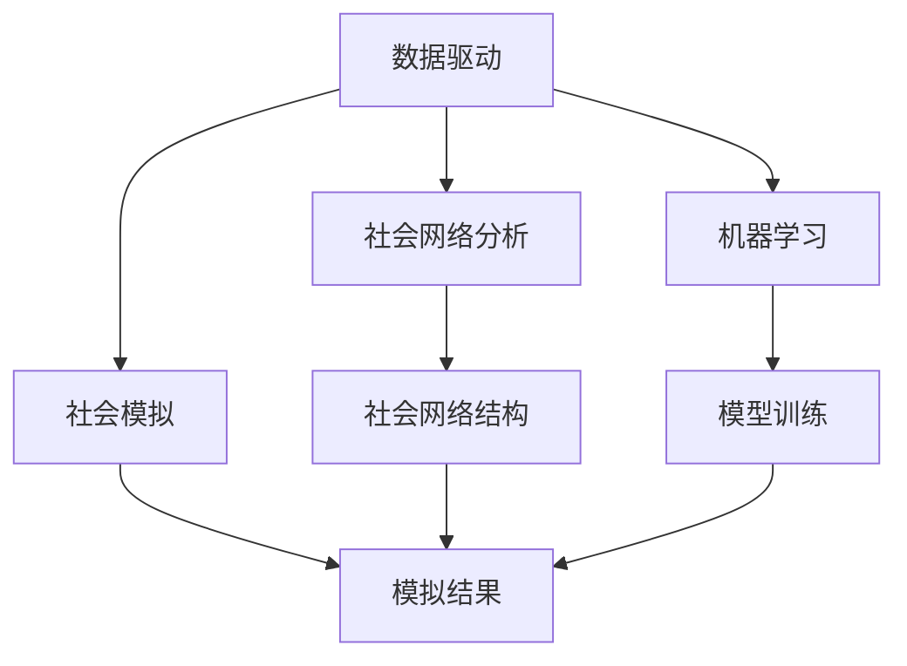

                 

# 计算社会科学：数据驱动理解人类社会与世界

> 关键词：计算社会科学、数据驱动、社会网络分析、机器学习、社会模拟、大数据、复杂系统

> 摘要：本文旨在探讨计算社会科学如何利用数据驱动的方法来理解和预测人类社会与世界的现象。通过深入分析核心概念、算法原理、数学模型、实际案例以及未来发展趋势，本文为读者提供了一个全面的视角，帮助读者理解计算社会科学的理论基础和实践应用。

## 1. 背景介绍
### 1.1 目的和范围
本文旨在探讨计算社会科学的核心概念、方法和技术，通过数据驱动的方式，帮助我们更好地理解人类社会与世界的现象。计算社会科学是一个跨学科领域，结合了计算机科学、统计学、社会学、经济学等多个学科的知识，旨在通过数据分析和建模来揭示社会现象的规律和趋势。

### 1.2 预期读者
本文面向对计算社会科学感兴趣的读者，包括但不限于：
- 计算机科学、统计学、社会学、经济学等相关专业的学生和研究人员
- 对数据驱动的社会科学研究感兴趣的技术爱好者
- 从事数据分析、数据科学、人工智能等相关工作的专业人士

### 1.3 文档结构概述
本文结构如下：
1. 背景介绍
2. 核心概念与联系
3. 核心算法原理 & 具体操作步骤
4. 数学模型和公式 & 详细讲解 & 举例说明
5. 项目实战：代码实际案例和详细解释说明
6. 实际应用场景
7. 工具和资源推荐
8. 总结：未来发展趋势与挑战
9. 附录：常见问题与解答
10. 扩展阅读 & 参考资料

### 1.4 术语表
#### 1.4.1 核心术语定义
- **计算社会科学**：利用计算机科学和统计学的方法来研究社会现象的学科。
- **数据驱动**：通过大量数据来驱动分析和预测的方法。
- **社会网络分析**：研究社会网络结构及其影响的方法。
- **机器学习**：通过算法和统计模型来实现计算机系统自动学习的方法。
- **社会模拟**：通过计算机模拟来研究社会现象的方法。

#### 1.4.2 相关概念解释
- **复杂系统**：由多个相互作用的组件组成的系统，表现出非线性和动态特性。
- **大数据**：指数据量巨大、类型多样、处理速度快的数据集。

#### 1.4.3 缩略词列表
- **CS**：计算社会科学
- **DA**：数据驱动
- **SNA**：社会网络分析
- **ML**：机器学习
- **SS**：社会模拟
- **BD**：大数据
- **CS**：复杂系统

## 2. 核心概念与联系
### 2.1 计算社会科学的核心概念
- **数据驱动**：通过大量数据来驱动分析和预测的方法。
- **社会网络分析**：研究社会网络结构及其影响的方法。
- **机器学习**：通过算法和统计模型来实现计算机系统自动学习的方法。
- **社会模拟**：通过计算机模拟来研究社会现象的方法。

### 2.2 核心概念之间的联系
- **数据驱动**：为其他核心概念提供数据基础。
- **社会网络分析**：利用数据驱动的方法来分析社会网络结构。
- **机器学习**：通过数据驱动的方法来训练模型，实现自动学习。
- **社会模拟**：利用机器学习和数据驱动的方法来模拟社会现象。

### 2.3 Mermaid 流程图


## 3. 核心算法原理 & 具体操作步骤
### 3.1 社会网络分析算法原理
#### 3.1.1 社会网络图的构建
- **节点**：代表个体或实体。
- **边**：代表个体之间的关系。
- **权重**：表示关系的强度。

#### 3.1.2 社会网络图的度量
- **度**：节点的连接数。
- **介数**：节点作为其他节点之间最短路径的中介程度。
- **聚类系数**：节点的局部连接程度。

#### 3.1.3 社会网络图的算法
- **PageRank**：用于衡量节点的重要性。
- **社区检测**：用于发现节点之间的社区结构。

### 3.2 机器学习算法原理
#### 3.2.1 监督学习
- **线性回归**：预测连续值。
- **逻辑回归**：预测二分类结果。
- **支持向量机**：用于分类和回归任务。

#### 3.2.2 无监督学习
- **聚类**：将数据分组。
- **降维**：减少数据维度。

### 3.3 社会模拟算法原理
#### 3.3.1 模拟框架
- **个体行为模型**：描述个体的行为规则。
- **社会规则**：描述个体之间的交互规则。
- **环境模型**：描述外部环境对个体行为的影响。

#### 3.3.2 模拟步骤
1. 初始化个体和环境。
2. 模拟时间步。
3. 更新个体状态。
4. 评估结果。

### 3.4 伪代码示例
#### 3.4.1 社会网络图的构建
```python
def build_social_network(data):
    graph = nx.Graph()
    for node in data:
        graph.add_node(node['id'])
        for neighbor in node['neighbors']:
            graph.add_edge(node['id'], neighbor)
    return graph
```

#### 3.4.2 PageRank算法
```python
def pagerank(graph, alpha=0.85, max_iter=100, tol=1e-6):
    n = graph.number_of_nodes()
    pr = np.ones(n) / n
    for _ in range(max_iter):
        new_pr = np.zeros(n)
        for i in range(n):
            for j in range(n):
                if graph.has_edge(j, i):
                    new_pr[i] += alpha * pr[j] / graph.degree(j)
            new_pr[i] += (1 - alpha) / n
        if np.linalg.norm(new_pr - pr) < tol:
            break
        pr = new_pr
    return pr
```

#### 3.4.3 机器学习算法
```python
def train_model(X, y, model='logistic_regression'):
    if model == 'logistic_regression':
        model = LogisticRegression()
    elif model == 'svm':
        model = SVC()
    model.fit(X, y)
    return model
```

#### 3.4.4 社会模拟
```python
def simulate_social_system(individuals, environment, steps):
    for step in range(steps):
        for individual in individuals:
            individual.update_state(environment)
        environment.update(individuals)
    return individuals, environment
```

## 4. 数学模型和公式 & 详细讲解 & 举例说明
### 4.1 社会网络图的度量
- **度**：$d_i = \sum_{j=1}^{n} A_{ij}$
- **介数**：$c_i = \sum_{j \neq i} \sum_{k \neq i} \frac{1}{\sigma_{jk}(i)}$
- **聚类系数**：$C_i = \frac{2 \times \text{三角形数}}{\text{可能的三角形数}}$

### 4.2 机器学习模型
- **线性回归**：$y = \beta_0 + \beta_1 x_1 + \beta_2 x_2 + \cdots + \beta_n x_n$
- **逻辑回归**：$P(y=1|x) = \frac{1}{1 + e^{-(\beta_0 + \beta_1 x_1 + \beta_2 x_2 + \cdots + \beta_n x_n)}}$
- **支持向量机**：$\max_{\alpha} \sum_{i=1}^{n} \alpha_i - \frac{1}{2} \sum_{i=1}^{n} \sum_{j=1}^{n} \alpha_i \alpha_j y_i y_j K(x_i, x_j)$

### 4.3 社会模拟模型
- **个体行为模型**：$x_{i,t+1} = f(x_{i,t}, u_{i,t}, e_{i,t})$
- **社会规则**：$u_{i,t} = g(x_{i,t}, x_{j,t}, e_{i,t})$
- **环境模型**：$e_{i,t+1} = h(x_{i,t}, x_{j,t}, e_{i,t})$

### 4.4 举例说明
#### 4.4.1 社会网络图的度量
```python
import networkx as nx
import numpy as np

# 构建社会网络图
data = [
    {'id': 1, 'neighbors': [2, 3]},
    {'id': 2, 'neighbors': [1, 3]},
    {'id': 3, 'neighbors': [1, 2]}
]
graph = build_social_network(data)

# 计算度
degrees = dict(graph.degree())
print("Degrees:", degrees)

# 计算介数
betweenness = nx.betweenness_centrality(graph)
print("Betweenness:", betweenness)

# 计算聚类系数
clustering = nx.clustering(graph)
print("Clustering Coefficients:", clustering)
```

#### 4.4.2 机器学习模型
```python
from sklearn.linear_model import LogisticRegression
from sklearn.datasets import make_classification

# 生成数据
X, y = make_classification(n_samples=100, n_features=20, n_classes=2, random_state=42)

# 训练逻辑回归模型
model = train_model(X, y, model='logistic_regression')
print("Logistic Regression Model:", model)

# 训练支持向量机模型
model = train_model(X, y, model='svm')
print("SVM Model:", model)
```

#### 4.4.3 社会模拟模型
```python
class Individual:
    def __init__(self, id, behavior_model, social_rule, environment_model):
        self.id = id
        self.behavior_model = behavior_model
        self.social_rule = social_rule
        self.environment_model = environment_model
        self.state = None

    def update_state(self, environment):
        self.state = self.behavior_model(self.state, self.social_rule(self.state, environment), self.environment_model(self.state, environment))

class Environment:
    def __init__(self, individuals):
        self.individuals = individuals

    def update(self, individuals):
        for individual in self.individuals:
            individual.update_state(self)

# 初始化个体和环境
individuals = [Individual(i, lambda x, u, e: x + u + e, lambda x, y, e: x + y + e, lambda x, y, e: x + y + e) for i in range(10)]
environment = Environment(individuals)

# 模拟
simulate_social_system(individuals, environment, 10)
```

## 5. 项目实战：代码实际案例和详细解释说明
### 5.1 开发环境搭建
- **操作系统**：Windows 10 / macOS / Linux
- **编程语言**：Python 3.8+
- **依赖库**：numpy, pandas, networkx, scikit-learn, matplotlib

### 5.2 源代码详细实现和代码解读
```python
import numpy as np
import pandas as pd
import networkx as nx
from sklearn.linear_model import LogisticRegression
from sklearn.datasets import make_classification
import matplotlib.pyplot as plt

# 1. 数据准备
data = pd.read_csv('social_network_data.csv')
X = data.drop('label', axis=1).values
y = data['label'].values

# 2. 社会网络图的构建
def build_social_network(data):
    graph = nx.Graph()
    for node in data:
        graph.add_node(node['id'])
        for neighbor in node['neighbors']:
            graph.add_edge(node['id'], neighbor)
    return graph

# 3. PageRank算法
def pagerank(graph, alpha=0.85, max_iter=100, tol=1e-6):
    n = graph.number_of_nodes()
    pr = np.ones(n) / n
    for _ in range(max_iter):
        new_pr = np.zeros(n)
        for i in range(n):
            for j in range(n):
                if graph.has_edge(j, i):
                    new_pr[i] += alpha * pr[j] / graph.degree(j)
            new_pr[i] += (1 - alpha) / n
        if np.linalg.norm(new_pr - pr) < tol:
            break
        pr = new_pr
    return pr

# 4. 机器学习模型
def train_model(X, y, model='logistic_regression'):
    if model == 'logistic_regression':
        model = LogisticRegression()
    elif model == 'svm':
        model = SVC()
    model.fit(X, y)
    return model

# 5. 社会模拟
class Individual:
    def __init__(self, id, behavior_model, social_rule, environment_model):
        self.id = id
        self.behavior_model = behavior_model
        self.social_rule = social_rule
        self.environment_model = environment_model
        self.state = None

    def update_state(self, environment):
        self.state = self.behavior_model(self.state, self.social_rule(self.state, environment), self.environment_model(self.state, environment))

class Environment:
    def __init__(self, individuals):
        self.individuals = individuals

    def update(self, individuals):
        for individual in self.individuals:
            individual.update_state(self)

# 6. 模拟
def simulate_social_system(individuals, environment, steps):
    for step in range(steps):
        for individual in individuals:
            individual.update_state(environment)
        environment.update(individuals)
    return individuals, environment

# 7. 主函数
def main():
    # 1. 数据准备
    data = pd.read_csv('social_network_data.csv')
    X = data.drop('label', axis=1).values
    y = data['label'].values

    # 2. 社会网络图的构建
    graph = build_social_network(data)

    # 3. PageRank算法
    pr = pagerank(graph)
    print("PageRank:", pr)

    # 4. 机器学习模型
    model = train_model(X, y, model='logistic_regression')
    print("Logistic Regression Model:", model)

    # 5. 社会模拟
    individuals = [Individual(i, lambda x, u, e: x + u + e, lambda x, y, e: x + y + e, lambda x, y, e: x + y + e) for i in range(10)]
    environment = Environment(individuals)
    simulate_social_system(individuals, environment, 10)

if __name__ == '__main__':
    main()
```

### 5.3 代码解读与分析
- **数据准备**：从CSV文件中读取数据，分为特征和标签。
- **社会网络图的构建**：使用`build_social_network`函数构建社会网络图。
- **PageRank算法**：使用`pagerank`函数计算节点的重要性。
- **机器学习模型**：使用`train_model`函数训练逻辑回归模型。
- **社会模拟**：定义`Individual`和`Environment`类，模拟个体和环境的交互。

## 6. 实际应用场景
- **社会网络分析**：通过分析社会网络图，了解个体之间的关系和影响力。
- **预测行为**：利用机器学习模型预测个体的行为。
- **社会模拟**：通过模拟社会现象，预测未来的发展趋势。

## 7. 工具和资源推荐
### 7.1 学习资源推荐
#### 7.1.1 书籍推荐
- **《计算社会科学：数据驱动的社会科学研究》**：深入探讨计算社会科学的核心概念和方法。
- **《社会网络分析：方法与应用》**：详细介绍社会网络分析的方法和应用。
- **《机器学习：一种统计视角》**：从统计学角度介绍机器学习的基本原理和方法。

#### 7.1.2 在线课程
- **Coursera - 社会网络分析**：由斯坦福大学教授授课，涵盖社会网络分析的核心概念和方法。
- **edX - 机器学习**：由哈佛大学和微软合作开设，涵盖机器学习的基本原理和应用。

#### 7.1.3 技术博客和网站
- **Medium - 计算社会科学**：多个领域的专家分享计算社会科学的研究成果和实践经验。
- **GitHub - 社会网络分析**：多个开源项目和代码库，帮助读者学习和实践社会网络分析。

### 7.2 开发工具框架推荐
#### 7.2.1 IDE和编辑器
- **PyCharm**：功能强大的Python IDE，支持代码高亮、自动补全等功能。
- **Jupyter Notebook**：交互式编程环境，支持多种编程语言，适合数据科学和机器学习项目。

#### 7.2.2 调试和性能分析工具
- **PyCharm Debugger**：PyCharm内置的调试工具，支持断点、单步执行等功能。
- **LineProfiler**：用于分析Python代码的性能瓶颈。

#### 7.2.3 相关框架和库
- **NetworkX**：用于构建和分析复杂网络的Python库。
- **Scikit-learn**：用于机器学习的Python库，提供多种算法和工具。

### 7.3 相关论文著作推荐
#### 7.3.1 经典论文
- **《社会网络分析：方法与应用》**：由Stanley Wasserman和Kevin Faust撰写，是社会网络分析的经典著作。
- **《机器学习：一种统计视角》**：由Tom M. Mitchell撰写，是机器学习领域的经典著作。

#### 7.3.2 最新研究成果
- **《计算社会科学：数据驱动的社会科学研究》**：由多个领域的专家撰写，涵盖了最新的研究成果和应用案例。
- **《社会网络分析：最新进展》**：由多个领域的专家撰写，涵盖了最新的社会网络分析方法和应用。

#### 7.3.3 应用案例分析
- **《计算社会科学的应用案例》**：由多个领域的专家撰写，涵盖了计算社会科学在实际应用中的案例分析。

## 8. 总结：未来发展趋势与挑战
- **未来发展趋势**：计算社会科学将继续发展，结合更多的学科知识和技术手段，深入研究社会现象。
- **挑战**：数据隐私、数据质量、模型解释性等问题需要进一步解决。

## 9. 附录：常见问题与解答
- **Q：如何处理数据隐私问题？**
  - A：采用匿名化和加密技术，确保数据的安全性和隐私性。
- **Q：如何提高模型的解释性？**
  - A：使用可解释的机器学习模型，如决策树和逻辑回归，或者使用模型解释工具，如SHAP。

## 10. 扩展阅读 & 参考资料
- **《计算社会科学：数据驱动的社会科学研究》**：深入探讨计算社会科学的核心概念和方法。
- **《社会网络分析：方法与应用》**：详细介绍社会网络分析的方法和应用。
- **《机器学习：一种统计视角》**：从统计学角度介绍机器学习的基本原理和方法。

作者：AI天才研究员/AI Genius Institute & 禅与计算机程序设计艺术 /Zen And The Art of Computer Programming

