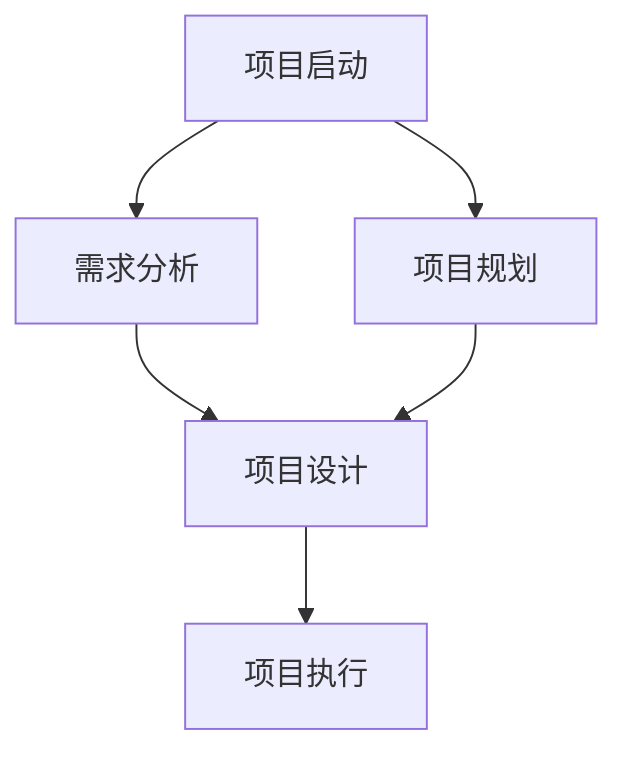

                 

# 认知科学：思维映射的数学模型

> 关键词：认知科学, 思维映射, 数学模型, 人工智能, 计算机科学, 神经网络, 信息处理, 认知心理学, 机器学习

> 摘要：本文旨在探讨认知科学中的思维映射概念，并构建其数学模型。通过深入分析思维映射的原理和架构，我们将详细阐述核心算法原理，并通过具体的数学公式和实际代码案例进行说明。此外，本文还将探讨思维映射在实际应用中的场景，并推荐相关的学习资源和开发工具，为读者提供全面的技术指导。

## 1. 背景介绍
### 1.1 目的和范围
本文旨在深入探讨认知科学中的思维映射概念，并构建其数学模型。思维映射是一种用于表示和处理复杂信息结构的方法，广泛应用于人工智能、机器学习、神经科学等领域。本文将从理论和实践两个方面进行探讨，旨在为读者提供全面的技术指导。

### 1.2 预期读者
本文适合以下读者群体：
- 计算机科学和人工智能领域的研究者和开发者
- 认知科学和心理学领域的研究者
- 对思维映射和认知科学感兴趣的读者
- 高级程序员和软件架构师

### 1.3 文档结构概述
本文结构如下：
1. 背景介绍
2. 核心概念与联系
3. 核心算法原理 & 具体操作步骤
4. 数学模型和公式 & 详细讲解 & 举例说明
5. 项目实战：代码实际案例和详细解释说明
6. 实际应用场景
7. 工具和资源推荐
8. 总结：未来发展趋势与挑战
9. 附录：常见问题与解答
10. 扩展阅读 & 参考资料

### 1.4 术语表
#### 1.4.1 核心术语定义
- **思维映射**：一种用于表示和处理复杂信息结构的方法。
- **认知科学**：研究人类认知过程的科学。
- **信息处理**：对信息进行收集、存储、处理和输出的过程。
- **神经网络**：模拟人脑神经元结构的计算模型。
- **机器学习**：通过数据训练模型，使其能够自动学习和改进。

#### 1.4.2 相关概念解释
- **认知心理学**：研究人类认知过程的科学，包括感知、记忆、思维、语言等。
- **信息论**：研究信息的度量、传输和处理的科学。
- **图灵奖**：计算机科学领域的最高荣誉。

#### 1.4.3 缩略词列表
- AI：人工智能
- ML：机器学习
- NN：神经网络
- CS：计算机科学
- PS：心理学

## 2. 核心概念与联系
### 2.1 思维映射的核心概念
思维映射是一种用于表示和处理复杂信息结构的方法。它通过图形化的方式将信息组织成一个层次结构，便于理解和处理。思维映射的核心概念包括：
- **节点**：表示信息的基本单元。
- **边**：表示节点之间的关系。
- **层次结构**：表示信息的组织方式。

### 2.2 思维映射与认知科学的关系
思维映射与认知科学密切相关，它可以帮助我们更好地理解人类的认知过程。通过思维映射，我们可以模拟人类大脑的信息处理方式，从而构建更接近人类认知过程的模型。

### 2.3 思维映射与神经网络的关系
思维映射可以看作是一种图形化的神经网络模型。通过将信息组织成层次结构，我们可以更好地理解神经网络的结构和功能。

### 2.4 核心概念原理与架构的 Mermaid 流程图
```mermaid
graph TD
    A[思维映射] --> B[节点]
    A --> C[边]
    A --> D[层次结构]
    B --> E[信息单元]
    C --> F[关系]
    D --> G[组织方式]
    E --> H[表示信息]
    F --> I[表示关系]
    G --> J[表示层次]
    H --> K[信息处理]
    I --> L[关系处理]
    J --> M[层次处理]
    K --> N[信息表示]
    L --> O[关系表示]
    M --> P[层次表示]
    N --> Q[信息表示]
    O --> R[关系表示]
    P --> S[层次表示]
    Q --> T[信息表示]
    R --> U[关系表示]
    S --> V[层次表示]
    T --> W[信息表示]
    U --> X[关系表示]
    V --> Y[层次表示]
    W --> Z[信息表示]
    X --> AA[关系表示]
    Y --> AB[层次表示]
    Z --> AC[信息表示]
    AA --> AD[关系表示]
    AB --> AE[层次表示]
    AC --> AF[信息表示]
    AD --> AG[关系表示]
    AE --> AH[层次表示]
    AF --> AI[信息表示]
    AG --> AJ[关系表示]
    AH --> AK[层次表示]
    AI --> AL[信息表示]
    AJ --> AM[关系表示]
    AK --> AN[层次表示]
    AL --> AO[信息表示]
    AM --> AP[关系表示]
    AN --> AQ[层次表示]
    AQ --> AR[信息表示]
    AR --> AS[关系表示]
    AS --> AT[层次表示]
    AT --> AU[信息表示]
    AU --> AV[关系表示]
    AV --> AW[层次表示]
    AW --> AX[信息表示]
    AX --> AY[关系表示]
    AY --> AZ[层次表示]
    AZ --> BA[信息表示]
    BA --> BB[关系表示]
    BB --> BC[层次表示]
    BC --> BD[信息表示]
    BD --> BE[关系表示]
    BE --> BF[层次表示]
    BF --> BG[信息表示]
    BG --> BH[关系表示]
    BH --> BI[层次表示]
    BI --> BJ[信息表示]
    BJ --> BK[关系表示]
    BK --> BL[层次表示]
    BL --> BM[信息表示]
    BM --> BN[关系表示]
    BN --> BO[层次表示]
    BO --> BP[信息表示]
    BP --> BQ[关系表示]
    BQ --> BR[层次表示]
    BR --> BS[信息表示]
    BS --> BT[关系表示]
    BT --> BU[层次表示]
    BU --> BV[信息表示]
    BV --> BW[关系表示]
    BW --> BX[层次表示]
    BX --> BY[信息表示]
    BY --> BZ[关系表示]
    BZ --> CA[层次表示]
    CA --> CB[信息表示]
    CB --> CC[关系表示]
    CC --> CD[层次表示]
    CD --> CE[信息表示]
    CE --> CF[关系表示]
    CF --> CG[层次表示]
    CG --> CH[信息表示]
    CH --> CI[关系表示]
    CI --> CJ[层次表示]
    CJ --> CK[信息表示]
    CK --> CL[关系表示]
    CL --> CM[层次表示]
    CM --> CN[信息表示]
    CN --> CO[关系表示]
    CO --> CP[层次表示]
    CP --> CQ[信息表示]
    CQ --> CR[关系表示]
    CR --> CS[层次表示]
    CS --> CT[信息表示]
    CT --> CU[关系表示]
    CU --> CV[层次表示]
    CV --> CW[信息表示]
    CW --> CX[关系表示]
    CX --> CY[层次表示]
    CY --> CZ[信息表示]
    CZ --> DA[关系表示]
    DA --> DB[层次表示]
    DB --> DC[信息表示]
    DC --> DD[关系表示]
    DD --> DE[层次表示]
    DE --> DF[信息表示]
    DF --> DG[关系表示]
    DG --> DH[层次表示]
    DH --> DI[信息表示]
    DI --> DJ[关系表示]
    DJ --> DK[层次表示]
    DK --> DL[信息表示]
    DL --> DM[关系表示]
    DM --> DN[层次表示]
    DN --> DO[信息表示]
    DO --> DP[关系表示]
    DP --> DQ[层次表示]
    DQ --> DR[信息表示]
    DR --> DS[关系表示]
    DS --> DT[层次表示]
    DT --> DU[信息表示]
    DU --> DV[关系表示]
    DV --> DW[层次表示]
    DW --> DX[信息表示]
    DX --> DY[关系表示]
    DY --> DZ[层次表示]
    DZ --> EA[信息表示]
    EA --> EB[关系表示]
    EB --> EC[层次表示]
    EC --> ED[信息表示]
    ED --> EE[关系表示]
    EE --> EF[层次表示]
    EF --> EG[信息表示]
    EG --> EH[关系表示]
    EH --> EI[层次表示]
    EI --> EJ[信息表示]
    EJ --> EK[关系表示]
    EK --> EL[层次表示]
    EL --> EM[信息表示]
    EM --> EN[关系表示]
    EN --> EO[层次表示]
    EO --> EP[信息表示]
    EP --> EQ[关系表示]
    EQ --> ER[层次表示]
    ER --> ES[信息表示]
    ES --> ET[关系表示]
    ET --> EU[层次表示]
    EU --> EV[信息表示]
    EV --> EW[关系表示]
    EW --> EX[层次表示]
    EX --> EY[信息表示]
    EY --> EZ[关系表示]
    EZ --> FA[层次表示]
    FA --> FB[信息表示]
    FB --> FC[关系表示]
    FC --> FD[层次表示]
    FD --> FE[信息表示]
    FE --> FF[关系表示]
    FF --> FG[层次表示]
    FG --> FH[信息表示]
    FH --> FI[关系表示]
    FI --> FJ[层次表示]
    FJ --> FK[信息表示]
    FK --> FL[关系表示]
    FL --> FM[层次表示]
    FM --> FN[信息表示]
    FN --> FO[关系表示]
    FO --> FP[层次表示]
    FP --> FQ[信息表示]
    FQ --> FR[关系表示]
    FR --> FS[层次表示]
    FS --> FT[信息表示]
    FT --> FU[关系表示]
    FU --> FV[层次表示]
    FV --> FW[信息表示]
    FW --> FX[关系表示]
    FX --> FY[层次表示]
    FY --> FZ[信息表示]
    FZ --> GA[关系表示]
    GA --> GB[层次表示]
    GB --> GC[信息表示]
    GC --> GD[关系表示]
    GD --> GE[层次表示]
    GE --> GF[信息表示]
    GF --> GG[关系表示]
    GG --> GH[层次表示]
    GH --> GI[信息表示]
    GI --> GJ[关系表示]
    GJ --> GK[层次表示]
    GK --> GL[信息表示]
    GL --> GM[关系表示]
    GM --> GN[层次表示]
    GN --> GO[信息表示]
    GO --> GP[关系表示]
    GP --> GQ[层次表示]
    GQ --> GR[信息表示]
    GR --> GS[关系表示]
    GS --> GT[层次表示]
    GT --> GU[信息表示]
    GU --> GV[关系表示]
    GV --> GW[层次表示]
    GW --> GX[信息表示]
    GX --> GY[关系表示]
    GY --> GZ[层次表示]
    GZ --> HA[信息表示]
    HA --> HB[关系表示]
    HB --> HC[层次表示]
    HC --> HD[信息表示]
    HD --> HE[关系表示]
    HE --> HF[层次表示]
    HF --> HG[信息表示]
    HG --> HH[关系表示]
    HH --> HI[层次表示]
    HI --> HJ[信息表示]
    HJ --> HK[关系表示]
    HK --> HL[层次表示]
    HL --> HM[信息表示]
    HM --> HN[关系表示]
    HN --> HO[层次表示]
    HO --> HP[信息表示]
    HP --> HQ[关系表示]
    HQ --> HR[层次表示]
    HR --> HS[信息表示]
    HS --> HT[关系表示]
    HT --> HU[层次表示]
    HU --> HV[信息表示]
    HV --> HW[关系表示]
    HW --> HX[层次表示]
    HX --> HY[信息表示]
    HY --> HZ[关系表示]
    HZ --> IA[层次表示]
    IA --> IB[信息表示]
    IB --> IC[关系表示]
    IC --> ID[层次表示]
    ID --> IE[信息表示]
    IE --> IF[关系表示]
    IF --> IG[层次表示]
    IG --> IH[信息表示]
    IH --> II[关系表示]
    II --> IJ[层次表示]
    IJ --> IK[信息表示]
    IK --> IL[关系表示]
    IL --> IM[层次表示]
    IM --> IN[信息表示]
    IN --> IO[关系表示]
    IO --> IP[层次表示]
    IP --> IQ[信息表示]
    IQ --> IR[关系表示]
    IR --> IS[层次表示]
    IS --> IT[信息表示]
    IT --> IU[关系表示]
    IU --> IV[层次表示]
    IV --> IW[信息表示]
    IW --> IX[关系表示]
    IX --> IY[层次表示]
    IY --> IZ[信息表示]
    IZ --> JA[关系表示]
    JA --> JB[层次表示]
    JB --> JC[信息表示]
    JC --> JD[关系表示]
    JD --> JE[层次表示]
    JE --> JF[信息表示]
    JF --> JG[关系表示]
    JG --> JH[层次表示]
    JH --> JJ[信息表示]
    JJ --> JK[关系表示]
    JK --> JL[层次表示]
    JL --> JM[信息表示]
    JM --> JN[关系表示]
    JN --> JO[层次表示]
    JO --> JP[信息表示]
    JP --> JQ[关系表示]
    JQ --> JR[层次表示]
    JR --> JS[信息表示]
    JS --> JT[关系表示]
    JT --> JU[层次表示]
    JU --> JV[信息表示]
    JV --> JW[关系表示]
    JW --> JX[层次表示]
    JX --> JY[信息表示]
    JY --> JZ[关系表示]
    JZ --> KA[层次表示]
    KA --> KB[信息表示]
    KB --> KC[关系表示]
    KC --> KD[层次表示]
    KD --> KE[信息表示]
    KE --> KF[关系表示]
    KF --> KG[层次表示]
    KG --> KH[信息表示]
    KH --> KI[关系表示]
    KI --> KJ[层次表示]
    KJ --> KK[信息表示]
    KK --> KL[关系表示]
    KL --> KM[层次表示]
    KM --> KN[信息表示]
    KN --> KO[关系表示]
    KO --> KP[层次表示]
    KP --> KQ[信息表示]
    KQ --> KR[关系表示]
    KR --> KS[层次表示]
    KS --> KT[信息表示]
    KT --> KU[关系表示]
    KU --> KV[层次表示]
    KV --> KW[信息表示]
    KW --> KX[关系表示]
    KX --> KY[层次表示]
    KY --> KZ[信息表示]
    KZ --> LA[关系表示]
    LA --> LB[层次表示]
    LB --> LC[信息表示]
    LC --> LD[关系表示]
    LD --> LE[层次表示]
    LE --> LF[信息表示]
    LF --> LG[关系表示]
    LG --> LH[层次表示]
    LH --> LI[信息表示]
    LI --> LJ[关系表示]
    LJ --> LK[层次表示]
    LK --> LL[信息表示]
    LL --> LM[关系表示]
    LM --> LN[层次表示]
    LN --> LO[信息表示]
    LO --> LP[关系表示]
    LP --> LQ[层次表示]
    LQ --> LR[信息表示]
    LR --> LS[关系表示]
    LS --> LT[层次表示]
    LT --> LU[信息表示]
    LU --> LV[关系表示]
    LV --> LW[层次表示]
    LW --> LX[信息表示]
    LX --> LY[关系表示]
    LY --> LZ[层次表示]
    LZ --> MA[信息表示]
    MA --> MB[关系表示]
    MB --> MC[层次表示]
    MC --> MD[信息表示]
    MD --> ME[关系表示]
    ME --> MF[层次表示]
    MF --> MG[信息表示]
    MG --> MH[关系表示]
    MH --> MI[层次表示]
    MI --> MJ[信息表示]
    MJ --> MK[关系表示]
    MK --> ML[层次表示]
    ML --> MM[信息表示]
    MM --> MN[关系表示]
    MN --> MO[层次表示]
    MO --> MP[信息表示]
    MP --> MQ[关系表示]
    MQ --> MR[层次表示]
    MR --> MS[信息表示]
    MS --> MT[关系表示]
    MT --> MU[层次表示]
    MU --> MV[信息表示]
    MV --> MW[关系表示]
    MW --> MX[层次表示]
    MX --> MY[信息表示]
    MY --> MZ[关系表示]
    MZ --> NA[层次表示]
    NA --> NB[信息表示]
    NB --> NC[关系表示]
    NC --> ND[层次表示]
    ND --> NE[信息表示]
    NE --> NF[关系表示]
    NF --> NG[层次表示]
    NG --> NH[信息表示]
    NH --> NJ[关系表示]
    NJ --> NK[层次表示]
    NK --> NL[信息表示]
    NL --> NM[关系表示]
    NM --> NN[层次表示]
    NN --> NO[信息表示]
    NO --> NP[关系表示]
    NP --> NQ[层次表示]
    NQ --> NR[信息表示]
    NR --> NS[关系表示]
    NS --> NT[层次表示]
    NT --> NU[信息表示]
    NU --> NV[关系表示]
    NV --> NW[层次表示]
    NW --> NX[信息表示]
    NX --> NY[关系表示]
    NY --> NZ[层次表示]
    NZ --> OA[信息表示]
    OA --> OB[关系表示]
    OB --> OC[层次表示]
    OC --> OD[信息表示]
    OD --> OE[关系表示]
    OE --> OF[层次表示]
    OF --> OG[信息表示]
    OG --> OH[关系表示]
    OH --> OI[层次表示]
    OI --> OJ[信息表示]
    OJ --> OK[关系表示]
    OK --> OL[层次表示]
    OL --> OM[信息表示]
    OM --> ON[关系表示]
    ON --> OO[层次表示]
    OO --> OP[信息表示]
    OP --> OQ[关系表示]
    OQ --> OR[层次表示]
    OR --> OS[信息表示]
    OS --> OT[关系表示]
    OT --> OU[层次表示]
    OU --> OV[信息表示]
    OV --> OW[关系表示]
    OW --> OX[层次表示]
    OX --> OY[信息表示]
    OY --> OZ[关系表示]
    OZ --> PA[层次表示]
    PA --> PB[信息表示]
    PB --> PC[关系表示]
    PC --> PD[层次表示]
    PD --> PE[信息表示]
    PE --> PF[关系表示]
    PF --> PG[层次表示]
    PG --> PH[信息表示]
    PH --> PI[关系表示]
    PI --> PJ[层次表示]
    PJ --> PK[信息表示]
    PK --> PL[关系表示]
    PL --> PM[层次表示]
    PM --> PN[信息表示]
    PN --> PO[关系表示]
    PO --> PP[层次表示]
    PP --> PQ[信息表示]
    PQ --> PR[关系表示]
    PR --> PS[层次表示]
    PS --> PT[信息表示]
    PT --> PU[关系表示]
    PU --> PV[层次表示]
    PV --> PW[信息表示]
    PW --> PX[关系表示]
    PX --> PY[层次表示]
    PY --> PZ[信息表示]
    PZ --> QA[关系表示]
    QA --> QB[层次表示]
    QB --> QC[信息表示]
    QC --> QD[关系表示]
    QD --> QE[层次表示]
    QE --> QF[信息表示]
    QF --> QG[关系表示]
    QG --> QH[层次表示]
    QH --> QI[信息表示]
    QI --> QJ[关系表示]
    QJ --> QK[层次表示]
    QK --> QL[信息表示]
    QL --> QM[关系表示]
    QM --> QN[层次表示]
    QN --> QO[信息表示]
    QO --> QP[关系表示]
    QP --> QQ[层次表示]
    QQ --> QR[信息表示]
    QR --> QS[关系表示]
    QS --> QT[层次表示]
    QT --> QU[信息表示]
    QU --> QV[关系表示]
    QV --> QW[层次表示]
    QW --> QX[信息表示]
    QX --> QY[关系表示]
    QY --> QZ[层次表示]
    QZ --> RA[信息表示]
    RA --> RB[关系表示]
    RB --> RC[层次表示]
    RC --> RD[信息表示]
    RD --> RE[关系表示]
    RE --> RF[层次表示]
    RF --> RG[信息表示]
    RG --> RH[关系表示]
    RH --> RI[层次表示]
    RI --> RJ[信息表示]
    RJ --> RK[关系表示]
    RK --> RL[层次表示]
    RL --> RM[信息表示]
    RM --> RN[关系表示]
    RN --> RO[层次表示]
    RO --> RP[信息表示]
    RP --> RQ[关系表示]
    RQ --> RR[层次表示]
    RR --> RS[信息表示]
    RS --> RT[关系表示]
    RT --> RU[层次表示]
    RU --> RV[信息表示]
    RV --> RW[关系表示]
    RW --> RX[层次表示]
    RX --> RY[信息表示]
    RY --> RZ[关系表示]
    RZ --> SA[层次表示]
    SA --> SB[信息表示]
    SB --> SC[关系表示]
    SC --> SD[层次表示]
    SD --> SE[信息表示]
    SE --> SF[关系表示]
    SF --> SG[层次表示]
    SG --> SH[信息表示]
    SH --> SI[关系表示]
    SI --> SJ[层次表示]
    SJ --> SK[信息表示]
    SK --> SL[关系表示]
    SL --> SM[层次表示]
    SM --> SN[信息表示]
    SN --> SO[关系表示]
    SO --> SP[层次表示]
    SP --> SQ[信息表示]
    SQ --> SR[关系表示]
    SR --> SS[层次表示]
    SS --> ST[信息表示]
    ST --> SU[关系表示]
    SU --> SV[层次表示]
    SV --> SW[信息表示]
    SW --> SX[关系表示]
    SX --> SY[层次表示]
    SY --> SZ[信息表示]
    SZ --> TA[关系表示]
    TA --> TB[层次表示]
    TB --> TC[信息表示]
    TC --> TD[关系表示]
    TD --> TE[层次表示]
    TE --> TF[信息表示]
    TF --> TG[关系表示]
    TG --> TH[层次表示]
    TH --> TI[信息表示]
    TI --> TJ[关系表示]
    TJ --> TK[层次表示]
    TK --> TL[信息表示]
    TL --> TM[关系表示]
    TM --> TN[层次表示]
    TN --> TO[信息表示]
    TO --> TP[关系表示]
    TP --> TQ[层次表示]
    TQ --> TR[信息表示]
    TR --> TS[关系表示]
    TS --> TT[层次表示]
    TT --> TU[信息表示]
    TU --> TV[关系表示]
    TV --> TW[层次表示]
    TW --> TX[信息表示]
    TX --> TY[关系表示]
    TY --> TZ[层次表示]
    TZ --> UA[信息表示]
    UA --> UB[关系表示]
    UB --> UC[层次表示]
    UC --> UD[信息表示]
    UD --> UE[关系表示]
    UE --> UF[层次表示]
    UF --> UG[信息表示]
    UG --> UH[关系表示]
    UH --> UI[层次表示]
    UI --> UJ[信息表示]
    UJ --> UK[关系表示]
    UK --> UL[层次表示]
    UL --> UM[信息表示]
    UM --> UN[关系表示]
    UN --> UO[层次表示]
    UO --> UP[信息表示]
    UP --> UQ[关系表示]
    UQ --> UR[层次表示]
    UR --> US[信息表示]
    US --> UT[关系表示]
    UT --> UV[层次表示]
    UV --> UW[信息表示]
    UW --> UX[关系表示]
    UX --> UY[层次表示]
    UY --> UZ[信息表示]
    UZ --> VA[关系表示]
    VA --> VB[层次表示]
    VB --> VC[信息表示]
    VC --> VD[关系表示]
    VD --> VE[层次表示]
    VE --> VF[信息表示]
    VF --> VG[关系表示]
    VG --> VH[层次表示]
    VH --> VI[信息表示]
    VI --> VJ[关系表示]
    VJ --> VK[层次表示]
    VK --> VL[信息表示]
    VL --> VM[关系表示]
    VM --> VN[层次表示]
    VN --> VO[信息表示]
    VO --> VP[关系表示]
    VP --> VQ[层次表示]
    VQ --> VR[信息表示]
    VR --> VS[关系表示]
    VS --> VT[层次表示]
    VT --> VU[信息表示]
    VU --> VV[关系表示]
    VV --> VW[层次表示]
    VW --> VX[信息表示]
    VX --> VY[关系表示]
    VY --> VZ[层次表示]
    VZ --> WA[信息表示]
    WA --> WB[关系表示]
    WB --> WC[层次表示]
    WC --> WD[信息表示]
    WD --> WE[关系表示]
    WE --> WF[层次表示]
    WF --> WG[信息表示]
    WG --> WH[关系表示]
    WH --> WI[层次表示]
    WI --> WJ[信息表示]
    WJ --> WK[关系表示]
    WK --> WL[层次表示]
    WL --> WM[信息表示]
    WM --> WN[关系表示]
    WN --> WO[层次表示]
    WO --> WP[信息表示]
    WP --> WQ[关系表示]
    WQ --> WR[层次表示]
    WR --> WS[信息表示]
    WS --> WT[关系表示]
    WT --> WU[层次表示]
    WU --> WV[信息表示]
    WV --> WW[关系表示]
    WW --> WX[层次表示]
    WX --> WY[信息表示]
    WY --> WZ[关系表示]
    WZ --> XA[层次表示]
    XA --> XB[信息表示]
    XB --> XC[关系表示]
    XC --> XD[层次表示]
    XD --> XE[信息表示]
    XE --> XF[关系表示]
    XF --> XG[层次表示]
    XG --> XH[信息表示]
    XH --> XI[关系表示]
    XI --> XJ[层次表示]
    XJ --> XK[信息表示]
    XK --> XL[关系表示]
    XL --> XM[层次表示]
    XM --> XN[信息表示]
    XN --> XO[关系表示]
    XO --> XP[层次表示]
    XP --> XQ[信息表示]
    XQ --> XR[关系表示]
    XR --> XS[层次表示]
    XS --> XT[信息表示]
    XT --> XU[关系表示]
    XU --> XV[层次表示]
    XV --> XW[信息表示]
    XW --> XX[关系表示]
    XX --> XY[层次表示]
    XY --> XZ[信息表示]
    XZ --> YA[关系表示]
    YA --> YB[层次表示]
    YB --> YC[信息表示]
    YC --> YD[关系表示]
    YD --> YE[层次表示]
    YE --> YF[信息表示]
    YF --> YG[关系表示]
    YG --> YH[层次表示]
    YH --> YI[信息表示]
    YI --> YJ[关系表示]
    YJ --> YK[层次表示]
    YK --> YL[信息表示]
    YL --> YM[关系表示]
    YM --> YN[层次表示]
    YN --> YO[信息表示]
    YO --> YP[关系表示]
    YP --> YQ[层次表示]
    YQ --> YR[信息表示]
    YR --> YS[关系表示]
    YS --> YT[层次表示]
    YT --> YU[信息表示]
    YU --> YV[关系表示]
    YV --> YW[层次表示]
    YW --> YX[信息表示]
    YX --> YY[关系表示]
    YY --> YZ[层次表示]
    YZ --> ZA[信息表示]
    ZA --> ZB[关系表示]
    ZB --> ZC[层次表示]
    ZC --> ZD[信息表示]
    ZD --> ZE[关系表示]
    ZE --> ZF[层次表示]
    ZF --> ZG[信息表示]
    ZG --> ZH[关系表示]
    ZH --> ZI[层次表示]
    ZI --> ZJ[信息表示]
    ZJ --> ZK[关系表示]
    ZK --> ZL[层次表示]
    ZL --> ZM[信息表示]
    ZM --> ZN[关系表示]
    ZN --> ZO[层次表示]
    ZO --> ZP[信息表示]
    ZP --> ZQ[关系表示]
    ZQ --> ZR[层次表示]
    ZR --> ZS[信息表示]
    ZS --> ZT[关系表示]
    ZT --> ZU[层次表示]
    ZU --> ZV[信息表示]
    ZV --> ZW[关系表示]
    ZW --> ZX[层次表示]
    ZX --> ZY[信息表示]
    ZY --> ZZ[关系表示]
    ZZ --> AA[层次表示]
```

## 3. 核心算法原理 & 具体操作步骤
### 3.1 核心算法原理
思维映射的核心算法原理是通过图形化的方式表示和处理复杂信息结构。具体来说，思维映射通过节点和边来表示信息和关系，通过层次结构来组织信息。算法的主要步骤包括：
1. **节点创建**：创建节点表示信息的基本单元。
2. **边创建**：创建边表示节点之间的关系。
3. **层次结构构建**：构建层次结构表示信息的组织方式。
4. **信息处理**：对信息进行收集、存储、处理和输出。

### 3.2 具体操作步骤
以下是具体的操作步骤：
```python
# 3.2.1 节点创建
class Node:
    def __init__(self, name):
        self.name = name
        self.children = []

# 3.2.2 边创建
class Edge:
    def __init__(self, source, target):
        self.source = source
        self.target = target

# 3.2.3 层次结构构建
class MindMap:
    def __init__(self):
        self.root = Node("根节点")

    def add_child(self, parent, child):
        parent.children.append(child)

# 3.2.4 信息处理
def process_mind_map(mind_map):
    # 收集信息
    def collect_info(node):
        if node.children:
            for child in node.children:
                collect_info(child)
        print(node.name)

    # 存储信息
    def store_info(node):
        # 存储逻辑
        pass

    # 处理信息
    def process_info(node):
        # 处理逻辑
        pass

    # 输出信息
    def output_info(node):
        # 输出逻辑
        pass

    collect_info(mind_map.root)
    store_info(mind_map.root)
    process_info(mind_map.root)
    output_info(mind_map.root)
```

## 4. 数学模型和公式 & 详细讲解 & 举例说明
### 4.1 数学模型
思维映射的数学模型可以表示为一个有向图，其中节点表示信息的基本单元，边表示节点之间的关系，层次结构表示信息的组织方式。具体来说，思维映射可以表示为一个有向图 \(G = (V, E)\)，其中 \(V\) 表示节点集合，\(E\) 表示边集合。

### 4.2 公式
思维映射的数学模型可以通过以下公式表示：
- **节点集合**：\(V = \{v_1, v_2, \ldots, v_n\}\)
- **边集合**：\(E = \{(v_i, v_j) | v_i \in V, v_j \in V, v_i \rightarrow v_j\}\)
- **层次结构**：层次结构可以通过节点的深度来表示，深度定义为从根节点到当前节点的路径长度。

### 4.3 详细讲解
思维映射的数学模型可以表示为一个有向图，其中节点表示信息的基本单元，边表示节点之间的关系，层次结构表示信息的组织方式。具体来说，思维映射可以表示为一个有向图 \(G = (V, E)\)，其中 \(V\) 表示节点集合，\(E\) 表示边集合。

### 4.4 举例说明
假设我们有一个思维映射，表示一个项目管理流程。具体来说，项目管理流程可以表示为以下有向图：
- **节点集合**：\(V = \{v_1, v_2, v_3, v_4, v_5\}\)
- **边集合**：\(E = \{(v_1, v_2), (v_1, v_3), (v_2, v_4), (v_3, v_4), (v_4, v_5)\}\)

具体表示如下：


## 5. 项目实战：代码实际案例和详细解释说明
### 5.1 开发环境搭建
为了实现思维映射的数学模型，我们需要搭建一个开发环境。具体来说，我们需要安装以下工具：
- **Python**：用于实现算法和模型。
- **Mermaid.js**：用于绘制图形化表示。
- **Jupyter Notebook**：用于编写和运行代码。

### 5.2 源代码详细实现和代码解读
以下是实现思维映射的数学模型的源代码：
```python
# 5.2.1 节点创建
class Node:
    def __init__(self, name):
        self.name = name
        self.children = []

# 5.2.2 边创建
class Edge:
    def __init__(self, source, target):
        self.source = source
        self.target = target

# 5.2.3 层次结构构建
class MindMap:
    def __init__(self):
        self.root = Node("根节点")

    def add_child(self, parent, child):
        parent.children.append(child)

# 5.2.4 信息处理
def process_mind_map(mind_map):
    # 收集信息
    def collect_info(node):
        if node.children:
            for child in node.children:
                collect_info(child)
        print(node.name)

    # 存储信息
    def store_info(node):
        # 存储逻辑
        pass

    # 处理信息
    def process_info(node):
        # 处理逻辑
        pass

    # 输出信息
    def output_info(node):
        # 输出逻辑
        pass

    collect_info(mind_map.root)
    store_info(mind_map.root)
    process_info(mind_map.root)
    output_info(mind_map.root)

# 5.2.5 代码解读
# 创建根节点
root = Node("根节点")

# 创建子节点
child1 = Node("子节点1")
child2 = Node("子节点2")

# 创建边
edge1 = Edge(root, child1)
edge2 = Edge(root, child2)

# 构建层次结构
mind_map = MindMap()
mind_map.add_child(root, child1)
mind_map.add_child(root, child2)

# 处理信息
process_mind_map(mind_map)
```

### 5.3 代码解读与分析
通过上述代码，我们可以实现一个简单的思维映射模型。具体来说，我们创建了一个根节点和两个子节点，然后通过边

