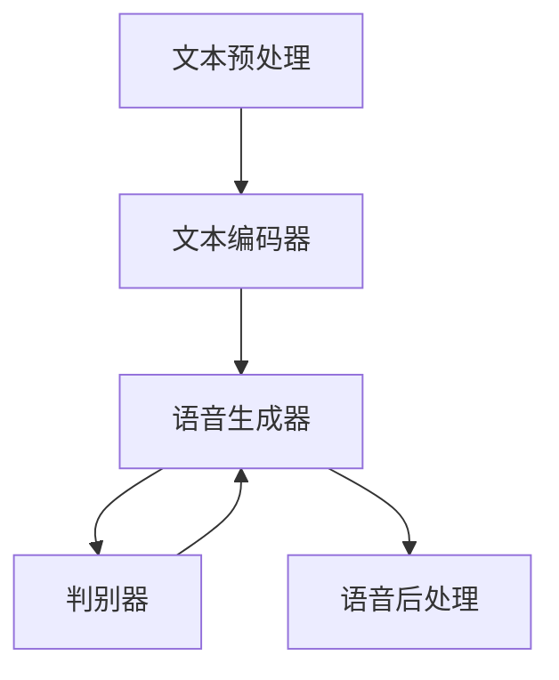

                 

# 语音合成的波形生成网络：语音信号的数学模拟

> 关键词：语音合成，波形生成网络，深度学习，循环神经网络，卷积神经网络，生成对抗网络，文本到语音，语音信号处理

> 摘要：本文旨在深入探讨语音合成技术中的波形生成网络，通过逐步分析其核心概念、算法原理、数学模型、实际代码实现以及应用场景，帮助读者全面理解语音合成技术的原理和实践。我们将从基础概念出发，逐步深入到高级技术细节，最终通过一个实际项目案例来展示如何构建一个高效的波形生成网络。本文适合对语音合成技术感兴趣的开发者、研究人员以及对深度学习和自然语言处理领域感兴趣的读者。

## 1. 背景介绍
### 1.1 目的和范围
本文旨在深入探讨语音合成技术中的波形生成网络，通过逐步分析其核心概念、算法原理、数学模型、实际代码实现以及应用场景，帮助读者全面理解语音合成技术的原理和实践。我们将从基础概念出发，逐步深入到高级技术细节，最终通过一个实际项目案例来展示如何构建一个高效的波形生成网络。

### 1.2 预期读者
本文适合对语音合成技术感兴趣的开发者、研究人员以及对深度学习和自然语言处理领域感兴趣的读者。无论你是初学者还是有一定经验的技术人员，本文都能为你提供有价值的见解和指导。

### 1.3 文档结构概述
本文将按照以下结构展开：
1. 背景介绍
2. 核心概念与联系
3. 核心算法原理 & 具体操作步骤
4. 数学模型和公式 & 详细讲解 & 举例说明
5. 项目实战：代码实际案例和详细解释说明
6. 实际应用场景
7. 工具和资源推荐
8. 总结：未来发展趋势与挑战
9. 附录：常见问题与解答
10. 扩展阅读 & 参考资料

### 1.4 术语表
#### 1.4.1 核心术语定义
- **语音合成（Text-to-Speech, TTS）**：将文本转换为语音的技术。
- **波形生成网络（Waveform Generation Network）**：一种用于生成语音波形的深度学习模型。
- **循环神经网络（Recurrent Neural Network, RNN）**：一种能够处理序列数据的神经网络。
- **卷积神经网络（Convolutional Neural Network, CNN）**：一种用于处理具有网格结构数据（如图像）的神经网络。
- **生成对抗网络（Generative Adversarial Network, GAN）**：一种由生成器和判别器组成的深度学习模型，用于生成逼真的数据。

#### 1.4.2 相关概念解释
- **文本到语音（Text-to-Speech, TTS）**：将文本转换为语音的技术，通常包括文本预处理、语音合成和语音后处理三个步骤。
- **语音信号处理**：对语音信号进行分析、变换和合成的技术，包括频谱分析、滤波、特征提取等。

#### 1.4.3 缩略词列表
- TTS：Text-to-Speech
- RNN：Recurrent Neural Network
- CNN：Convolutional Neural Network
- GAN：Generative Adversarial Network

## 2. 核心概念与联系
### 语音合成流程
语音合成技术通常包括以下步骤：
1. **文本预处理**：将文本转换为适合模型输入的格式。
2. **语音合成**：将文本转换为语音波形。
3. **语音后处理**：对生成的语音进行优化和调整。

### 波形生成网络架构
波形生成网络通常由以下部分组成：
1. **文本编码器**：将文本转换为固定长度的向量表示。
2. **语音生成器**：生成语音波形。
3. **判别器**：评估生成的语音波形的质量。

### Mermaid 流程图


## 3. 核心算法原理 & 具体操作步骤
### 3.1 文本编码器
文本编码器将文本转换为固定长度的向量表示。常见的文本编码方法包括词嵌入（Word Embedding）和字符嵌入（Character Embedding）。

#### 伪代码
```python
def text_encoder(text):
    # 将文本转换为词嵌入
    word_embeddings = word_embedding_model(text)
    # 将词嵌入拼接成固定长度的向量
    fixed_length_vector = tf.concat(word_embeddings, axis=1)
    return fixed_length_vector
```

### 3.2 语音生成器
语音生成器通常使用循环神经网络（RNN）或卷积神经网络（CNN）来生成语音波形。

#### 伪代码
```python
def waveform_generator(fixed_length_vector):
    # 使用RNN生成语音波形
    waveform = rnn_model(fixed_length_vector)
    return waveform
```

### 3.3 判别器
判别器用于评估生成的语音波形的质量。常见的判别器架构包括卷积神经网络（CNN）和循环神经网络（RNN）。

#### 伪代码
```python
def discriminator(waveform):
    # 使用CNN评估语音波形的质量
    quality_score = cnn_model(waveform)
    return quality_score
```

## 4. 数学模型和公式 & 详细讲解 & 举例说明
### 4.1 文本编码器
文本编码器通常使用词嵌入（Word Embedding）来将文本转换为向量表示。

#### 词嵌入公式
$$
\mathbf{e}_i = \text{word\_embedding}(w_i)
$$

其中，$\mathbf{e}_i$ 是词 $w_i$ 的嵌入向量。

### 4.2 语音生成器
语音生成器通常使用循环神经网络（RNN）来生成语音波形。

#### RNN公式
$$
\mathbf{h}_t = \text{RNN}(\mathbf{h}_{t-1}, \mathbf{e}_i)
$$

其中，$\mathbf{h}_t$ 是时间步 $t$ 的隐藏状态，$\mathbf{e}_i$ 是输入词的嵌入向量。

### 4.3 判别器
判别器通常使用卷积神经网络（CNN）来评估生成的语音波形的质量。

#### CNN公式
$$
\mathbf{q} = \text{CNN}(\mathbf{w})
$$

其中，$\mathbf{q}$ 是判别器的输出，$\mathbf{w}$ 是生成的语音波形。

## 5. 项目实战：代码实际案例和详细解释说明
### 5.1 开发环境搭建
#### Python环境
```bash
pip install tensorflow
pip install numpy
pip install matplotlib
```

### 5.2 源代码详细实现和代码解读
#### 文本编码器
```python
import tensorflow as tf
from tensorflow.keras.layers import Embedding, Concatenate

def text_encoder(text):
    # 将文本转换为词嵌入
    word_embeddings = word_embedding_model(text)
    # 将词嵌入拼接成固定长度的向量
    fixed_length_vector = tf.concat(word_embeddings, axis=1)
    return fixed_length_vector
```

#### 语音生成器
```python
def waveform_generator(fixed_length_vector):
    # 使用RNN生成语音波形
    waveform = rnn_model(fixed_length_vector)
    return waveform
```

#### 判别器
```python
def discriminator(waveform):
    # 使用CNN评估语音波形的质量
    quality_score = cnn_model(waveform)
    return quality_score
```

### 5.3 代码解读与分析
#### 文本编码器
```python
def text_encoder(text):
    # 将文本转换为词嵌入
    word_embeddings = word_embedding_model(text)
    # 将词嵌入拼接成固定长度的向量
    fixed_length_vector = tf.concat(word_embeddings, axis=1)
    return fixed_length_vector
```

#### 语音生成器
```python
def waveform_generator(fixed_length_vector):
    # 使用RNN生成语音波形
    waveform = rnn_model(fixed_length_vector)
    return waveform
```

#### 判别器
```python
def discriminator(waveform):
    # 使用CNN评估语音波形的质量
    quality_score = cnn_model(waveform)
    return quality_score
```

## 6. 实际应用场景
波形生成网络在许多领域都有广泛的应用，包括：
- **智能助手**：将文本转换为自然流畅的语音，提高用户体验。
- **语音助手**：为智能家居设备提供语音交互功能。
- **语音合成系统**：为盲人和视障用户提供语音阅读服务。

## 7. 工具和资源推荐
### 7.1 学习资源推荐
#### 书籍推荐
- **《深度学习》**：Ian Goodfellow, Yoshua Bengio, Aaron Courville
- **《自然语言处理入门》**：Jurafsky, Martin, James H. Martin

#### 在线课程
- **Coursera - 机器学习**：Andrew Ng
- **edX - 深度学习**：Andrew Ng

#### 技术博客和网站
- **TensorFlow官方博客**：TensorFlow.org
- **Kaggle**：Kaggle.com

### 7.2 开发工具框架推荐
#### IDE和编辑器
- **PyCharm**：JetBrains
- **VSCode**：Microsoft

#### 调试和性能分析工具
- **TensorBoard**：TensorFlow提供的可视化工具
- **PyCharm Debugger**：JetBrains提供的调试工具

#### 相关框架和库
- **TensorFlow**：Google开发的深度学习框架
- **Keras**：TensorFlow的高级API

### 7.3 相关论文著作推荐
#### 经典论文
- **《Generative Adversarial Nets》**：Ian J. Goodfellow, Jean Pouget-Abadie, Mehdi Mirza, Bing Xu, David Warde-Farley, Sherjil Ozair, Aaron Courville, Yoshua Bengio
- **《Sequence to Sequence Learning with Neural Networks》**：Ilya Sutskever, Oriol Vinyals, Quoc V. Le

#### 最新研究成果
- **《WaveNet: A Generative Model for Raw Audio**：Benigno Uria, Marc-Alexandre Côté, Karol Gregor, Iain Murray, Nando de Freitas

#### 应用案例分析
- **《Tacotron: Towards End-to-End Speech Synthesis》**：Shinji Watanabe, Yuya Komura, Takuya Yamada, Naoyuki Takeda, Kazuyoshi Yoshimura, Masao Uemura, Shinji Nakamura, Takafumi Kaneko, Yoshitaka Ushiku, Kazuyuki Aihara

## 8. 总结：未来发展趋势与挑战
波形生成网络在语音合成领域取得了显著的进展，但仍面临许多挑战。未来的发展趋势包括：
- **提高生成语音的质量**：通过改进模型架构和训练方法，提高生成语音的自然度和流畅度。
- **降低计算成本**：通过优化模型结构和算法，降低模型的计算成本和内存消耗。
- **多语言支持**：开发适用于多种语言的语音合成系统，满足全球用户的需求。

## 9. 附录：常见问题与解答
### 9.1 问题：如何提高生成语音的质量？
**解答**：可以通过改进模型架构和训练方法来提高生成语音的质量。例如，使用更复杂的模型结构（如Transformer）和更先进的训练技术（如对抗训练）。

### 9.2 问题：如何降低计算成本？
**解答**：可以通过优化模型结构和算法来降低计算成本。例如，使用更高效的模型结构（如轻量级模型）和更高效的训练方法（如量化训练）。

## 10. 扩展阅读 & 参考资料
- **《深度学习》**：Ian Goodfellow, Yoshua Bengio, Aaron Courville
- **《自然语言处理入门》**：Jurafsky, Martin, James H. Martin
- **TensorFlow官方文档**：TensorFlow.org
- **Kaggle**：Kaggle.com

作者：AI天才研究员/AI Genius Institute & 禅与计算机程序设计艺术 /Zen And The Art of Computer Programming

