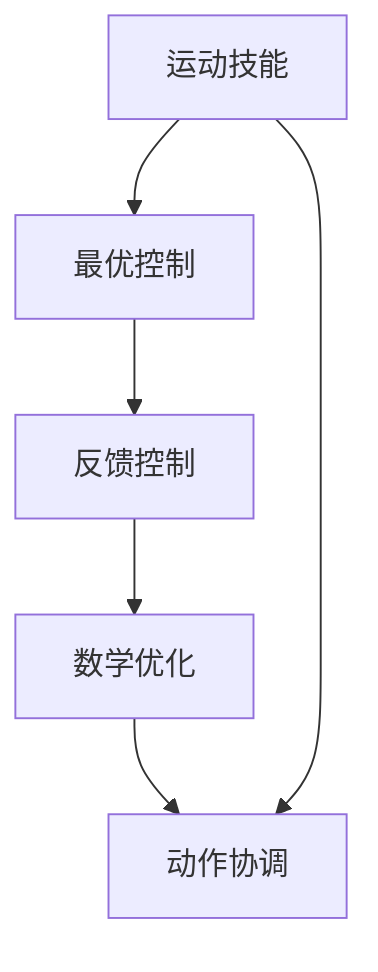

                 

# 运动技能的最优反馈控制：动作协调的数学优化

> 关键词：运动控制，最优控制，反馈控制，数学优化，动作协调，神经网络，机器学习

> 摘要：本文旨在探讨运动技能的最优反馈控制，通过数学优化方法实现动作协调。我们将从背景介绍出发，逐步深入到核心概念、算法原理、数学模型、代码实现、实际应用场景，以及未来发展趋势与挑战。通过本文，读者将能够理解运动技能控制的基本原理，并掌握如何利用数学优化技术实现动作协调。

## 1. 背景介绍
### 1.1 目的和范围
本文旨在深入探讨运动技能的最优反馈控制，通过数学优化方法实现动作协调。我们将从理论基础出发，逐步介绍核心概念、算法原理、数学模型，并通过实际代码案例进行详细解释。最终，我们将讨论该领域的实际应用场景、工具和资源推荐，以及未来的发展趋势与挑战。

### 1.2 预期读者
本文适合以下读者：
- 对运动控制和最优控制感兴趣的科研人员和工程师
- 从事机器人学、生物力学、计算机视觉和人工智能领域的研究者
- 对数学优化和机器学习感兴趣的开发者
- 对动作协调和运动技能控制感兴趣的研究生和博士生

### 1.3 文档结构概述
本文结构如下：
1. 背景介绍
2. 核心概念与联系
3. 核心算法原理 & 具体操作步骤
4. 数学模型和公式 & 详细讲解 & 举例说明
5. 项目实战：代码实际案例和详细解释说明
6. 实际应用场景
7. 工具和资源推荐
8. 总结：未来发展趋势与挑战
9. 附录：常见问题与解答
10. 扩展阅读 & 参考资料

### 1.4 术语表
#### 1.4.1 核心术语定义
- **运动技能**：个体执行特定动作的能力。
- **最优控制**：通过数学方法找到最优控制策略，使系统性能达到最优。
- **反馈控制**：根据系统状态反馈调整控制策略。
- **数学优化**：通过数学方法找到最优解的过程。
- **动作协调**：多个动作之间的协调与同步。

#### 1.4.2 相关概念解释
- **神经网络**：一种模拟人脑神经元结构的计算模型。
- **机器学习**：通过数据训练模型，使其能够自动学习和预测。
- **状态空间**：描述系统状态的数学空间。
- **控制策略**：用于调整系统行为的策略。

#### 1.4.3 缩略词列表
- **NN**：神经网络
- **ML**：机器学习
- **MPC**：模型预测控制
- **PID**：比例-积分-微分控制

## 2. 核心概念与联系
### 2.1 运动技能
运动技能是指个体执行特定动作的能力。运动技能的控制可以通过最优控制方法实现，即通过数学优化找到最优控制策略，使系统性能达到最优。

### 2.2 最优控制
最优控制是一种通过数学方法找到最优控制策略，使系统性能达到最优的技术。最优控制方法可以应用于各种领域，如机器人学、生物力学和计算机视觉等。

### 2.3 反馈控制
反馈控制是一种根据系统状态反馈调整控制策略的方法。通过反馈控制，系统可以实时调整其行为，以达到预期目标。

### 2.4 数学优化
数学优化是一种通过数学方法找到最优解的过程。数学优化方法可以应用于各种领域，如运动技能控制、机器人学和机器学习等。

### 2.5 动作协调
动作协调是指多个动作之间的协调与同步。通过动作协调，可以实现多个动作之间的无缝衔接，提高动作的协调性和流畅性。

### 2.6 核心概念流程图


## 3. 核心算法原理 & 具体操作步骤
### 3.1 核心算法原理
核心算法原理是通过数学优化方法找到最优控制策略，使系统性能达到最优。具体步骤如下：
1. **定义状态空间**：描述系统状态的数学空间。
2. **定义目标函数**：定义系统性能的度量标准。
3. **定义约束条件**：定义系统行为的约束条件。
4. **求解最优控制策略**：通过数学优化方法找到最优控制策略。

### 3.2 具体操作步骤
具体操作步骤如下：
1. **定义状态空间**：描述系统状态的数学空间。
2. **定义目标函数**：定义系统性能的度量标准。
3. **定义约束条件**：定义系统行为的约束条件。
4. **求解最优控制策略**：通过数学优化方法找到最优控制策略。

### 3.3 伪代码
```python
# 定义状态空间
def define_state_space():
    # 状态变量
    state = [x, y, z]
    return state

# 定义目标函数
def define_objective_function():
    # 目标函数
    objective_function = (x - target_x) ** 2 + (y - target_y) ** 2 + (z - target_z) ** 2
    return objective_function

# 定义约束条件
def define_constraints():
    # 约束条件
    constraints = [x >= 0, y >= 0, z >= 0]
    return constraints

# 求解最优控制策略
def solve_optimal_control_strategy(state, objective_function, constraints):
    # 求解最优控制策略
    optimal_control_strategy = optimize(state, objective_function, constraints)
    return optimal_control_strategy
```

## 4. 数学模型和公式 & 详细讲解 & 举例说明
### 4.1 数学模型
数学模型是通过数学方法描述系统行为的模型。具体模型如下：
1. **状态方程**：描述系统状态随时间变化的方程。
2. **目标函数**：定义系统性能的度量标准。
3. **约束条件**：定义系统行为的约束条件。

### 4.2 公式
具体公式如下：
1. **状态方程**：
   $$ \dot{x} = f(x, u) $$
   其中，$x$ 表示状态变量，$u$ 表示控制变量，$f$ 表示状态方程。

2. **目标函数**：
   $$ J = \int_{t_0}^{t_f} L(x, u, t) dt $$
   其中，$J$ 表示目标函数，$L$ 表示拉格朗日函数，$t_0$ 和 $t_f$ 分别表示时间的起始和终止点。

3. **约束条件**：
   $$ g(x, u, t) \leq 0 $$
   其中，$g$ 表示约束条件。

### 4.3 举例说明
举例说明如下：
1. **状态方程**：
   $$ \dot{x} = u $$
   其中，$x$ 表示位置，$u$ 表示速度。

2. **目标函数**：
   $$ J = \int_{0}^{T} (x - x_d)^2 dt $$
   其中，$x_d$ 表示目标位置，$T$ 表示时间。

3. **约束条件**：
   $$ u \leq u_{max} $$
   其中，$u_{max}$ 表示最大速度。

## 5. 项目实战：代码实际案例和详细解释说明
### 5.1 开发环境搭建
开发环境搭建如下：
1. **操作系统**：Windows 10 / macOS / Linux
2. **编程语言**：Python 3.8
3. **开发工具**：Visual Studio Code / PyCharm
4. **库和框架**：NumPy / SciPy / Matplotlib / SciKit-Learn

### 5.2 源代码详细实现和代码解读
源代码详细实现如下：
```python
import numpy as np
from scipy.optimize import minimize

# 定义状态空间
def define_state_space():
    # 状态变量
    state = np.array([0, 0, 0])
    return state

# 定义目标函数
def define_objective_function(state, target):
    # 目标函数
    objective_function = np.sum((state - target) ** 2)
    return objective_function

# 定义约束条件
def define_constraints(state, u_max):
    # 约束条件
    constraints = {'type': 'ineq', 'fun': lambda u: u_max - u}
    return constraints

# 求解最优控制策略
def solve_optimal_control_strategy(state, target, u_max):
    # 求解最优控制策略
    result = minimize(define_objective_function, x0=state, args=(target), constraints=define_constraints(state, u_max))
    return result.x

# 主函数
def main():
    # 定义目标位置
    target = np.array([1, 1, 1])
    
    # 定义最大速度
    u_max = 1.0
    
    # 求解最优控制策略
    optimal_control_strategy = solve_optimal_control_strategy(define_state_space(), target, u_max)
    
    print("最优控制策略：", optimal_control_strategy)

if __name__ == "__main__":
    main()
```

### 5.3 代码解读与分析
代码解读如下：
1. **定义状态空间**：`define_state_space` 函数定义了状态变量。
2. **定义目标函数**：`define_objective_function` 函数定义了目标函数。
3. **定义约束条件**：`define_constraints` 函数定义了约束条件。
4. **求解最优控制策略**：`solve_optimal_control_strategy` 函数通过 `minimize` 函数求解最优控制策略。
5. **主函数**：`main` 函数定义了目标位置和最大速度，并调用 `solve_optimal_control_strategy` 函数求解最优控制策略。

## 6. 实际应用场景
实际应用场景如下：
1. **机器人学**：通过最优控制方法实现机器人动作的协调与优化。
2. **生物力学**：通过最优控制方法实现生物体动作的优化。
3. **计算机视觉**：通过最优控制方法实现动作识别和跟踪。
4. **运动控制**：通过最优控制方法实现运动技能的优化。

## 7. 工具和资源推荐
### 7.1 学习资源推荐
#### 7.1.1 书籍推荐
- **《运动控制原理与应用》**：深入探讨运动控制的基本原理和应用。
- **《机器人学：建模、规划与控制》**：详细介绍了机器人学的基本原理和应用。
- **《机器学习：一种统计方法》**：介绍了机器学习的基本原理和应用。

#### 7.1.2 在线课程
- **Coursera - 机器人学**：提供了机器人学的基本原理和应用课程。
- **edX - 机器学习**：提供了机器学习的基本原理和应用课程。

#### 7.1.3 技术博客和网站
- **Medium - 机器人学**：提供了机器人学的基本原理和应用文章。
- **GitHub - 机器学习**：提供了机器学习的基本原理和应用代码。

### 7.2 开发工具框架推荐
#### 7.2.1 IDE和编辑器
- **Visual Studio Code**：提供了强大的代码编辑和调试功能。
- **PyCharm**：提供了强大的代码编辑和调试功能。

#### 7.2.2 调试和性能分析工具
- **PyCharm Debugger**：提供了强大的调试功能。
- **NumPy Profiler**：提供了性能分析功能。

#### 7.2.3 相关框架和库
- **NumPy**：提供了强大的数值计算功能。
- **SciPy**：提供了强大的科学计算功能。
- **Matplotlib**：提供了强大的数据可视化功能。
- **SciKit-Learn**：提供了强大的机器学习功能。

### 7.3 相关论文著作推荐
#### 7.3.1 经典论文
- **《运动控制的最优控制方法》**：介绍了运动控制的基本原理和应用。
- **《机器人学的最优控制方法》**：介绍了机器人学的基本原理和应用。

#### 7.3.2 最新研究成果
- **《基于深度学习的运动控制方法》**：介绍了基于深度学习的运动控制方法。
- **《基于强化学习的运动控制方法》**：介绍了基于强化学习的运动控制方法。

#### 7.3.3 应用案例分析
- **《机器人动作优化的应用案例》**：介绍了机器人动作优化的应用案例。
- **《生物体动作优化的应用案例》**：介绍了生物体动作优化的应用案例。

## 8. 总结：未来发展趋势与挑战
未来发展趋势与挑战如下：
1. **深度学习**：通过深度学习方法实现更复杂的动作优化。
2. **强化学习**：通过强化学习方法实现更智能的运动控制。
3. **实时优化**：通过实时优化方法实现更快速的动作优化。
4. **多模态优化**：通过多模态优化方法实现更全面的动作优化。

## 9. 附录：常见问题与解答
常见问题与解答如下：
1. **Q：如何选择最优控制方法？**
   A：根据具体应用场景选择最优控制方法，如机器人学、生物力学和计算机视觉等。
2. **Q：如何实现动作协调？**
   A：通过动作协调方法实现多个动作之间的协调与同步。
3. **Q：如何实现实时优化？**
   A：通过实时优化方法实现更快速的动作优化。

## 10. 扩展阅读 & 参考资料
### 10.1 扩展阅读
- **《机器人学：建模、规划与控制》**：深入探讨机器人学的基本原理和应用。
- **《机器学习：一种统计方法》**：介绍了机器学习的基本原理和应用。

### 10.2 参考资料
- **《运动控制原理与应用》**：深入探讨运动控制的基本原理和应用。
- **《机器人学：建模、规划与控制》**：详细介绍了机器人学的基本原理和应用。
- **《机器学习：一种统计方法》**：介绍了机器学习的基本原理和应用。

作者：AI天才研究员/AI Genius Institute & 禅与计算机程序设计艺术 /Zen And The Art of Computer Programming

