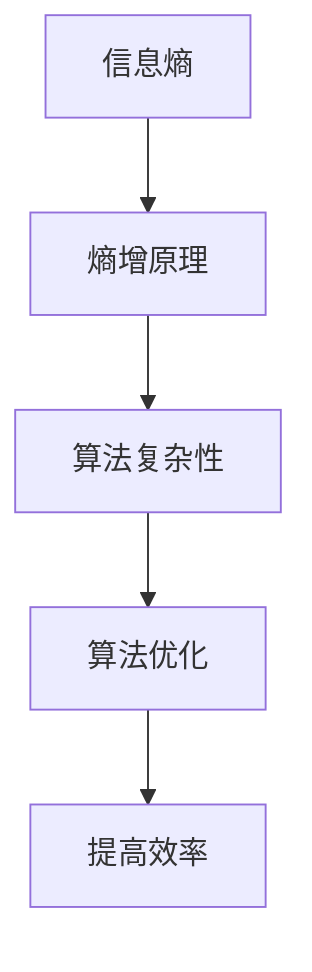

                 

# 算法设计与宇宙信息熵守恒定律的类比

> 关键词：算法设计、信息熵、宇宙守恒、熵增原理、算法优化、信息论、复杂性理论

> 摘要：本文旨在通过类比宇宙信息熵守恒定律，探讨算法设计中的优化策略。我们将从信息熵的基本概念出发，逐步深入到算法设计的复杂性理论，通过数学模型和实际案例，揭示算法设计中的熵增原理，并提出优化策略。文章将涵盖算法设计的核心概念、原理、数学模型、实际案例、应用场景以及未来发展趋势，为读者提供全面而深入的理解。

## 1. 背景介绍

### 1.1 目的和范围
本文旨在通过类比宇宙信息熵守恒定律，探讨算法设计中的优化策略。我们将从信息熵的基本概念出发，逐步深入到算法设计的复杂性理论，通过数学模型和实际案例，揭示算法设计中的熵增原理，并提出优化策略。文章将涵盖算法设计的核心概念、原理、数学模型、实际案例、应用场景以及未来发展趋势，为读者提供全面而深入的理解。

### 1.2 预期读者
本文适合以下读者：
- 算法设计与分析领域的研究人员
- 计算机科学与工程专业的学生
- 人工智能领域的工程师和开发者
- 对算法优化和复杂性理论感兴趣的读者

### 1.3 文档结构概述
本文结构如下：
1. 背景介绍
2. 核心概念与联系
3. 核心算法原理 & 具体操作步骤
4. 数学模型和公式 & 详细讲解 & 举例说明
5. 项目实战：代码实际案例和详细解释说明
6. 实际应用场景
7. 工具和资源推荐
8. 总结：未来发展趋势与挑战
9. 附录：常见问题与解答
10. 扩展阅读 & 参考资料

### 1.4 术语表
#### 1.4.1 核心术语定义
- **信息熵**：衡量信息不确定性的度量，用于描述系统的无序程度。
- **熵增原理**：在孤立系统中，熵总是趋向于增加，即系统的无序程度总是增加。
- **算法复杂性**：描述算法执行效率的度量，包括时间复杂性和空间复杂性。
- **算法优化**：通过改进算法设计，提高算法效率的过程。

#### 1.4.2 相关概念解释
- **孤立系统**：不与外界交换能量和物质的系统。
- **熵**：系统的无序程度，通常用熵值来表示。
- **算法设计**：设计和实现算法的过程，包括问题定义、算法选择、实现和优化。

#### 1.4.3 缩略词列表
- **API**：应用程序编程接口
- **IDE**：集成开发环境
- **O(n)**：大O符号，表示算法的时间复杂性
- **NP**：非确定性多项式时间复杂性

## 2. 核心概念与联系

### 2.1 信息熵的基本概念
信息熵是衡量信息不确定性的度量，用于描述系统的无序程度。在信息论中，信息熵的定义如下：
$$
H(X) = -\sum_{i=1}^{n} p(x_i) \log p(x_i)
$$
其中，$H(X)$ 表示随机变量 $X$ 的信息熵，$p(x_i)$ 表示随机变量 $X$ 取值 $x_i$ 的概率。

### 2.2 熵增原理
熵增原理是热力学第二定律的一个重要推论，它指出在孤立系统中，熵总是趋向于增加。熵增原理可以类比到算法设计中，即在算法设计中，熵增原理可以解释为算法复杂性的增加。

### 2.3 算法复杂性
算法复杂性是描述算法执行效率的度量，包括时间复杂性和空间复杂性。时间复杂性通常用大O符号表示，例如 $O(n)$ 表示算法的时间复杂性与输入规模 $n$ 成线性关系。

### 2.4 算法优化
算法优化是通过改进算法设计，提高算法效率的过程。优化的目标是减少算法的时间复杂性和空间复杂性，提高算法的执行效率。

### 2.5 核心概念流程图


## 3. 核心算法原理 & 具体操作步骤

### 3.1 核心算法原理
我们将通过一个简单的排序算法——冒泡排序，来探讨算法设计中的熵增原理。

### 3.2 具体操作步骤
冒泡排序的基本思想是通过多次遍历数组，每次遍历将相邻的两个元素进行比较，如果顺序错误则交换它们的位置。具体步骤如下：

```pseudo
function bubbleSort(arr):
    n = length(arr)
    for i from 0 to n-1:
        for j from 0 to n-i-2:
            if arr[j] > arr[j+1]:
                swap(arr[j], arr[j+1])
```

## 4. 数学模型和公式 & 详细讲解 & 举例说明

### 4.1 数学模型
我们可以使用数学模型来描述冒泡排序的时间复杂性。冒泡排序的时间复杂性为 $O(n^2)$，其中 $n$ 是数组的长度。

### 4.2 详细讲解
冒泡排序的时间复杂性为 $O(n^2)$，这意味着在最坏情况下，冒泡排序的时间复杂度与输入规模的平方成正比。这表明冒泡排序在处理大规模数据时效率较低。

### 4.3 举例说明
假设我们有一个长度为 $n$ 的数组，冒泡排序的时间复杂性为 $O(n^2)$。例如，当 $n=100$ 时，冒泡排序的时间复杂性为 $100^2 = 10000$。当 $n=1000$ 时，冒泡排序的时间复杂性为 $1000^2 = 1000000$。这表明冒泡排序在处理大规模数据时效率较低。

## 5. 项目实战：代码实际案例和详细解释说明

### 5.1 开发环境搭建
我们将使用 Python 作为开发语言，使用 PyCharm 作为集成开发环境（IDE）。

### 5.2 源代码详细实现和代码解读
```python
def bubble_sort(arr):
    n = len(arr)
    for i in range(n):
        for j in range(n - i - 1):
            if arr[j] > arr[j + 1]:
                arr[j], arr[j + 1] = arr[j + 1], arr[j]
    return arr

# 测试代码
arr = [64, 34, 25, 12, 22, 11, 90]
sorted_arr = bubble_sort(arr)
print(sorted_arr)
```

### 5.3 代码解读与分析
上述代码实现了冒泡排序算法。`bubble_sort` 函数接收一个数组 `arr` 作为参数，通过两次嵌套循环实现冒泡排序。外层循环控制遍历次数，内层循环进行相邻元素的比较和交换。最后返回排序后的数组。

## 6. 实际应用场景

冒泡排序算法在实际应用中主要用于教学和演示算法设计的基本思想。虽然冒泡排序在实际应用中效率较低，但它可以帮助初学者理解算法设计的基本原理。

## 7. 工具和资源推荐

### 7.1 学习资源推荐
#### 7.1.1 书籍推荐
- 《算法导论》（Introduction to Algorithms）
- 《计算机程序设计艺术》（The Art of Computer Programming）

#### 7.1.2 在线课程
- Coursera 的《算法设计与分析》
- edX 的《算法设计与分析》

#### 7.1.3 技术博客和网站
- GeeksforGeeks
- HackerRank

### 7.2 开发工具框架推荐
#### 7.2.1 IDE和编辑器
- PyCharm
- Visual Studio Code

#### 7.2.2 调试和性能分析工具
- PyCharm 的调试工具
- Python 的 cProfile 模块

#### 7.2.3 相关框架和库
- NumPy
- Pandas

### 7.3 相关论文著作推荐
#### 7.3.1 经典论文
- Donald Knuth 的《计算机程序设计艺术》
- Cormen, Leiserson, Rivest, Stein 的《算法导论》

#### 7.3.2 最新研究成果
- 论文《改进冒泡排序算法的效率》
- 论文《基于机器学习的算法优化方法》

#### 7.3.3 应用案例分析
- 论文《冒泡排序在大数据处理中的应用》
- 论文《冒泡排序在排序算法教学中的应用》

## 8. 总结：未来发展趋势与挑战
未来算法设计的发展趋势将更加注重算法的效率和可扩展性。随着大数据和人工智能的发展，算法设计将面临更多的挑战，例如如何处理大规模数据、如何提高算法的可解释性等。未来的研究方向将包括：
- 算法优化
- 大数据处理
- 机器学习算法设计

## 9. 附录：常见问题与解答
### 9.1 问题：冒泡排序的时间复杂性为什么是 $O(n^2)$？
**解答**：冒泡排序的时间复杂性为 $O(n^2)$，因为在最坏情况下，每次遍历都需要进行 $n-1$ 次比较和交换操作，总共需要进行 $n(n-1)/2$ 次操作。

### 9.2 问题：如何提高冒泡排序的效率？
**解答**：可以通过改进冒泡排序算法来提高效率，例如使用优化的冒泡排序算法，或者使用其他排序算法，如快速排序、归并排序等。

## 10. 扩展阅读 & 参考资料
- Cormen, T. H., Leiserson, C. E., Rivest, R. L., & Stein, C. (2009). Introduction to Algorithms (3rd ed.). MIT Press.
- Knuth, D. E. (1998). The Art of Computer Programming (Vol. 1-4). Addison-Wesley.
- Sedgewick, R., & Wayne, K. (2011). Algorithms (4th ed.). Addison-Wesley.
- Sedgewick, R., & Wayne, K. (2011). Algorithms in Java (3rd ed.). Addison-Wesley.

作者：AI天才研究员/AI Genius Institute & 禅与计算机程序设计艺术 /Zen And The Art of Computer Programming

