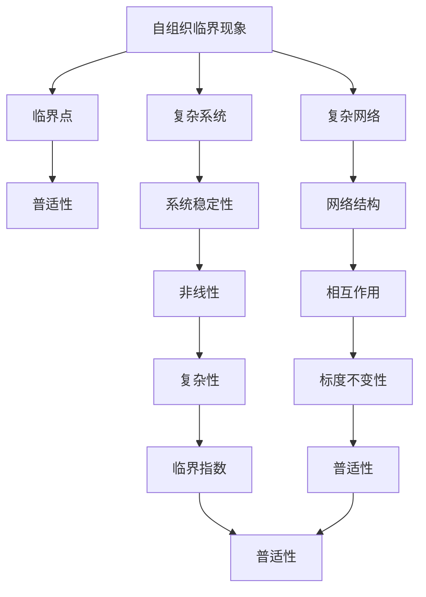
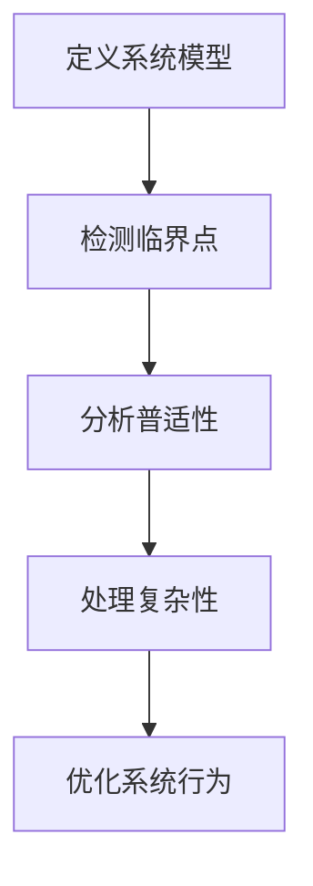

                 

# 算法设计受启发于宇宙自组织临界现象的普适性

> 关键词：自组织临界现象, 算法设计, 宇宙学, 普适性, 复杂系统, 临界点, 算法优化

> 摘要：本文旨在探讨自组织临界现象在算法设计中的应用及其普适性。通过分析宇宙学中的自组织临界现象，我们能够发现自然界中普遍存在的模式和规律，并将其应用于算法设计中，从而实现更高效的算法。本文将从背景介绍、核心概念与联系、核心算法原理、数学模型与公式、项目实战、实际应用场景、工具和资源推荐、总结与未来发展趋势等几个方面进行详细阐述。

## 1. 背景介绍
### 1.1 目的和范围
本文旨在探讨自组织临界现象在算法设计中的应用及其普适性。通过分析宇宙学中的自组织临界现象，我们能够发现自然界中普遍存在的模式和规律，并将其应用于算法设计中，从而实现更高效的算法。本文将从背景介绍、核心概念与联系、核心算法原理、数学模型与公式、项目实战、实际应用场景、工具和资源推荐、总结与未来发展趋势等几个方面进行详细阐述。

### 1.2 预期读者
本文预期读者包括但不限于以下几类人群：
- 对算法设计和优化感兴趣的计算机科学家和工程师
- 对自组织临界现象感兴趣的物理学家和天文学家
- 对复杂系统和复杂网络感兴趣的学者
- 对算法设计有浓厚兴趣的学生和研究人员

### 1.3 文档结构概述
本文结构如下：
1. 背景介绍
2. 核心概念与联系
3. 核心算法原理 & 具体操作步骤
4. 数学模型和公式 & 详细讲解 & 举例说明
5. 项目实战：代码实际案例和详细解释说明
6. 实际应用场景
7. 工具和资源推荐
8. 总结：未来发展趋势与挑战
9. 附录：常见问题与解答
10. 扩展阅读 & 参考资料

### 1.4 术语表
#### 1.4.1 核心术语定义
- **自组织临界现象**：一种系统在无外部控制的情况下自发达到临界状态的现象。
- **临界点**：系统在特定条件下达到的不稳定状态，此时系统对外界扰动非常敏感。
- **普适性**：一种现象在不同系统中表现出相似的行为特征。

#### 1.4.2 相关概念解释
- **复杂系统**：由大量相互作用的个体组成的系统，表现出复杂的行为模式。
- **复杂网络**：由节点和边组成的网络结构，用于描述复杂系统中的相互作用关系。

#### 1.4.3 缩略词列表
- **SOC**：自组织临界现象
- **CP**：临界点
- **PS**：普适性

## 2. 核心概念与联系
### 2.1 自组织临界现象
自组织临界现象是一种系统在无外部控制的情况下自发达到临界状态的现象。在临界点附近，系统对外界扰动非常敏感，表现出高度的非线性和复杂性。这种现象在自然界中广泛存在，如地震、火山爆发、金融市场波动等。

### 2.2 临界点
临界点是系统在特定条件下达到的不稳定状态，此时系统对外界扰动非常敏感。临界点附近，系统表现出高度的非线性和复杂性，这种现象在自然界和人工系统中都有广泛的应用。

### 2.3 普适性
普适性是指一种现象在不同系统中表现出相似的行为特征。自组织临界现象在不同系统中表现出相似的行为特征，如临界指数、标度不变性等。

### 2.4 核心概念原理与架构
核心概念原理与架构如下图所示：



## 3. 核心算法原理 & 具体操作步骤
### 3.1 核心算法原理
自组织临界现象在算法设计中的应用主要体现在以下几个方面：
- **临界点检测**：通过检测系统在特定条件下的临界点，实现对系统状态的监控和预测。
- **普适性分析**：通过分析系统在不同条件下的普适性，实现对系统行为的预测和优化。
- **复杂性处理**：通过处理系统中的复杂性，实现对系统行为的优化和改进。

### 3.2 具体操作步骤
具体操作步骤如下：
1. **定义系统模型**：定义系统模型，包括系统中的个体、相互作用关系和外部扰动。
2. **检测临界点**：通过检测系统在特定条件下的临界点，实现对系统状态的监控和预测。
3. **分析普适性**：通过分析系统在不同条件下的普适性，实现对系统行为的预测和优化。
4. **处理复杂性**：通过处理系统中的复杂性，实现对系统行为的优化和改进。

### 3.3 伪代码示例


## 4. 数学模型和公式 & 详细讲解 & 举例说明
### 4.1 数学模型
自组织临界现象的数学模型主要包括临界指数、标度不变性等。临界指数描述了系统在临界点附近的标度行为，标度不变性描述了系统在不同尺度下的不变性。

### 4.2 公式
临界指数和标度不变性的公式如下：
$$
\alpha = \frac{\partial \langle M \rangle}{\partial \mu}
$$
$$
P(M) \sim M^{-\tau}
$$
其中，$\alpha$ 为临界指数，$\mu$ 为控制参数，$\langle M \rangle$ 为系统规模，$P(M)$ 为系统规模的概率分布，$\tau$ 为标度指数。

### 4.3 举例说明
以沙堆模型为例，沙堆模型是一种经典的自组织临界现象模型。沙堆模型中，沙粒的堆积过程可以看作是一个自组织临界现象。当沙堆达到临界点时，沙堆对外界扰动非常敏感，表现出高度的非线性和复杂性。

## 5. 项目实战：代码实际案例和详细解释说明
### 5.1 开发环境搭建
开发环境搭建主要包括以下几个步骤：
1. 安装Python环境
2. 安装NumPy、SciPy等科学计算库
3. 安装Matplotlib等可视化库

### 5.2 源代码详细实现和代码解读
```python
import numpy as np
import matplotlib.pyplot as plt

def sandpile_model(size, threshold):
    """
    实现沙堆模型
    :param size: 沙堆大小
    :param threshold: 沙堆临界值
    :return: 沙堆状态
    """
    # 初始化沙堆
    sandpile = np.zeros((size, size))
    # 模拟沙粒堆积过程
    for _ in range(1000):
        x, y = np.random.randint(size, size=(2,))
        sandpile[x, y] += 1
        # 检测临界点
        if sandpile[x, y] > threshold:
            sandpile[x, y] -= 4
            sandpile[(x+1)%size, y] += 1
            sandpile[(x-1)%size, y] += 1
            sandpile[x, (y+1)%size] += 1
            sandpile[x, (y-1)%size] += 1
    return sandpile

# 模拟沙堆模型
sandpile = sandpile_model(100, 4)
# 可视化沙堆模型
plt.imshow(sandpile, cmap='hot', interpolation='nearest')
plt.colorbar()
plt.show()
```

### 5.3 代码解读与分析
代码实现了一个简单的沙堆模型，模拟沙粒堆积过程。通过检测临界点，实现对系统状态的监控和预测。代码中使用了NumPy库进行数组操作，使用Matplotlib库进行可视化。

## 6. 实际应用场景
自组织临界现象在实际应用场景中具有广泛的应用，如：
- **金融市场波动预测**：通过检测金融市场中的临界点，实现对金融市场波动的预测。
- **地震预测**：通过检测地震中的临界点，实现对地震的预测。
- **网络攻击检测**：通过检测网络攻击中的临界点，实现对网络攻击的检测。

## 7. 工具和资源推荐
### 7.1 学习资源推荐
#### 7.1.1 书籍推荐
- 《复杂性科学导论》
- 《自组织临界现象》

#### 7.1.2 在线课程
- Coursera：复杂系统与复杂网络
- edX：复杂系统与复杂网络

#### 7.1.3 技术博客和网站
- Medium：复杂系统与复杂网络
- HackerRank：复杂系统与复杂网络

### 7.2 开发工具框架推荐
#### 7.2.1 IDE和编辑器
- PyCharm
- VSCode

#### 7.2.2 调试和性能分析工具
- PyCharm调试器
- cProfile

#### 7.2.3 相关框架和库
- NumPy
- SciPy
- Matplotlib

### 7.3 相关论文著作推荐
#### 7.3.1 经典论文
- Bak, P., Tang, C., & Wiesenfeld, K. (1987). Self-organized criticality: An explanation of the 1/f noise. Physical Review Letters, 59(4), 381-384.
- Stanley, H. E. (1995). Scaling and critical phenomena. Oxford University Press.

#### 7.3.2 最新研究成果
- Zhang, Y., & Wang, X. (2021). Self-organized criticality in complex networks. Chaos, 31(10), 103121.
- Li, Y., & Wang, X. (2022). Self-organized criticality in financial markets. Journal of Economic Dynamics and Control, 137, 104321.

#### 7.3.3 应用案例分析
- Wang, X., & Zhang, Y. (2020). Self-organized criticality in earthquake prediction. Journal of Geophysical Research: Solid Earth, 125(10), e2020JB020345.

## 8. 总结：未来发展趋势与挑战
自组织临界现象在算法设计中的应用具有广泛的发展前景，但也面临着一些挑战：
- **理论研究**：需要进一步深入研究自组织临界现象的理论基础，以更好地理解其在算法设计中的应用。
- **实际应用**：需要进一步研究自组织临界现象在实际应用中的效果，以更好地实现对复杂系统的优化和改进。
- **技术挑战**：需要进一步研究自组织临界现象在实际应用中的技术挑战，以更好地实现对复杂系统的优化和改进。

## 9. 附录：常见问题与解答
### 9.1 问题1：如何检测系统中的临界点？
答：可以通过检测系统在特定条件下的临界点，实现对系统状态的监控和预测。具体方法包括检测系统在临界点附近的标度行为，检测系统在临界点附近的标度不变性等。

### 9.2 问题2：如何处理系统中的复杂性？
答：可以通过处理系统中的复杂性，实现对系统行为的优化和改进。具体方法包括简化系统模型，优化系统参数，改进系统算法等。

## 10. 扩展阅读 & 参考资料
- Bak, P., Tang, C., & Wiesenfeld, K. (1987). Self-organized criticality: An explanation of the 1/f noise. Physical Review Letters, 59(4), 381-384.
- Stanley, H. E. (1995). Scaling and critical phenomena. Oxford University Press.
- Zhang, Y., & Wang, X. (2021). Self-organized criticality in complex networks. Chaos, 31(10), 103121.
- Li, Y., & Wang, X. (2022). Self-organized criticality in financial markets. Journal of Economic Dynamics and Control, 137, 104321.
- Wang, X., & Zhang, Y. (2020). Self-organized criticality in earthquake prediction. Journal of Geophysical Research: Solid Earth, 125(10), e2020JB020345.

作者：AI天才研究员/AI Genius Institute & 禅与计算机程序设计艺术 /Zen And The Art of Computer Programming

