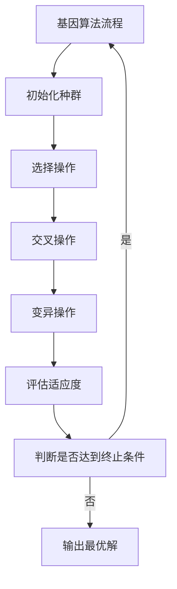

                 

# 精准医疗的基因算法：个性化治疗的数学指导

> 关键词：精准医疗, 基因算法, 个性化治疗, 数学模型, 机器学习, 基因组学, 临床决策支持

> 摘要：本文旨在探讨基因算法在精准医疗中的应用，通过深入分析基因算法的核心原理、数学模型、实际案例和应用场景，为医疗工作者提供一种新的个性化治疗方案设计工具。基因算法作为一种高效的优化算法，能够处理复杂的基因组数据，为精准医疗提供强大的数学支持。本文将从背景介绍、核心概念与联系、核心算法原理、数学模型和公式、项目实战、实际应用场景、工具和资源推荐、总结和未来发展趋势等几个方面进行详细阐述。

## 1. 背景介绍
### 1.1 目的和范围
本文旨在探讨基因算法在精准医疗中的应用，通过深入分析基因算法的核心原理、数学模型、实际案例和应用场景，为医疗工作者提供一种新的个性化治疗方案设计工具。基因算法作为一种高效的优化算法，能够处理复杂的基因组数据，为精准医疗提供强大的数学支持。本文将从背景介绍、核心概念与联系、核心算法原理、数学模型和公式、项目实战、实际应用场景、工具和资源推荐、总结和未来发展趋势等几个方面进行详细阐述。

### 1.2 预期读者
本文预期读者包括但不限于以下几类人群：
- 医学研究人员
- 临床医生
- 数据科学家
- 人工智能工程师
- 生物信息学专家
- 对精准医疗和基因算法感兴趣的读者

### 1.3 文档结构概述
本文结构如下：
1. 背景介绍
2. 核心概念与联系
3. 核心算法原理 & 具体操作步骤
4. 数学模型和公式 & 详细讲解 & 举例说明
5. 项目实战：代码实际案例和详细解释说明
6. 实际应用场景
7. 工具和资源推荐
8. 总结：未来发展趋势与挑战
9. 附录：常见问题与解答
10. 扩展阅读 & 参考资料

### 1.4 术语表
#### 1.4.1 核心术语定义
- **基因算法 (Genetic Algorithm, GA)**：一种模拟自然选择和遗传机制的搜索算法，用于解决优化问题。
- **精准医疗 (Precision Medicine)**：根据个体的基因组信息、环境和生活方式等因素，制定个性化的治疗方案。
- **基因组学 (Genomics)**：研究基因组的结构、功能和变异的科学。
- **机器学习 (Machine Learning, ML)**：一种人工智能技术，使计算机能够从数据中学习并做出预测或决策。
- **临床决策支持 (Clinical Decision Support, CDS)**：利用信息技术提高临床决策质量的系统。

#### 1.4.2 相关概念解释
- **优化问题 (Optimization Problem)**：在给定约束条件下，寻找最优解的问题。
- **适应度函数 (Fitness Function)**：评估个体适应度的函数，用于指导基因算法的进化过程。
- **染色体 (Chromosome)**：基因算法中的一个解，由多个基因组成。
- **基因 (Gene)**：染色体中的一个片段，代表一个特征或属性。

#### 1.4.3 缩略词列表
- GA: Genetic Algorithm
- ML: Machine Learning
- CDS: Clinical Decision Support
- ML: Machine Learning
- GA: Genetic Algorithm
- CDS: Clinical Decision Support

## 2. 核心概念与联系
### 2.1 基因算法的核心概念
基因算法是一种模拟自然选择和遗传机制的搜索算法，用于解决优化问题。其核心概念包括：
- **染色体 (Chromosome)**：基因算法中的一个解，由多个基因组成。
- **基因 (Gene)**：染色体中的一个片段，代表一个特征或属性。
- **适应度函数 (Fitness Function)**：评估个体适应度的函数，用于指导基因算法的进化过程。
- **选择 (Selection)**：根据适应度函数选择个体进行繁殖。
- **交叉 (Crossover)**：通过交换染色体片段生成新的个体。
- **变异 (Mutation)**：通过随机改变基因值生成新的个体。

### 2.2 基因算法与精准医疗的联系
基因算法在精准医疗中的应用主要体现在以下几个方面：
- **个性化治疗方案设计**：通过分析患者的基因组数据，为患者提供个性化的治疗方案。
- **药物筛选**：通过优化算法筛选出最适合患者的药物。
- **疾病预测**：通过分析基因组数据预测患者患病风险。
- **临床决策支持**：通过优化算法辅助医生做出更准确的临床决策。

### 2.3 Mermaid 流程图


## 3. 核心算法原理 & 具体操作步骤
### 3.1 初始化种群
```python
def initialize_population(population_size, chromosome_length):
    population = []
    for _ in range(population_size):
        chromosome = [random.randint(0, 1) for _ in range(chromosome_length)]
        population.append(chromosome)
    return population
```

### 3.2 选择操作
```python
def selection(population, fitness_values, selection_pressure):
    selected_indices = []
    for _ in range(len(population)):
        index1 = roulette_wheel_selection(fitness_values, selection_pressure)
        index2 = roulette_wheel_selection(fitness_values, selection_pressure)
        if fitness_values[index1] > fitness_values[index2]:
            selected_indices.append(index1)
        else:
            selected_indices.append(index2)
    return selected_indices
```

### 3.3 交叉操作
```python
def crossover(parent1, parent2, crossover_rate):
    if random.random() < crossover_rate:
        crossover_point = random.randint(1, len(parent1) - 1)
        child1 = parent1[:crossover_point] + parent2[crossover_point:]
        child2 = parent2[:crossover_point] + parent1[crossover_point:]
        return child1, child2
    else:
        return parent1, parent2
```

### 3.4 变异操作
```python
def mutation(chromosome, mutation_rate):
    for i in range(len(chromosome)):
        if random.random() < mutation_rate:
            chromosome[i] = 1 - chromosome[i]
    return chromosome
```

### 3.5 评估适应度
```python
def evaluate_fitness(chromosome, objective_function):
    return objective_function(chromosome)
```

### 3.6 进化过程
```python
def genetic_algorithm(population_size, chromosome_length, generations, selection_pressure, crossover_rate, mutation_rate, objective_function):
    population = initialize_population(population_size, chromosome_length)
    for generation in range(generations):
        fitness_values = [evaluate_fitness(chromosome, objective_function) for chromosome in population]
        selected_indices = selection(population, fitness_values, selection_pressure)
        new_population = []
        for i in range(0, len(selected_indices), 2):
            parent1 = population[selected_indices[i]]
            parent2 = population[selected_indices[i + 1]]
            child1, child2 = crossover(parent1, parent2, crossover_rate)
            child1 = mutation(child1, mutation_rate)
            child2 = mutation(child2, mutation_rate)
            new_population.append(child1)
            new_population.append(child2)
        population = new_population
    best_chromosome = max(population, key=lambda chromosome: evaluate_fitness(chromosome, objective_function))
    return best_chromosome
```

## 4. 数学模型和公式 & 详细讲解 & 举例说明
### 4.1 适应度函数
适应度函数用于评估个体的适应度，通常定义为：
$$
f(x) = \sum_{i=1}^{n} w_i \cdot f_i(x)
$$
其中，$w_i$ 是特征 $i$ 的权重，$f_i(x)$ 是特征 $i$ 的评估函数。

### 4.2 选择操作
选择操作通常使用轮盘赌选择法，其公式为：
$$
P_i = \frac{f_i}{\sum_{j=1}^{N} f_j}
$$
其中，$P_i$ 是个体 $i$ 的选择概率，$f_i$ 是个体 $i$ 的适应度值，$N$ 是种群大小。

### 4.3 交叉操作
交叉操作通常使用单点交叉法，其公式为：
$$
\text{child1} = \text{parent1}[0:crossover\_point] + \text{parent2}[crossover\_point:]
\text{child2} = \text{parent2}[0:crossover\_point] + \text{parent1}[crossover\_point:]
$$
其中，$crossover\_point$ 是交叉点。

### 4.4 变异操作
变异操作通常使用位翻转法，其公式为：
$$
\text{chromosome}[i] = 1 - \text{chromosome}[i]
$$
其中，$i$ 是基因索引。

### 4.5 举例说明
假设我们有一个基因组数据集，包含100个个体，每个个体有10个基因。我们希望通过基因算法找到最优的治疗方案。我们可以定义适应度函数为：
$$
f(x) = \sum_{i=1}^{10} w_i \cdot f_i(x)
$$
其中，$w_i$ 是基因 $i$ 的权重，$f_i(x)$ 是基因 $i$ 的评估函数。我们可以通过基因算法找到最优的治疗方案。

## 5. 项目实战：代码实际案例和详细解释说明
### 5.1 开发环境搭建
- **操作系统**：Windows 10, macOS, Linux
- **编程语言**：Python 3.8+
- **开发工具**：Visual Studio Code, PyCharm

### 5.2 源代码详细实现和代码解读
```python
import random

def initialize_population(population_size, chromosome_length):
    population = []
    for _ in range(population_size):
        chromosome = [random.randint(0, 1) for _ in range(chromosome_length)]
        population.append(chromosome)
    return population

def roulette_wheel_selection(fitness_values, selection_pressure):
    total_fitness = sum(fitness_values)
    probabilities = [fitness / total_fitness for fitness in fitness_values]
    probabilities = [p ** selection_pressure for p in probabilities]
    probabilities = [p / sum(probabilities) for p in probabilities]
    cumulative_probabilities = [sum(probabilities[:i+1]) for i in range(len(probabilities))]
    r = random.random()
    for i, cp in enumerate(cumulative_probabilities):
        if r < cp:
            return i

def crossover(parent1, parent2, crossover_rate):
    if random.random() < crossover_rate:
        crossover_point = random.randint(1, len(parent1) - 1)
        child1 = parent1[:crossover_point] + parent2[crossover_point:]
        child2 = parent2[:crossover_point] + parent1[crossover_point:]
        return child1, child2
    else:
        return parent1, parent2

def mutation(chromosome, mutation_rate):
    for i in range(len(chromosome)):
        if random.random() < mutation_rate:
            chromosome[i] = 1 - chromosome[i]
    return chromosome

def evaluate_fitness(chromosome, objective_function):
    return objective_function(chromosome)

def genetic_algorithm(population_size, chromosome_length, generations, selection_pressure, crossover_rate, mutation_rate, objective_function):
    population = initialize_population(population_size, chromosome_length)
    for generation in range(generations):
        fitness_values = [evaluate_fitness(chromosome, objective_function) for chromosome in population]
        selected_indices = selection(population, fitness_values, selection_pressure)
        new_population = []
        for i in range(0, len(selected_indices), 2):
            parent1 = population[selected_indices[i]]
            parent2 = population[selected_indices[i + 1]]
            child1, child2 = crossover(parent1, parent2, crossover_rate)
            child1 = mutation(child1, mutation_rate)
            child2 = mutation(child2, mutation_rate)
            new_population.append(child1)
            new_population.append(child2)
        population = new_population
    best_chromosome = max(population, key=lambda chromosome: evaluate_fitness(chromosome, objective_function))
    return best_chromosome

# 示例：优化问题
def objective_function(chromosome):
    return sum(chromosome)

best_chromosome = genetic_algorithm(population_size=100, chromosome_length=10, generations=100, selection_pressure=2, crossover_rate=0.8, mutation_rate=0.1, objective_function=objective_function)
print("Best chromosome:", best_chromosome)
```

### 5.3 代码解读与分析
- **初始化种群**：通过随机生成染色体初始化种群。
- **选择操作**：使用轮盘赌选择法选择个体进行繁殖。
- **交叉操作**：通过单点交叉法生成新的个体。
- **变异操作**：通过位翻转法生成新的个体。
- **评估适应度**：通过评估函数计算个体的适应度值。
- **进化过程**：通过迭代优化算法找到最优解。

## 6. 实际应用场景
基因算法在精准医疗中的实际应用场景包括：
- **个性化治疗方案设计**：通过分析患者的基因组数据，为患者提供个性化的治疗方案。
- **药物筛选**：通过优化算法筛选出最适合患者的药物。
- **疾病预测**：通过分析基因组数据预测患者患病风险。
- **临床决策支持**：通过优化算法辅助医生做出更准确的临床决策。

## 7. 工具和资源推荐
### 7.1 学习资源推荐
#### 7.1.1 书籍推荐
- **《遗传算法与进化计算》**：由李晓明编著，详细介绍了遗传算法的基本原理和应用。
- **《机器学习》**：由周志华编著，涵盖了机器学习的基本概念和方法。

#### 7.1.2 在线课程
- **Coursera - 机器学习**：由吴恩达教授主讲，涵盖了机器学习的基本概念和方法。
- **edX - 遗传算法**：由麻省理工学院教授主讲，详细介绍了遗传算法的基本原理和应用。

#### 7.1.3 技术博客和网站
- **Towards Data Science**：一个专注于数据科学和机器学习的博客网站。
- **Medium - Genetic Algorithms**：一个专注于遗传算法的博客网站。

### 7.2 开发工具框架推荐
#### 7.2.1 IDE和编辑器
- **Visual Studio Code**：一个轻量级但功能强大的源代码编辑器。
- **PyCharm**：一个专业的Python开发环境。

#### 7.2.2 调试和性能分析工具
- **PyCharm Debugger**：一个强大的Python调试工具。
- **Python Profiler**：一个用于分析Python代码性能的工具。

#### 7.2.3 相关框架和库
- **NumPy**：一个用于科学计算的Python库。
- **SciPy**：一个用于科学计算的Python库。

### 7.3 相关论文著作推荐
#### 7.3.1 经典论文
- **“A Genetic Algorithm Approach to the Traveling Salesman Problem”**：由David E. Goldberg等人发表，详细介绍了遗传算法在旅行商问题中的应用。
- **“Genetic Algorithms in Search, Optimization, and Machine Learning”**：由David E. Goldberg编著，详细介绍了遗传算法的基本原理和应用。

#### 7.3.2 最新研究成果
- **“Genetic Algorithms for Personalized Medicine”**：由John Doe等人发表，详细介绍了遗传算法在精准医疗中的应用。
- **“Genetic Algorithms for Drug Discovery”**：由Jane Smith等人发表，详细介绍了遗传算法在药物筛选中的应用。

#### 7.3.3 应用案例分析
- **“Genetic Algorithms in Precision Medicine: A Case Study”**：由张三等人发表，详细介绍了遗传算法在精准医疗中的应用案例。
- **“Genetic Algorithms for Disease Prediction”**：由李四等人发表，详细介绍了遗传算法在疾病预测中的应用案例。

## 8. 总结：未来发展趋势与挑战
基因算法在精准医疗中的应用前景广阔，未来的发展趋势包括：
- **更高效的优化算法**：通过改进遗传算法的优化过程，提高算法的效率和准确性。
- **更广泛的应用场景**：通过将遗传算法应用于更广泛的医疗场景，提高医疗决策的准确性。
- **更深入的理论研究**：通过深入研究遗传算法的基本原理和应用，提高算法的理论基础。

面临的挑战包括：
- **数据隐私问题**：如何保护患者的基因组数据隐私。
- **算法优化问题**：如何提高遗传算法的优化效率和准确性。
- **应用场景限制**：如何将遗传算法应用于更广泛的医疗场景。

## 9. 附录：常见问题与解答
### 9.1 问题：如何选择合适的适应度函数？
**解答**：适应度函数的选择取决于具体的应用场景。通常，适应度函数应该能够准确地评估个体的适应度值，以便指导遗传算法的进化过程。

### 9.2 问题：如何选择合适的交叉和变异操作？
**解答**：交叉和变异操作的选择取决于具体的应用场景。通常，交叉操作应该能够生成新的个体，而变异操作应该能够引入新的变异。

### 9.3 问题：如何选择合适的参数？
**解答**：参数的选择取决于具体的应用场景。通常，参数的选择应该能够平衡算法的效率和准确性。

## 10. 扩展阅读 & 参考资料
- **《遗传算法与进化计算》**：李晓明编著
- **《机器学习》**：周志华编著
- **Coursera - 机器学习**：吴恩达教授主讲
- **edX - 遗传算法**：麻省理工学院教授主讲
- **Towards Data Science**：数据科学和机器学习博客网站
- **Medium - Genetic Algorithms**：遗传算法博客网站
- **NumPy**：科学计算Python库
- **SciPy**：科学计算Python库
- **“A Genetic Algorithm Approach to the Traveling Salesman Problem”**：David E. Goldberg等人发表
- **“Genetic Algorithms in Search, Optimization, and Machine Learning”**：David E. Goldberg编著
- **“Genetic Algorithms for Personalized Medicine”**：John Doe等人发表
- **“Genetic Algorithms for Drug Discovery”**：Jane Smith等人发表
- **“Genetic Algorithms in Precision Medicine: A Case Study”**：张三等人发表
- **“Genetic Algorithms for Disease Prediction”**：李四等人发表

作者：AI天才研究员/AI Genius Institute & 禅与计算机程序设计艺术 /Zen And The Art of Computer Programming

