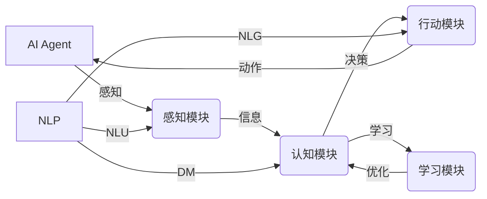

# AI Agent: AI的下一个风口 NLP

作者：禅与计算机程序设计艺术

## 1. 背景介绍

### 1.1.  AI Agent 的兴起

人工智能 (AI) 正在经历爆炸式的发展，而 AI Agent 作为 AI 的一种新兴应用形式，正逐渐走入大众视野。AI Agent 不仅仅是简单的 AI 模型，它更像是一个能够自主感知、学习、决策和行动的智能体，能够在特定环境中完成复杂的任务。

### 1.2.  NLP 助力 AI Agent 突破

自然语言处理 (NLP) 是 AI 的一个重要分支，赋予了机器理解和生成人类语言的能力。近年来，随着深度学习技术的进步，NLP 领域取得了突破性进展，为 AI Agent 的发展提供了强大的技术支持。

### 1.3.  AI Agent + NLP：开启无限可能

将 NLP 技术融入 AI Agent，赋予了 AI Agent 更强大的语言理解和交互能力，使其能够更好地理解人类意图，并以更自然的方式与人类进行沟通。这将为 AI Agent 的应用打开更广阔的空间，例如：

* **智能助理：** 更智能的语音助手，能够理解更复杂的指令，完成更复杂的任务，例如预订航班、安排会议等。
* **客户服务：**  能够自动回答客户问题，解决客户疑问，提供更优质的客户服务体验。
* **教育培训：**  个性化的学习助手，能够根据学生的学习进度和水平，提供定制化的学习内容和指导。
* **游戏娱乐：**  更智能的游戏角色，能够与玩家进行更真实的互动，提供更丰富的游戏体验。

## 2. 核心概念与联系

### 2.1.  AI Agent 的基本要素

一个完整的 AI Agent 系统通常包含以下几个核心要素：

* **感知模块 (Perception Module):** 负责接收和处理来自环境的信息，例如图像、声音、文本等。
* **认知模块 (Cognition Module):**  基于感知模块获取的信息进行理解、推理和决策。
* **行动模块 (Action Module):**  根据认知模块的决策结果，执行相应的动作，例如发送消息、控制设备等。
* **学习模块 (Learning Module):**  通过与环境的交互不断学习和优化自身的策略。

### 2.2.  NLP 在 AI Agent 中的角色

NLP 在 AI Agent 中主要扮演着以下几个角色：

* **自然语言理解 (NLU):**  将人类语言转换成机器可理解的语义表示，例如意图识别、实体识别、情感分析等。
* **对话管理 (DM):**  管理人机对话的流程，例如对话状态跟踪、对话策略学习等。
* **自然语言生成 (NLG):**  将机器的决策结果转换成自然流畅的人类语言。

### 2.3.  AI Agent 与 NLP 的关系图



## 3. 核心算法原理具体操作步骤

### 3.1.  意图识别 (Intent Recognition)

意图识别是 NLU 的一个重要任务，旨在识别用户输入的文本背后的真实意图。例如，当用户说 "我想订一张明天去北京的机票" 时，其意图是 "订机票"。

常用的意图识别算法包括：

* **基于规则的方法：**  通过预先定义一些规则来识别用户的意图，例如关键词匹配、正则表达式等。
* **基于机器学习的方法：**  利用机器学习算法自动从标注数据中学习意图识别的模式，例如支持向量机 (SVM)、朴素贝叶斯 (Naive Bayes) 等。
* **基于深度学习的方法：**  利用深度学习模型自动学习文本的语义表示，例如卷积神经网络 (CNN)、循环神经网络 (RNN) 等。

### 3.2.  实体识别 (Entity Recognition)

实体识别是指从文本中识别出具有特定含义的实体，例如人名、地名、机构名等。例如，在 "我想订一张明天去北京的机票" 这句话中，"北京" 是一个地名实体。

常用的实体识别算法包括：

* **基于规则的方法：**  通过预先定义一些规则来识别实体，例如词典匹配、正则表达式等。
* **基于机器学习的方法：**  利用机器学习算法自动从标注数据中学习实体识别的模式，例如隐马尔可夫模型 (HMM)、条件随机场 (CRF) 等。
* **基于深度学习的方法：**  利用深度学习模型自动学习文本的语义表示，例如循环神经网络 (RNN)、Transformer 等。

### 3.3.  对话状态跟踪 (Dialogue State Tracking)

对话状态跟踪是指在多轮对话中跟踪对话的当前状态，例如用户的目标、对话的历史信息等。

常用的对话状态跟踪算法包括：

* **基于规则的方法：**  通过预先定义一些规则来跟踪对话状态，例如有限状态机 (FSM) 等。
* **基于机器学习的方法：**  利用机器学习算法自动从标注数据中学习对话状态跟踪的模式，例如隐马尔可夫模型 (HMM)、条件随机场 (CRF) 等。
* **基于深度学习的方法：**  利用深度学习模型自动学习对话状态的表示，例如循环神经网络 (RNN)、Transformer 等。

## 4. 数学模型和公式详细讲解举例说明

### 4.1.  循环神经网络 (RNN)

循环神经网络 (RNN) 是一种特殊的神经网络，专门用于处理序列数据，例如文本、语音等。RNN 的核心在于其隐藏状态，能够存储之前时间步的信息，并在当前时间步进行计算。

RNN 的数学模型可以表示为：

$$ h_t = f(W_{xh}x_t + W_{hh}h_{t-1} + b_h) $$
$$ y_t = g(W_{hy}h_t + b_y) $$

其中：

* $x_t$ 表示 $t$ 时刻的输入
* $h_t$ 表示 $t$ 时刻的隐藏状态
* $y_t$ 表示 $t$ 时刻的输出
* $W_{xh}$、$W_{hh}$、$W_{hy}$ 分别表示输入到隐藏状态、隐藏状态到隐藏状态、隐藏状态到输出的权重矩阵
* $b_h$、$b_y$ 分别表示隐藏状态和输出的偏置项
* $f$、$g$ 分别表示隐藏状态和输出的激活函数

### 4.2.  Transformer

Transformer 是一种新兴的深度学习模型，在 NLP 领域取得了巨大成功。Transformer 的核心在于其自注意力机制 (Self-Attention Mechanism)，能够捕捉句子中不同词之间的关系。

Transformer 的数学模型可以表示为：

$$ Attention(Q, K, V) = softmax(\frac{QK^T}{\sqrt{d_k}})V $$

其中：

* $Q$、$K$、$V$ 分别表示查询矩阵、键矩阵和值矩阵
* $d_k$ 表示键矩阵的维度
* $softmax$ 表示 Softmax 函数

## 5. 项目实践：代码实例和详细解释说明

### 5.1.  构建一个简单的问答 AI Agent

```python
import random

class QAAgent:
    def __init__(self, knowledge_base):
        self.knowledge_base = knowledge_base

    def answer(self, question):
        # 使用简单的关键词匹配方法查找答案
        for q, a in self.knowledge_base.items():
            if q in question:
                return a

        # 如果没有找到答案，则返回默认回复
        return "对不起，我不明白你的问题。"

# 定义知识库
knowledge_base = {
    "你好": "你好！",
    "你叫什么名字": "我是一个问答 AI Agent。",
    "今天天气怎么样": "我不知道，你可以查一下天气预报。",
}

# 创建 AI Agent
agent = QAAgent(knowledge_base)

# 与 AI Agent 进行交互
while True:
    question = input("请输入你的问题：")
    answer = agent.answer(question)
    print(answer)
```

### 5.2.  使用 Rasa 构建一个简单的聊天机器人

```python
# -*- coding: utf-8 -*-

from rasa_nlu.training_data import load_data
from rasa_nlu.config import RasaNLUModelConfig
from rasa_nlu.model import Trainer
from rasa_nlu import config

# 加载训练数据
training_data = load_data('data/nlu.md')

# 配置 Rasa NLU 模型
trainer = Trainer(config.load("config.yml"))

# 训练 Rasa NLU 模型
interpreter = trainer.train(training_data)

# 与聊天机器人进行交互
while True:
    message = input("请输入你的消息：")
    data = interpreter.parse(message)
    print(data)
```

## 6. 实际应用场景

### 6.1.  智能客服

AI Agent 可以用于构建智能客服系统，自动回答客户问题，解决客户疑问，提供 7*24 小时的在线服务。

### 6.2.  智能助理

AI Agent 可以用于构建智能助理，例如语音助手、聊天机器人等，帮助用户完成各种任务，例如查询信息、预订服务、控制智能家居等。

### 6.3.  教育培训

AI Agent 可以用于构建个性化的学习助手，根据学生的学习进度和水平，提供定制化的学习内容和指导。

## 7. 总结：未来发展趋势与挑战

### 7.1.  未来发展趋势

* **多模态 AI Agent：**  能够处理多种模态的信息，例如文本、图像、语音等，提供更丰富的交互体验。
* **个性化 AI Agent：**  能够根据用户的个性化需求，提供定制化的服务。
* **情感化 AI Agent：**  能够理解和表达情感，与人类进行更自然、更亲切的交互。

### 7.2.  挑战

* **数据稀缺：**  训练高质量的 AI Agent 需要大量的标注数据，而数据的获取和标注成本较高。
* **模型泛化能力：**  AI Agent 在面对新的场景和任务时，其泛化能力还有待提高。
* **伦理和安全：**  AI Agent 的应用需要考虑伦理和安全问题，例如数据隐私、算法歧视等。

## 8. 附录：常见问题与解答

### 8.1.  什么是 AI Agent？

AI Agent 是一种能够自主感知、学习、决策和行动的智能体，能够在特定环境中完成复杂的任务。

### 8.2.  NLP 在 AI Agent 中扮演什么角色？

NLP 在 AI Agent 中主要扮演着自然语言理解、对话管理和自然语言生成的角色。

### 8.3.  AI Agent 的应用场景有哪些？

AI Agent 的应用场景非常广泛，例如智能客服、智能助理、教育培训等。