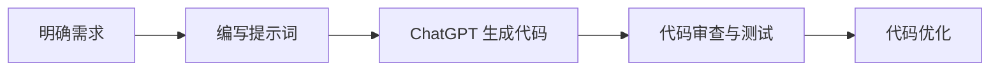

# AIGC从入门到实战：利用 ChatGPT 来生成前后端代码

作者：禅与计算机程序设计艺术

## 1. 背景介绍

### 1.1 AIGC的兴起与发展

近年来，随着人工智能技术的飞速发展，AIGC（Artificial Intelligence Generated Content，人工智能生成内容）逐渐走进大众视野，并展现出强大的内容创作能力。从最初的文本生成、图像生成，到如今的代码生成、视频生成，AIGC 正以前所未有的速度颠覆着各行各业的内容生产方式。

### 1.2 ChatGPT：引领代码生成革命

作为 OpenAI 开发的大型语言模型，ChatGPT 在代码生成领域展现出惊人的能力。凭借其强大的自然语言处理能力和海量的代码库训练数据，ChatGPT 能够理解用户的需求，并生成高质量、可执行的代码。

### 1.3 本文目标与意义

本文旨在帮助读者快速入门 AIGC 代码生成，并通过实战案例，详细介绍如何利用 ChatGPT 生成前后端代码，从而提高开发效率，降低开发成本。

## 2. 核心概念与联系

### 2.1 AIGC 代码生成

AIGC 代码生成是指利用人工智能技术自动生成代码的过程。其核心原理是通过训练模型学习大量的代码数据，并根据用户的输入，生成符合语法规则、语义清晰的代码。

### 2.2 ChatGPT

ChatGPT 是一种基于 Transformer 架构的大型语言模型，由 OpenAI 开发。它能够理解和生成自然语言，并可用于多种任务，包括代码生成、文本摘要、机器翻译等。

### 2.3 前后端代码

* **前端代码**：负责用户界面的开发，包括网页的结构、样式和交互逻辑。
* **后端代码**：负责处理业务逻辑、数据存储和访问等功能，为前端提供数据支持。

### 2.4 核心概念之间的联系

AIGC 代码生成技术为开发者提供了一种全新的代码编写方式，而 ChatGPT 作为一种强大的 AIGC 工具，能够帮助开发者快速生成高质量的前后端代码。

## 3. 核心算法原理具体操作步骤

### 3.1 ChatGPT 代码生成原理

ChatGPT 的代码生成基于 Transformer 架构，并采用自回归语言模型的方式进行训练。其核心原理是：

1. **编码器-解码器结构**：ChatGPT 使用编码器-解码器结构，将输入的文本编码为向量表示，并使用解码器生成目标代码。
2. **自注意力机制**：Transformer 架构中的自注意力机制能够捕捉输入文本中不同位置之间的语义关系，从而生成更准确的代码。
3. **海量代码数据训练**：ChatGPT 使用海量的代码数据进行训练，学习代码的语法规则、语义信息和编程规范。

### 3.2 利用 ChatGPT 生成代码的步骤

1. **明确需求**：首先，明确需要生成的代码功能、输入输出和相关技术栈。
2. **编写提示词**：使用清晰、简洁的语言描述代码需求，并将其作为 ChatGPT 的输入。
3. **生成代码**：ChatGPT 会根据输入的提示词，生成符合需求的代码。
4. **代码审查与测试**：对生成的代码进行审查和测试，确保其正确性、可读性和性能。
5. **代码优化**：根据实际情况，对生成的代码进行优化，提高代码质量。

## 4. 数学模型和公式详细讲解举例说明

### 4.1 Transformer 架构

Transformer 架构是一种基于自注意力机制的神经网络结构，其核心公式如下：

$$
\text{Attention}(Q, K, V) = \text{softmax}(\frac{QK^T}{\sqrt{d_k}})V
$$

其中：

* $Q$：查询矩阵
* $K$：键矩阵
* $V$：值矩阵
* $d_k$：键的维度

### 4.2 自回归语言模型

自回归语言模型是一种基于概率的语言模型，其核心公式如下：

$$
P(x_1, x_2, ..., x_n) = \prod_{i=1}^n P(x_i | x_1, x_2, ..., x_{i-1})
$$

其中：

* $x_i$：第 $i$ 个词
* $P(x_i | x_1, x_2, ..., x_{i-1})$：在已知前面词的情况下，第 $i$ 个词出现的概率

### 4.3 举例说明

假设我们需要生成一段 Python 代码，用于计算两个数的和。我们可以使用以下提示词：

```
编写一段 Python 代码，用于计算两个数的和。
```

ChatGPT 可能会生成以下代码：

```python
def sum(a, b):
  """
  计算两个数的和。

  Args:
    a: 第一个数。
    b: 第二个数。

  Returns:
    两个数的和。
  """
  return a + b
```

## 5. 项目实践：代码实例和详细解释说明

### 5.1 前端代码生成：React 组件

**需求描述**: 生成一个 React 组件，用于显示用户列表。

**提示词**:

```
生成一个 React 组件，用于显示用户列表。组件接收一个 users 数组作为参数，数组中每个元素是一个用户对象，包含 name 和 email 属性。
```

**ChatGPT 生成的代码**:

```jsx
import React from 'react';

const UserList = ({ users }) => {
  return (
    <ul>
      {users.map((user) => (
        <li key={user.email}>
          {user.name} ({user.email})
        </li>
      ))}
    </ul>
  );
};

export default UserList;
```

**代码解释**:

* 该组件使用 `map` 方法遍历 `users` 数组，并为每个用户渲染一个列表项。
* 每个列表项使用用户的 `email` 属性作为 key，并显示用户的 `name` 和 `email`。

### 5.2 后端代码生成：Node.js API

**需求描述**: 生成一个 Node.js API，用于获取用户列表。

**提示词**:

```
使用 Express 框架生成一个 Node.js API，用于获取用户列表。API 路径为 /users，请求方法为 GET。
```

**ChatGPT 生成的代码**:

```javascript
const express = require('express');
const app = express();

const users = [
  { id: 1, name: 'John Doe', email: 'john.doe@example.com' },
  { id: 2, name: 'Jane Doe', email: 'jane.doe@example.com' },
];

app.get('/users', (req, res) => {
  res.json(users);
});

app.listen(3000, () => {
  console.log('Server listening on port 3000');
});
```

**代码解释**:

* 该代码使用 `express` 框架创建了一个简单的 API。
* 当访问 `/users` 路径时，API 会返回 `users` 数组。

## 6. 实际应用场景

AIGC 代码生成在实际开发中有着广泛的应用场景，例如：

* **快速原型开发**: 利用 AIGC 快速生成代码原型，验证产品概念，提高开发效率。
* **重复性代码生成**: 自动生成重复性代码，例如数据模型、接口定义等，减少开发人员的工作量。
* **代码补全和建议**: 在编码过程中，利用 AIGC 提供代码补全和建议，提高代码质量和开发效率。
* **代码文档生成**: 自动生成代码文档，减少文档编写工作量，提高代码可维护性。

## 7. 工具和资源推荐

### 7.1 ChatGPT

* **网址**: https://chat.openai.com/

### 7.2 GitHub Copilot

* **网址**: https://copilot.github.com/

### 7.3 Tabnine

* **网址**: https://www.tabnine.com/

## 8. 总结：未来发展趋势与挑战

### 8.1 未来发展趋势

* **更强大的代码生成能力**: 随着 AIGC 技术的不断发展，代码生成模型的生成能力将会越来越强大，能够生成更加复杂、高质量的代码。
* **更广泛的应用场景**: AIGC 代码生成将会应用于更多的开发场景，例如移动应用开发、游戏开发等。
* **更智能的代码助手**: AIGC 代码生成工具将会更加智能化，能够根据用户的编码习惯和项目需求，提供更加个性化的代码建议和帮助。

### 8.2 面临的挑战

* **代码质量和安全性**: AIGC 生成的代码需要经过严格的测试和审查，确保其质量和安全性。
* **伦理和法律问题**: AIGC 代码生成技术的使用需要遵守相关的伦理和法律规范，例如版权问题、数据安全问题等。

## 9. 附录：常见问题与解答

### 9.1 如何提高 ChatGPT 代码生成的质量？

* 使用清晰、简洁的语言描述代码需求。
* 提供尽可能详细的上下文信息，例如代码库、技术栈等。
* 对生成的代码进行审查和测试，及时反馈问题。

### 9.2 AIGC 代码生成会取代程序员吗？

AIGC 代码生成技术旨在辅助程序员提高开发效率，而不是取代程序员。程序员仍然需要具备扎实的编程基础和解决问题的能力。


## 10. Mermaid 流程图


