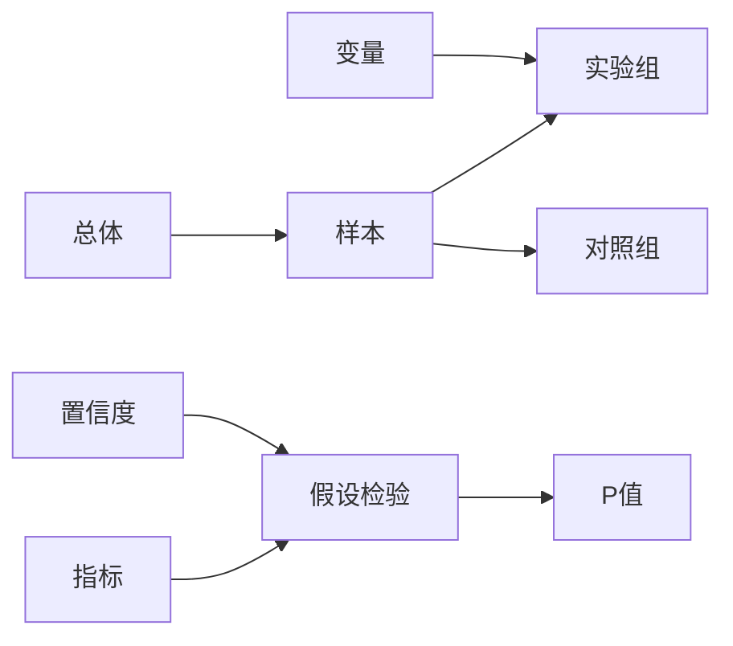

# AI系统A/B测试原理与代码实战案例讲解

作者：禅与计算机程序设计艺术

## 1. 背景介绍

### 1.1. A/B测试概述

在互联网产品开发迭代过程中，为了更加科学、客观地评估产品功能、设计、算法等方面的改进效果，A/B测试成为了不可或缺的一环。简单来说，A/B测试就是将用户随机分成两组或多组，然后分别展示不同版本的页面或功能，通过收集和分析用户行为数据，最终判断哪个版本的效果更好。

### 1.2. AI系统A/B测试的必要性

随着人工智能技术的快速发展，越来越多的AI系统被应用于各个领域，例如推荐系统、搜索引擎、机器翻译等等。然而，由于AI系统的复杂性，即使是微小的改动也可能对最终效果产生巨大影响。因此，在AI系统开发过程中进行A/B测试显得尤为重要，可以帮助我们：

* **验证假设:** 确认新的算法、模型或特征工程是否能够带来预期的效果提升。
* **优化参数:** 找到模型超参数、特征权重等的最优配置，最大化模型性能。
* **比较不同方案:**  在多个备选方案中选择最优方案，例如不同模型架构、不同数据预处理方法等。
* **持续改进:**  通过A/B测试不断迭代优化AI系统，提升用户体验和业务指标。

### 1.3. AI系统A/B测试面临的挑战

相比于传统的软件工程，AI系统A/B测试面临着一些独特的挑战：

* **样本量需求大:**  由于AI系统通常涉及大量用户和数据，为了得到 statistically significant 的结果，需要更大的样本量。
* **实验周期长:**  AI模型训练和评估需要耗费大量时间，导致A/B测试周期较长。
* **指标选取困难:**  AI系统的评价指标往往比较复杂，需要结合业务目标和用户行为进行综合考虑。
* **结果解释性:**  如何解释A/B测试结果，以及如何将实验结果应用于实际产品改进，也是一个挑战。


## 2. 核心概念与联系

### 2.1. 核心概念

* **总体:**  进行A/B测试的目标用户群体。
* **样本:**  从总体中随机抽取的一部分用户，用于参与A/B测试。
* **实验组:**  接受新版本产品或功能的用户组。
* **对照组:**  接受旧版本产品或功能的用户组。
* **变量:**  在A/B测试中，我们想要改变的因素，例如算法、模型、UI设计等。
* **指标:**  用于衡量A/B测试效果的指标，例如点击率、转化率、用户留存率等。
* **假设检验:**  用于判断实验组和对照组之间是否存在显著差异的统计学方法。
* **置信度:**  表示A/B测试结果的可信程度，通常设置为95%或99%。
* **P值:**  表示在原假设成立的情况下，观察到当前实验结果或更极端结果的概率。


### 2.2. 联系

下图展示了A/B测试中各个核心概念之间的联系：



## 3. 核心算法原理具体操作步骤

### 3.1.  确定实验目标和指标

在进行A/B测试之前，首先需要明确实验目标，例如提升点击率、提高转化率、增加用户留存等。然后，需要根据实验目标选择合适的指标来衡量实验效果。

### 3.2.  设计实验方案

实验方案设计包括以下几个方面：

* **确定实验组和对照组:**  将用户随机分配到实验组和对照组，确保两组用户在统计学意义上是相似的。
* **选择变量:**  确定要改变的因素，例如算法、模型、UI设计等。
* **确定样本量:**  根据实验目标、指标和预期效果，计算所需的样本量，确保实验结果具有统计显著性。
* **设置实验周期:**  根据实验目标和指标，设置合理的实验周期，确保收集到足够的数据。

### 3.3.  进行数据收集

在实验过程中，需要收集用户行为数据，例如点击、浏览、购买等。

### 3.4.  数据分析

实验结束后，需要对收集到的数据进行分析，判断实验组和对照组之间是否存在显著差异。常用的统计学方法包括：

* **假设检验:**  例如t检验、卡方检验等。
* **置信区间:**  计算指标的置信区间，判断实验组和对照组之间是否存在重叠。

### 3.5.  结果解释和应用

根据数据分析结果，判断实验组和对照组之间是否存在显著差异，以及差异的大小和方向。如果实验组的效果显著优于对照组，则可以将新版本产品或功能上线；否则，需要重新设计实验方案或放弃改进。


## 4. 数学模型和公式详细讲解举例说明

### 4.1. 假设检验

假设检验是A/B测试中常用的统计学方法，用于判断实验组和对照组之间是否存在显著差异。

**零假设(H0):** 实验组和对照组之间没有显著差异。

**备择假设(H1):** 实验组和对照组之间存在显著差异。

**检验统计量:**  用于衡量实验组和对照组之间差异大小的统计量。

**P值:**  表示在原假设成立的情况下，观察到当前实验结果或更极端结果的概率。

**决策规则:**  

* 如果P值小于显著性水平(α)，则拒绝原假设，接受备择假设，认为实验组和对照组之间存在显著差异。
* 如果P值大于等于显著性水平(α)，则不拒绝原假设，认为实验组和对照组之间没有显著差异。

**举例说明:**

假设我们要测试一个新的推荐算法是否能够提升用户点击率。我们将用户随机分成两组，实验组使用新的推荐算法，对照组使用旧的推荐算法。实验结束后，我们收集到以下数据：

| 组别 | 样本量 | 点击用户数 | 点击率 |
|---|---|---|---|
| 实验组 | 1000 | 200 | 20% |
| 对照组 | 1000 | 150 | 15% |

我们可以使用**双样本t检验**来判断实验组和对照组之间是否存在显著差异。

**检验统计量:**

$$t = \frac{\bar{x_1} - \bar{x_2}}{\sqrt{\frac{s_1^2}{n_1} + \frac{s_2^2}{n_2}}}$$

其中：

* $\bar{x_1}$: 实验组的样本均值
* $\bar{x_2}$: 对照组的样本均值
* $s_1$: 实验组的样本标准差
* $s_2$: 对照组的样本标准差
* $n_1$: 实验组的样本量
* $n_2$: 对照组的样本量

**计算:**

```
t = (0.2 - 0.15) / sqrt((0.2 * 0.8 / 1000) + (0.15 * 0.85 / 1000)) = 3.16
```

**查表:**

查t分布表，自由度为1998，α=0.05，得到t临界值为1.96。

**决策:**

由于t=3.16 > 1.96，因此拒绝原假设，接受备择假设，认为实验组的点击率显著高于对照组。


### 4.2. 置信区间

置信区间是用来估计总体参数的一个范围，通常表示为点估计值 ± 边际误差。

**置信水平:**  表示置信区间的可信程度，通常设置为95%或99%。

**边际误差:**  表示置信区间的大小，取决于样本量、置信水平和样本标准差。

**举例说明:**

假设我们要估计一个网站的平均访问时长。我们随机抽取了1000个用户，计算得到样本均值为5分钟，样本标准差为2分钟。

我们可以使用以下公式计算95%置信区间的边际误差：

```
Margin of Error = Z * (Standard Deviation / sqrt(Sample Size))
```

其中：

* Z: 对应于置信水平的标准正态分布的分位数，95%置信水平对应的Z值为1.96
* Standard Deviation: 样本标准差
* Sample Size: 样本量

**计算:**

```
Margin of Error = 1.96 * (2 / sqrt(1000)) = 0.124
```

因此，该网站平均访问时长的95%置信区间为 [4.876, 5.124] 分钟。

## 5. 项目实践：代码实例和详细解释说明

### 5.1. Python代码实现A/B测试

```python
import numpy as np
from scipy import stats

# 生成模拟数据
np.random.seed(42)
control_group = np.random.normal(loc=10, scale=2, size=1000)
treatment_group = np.random.normal(loc=10.5, scale=2, size=1000)

# 进行t检验
t_statistic, p_value = stats.ttest_ind(control_group, treatment_group)

# 打印结果
print(f"T-statistic: {t_statistic:.4f}")
print(f"P-value: {p_value:.4f}")

# 判断是否拒绝原假设
alpha = 0.05
if p_value < alpha:
    print("Reject null hypothesis: There is a significant difference between the two groups.")
else:
    print("Fail to reject null hypothesis: There is no significant difference between the two groups.")
```

### 5.2. 代码解释

* 首先，我们使用`numpy`库生成模拟数据，分别代表对照组和实验组的指标数据。
* 然后，我们使用`scipy.stats`模块中的`ttest_ind`函数进行双样本t检验。
* 最后，我们打印t统计量和p值，并根据预先设定的显著性水平判断是否拒绝原假设。

### 5.3. 实际应用

在实际应用中，我们可以将上述代码集成到A/B测试平台中，用于自动化地进行数据分析和结果判断。例如，我们可以使用以下步骤构建一个简单的A/B测试平台：

1. **创建实验:**  定义实验名称、目标、指标、变量等信息。
2. **分配流量:**  将用户随机分配到实验组和对照组。
3. **收集数据:**  记录用户行为数据，例如点击、浏览、购买等。
4. **数据分析:**  使用统计学方法分析数据，判断实验组和对照组之间是否存在显著差异。
5. **结果展示:**  以图表或报表的形式展示实验结果。


## 6. 实际应用场景

A/B测试可以应用于各种AI系统，例如：

* **推荐系统:**  测试不同的推荐算法、模型或特征工程，以提升点击率、转化率或用户留存率。
* **搜索引擎:**  测试不同的排序算法、相关性模型或查询理解模型，以提升搜索结果的质量和用户满意度。
* **机器翻译:**  测试不同的翻译模型、数据预处理方法或解码算法，以提升翻译质量。
* **自然语言处理:**  测试不同的文本分类模型、情感分析模型或命名实体识别模型，以提升模型的准确率和召回率。


## 7. 工具和资源推荐

* **Google Optimize:**  Google提供的免费A/B测试工具，可以与Google Analytics集成使用。
* **Optimizely:**  商业化的A/B测试平台，提供更强大的功能和服务。
* **VWO:**  国内的A/B测试平台，提供中文界面和技术支持。


## 8. 总结：未来发展趋势与挑战

### 8.1. 未来发展趋势

* **自动化A/B测试:**  随着机器学习技术的进步，未来A/B测试将会更加自动化，例如自动选择变量、自动调整流量分配比例、自动分析数据等。
* **多变量测试:**  传统的A/B测试只改变一个变量，而多变量测试可以同时改变多个变量，可以更全面地评估不同因素的影响。
* **个性化A/B测试:**  根据用户的特征和行为，将用户分配到不同的实验组，可以更精准地评估产品改进的效果。

### 8.2. 面临的挑战

* **数据安全和隐私保护:**  A/B测试需要收集和分析用户数据，如何保护用户数据安全和隐私是一个重要挑战。
* **实验结果的可解释性:**  随着AI系统越来越复杂，如何解释A/B测试结果，以及如何将实验结果应用于实际产品改进，也是一个挑战。
* **伦理问题:**  A/B测试可能会对用户行为产生影响，例如操纵用户情绪、引导用户消费等，如何避免伦理问题也是一个挑战。


## 9. 附录：常见问题与解答

### 9.1.  A/B测试和机器学习是什么关系？

A/B测试可以看作是机器学习模型评估的一种方法。在机器学习中，我们通常会使用训练集和测试集来评估模型性能。A/B测试可以看作是一种在线评估方法，使用真实用户数据来评估模型性能。

### 9.2.  A/B测试需要多少样本量？

A/B测试所需的样本量取决于多个因素，例如实验目标、指标、预期效果、置信水平等。可以使用统计学公式或在线工具来计算所需的样本量。

### 9.3.  A/B测试的结果一定是可靠的吗？

A/B测试的结果不一定总是可靠的，可能受到多种因素的影响，例如样本偏差、实验周期、外部因素等。为了提高A/B测试结果的可靠性，需要注意以下几点：

* 确保实验组和对照组的用户在统计学意义上是相似的。
* 设置合理的实验周期，确保收集到足够的数据。
* 尽量排除外部因素的干扰。

### 9.4.  如何选择合适的A/B测试工具？

选择A/B测试工具需要考虑多个因素，例如功能、价格、易用性、技术支持等。可以参考市场调研报告或用户评价来选择合适的工具。
