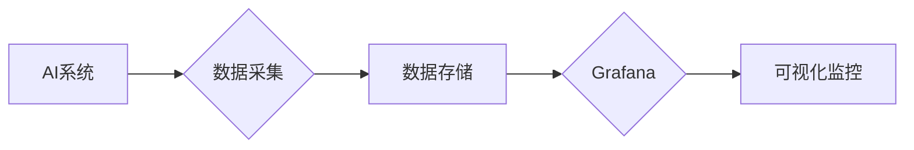

# AI系统Grafana原理与代码实战案例讲解

作者：禅与计算机程序设计艺术

## 1. 背景介绍

### 1.1  AI系统监控的重要性与挑战

近年来，人工智能(AI)技术发展迅速，已经在各个领域得到广泛应用。随着AI系统规模和复杂性的不断提高，如何有效地监控AI系统的运行状态、性能指标以及潜在问题，成为AI系统运维管理中至关重要的环节。

传统的IT系统监控工具往往难以满足AI系统的特殊需求。AI系统通常具有以下特点：

* **数据量大、维度高：** AI系统训练和推理过程中会产生海量数据，涉及各种特征和参数。
* **模型复杂、逻辑抽象：**  AI系统通常基于复杂的机器学习算法，模型结构和逻辑难以理解和解释。
* **实时性要求高：**  AI系统需要实时响应用户请求，对监控系统的延迟和性能要求很高。

因此，我们需要专门针对AI系统特点设计的监控工具和方法，才能有效保障AI系统的稳定运行和高效性能。

### 1.2 Grafana：可视化监控利器

Grafana是一款开源的、功能强大的数据可视化和监控工具，它可以连接多种数据源，并通过灵活的仪表盘和图表展示数据，帮助用户直观地了解系统的运行状态。

Grafana具有以下优点：

* **丰富的可视化方式：**  Grafana支持多种图表类型，包括曲线图、柱状图、饼图、热力图等，可以满足不同场景下的数据可视化需求。
* **灵活的数据源支持：**  Grafana可以连接多种数据源，例如Prometheus、InfluxDB、Elasticsearch等，方便用户收集和整合来自不同系统的监控数据。
* **强大的告警功能：**  Grafana支持设置阈值告警，当监控指标超过预设范围时，可以及时通知管理员处理。
* **易于部署和使用：**  Grafana安装简单，配置灵活，用户可以通过Web界面轻松创建和管理仪表盘。

### 1.3 本文目标

本文将深入探讨如何利用Grafana构建AI系统监控平台，并通过代码实战案例，帮助读者掌握使用Grafana监控AI系统的核心技巧。

## 2. 核心概念与联系

### 2.1 监控指标体系

构建AI系统监控平台的第一步是建立完善的监控指标体系。AI系统监控指标可以分为以下几类：

* **系统指标：**  反映AI系统整体运行状态的指标，例如CPU使用率、内存占用率、磁盘IO等。
* **模型指标：**  反映AI模型性能的指标，例如准确率、召回率、F1值、AUC等。
* **业务指标：**  反映AI系统业务效果的指标，例如用户转化率、点击率、订单量等。

### 2.2 数据采集与存储

为了实时监控AI系统的运行状态，我们需要收集和存储相关的监控数据。常用的数据采集工具包括：

* **Prometheus：**  一款开源的系统监控和告警工具，支持多种数据采集方式，例如Exporter、Pushgateway等。
* **StatsD：**  一个简单灵活的网络守护进程，可以收集应用程序的指标数据，并将其发送到后端存储系统。
* **Fluentd：**  一个开源的日志收集、处理和转发工具，可以收集来自各种数据源的日志数据，并将其发送到后端存储系统。

常用的数据存储系统包括：

* **InfluxDB：**  一款开源的时序数据库，适合存储大量的监控数据。
* **OpenTSDB：**  基于HBase的分布式时序数据库，可以存储海量的监控数据。
* **Elasticsearch：**  一个分布式搜索和分析引擎，也可以用于存储和查询监控数据。

### 2.3 Grafana可视化

Grafana可以连接多种数据源，并将数据以图表的形式展示出来。在Grafana中，我们可以创建仪表盘，并将多个图表添加到仪表盘中，以便于集中监控多个指标。

### 2.4 核心概念联系

下图展示了AI系统监控平台的核心概念及其联系：



## 3. 核心算法原理具体操作步骤

### 3.1 使用Prometheus采集AI系统指标

Prometheus是一个开源的系统监控和告警工具，它可以通过Exporter、Pushgateway等方式采集AI系统的指标数据。

#### 3.1.1 安装Prometheus

```
# 下载Prometheus
wget https://github.com/prometheus/prometheus/releases/download/v2.31.1/prometheus-2.31.1.linux-amd64.tar.gz

# 解压
tar xvfz prometheus-2.31.1.linux-amd64.tar.gz

# 进入目录
cd prometheus-2.31.1.linux-amd64
```

#### 3.1.2 配置Prometheus

编辑`prometheus.yml`文件，添加以下内容：

```yaml
global:
  scrape_interval:     15s # 默认抓取间隔
  evaluation_interval: 15s # 默认规则评估间隔

  # Alertmanager configuration
  alerting:
    alertmanagers:
    - static_configs:
      - targets:
        # - alertmanager:9093

# A scrape configuration containing exactly one endpoint to scrape:
# Here it points to itself.
scrape_configs:
  # The job name is added as a label `job=<job_name>` to any timeseries scraped from this config.
  - job_name: 'prometheus'

    # metrics_path defaults to '/metrics'
    # scheme defaults to 'http'.

    static_configs:
    - targets: ['localhost:9090']

  - job_name: 'ai_system'
    static_configs:
    - targets: ['localhost:8080']
```

其中，`ai_system`是我们要监控的AI系统的名称，`localhost:8080`是AI系统暴露指标数据的端口。

#### 3.1.3 启动Prometheus

```
./prometheus --config.file=prometheus.yml
```

### 3.2 使用Grafana可视化AI系统指标

#### 3.2.1 安装Grafana

```
# 下载Grafana
wget https://dl.grafana.com/oss/release/grafana-8.3.3.linux-amd64.tar.gz

# 解压
tar xvfz grafana-8.3.3.linux-amd64.tar.gz

# 进入目录
cd grafana-8.3.3
```

#### 3.2.2 启动Grafana

```
./bin/grafana-server web
```

#### 3.2.3 配置Grafana数据源

打开浏览器，访问`http://localhost:3000`，使用默认用户名和密码`admin/admin`登录Grafana。

点击左侧菜单栏的"Configuration" -> "Data Sources"，点击"Add data source"按钮，选择"Prometheus"数据源类型。

在"URL"字段中输入Prometheus的地址，例如`http://localhost:9090`，点击"Save & Test"按钮，测试连接是否成功。

#### 3.2.4 创建Grafana仪表盘

点击左侧菜单栏的"+" -> "Dashboard"，创建一个新的仪表盘。

点击"Add panel"按钮，添加一个新的图表。

在"Query"选项卡中，选择Prometheus数据源，并输入要查询的指标名称，例如`node_cpu_seconds_total`。

在"Visualization"选项卡中，选择图表类型，例如"Graph"。

在"General"选项卡中，设置图表的标题、单位等信息。

重复以上步骤，添加更多图表，构建完整的AI系统监控仪表盘。

## 4. 数学模型和公式详细讲解举例说明

### 4.1  AI系统性能指标计算公式

* **准确率 (Accuracy):**  $Accuracy = \frac{TP + TN}{TP + TN + FP + FN}$
* **精确率 (Precision):**  $Precision = \frac{TP}{TP + FP}$
* **召回率 (Recall):**  $Recall = \frac{TP}{TP + FN}$
* **F1值 (F1-score):**  $F1 = 2 * \frac{Precision * Recall}{Precision + Recall}$
* **AUC (Area Under the Curve):**  ROC曲线下的面积，用于衡量分类器对正负样本的区分能力。

其中：

* TP (True Positive):  将正样本预测为正样本的数量。
* TN (True Negative):  将负样本预测为负样本的数量。
* FP (False Positive):  将负样本预测为正样本的数量。
* FN (False Negative):  将正样本预测为负样本的数量。

### 4.2  举例说明

假设我们有一个图像分类模型，用于识别猫和狗的图片。我们用100张图片测试模型，其中50张是猫的图片，50张是狗的图片。模型的预测结果如下：

| 真实类别 | 预测类别 | 数量 |
|---|---|---|
| 猫 | 猫 | 45 |
| 猫 | 狗 | 5 |
| 狗 | 猫 | 10 |
| 狗 | 狗 | 40 |

根据以上数据，我们可以计算出模型的各项性能指标：

* **准确率 (Accuracy):**  $(45 + 40) / (45 + 40 + 5 + 10) = 0.85$
* **精确率 (Precision):**  $45 / (45 + 10) = 0.818$
* **召回率 (Recall):**  $45 / (45 + 5) = 0.9$
* **F1值 (F1-score):**  $2 * (0.818 * 0.9) / (0.818 + 0.9) = 0.857$

## 5. 项目实践：代码实例和详细解释说明

### 5.1 使用Flask构建简单的AI服务

```python
from flask import Flask, request, jsonify

app = Flask(__name__)

@app.route('/predict', methods=['POST'])
def predict():
    # 获取请求数据
    data = request.get_json()

    # 进行预测
    # ...

    # 返回预测结果
    return jsonify({'prediction': prediction})

if __name__ == '__main__':
    app.run(host='0.0.0.0', port=8080)
```

### 5.2 使用Prometheus client library暴露指标数据

```python
from flask import Flask, request, jsonify
from prometheus_client import Counter, Gauge, Summary, start_http_server

app = Flask(__name__)

# 创建指标
REQUEST_COUNT = Counter('request_count', 'Total request count')
PREDICTION_LATENCY = Summary('prediction_latency_seconds', 'Prediction latency in seconds')
PREDICTION_ACCURACY = Gauge('prediction_accuracy', 'Prediction accuracy')

@app.route('/predict', methods=['POST'])
def predict():
    # 记录请求数量
    REQUEST_COUNT.inc()

    # 记录预测时间
    with PREDICTION_LATENCY.time():
        # 进行预测
        # ...

    # 记录预测准确率
    PREDICTION_ACCURACY.set(accuracy)

    # 返回预测结果
    return jsonify({'prediction': prediction})

if __name__ == '__main__':
    # 启动Prometheus HTTP server
    start_http_server(8000)

    # 启动Flask app
    app.run(host='0.0.0.0', port=8080)
```

### 5.3 使用Grafana可视化指标数据

按照第3.2节的步骤配置Grafana数据源，并创建仪表盘，添加以下图表：

* **请求数量：**  使用`sum(rate(request_count[1m]))`查询每分钟的请求数量。
* **预测延迟：**  使用`histogram_quantile(0.95, sum(rate(prediction_latency_seconds_bucket[1m])))`查询95分位的预测延迟。
* **预测准确率：**  使用`avg(prediction_accuracy)`查询平均预测准确率。

## 6. 实际应用场景

### 6.1  实时监控模型性能

在实际应用中，我们可以使用Grafana实时监控AI模型的性能指标，例如准确率、召回率、F1值等。当模型性能出现异常波动时，可以及时发现并处理问题，例如调整模型参数、增加训练数据等。

### 6.2  分析模型性能瓶颈

Grafana可以帮助我们分析AI模型的性能瓶颈。例如，我们可以通过监控模型推理时间，找出模型中耗时最长的部分，然后针对性地进行优化，例如使用模型压缩技术、优化代码等。

### 6.3  评估模型迭代效果

在模型迭代过程中，我们可以使用Grafana对比不同版本模型的性能指标，评估模型迭代的效果。例如，我们可以比较新版本模型和旧版本模型的准确率、召回率等指标，判断新版本模型是否带来了性能提升。

## 7. 总结：未来发展趋势与挑战

### 7.1  未来发展趋势

* **更加智能化的监控：**  未来，AI系统监控平台将会更加智能化，例如自动识别异常指标、自动分析问题根因等。
* **更加一体化的监控：**  AI系统监控平台将会与其他运维管理工具更加紧密地集成，例如日志分析工具、告警平台等。
* **更加云原生的监控：**  随着云计算的普及，AI系统监控平台将会更加云原生化，例如支持Kubernetes、Serverless等云平台。

### 7.2  挑战

* **海量数据的处理：**  AI系统通常会产生海量的监控数据，如何高效地存储、查询和分析这些数据是一个挑战。
* **复杂模型的可解释性：**  AI模型通常非常复杂，如何解释模型的预测结果以及模型内部的运行机制是一个挑战。
* **监控指标的标准化：**  目前，AI系统监控指标还没有统一的标准，这给不同平台之间的监控数据共享和比较带来了困难。

## 8. 附录：常见问题与解答

### 8.1  如何配置Prometheus采集自定义指标？

可以使用Prometheus client library在应用程序中暴露自定义指标数据。例如，可以使用`Counter`、`Gauge`、`Summary`、`Histogram`等指标类型来记录应用程序的各种指标数据。

### 8.2  如何设置Grafana告警？

在Grafana中，可以为图表设置阈值告警。当监控指标超过预设范围时，Grafana可以发送告警通知到指定的渠道，例如邮件、Slack等。

### 8.3  如何排查Grafana仪表盘加载缓慢的问题？

Grafana仪表盘加载缓慢可能是由于数据量过大、查询语句复杂、网络延迟等原因导致的。可以通过优化查询语句、减少数据量、使用缓存等方法来解决。
