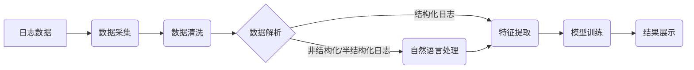

##  AI系统日志分析原理与代码实战案例讲解

作者：禅与计算机程序设计艺术

## 1. 背景介绍

### 1.1 日志数据的重要性

在当今信息爆炸的时代，海量的日志数据蕴藏着巨大的价值。对于AI系统而言，日志数据记录了系统运行的每个细节，包括用户行为、系统状态、性能指标等关键信息。通过对这些日志进行分析，我们可以洞悉系统运行的规律，及时发现并解决潜在问题，从而提升系统的稳定性、可靠性和性能。

### 1.2 AI系统日志分析的挑战

然而，AI系统日志分析也面临着诸多挑战：

* **海量数据:** AI系统通常会产生海量的日志数据，传统的分析方法难以处理如此庞大的数据量。
* **复杂关联:**  日志数据之间存在着复杂的关联关系，需要借助更高级的分析技术才能挖掘出有价值的信息。
* **实时性要求:**  对于一些关键应用场景，例如异常检测、故障诊断等，需要对日志数据进行实时分析才能及时采取行动。

### 1.3 AI技术在日志分析中的应用

近年来，人工智能技术在自然语言处理、机器学习等领域取得了突破性进展，为解决上述挑战提供了新的思路。利用AI技术，我们可以构建更加智能化的日志分析系统，实现对海量日志数据的快速、准确分析，从而更好地服务于AI系统的开发、部署和运维。


## 2. 核心概念与联系

### 2.1 日志数据结构

AI系统日志通常采用结构化、半结构化或非结构化的格式存储。

* **结构化日志**：采用预定义的字段和格式存储，例如CSV、JSON等格式。
* **半结构化日志**：具有一定的结构，但字段和格式不完全固定，例如XML、Logstash等格式。
* **非结构化日志**：没有固定的结构，例如纯文本日志。

### 2.2 日志分析流程

一个典型的AI系统日志分析流程包括以下步骤：

1. **数据采集**: 从各个数据源收集日志数据。
2. **数据清洗**: 对原始日志数据进行清洗，去除噪声和冗余信息。
3. **数据解析**: 将非结构化或半结构化日志解析为结构化数据。
4. **特征提取**: 从结构化日志中提取有意义的特征。
5. **模型训练**: 利用机器学习算法训练模型，用于异常检测、故障诊断等任务。
6. **结果展示**: 将分析结果以可视化的方式展示给用户。

### 2.3 核心概念联系

下图展示了AI系统日志分析的核心概念之间的联系：



## 3. 核心算法原理与具体操作步骤

### 3.1 数据清洗

数据清洗是日志分析的第一步，其目的是去除原始日志数据中的噪声和冗余信息，提高数据质量。常用的数据清洗方法包括：

* **去重**: 去除重复的日志记录。
* **缺失值处理**: 对缺失的字段进行填充或删除。
* **格式转换**: 将不同格式的日志数据转换为统一的格式。

### 3.2 数据解析

对于非结构化或半结构化日志，需要进行数据解析，将其转换为结构化数据才能进行后续分析。常用的数据解析方法包括：

* **正则表达式**: 利用正则表达式匹配关键信息，提取字段值。
* **基于规则的解析**:  根据预定义的规则解析日志，例如使用分隔符、关键字等。
* **基于机器学习的解析**: 利用机器学习算法自动学习日志的结构和语法，实现自动化解析。

### 3.3 特征提取

特征提取是从结构化日志中提取有意义的特征，用于后续的模型训练。常用的特征提取方法包括：

* **统计特征**:  例如日志频率、平均值、方差等。
* **时间序列特征**:  例如滑动窗口统计量、周期性分析等。
* **文本特征**:  例如词袋模型、TF-IDF等。

### 3.4 模型训练

常用的机器学习算法包括：

* **监督学习**:  例如逻辑回归、支持向量机、决策树等，用于异常检测、故障分类等任务。
* **无监督学习**:  例如聚类算法、主成分分析等，用于日志模式发现、异常检测等任务。

## 4. 数学模型和公式详细讲解举例说明

### 4.1 TF-IDF算法

TF-IDF（Term Frequency-Inverse Document Frequency）是一种常用的文本特征提取算法，用于评估一个词语对于一个文档集或语料库中的其中一份文档的重要程度。字词的重要性随着它在文件中出现的次数成正比增加，但同时会随着它在语料库中出现的频率成反比下降。

**TF**: 词频，指某个词语在当前文档中出现的频率。

$$
TF(t,d) = \frac{f_{t,d}}{\sum_{t' \in d}{f_{t',d}}}
$$

其中，$f_{t,d}$ 表示词语 $t$ 在文档 $d$ 中出现的次数，分母表示文档 $d$ 中所有词语的出现次数之和。

**IDF**: 逆文档频率，指包含某个词语的文档在所有文档中所占的比例的倒数的对数。

$$
IDF(t,D) = log \frac{|D|}{|\{d \in D: t \in d\}|}
$$

其中，$|D|$ 表示文档集 $D$ 中的文档总数，$|\{d \in D: t \in d\}|$ 表示包含词语 $t$ 的文档数量。

**TF-IDF**: 将词频和逆文档频率相乘，得到词语 $t$ 在文档 $d$ 中的 TF-IDF 值。

$$
TF-IDF(t,d,D) = TF(t,d) * IDF(t,D)
$$

### 4.2 逻辑回归算法

逻辑回归是一种常用的监督学习算法，用于二分类问题。其基本思想是找到一条直线或超平面，将不同类别的样本分开。

逻辑回归模型的假设函数为：

$$
h_{\theta}(x) = g(\theta^{T}x)
$$

其中，$x$ 是特征向量，$\theta$ 是参数向量，$g$ 是 sigmoid 函数：

$$
g(z) = \frac{1}{1+e^{-z}}
$$

逻辑回归的目标函数是最大化似然函数，可以通过梯度下降法求解参数 $\theta$。

### 4.3 案例分析

假设我们有一个电商网站的日志数据，包含用户访问的页面、商品浏览记录、购买记录等信息。我们想利用这些数据训练一个模型，用于预测用户是否会购买某个商品。

我们可以提取以下特征：

* 用户历史购买记录
* 用户浏览该商品的次数
* 用户在该商品页面停留的时间
* 用户对该商品的评价

我们可以使用逻辑回归算法训练一个模型，用于预测用户是否会购买该商品。

## 5. 项目实践：代码实例和详细解释说明

### 5.1 Python日志分析库

Python 中常用的日志分析库包括：

* **logging**: Python 自带的日志模块，可以方便地记录不同级别的日志信息。
* **logstash-python**:  Logstash 的 Python 客户端，可以将日志数据发送到 Logstash 服务器进行集中处理。
* **pandas**:  强大的数据分析库，可以方便地对结构化日志进行处理和分析。
* **scikit-learn**:  常用的机器学习库，包含各种机器学习算法的实现，可以用于日志分析模型的训练和评估。

### 5.2 代码实例

以下是一个使用 Python 进行日志分析的简单例子：

```python
import pandas as pd
from sklearn.model_selection import train_test_split
from sklearn.linear_model import LogisticRegression
from sklearn.metrics import accuracy_score

# 读取日志数据
df = pd.read_csv('log_data.csv')

# 提取特征和标签
X = df[['user_id', 'product_id', 'page_views', 'session_duration']]
y = df['purchase']

# 将数据集拆分为训练集和测试集
X_train, X_test, y_train, y_test = train_test_split(X, y, test_size=0.2)

# 创建逻辑回归模型并训练
model = LogisticRegression()
model.fit(X_train, y_train)

# 在测试集上评估模型性能
y_pred = model.predict(X_test)
accuracy = accuracy_score(y_test, y_pred)
print('Accuracy:', accuracy)
```

## 6. 实际应用场景

### 6.1 异常检测

通过分析系统日志，可以识别出异常的行为模式，例如：

* **入侵检测**:  识别出恶意用户的行为，例如暴力破解、SQL注入等。
* **欺诈检测**:  识别出欺诈交易，例如信用卡盗刷、账户盗用等。
* **故障检测**:  识别出系统故障，例如服务器宕机、网络中断等。

### 6.2 性能分析

通过分析系统日志，可以识别出性能瓶颈，例如：

* **数据库性能分析**:  识别出数据库查询缓慢的原因，例如索引缺失、查询语句不合理等。
* **应用程序性能分析**:  识别出应用程序的性能瓶颈，例如代码效率低下、资源竞争等。
* **网络性能分析**:  识别出网络延迟的原因，例如带宽不足、网络拥塞等。

### 6.3 用户行为分析

通过分析系统日志，可以了解用户的行为模式，例如：

* **用户画像**:  分析用户的兴趣爱好、消费习惯等，用于精准营销和个性化推荐。
* **产品优化**:  分析用户的使用习惯，识别出产品的改进方向。
* **市场趋势分析**:  分析用户的搜索关键词、浏览记录等，了解市场趋势。

## 7. 工具和资源推荐

### 7.1 开源日志分析平台

* **ELK Stack (Elasticsearch, Logstash, Kibana)**:  流行的开源日志分析平台，可以收集、存储、分析和可视化日志数据。
* **Graylog**:  功能强大的日志管理平台，提供日志收集、解析、存储、搜索和告警等功能。
* **Fluentd**:  开源的日志收集器，可以收集各种来源的日志数据，并将其发送到各种目的地。

### 7.2 商业日志分析平台

* **Splunk**:  领先的机器数据平台，提供日志管理、安全分析、IT运营分析等功能。
* **Datadog**:  云监控平台，提供日志管理、指标监控、APM等功能。
* **Sumo Logic**:  云原生日志管理平台，提供日志收集、分析、可视化和告警等功能。

## 8. 总结：未来发展趋势与挑战

### 8.1 未来发展趋势

* **人工智能技术将更加深入地应用于日志分析领域**:  例如自然语言处理技术可以用于自动化日志解析，深度学习技术可以用于更精准的异常检测。
* **日志分析平台将更加智能化和自动化**:  例如自动发现异常、自动生成报告等。
* **日志数据将与其他数据源进行融合分析**:  例如将日志数据与业务数据、用户数据等进行关联分析，可以获得更全面的洞察。

### 8.2 面临的挑战

* **数据隐私和安全**:  日志数据中可能包含敏感信息，需要采取措施保护数据隐私和安全。
* **数据规模和复杂性**:  随着数据量的不断增长和数据结构的日益复杂，日志分析面临着更大的挑战。
* **人才缺口**:  日志分析需要具备跨学科的知识和技能，人才缺口较大。

## 9.  附录：常见问题与解答

### 9.1 如何选择合适的日志分析工具？

选择合适的日志分析工具需要考虑以下因素：

* **数据量和数据源**:  不同的工具适用于不同的数据量和数据源。
* **功能需求**:  不同的工具提供不同的功能，例如日志收集、解析、存储、搜索、告警等。
* **成本**:  开源工具免费使用，但需要自己搭建和维护；商业工具功能更强大，但需要付费使用。

### 9.2 如何保护日志数据的安全？

保护日志数据的安全可以采取以下措施：

* **访问控制**:  限制对日志数据的访问权限，只允许授权用户访问。
* **数据加密**:  对敏感的日志数据进行加密存储和传输。
* **安全审计**:  记录对日志数据的访问和操作记录，以便于追溯和审计。

### 9.3 如何学习日志分析？

学习日志分析可以参考以下资源：

* **官方文档**:  各个日志分析工具的官方文档都提供了详细的介绍和使用说明。
* **在线教程**:  网上有很多关于日志分析的在线教程，例如博客、视频等。
* **书籍**:  市面上有很多关于日志分析的书籍，例如《日志分析实战》、《Elasticsearch权威指南》等。