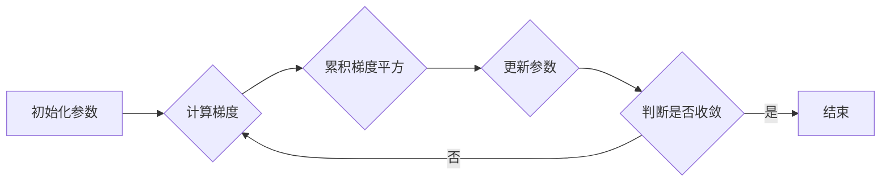

# AdaGrad优化算法原理与代码实战案例讲解

作者：禅与计算机程序设计艺术

## 1. 背景介绍

### 1.1 梯度下降算法的困境
梯度下降算法是机器学习和深度学习中常用的优化算法之一，它通过迭代地调整参数来最小化损失函数。然而，传统的梯度下降算法在处理高维稀疏数据时 often 遇到以下挑战：

* **学习率困境:**  学习率是一个非常重要的超参数，它决定了参数更新的步长。如果学习率设置过大，算法可能会在最优解附近震荡，甚至发散；而学习率设置过小，算法收敛速度会很慢。
* **稀疏特征的更新:** 在处理自然语言处理或推荐系统等高维稀疏数据时，很多特征出现的频率很低。传统的梯度下降算法对所有特征使用相同的学习率进行更新，这会导致稀疏特征的更新非常缓慢，甚至无法得到有效训练。

### 1.2 AdaGrad算法的优势
为了解决上述问题，John Duchi 等人于 2011 年提出了 AdaGrad (Adaptive Gradient Algorithm) 算法。AdaGrad 是一种自适应优化算法，它可以为每个参数设置不同的学习率，从而更好地处理高维稀疏数据。

AdaGrad 算法的主要优势在于：

* **自适应学习率:** AdaGrad 会根据历史梯度的大小来自动调整每个参数的学习率。对于出现频率较低的稀疏特征，AdaGrad 会为其分配更大的学习率，从而加快其更新速度；而对于出现频率较高的稠密特征，AdaGrad 会为其分配较小的学习率，以避免震荡。
* **无需手动调整学习率:**  AdaGrad 不需要手动设置学习率，这大大简化了调参过程。

## 2. 核心概念与联系

### 2.1 梯度累积
AdaGrad 算法的核心思想是利用历史梯度信息来调整学习率。具体来说，AdaGrad 会累积每个参数的历史梯度的平方和，并将其作为分母来调整学习率。

### 2.2 学习率衰减
由于 AdaGrad 会不断累积历史梯度的平方和，因此随着迭代次数的增加，学习率会逐渐衰减。这种学习率衰减策略可以有效地防止算法在最优解附近震荡。

## 3. 核心算法原理具体操作步骤

AdaGrad 算法的具体操作步骤如下：

1. **初始化参数:**  将模型的参数初始化为随机值。
2. **迭代更新:**  重复以下步骤，直到满足停止条件：
    * 计算梯度:  计算损失函数关于当前参数的梯度。
    * 累积梯度平方:  将当前梯度的平方加到历史梯度的平方和中。
    * 更新参数:  使用调整后的学习率更新参数。

### 3.1 算法流程图



### 3.2 参数更新公式
AdaGrad 算法的参数更新公式如下：

$$
\theta_{t+1, i} = \theta_{t, i} - \frac{\eta}{\sqrt{G_{t, ii} + \epsilon}} \cdot g_{t, i}
$$

其中：

* $\theta_{t, i}$ 表示第 $t$ 次迭代时参数 $\theta_i$ 的值。
* $\eta$ 表示初始学习率。
* $G_{t, ii}$ 表示第 $t$ 次迭代时参数 $\theta_i$ 的历史梯度平方和。
* $\epsilon$ 是一个很小的常数，用于避免除以零。
* $g_{t, i}$ 表示第 $t$ 次迭代时损失函数关于参数 $\theta_i$ 的梯度。

## 4. 数学模型和公式详细讲解举例说明

### 4.1 梯度累积的意义
AdaGrad 算法通过累积历史梯度的平方和来调整学习率。对于出现频率较低的稀疏特征，其历史梯度平方和较小，因此 AdaGrad 会为其分配更大的学习率，从而加快其更新速度。而对于出现频率较高的稠密特征，其历史梯度平方和较大，因此 AdaGrad 会为其分配较小的学习率，以避免震荡。

### 4.2 学习率衰减的影响
随着迭代次数的增加，AdaGrad 的学习率会逐渐衰减。这是因为历史梯度平方和会不断累积，导致分母越来越大。学习率衰减可以有效地防止算法在最优解附近震荡。

### 4.3 公式推导
AdaGrad 算法的参数更新公式可以从梯度下降算法的参数更新公式推导而来。梯度下降算法的参数更新公式如下：

$$
\theta_{t+1} = \theta_t - \eta \cdot g_t
$$

将学习率 $\eta$ 替换为 $\frac{\eta}{\sqrt{G_t + \epsilon}}$，即可得到 AdaGrad 算法的参数更新公式。

## 5. 项目实践：代码实例和详细解释说明

### 5.1 Python 代码实现

```python
import numpy as np

class Adagrad:
    def __init__(self, learning_rate=0.01, epsilon=1e-8):
        self.learning_rate = learning_rate
        self.epsilon = epsilon
        self.accumulated_squared_gradients = None

    def update(self, params, grads):
        if self.accumulated_squared_gradients is None:
            self.accumulated_squared_gradients = np.zeros_like(params)

        self.accumulated_squared_gradients += grads ** 2
        params -= self.learning_rate * grads / np.sqrt(self.accumulated_squared_gradients + self.epsilon)

        return params
```

### 5.2 代码解释
* `__init__()` 方法用于初始化 AdaGrad 优化器的学习率、epsilon 和累积梯度平方和。
* `update()` 方法用于更新模型的参数。
    * 首先，判断累积梯度平方和是否为空。如果为空，则将其初始化为零矩阵。
    * 然后，将当前梯度的平方加到累积梯度平方和中。
    * 最后，使用调整后的学习率更新参数。

### 5.3 使用示例

```python
# 初始化模型参数
params = np.random.randn(10)

# 创建 AdaGrad 优化器
optimizer = Adagrad(learning_rate=0.1)

# 迭代训练模型
for i in range(1000):
    # 计算梯度
    grads = ...

    # 更新参数
    params = optimizer.update(params, grads)
```

## 6. 实际应用场景

AdaGrad 算法适用于处理高维稀疏数据，例如：

* **自然语言处理:**  在自然语言处理中，文本数据通常表示为高维稀疏向量。AdaGrad 可以有效地训练词向量模型，例如 Word2Vec 和 GloVe。
* **推荐系统:**  推荐系统的数据集通常包含大量的用户和商品，而且用户与商品之间的交互非常稀疏。AdaGrad 可以有效地训练推荐系统模型，例如协同过滤和矩阵分解。

## 7. 工具和资源推荐

* **TensorFlow:**  TensorFlow 是 Google 开源的机器学习平台，它提供了 AdaGrad 优化器的实现。
* **PyTorch:**  PyTorch 是 Facebook 开源的机器学习平台，它也提供了 AdaGrad 优化器的实现。

## 8. 总结：未来发展趋势与挑战

### 8.1 AdaGrad 算法的局限性
AdaGrad 算法的主要局限性在于：

* **学习率衰减过快:**  由于 AdaGrad 会不断累积历史梯度的平方和，因此随着迭代次数的增加，学习率会逐渐衰减。在训练后期，学习率可能会变得非常小，导致算法收敛速度变慢。
* **对初始学习率敏感:**  AdaGrad 算法对初始学习率比较敏感。如果初始学习率设置过大，算法可能会在最优解附近震荡，甚至发散。

### 8.2 未来发展趋势
为了解决 AdaGrad 算法的局限性，研究人员提出了许多改进算法，例如：

* **RMSprop:**  RMSprop 算法通过使用滑动平均来估计历史梯度的平方和，从而缓解了 AdaGrad 算法学习率衰减过快的问题。
* **Adam:**  Adam 算法结合了 Momentum 和 RMSprop 算法的优点，可以更好地处理高维稀疏数据。

### 8.3  AdaGrad 的应用
尽管 AdaGrad 算法存在一些局限性，但它仍然是一种非常有效的优化算法，尤其适用于处理高维稀疏数据。在实际应用中，我们可以根据具体的任务和数据集选择合适的优化算法。


##  9. 附录：常见问题与解答

### 9.1  为什么 AdaGrad 的学习率会单调递减？
AdaGrad 算法会在每次迭代时累加梯度的平方到历史梯度平方和中，导致分母越来越大，从而使得学习率单调递减。

### 9.2  AdaGrad 如何处理稀疏数据？
对于稀疏数据，很多特征的出现频率很低，导致其对应的梯度很小。AdaGrad 会为这些特征分配更大的学习率，从而加快其更新速度。

### 9.3  AdaGrad 与其他优化算法相比有什么优缺点？
**优点:**

* 自适应学习率，无需手动调整学习率。
* 适用于处理高维稀疏数据。

**缺点:**

* 学习率衰减过快，导致算法在训练后期收敛速度变慢。
* 对初始学习率比较敏感。 
