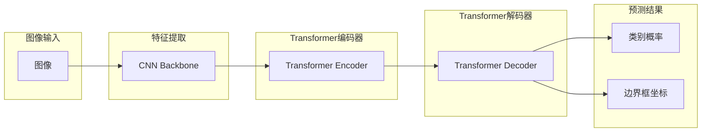

##  DETR原理与代码实例讲解

## 1. 背景介绍

### 1.1 目标检测任务的挑战

目标检测是计算机视觉领域中的一个核心任务，其目标是在图像或视频中定位并识别出不同的物体。传统的目标检测算法，如Faster R-CNN、YOLO等，通常依赖于预先定义的锚框或候选区域，这些方法存在以下几个挑战：

* **手工设计特征:** 传统的目标检测算法通常依赖于手工设计的特征，例如HOG、SIFT等，这些特征的表达能力有限，难以适应复杂多变的场景。
* **锚框的超参数:** 锚框的尺寸、比例、数量等超参数需要根据数据集进行调整，这增加了算法的复杂度和训练难度。
* **后处理操作:** 传统的目标检测算法通常需要进行非极大值抑制(NMS)等后处理操作，以去除重复的检测结果，这些操作会引入额外的计算量和延迟。

### 1.2 DETR的提出

为了解决上述挑战，Facebook AI Research团队于2020年提出了DETR (**DE**tection **TR**ansformer)，一种基于Transformer的新型目标检测算法。DETR将目标检测任务视为一个集合预测问题，并使用Transformer模型直接预测图像中所有目标的类别和边界框，无需使用锚框或候选区域。

### 1.3 DETR的优势

与传统的目标检测算法相比，DETR具有以下几个优势：

* **端到端训练:** DETR可以进行端到端的训练，无需进行多阶段的训练或后处理操作。
* **无需锚框:** DETR无需使用锚框或候选区域，避免了与锚框相关的超参数调整问题。
* **全局建模:** Transformer模型可以对图像进行全局建模，从而更好地捕捉目标之间的关系。

## 2. 核心概念与联系

### 2.1 Transformer模型

Transformer模型最初是为自然语言处理任务设计的，其核心是自注意力机制(Self-Attention)。自注意力机制允许模型关注输入序列中不同位置的信息，从而学习到序列中元素之间的依赖关系。

在DETR中，Transformer模型用于对图像特征进行编码和解码。编码器将输入图像转换为一组特征向量，解码器则根据这些特征向量预测目标的类别和边界框。

### 2.2 集合预测

DETR将目标检测任务视为一个集合预测问题，即预测图像中所有目标的集合。为了实现集合预测，DETR使用了二分图匹配(Bipartite Matching)算法，将预测结果与真实目标进行匹配。

### 2.3 匈牙利算法

匈牙利算法是一种用于解决二分图匹配问题的经典算法，其时间复杂度为 $O(n^3)$，其中 $n$ 是图中节点的数量。DETR使用匈牙利算法来寻找预测结果与真实目标之间的最佳匹配。


## 3. 核心算法原理具体操作步骤

### 3.1 DETR的整体架构

DETR的整体架构如下图所示：



DETR的具体操作步骤如下：

1. **特征提取:** 首先，使用卷积神经网络(CNN)对输入图像进行特征提取，得到一组特征图。
2. **Transformer编码:** 将特征图输入到Transformer编码器中，编码器对特征图进行全局建模，得到一组编码后的特征向量。
3. **Transformer解码:** 将编码后的特征向量输入到Transformer解码器中，解码器根据这些特征向量预测目标的类别和边界框。
4. **二分图匹配:** 使用匈牙利算法将预测结果与真实目标进行匹配。
5. **损失函数计算:** 根据匹配结果计算损失函数，并使用反向传播算法更新模型参数。

### 3.2 Transformer编码器

Transformer编码器由多个编码层堆叠而成，每个编码层包含以下两个子层：

* **多头自注意力层(Multi-Head Self-Attention):** 多头自注意力层允许模型关注输入序列中不同位置的信息，从而学习到序列中元素之间的依赖关系。
* **前馈神经网络(Feedforward Neural Network):** 前馈神经网络对每个位置的特征向量进行独立的非线性变换。

### 3.3 Transformer解码器

Transformer解码器也由多个解码层堆叠而成，每个解码层包含以下三个子层：

* **掩码多头自注意力层(Masked Multi-Head Self-Attention):** 掩码多头自注意力层与多头自注意力层类似，但它只允许模型关注当前位置及之前位置的信息，以确保解码过程的因果关系。
* **编码器-解码器注意力层(Encoder-Decoder Attention):** 编码器-解码器注意力层允许解码器关注编码器输出的特征向量，从而获取图像的全局信息。
* **前馈神经网络(Feedforward Neural Network):** 前馈神经网络对每个位置的特征向量进行独立的非线性变换。

### 3.4 二分图匹配

DETR使用匈牙利算法将预测结果与真实目标进行匹配。具体来说，DETR将每个预测结果视为二分图中的一个节点，将每个真实目标也视为二分图中的一个节点。然后，DETR根据预测结果与真实目标之间的相似度计算边权重，并使用匈牙利算法找到边权重之和最大的匹配。

## 4. 数学模型和公式详细讲解举例说明

### 4.1 Transformer模型

Transformer模型的数学模型可以表示为：

```
MultiHeadAttention(Q, K, V) = Concat(head_1, ..., head_h)W^O
```

其中：

* $Q$、$K$、$V$ 分别表示查询矩阵、键矩阵和值矩阵。
* $h$ 表示注意力头的数量。
* $W^O$ 表示输出矩阵。

### 4.2 二分图匹配

二分图匹配的目标是找到边权重之和最大的匹配。假设二分图的边权重矩阵为 $C$，则匹配结果可以表示为一个排列矩阵 $P$，其中 $P_{i,j}=1$ 表示第 $i$ 个预测结果与第 $j$ 个真实目标匹配。

匈牙利算法的目标是找到满足以下条件的排列矩阵 $P$:

```
\sum_{i=1}^N \sum_{j=1}^M C_{i,j} P_{i,j}
```

其中：

* $N$ 表示预测结果的数量。
* $M$ 表示真实目标的数量。


## 5. 项目实践：代码实例和详细解释说明

### 5.1 DETR的PyTorch实现

以下是一个简单的DETR模型的PyTorch实现：

```python
import torch
from torch import nn
from torchvision.models import resnet50

class DETR(nn.Module):
    def __init__(self, num_classes, hidden_dim=256, nheads=8, num_encoder_layers=6, num_decoder_layers=6):
        super().__init__()

        # 使用ResNet-50作为特征提取器
        self.backbone = resnet50(pretrained=True)
        self.backbone = nn.Sequential(*list(self.backbone.children())[:-2])

        # Transformer编码器
        self.transformer = nn.Transformer(hidden_dim, nheads, num_encoder_layers, num_decoder_layers)

        # 类别预测头
        self.class_embed = nn.Linear(hidden_dim, num_classes + 1)

        # 边界框预测头
        self.bbox_embed = MLP(hidden_dim, hidden_dim, 4, 3)

        # 查询嵌入
        self.query_embed = nn.Embedding(100, hidden_dim)

    def forward(self, x):
        # 特征提取
        features = self.backbone(x)

        # Transformer编码
        bs, c, h, w = features.shape
        features = features.flatten(2).permute(2, 0, 1)
        memory = self.transformer.encoder(features)

        # 查询嵌入
        query_embed = self.query_embed.weight.unsqueeze(1).repeat(1, bs, 1)

        # Transformer解码
        hs = self.transformer.decoder(query_embed, memory)

        # 类别预测
        outputs_class = self.class_embed(hs)

        # 边界框预测
        outputs_coord = self.bbox_embed(hs).sigmoid()

        # 返回预测结果
        return outputs_class.transpose(0, 1), outputs_coord.transpose(0, 1)

# 多层感知机
class MLP(nn.Module):
    def __init__(self, input_dim, hidden_dim, output_dim, num_layers):
        super().__init__()
        self.layers = nn.ModuleList()
        for _ in range(num_layers):
            self.layers.append(nn.Linear(input_dim, hidden_dim))
            self.layers.append(nn.ReLU())
            input_dim = hidden_dim
        self.layers.append(nn.Linear(hidden_dim, output_dim))

    def forward(self, x):
        for layer in self.layers:
            x = layer(x)
        return x
```

### 5.2 代码解释

* `backbone`: 使用预训练的ResNet-50模型作为特征提取器，并移除最后的两个全连接层。
* `transformer`: 使用PyTorch提供的`nn.Transformer`模块实现Transformer模型。
* `class_embed`: 类别预测头，用于预测目标的类别。
* `bbox_embed`: 边界框预测头，用于预测目标的边界框坐标。
* `query_embed`: 查询嵌入，用于生成Transformer解码器的输入。
* `forward`: 前向传播函数，依次进行特征提取、Transformer编码、查询嵌入、Transformer解码、类别预测和边界框预测。

## 6. 实际应用场景

DETR在目标检测、实例分割、姿态估计等多个计算机视觉任务中都取得了良好的效果。以下是一些DETR的实际应用场景：

* **自动驾驶:** DETR可以用于自动驾驶中的目标检测任务，例如检测车辆、行人、交通信号灯等。
* **医学影像分析:** DETR可以用于医学影像分析中的病灶检测任务，例如检测肿瘤、骨折等。
* **机器人视觉:** DETR可以用于机器人视觉中的目标抓取、场景理解等任务。


## 7. 总结：未来发展趋势与挑战

### 7.1 未来发展趋势

* **更高效的Transformer模型:** 研究更高效的Transformer模型，例如Longformer、Reformer等，以降低DETR的计算复杂度。
* **多模态目标检测:** 将DETR扩展到多模态目标检测任务，例如结合图像和文本信息进行目标检测。
* **小目标检测:** 提升DETR在小目标检测任务上的性能。

### 7.2 挑战

* **训练效率:** DETR的训练效率较低，需要大量的训练数据和计算资源。
* **泛化能力:** DETR在某些场景下的泛化能力还有待提升，例如遮挡严重、光照变化剧烈的场景。


## 8. 附录：常见问题与解答

### 8.1 DETR与传统的目标检测算法有什么区别？

与传统的目标检测算法相比，DETR的主要区别在于：

* DETR无需使用锚框或候选区域。
* DETR可以进行端到端的训练。
* DETR使用Transformer模型对图像进行全局建模。

### 8.2 DETR的优缺点是什么？

**优点:**

* 端到端训练，无需后处理操作。
* 无需锚框，避免了与锚框相关的超参数调整问题。
* 全局建模，可以更好地捕捉目标之间的关系。

**缺点:**

* 训练效率较低。
* 泛化能力还有待提升。

### 8.3 如何提升DETR的性能？

* 使用更大的训练数据集。
* 使用更强大的特征提取器。
* 调整Transformer模型的超参数。
* 使用数据增强技术。
