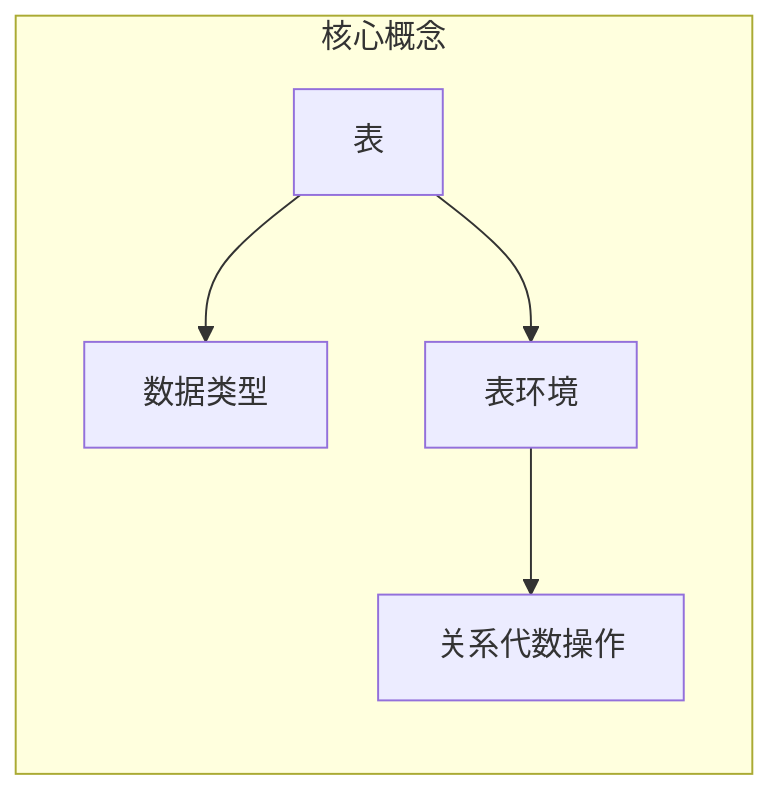

## 1. 背景介绍

### 1.1 流处理与批处理的融合趋势

在大数据时代，海量数据的实时处理需求日益增长，传统的批处理框架如 Hadoop MapReduce 已难以满足实时性要求。与此同时，流处理技术逐渐成熟，以 Apache Flink 为代表的流处理引擎在处理高吞吐、低延迟的数据流方面表现出色。然而，流处理和批处理在编程模型、API 设计等方面存在较大差异，开发人员需要分别学习和使用不同的技术栈，增加了开发和维护成本。

为了解决上述问题，流批一体化成为了大数据处理领域的重要发展趋势。Flink 作为新一代的流批一体化处理引擎，致力于提供统一的 API 和执行引擎，能够同时高效地处理批处理和流处理任务。Flink Table API 和 SQL 作为 Flink 生态系统中的重要组成部分，为用户提供了声明式、易于理解和维护的 API，能够简化数据分析和处理任务的开发过程。

### 1.2  Flink Table API 和 SQL 的优势

Flink Table API 和 SQL 相比于传统的 DataStream API 具有以下优势：

* **声明式 API：** 用户只需关注数据处理的逻辑，无需关心底层的实现细节，例如数据分发、网络传输等，从而提高开发效率。
* **SQL 标准兼容性：** Flink SQL 基于 Apache Calcite 解析器，支持 ANSI SQL 标准，用户可以使用熟悉的 SQL 语法进行数据查询和分析。
* **流批一体化：** Flink Table API 和 SQL 可以无缝地处理批处理和流处理任务，用户可以使用相同的 API 和代码逻辑处理不同类型的数据源。
* **优化器支持：** Flink 内置了基于成本的优化器，能够自动优化查询计划，提高执行效率。

## 2. 核心概念与联系

### 2.1 表（Table）

在 Flink Table API 和 SQL 中，表是数据的逻辑视图，类似于关系型数据库中的表。Flink 中的表可以是动态的（流式表）或静态的（批式表）。

* **流式表（StreamTable）：** 表示一个无限、持续更新的数据流，例如来自 Kafka 的消息流。
* **批式表（BatchTable）：** 表示一个有限、静态的数据集，例如存储在 HDFS 上的 CSV 文件。

### 2.2 数据类型（DataType）

Flink Table API 和 SQL 支持丰富的数据类型，包括：

* **基本数据类型：** INT、BIGINT、FLOAT、DOUBLE、STRING、BOOLEAN、DATE、TIME、TIMESTAMP 等。
* **复合数据类型：** ARRAY、MAP、ROW 等。
* **用户自定义数据类型：** 用户可以自定义数据类型来满足特定的业务需求。

### 2.3 表环境（TableEnvironment）

表环境是 Flink Table API 和 SQL 的入口点，提供了创建表、执行查询、注册用户自定义函数等功能。

### 2.4  关系代数操作（Relational Algebra Operations）

Flink Table API 和 SQL 提供了一系列关系代数操作，例如：

* **选择（Selection）：** 从表中选择满足条件的行。
* **投影（Projection）：** 从表中选择指定的列。
* **连接（Join）：** 根据指定的条件将两个表合并成一个新表。
* **聚合（Aggregation）：** 对表中的数据进行分组聚合操作，例如求和、平均值等。

### 2.5 核心概念联系图



## 3. 核心算法原理具体操作步骤

### 3.1 创建表环境

```java
// 创建流处理执行环境
StreamExecutionEnvironment env = StreamExecutionEnvironment.getExecutionEnvironment();

// 创建表环境
StreamTableEnvironment tableEnv = StreamTableEnvironment.create(env);
```

### 3.2 创建表

#### 3.2.1 从数据源创建表

```java
// 从 Kafka 创建流式表
DataStream<Order> orderStream = env.addSource(new FlinkKafkaConsumer<>("order_topic", new OrderSchema(), properties));
tableEnv.createTemporaryView("orders", orderStream, $("user_id"), $("order_id"), $("amount"), $("timestamp").rowtime());

// 从 CSV 文件创建批式表
tableEnv.createTemporaryView("users", env.readTextFile("users.csv").map(new MapFunction<String, User>() {
    @Override
    public User map(String value) throws Exception {
        String[] fields = value.split(",");
        return new User(Integer.parseInt(fields[0]), fields[1]);
    }
}));
```

#### 3.2.2 从 DataStream 或 DataSet 创建表

```java
// 从 DataStream 创建表
DataStream<Tuple3<Long, String, Integer>> dataStream = env.fromElements(
    Tuple3.of(1L, "Alice", 10),
    Tuple3.of(2L, "Bob", 20),
    Tuple3.of(3L, "Charlie", 30)
);
tableEnv.createTemporaryView("my_table", dataStream, $("id"), $("name"), $("age"));

// 从 DataSet 创建表
DataSet<Tuple3<Long, String, Integer>> dataSet = env.fromElements(
    Tuple3.of(1L, "Alice", 10),
    Tuple3.of(2L, "Bob", 20),
    Tuple3.of(3L, "Charlie", 30)
);
tableEnv.createTemporaryView("my_table", dataSet, $("id"), $("name"), $("age"));
```

### 3.3 执行查询

#### 3.3.1 使用 Table API

```java
// 查询订单总金额
Table resultTable = tableEnv.from("orders")
    .select($("amount").sum().as("total_amount"));

// 将结果打印到控制台
tableEnv.toAppendStream(resultTable, Row.class).print();
```

#### 3.3.2 使用 SQL

```java
// 查询每个用户的订单数量
Table resultTable = tableEnv.sqlQuery("SELECT user_id, COUNT(*) AS order_count FROM orders GROUP BY user_id");

// 将结果写入到 Kafka
tableEnv.toRetractStream(resultTable, Row.class)
    .addSink(new FlinkKafkaProducer<>("result_topic", new OrderCountSchema(), properties));
```

### 3.4 注册用户自定义函数

```java
// 注册用户自定义标量函数
tableEnv.createTemporarySystemFunction("my_udf", new MyScalarFunction());

// 注册用户自定义表函数
tableEnv.createTemporarySystemFunction("my_table_function", new MyTableFunction());
```

## 4. 数学模型和公式详细讲解举例说明

### 4.1 时间属性和 Watermark

在流处理中，时间是一个非常重要的概念。Flink Table API 和 SQL 支持三种时间属性：

* **处理时间（Processing Time）：** 事件被 Flink 处理的本地系统时间。
* **事件时间（Event Time）：** 事件实际发生的时间，通常嵌入在事件数据中。
* **摄入时间（Ingestion Time）：** 事件进入 Flink 数据源的时间。

Watermark 是 Flink 中用于处理乱序事件的机制。Watermark 表示事件时间的一个逻辑时钟，它保证在 Watermark 之后不会再有更早的事件到达。

#### 4.1.1 设置时间属性

```java
// 设置事件时间属性
tableEnv.createTemporaryView("orders", orderStream, $("user_id"), $("order_id"), $("amount"), $("timestamp").rowtime());
```

#### 4.1.2 定义 Watermark

```java
// 定义 Watermark 为事件时间延迟 5 秒钟
DataStream<Order> orderStreamWithWatermark = orderStream.assignTimestampsAndWatermarks(WatermarkStrategy
    .<Order>forBoundedOutOfOrderness(Duration.ofSeconds(5))
    .withTimestampAssigner((event, timestamp) -> event.getTimestamp()));
```

### 4.2 窗口函数

窗口函数用于对数据流进行分组聚合操作。Flink Table API 和 SQL 支持多种类型的窗口函数，例如：

* **滚动窗口（Tumbling Window）：** 将数据流按照固定的时间或行数进行切片。
* **滑动窗口（Sliding Window）：** 类似于滚动窗口，但是窗口之间可以重叠。
* **会话窗口（Session Window）：** 根据数据流中的间隔时间将数据分组。

#### 4.2.1 使用滚动窗口函数

```java
// 统计每分钟的订单总金额
Table resultTable = tableEnv.from("orders")
    .window(Tumble.over(lit(1).minutes()).on($("timestamp")).as("w"))
    .groupBy($("w"), $("user_id"))
    .select($("user_id"), $("amount").sum().as("total_amount"));
```

#### 4.2.2 使用滑动窗口函数

```java
// 统计每 10 秒钟内，每 5 秒钟的订单总金额
Table resultTable = tableEnv.from("orders")
    .window(Slide.over(lit(10).seconds()).every(lit(5).seconds()).on($("timestamp")).as("w"))
    .groupBy($("w"), $("user_id"))
    .select($("user_id"), $("amount").sum().as("total_amount"));
```

## 5. 项目实践：代码实例和详细解释说明

### 5.1 案例背景

假设我们有一个电商网站，需要实时统计每个用户的订单总金额。

### 5.2 数据源

数据源是 Kafka 中的订单消息流，每条消息包含以下字段：

* user_id: 用户 ID
* order_id: 订单 ID
* amount: 订单金额
* timestamp: 订单时间

### 5.3 代码实现

```java
import org.apache.flink.api.common.functions.MapFunction;
import org.apache.flink.api.java.tuple.Tuple3;
import org.apache.flink.streaming.api.datastream.DataStream;
import org.apache.flink.streaming.api.environment.StreamExecutionEnvironment;
import org.apache.flink.table.api.EnvironmentSettings;
import org.apache.flink.table.api.Table;
import org.apache.flink.table.api.bridge.java.StreamTableEnvironment;
import org.apache.flink.types.Row;

import static org.apache.flink.table.api.Expressions.$;

public class OrderTotalAmount {

    public static void main(String[] args) throws Exception {
        // 创建流处理执行环境
        StreamExecutionEnvironment env = StreamExecutionEnvironment.getExecutionEnvironment();

        // 创建表环境
        EnvironmentSettings settings = EnvironmentSettings.newInstance().useBlinkPlanner().inStreamingMode().build();
        StreamTableEnvironment tableEnv = StreamTableEnvironment.create(env, settings);

        // 从 Kafka 创建流式表
        DataStream<Order> orderStream = env.addSource(new FlinkKafkaConsumer<>("order_topic", new OrderSchema(), properties));
        tableEnv.createTemporaryView("orders", orderStream, $("user_id"), $("order_id"), $("amount"), $("timestamp").rowtime());

        // 查询每个用户的订单总金额
        Table resultTable = tableEnv.from("orders")
            .groupBy($("user_id"))
            .select($("user_id"), $("amount").sum().as("total_amount"));

        // 将结果打印到控制台
        tableEnv.toRetractStream(resultTable, Row.class).print();

        // 执行任务
        env.execute("Order Total Amount");
    }

    // 订单数据结构
    public static class Order {
        public Long user_id;
        public Long order_id;
        public Double amount;
        public Long timestamp;

        public Order() {}

        public Order(Long user_id, Long order_id, Double amount, Long timestamp) {
            this.user_id = user_id;
            this.order_id = order_id;
            this.amount = amount;
            this.timestamp = timestamp;
        }
    }

    // Kafka 消息 Schema
    public static class OrderSchema implements KafkaSerializationSchema<Order> {
        // ...
    }
}
```

## 6. 实际应用场景

Flink Table API 和 SQL 适用于各种数据分析和处理场景，例如：

* **实时报表和仪表盘：** 实时监控业务指标，例如网站流量、用户行为等。
* **风险控制和欺诈检测：** 实时识别异常行为，例如信用卡欺诈、账户盗用等。
* **物联网数据分析：** 实时分析传感器数据，例如温度、湿度、压力等。
* **机器学习模型训练和预测：** 使用 Flink SQL 进行特征工程和数据预处理，然后将数据传递给机器学习算法进行训练和预测。

## 7. 工具和资源推荐

* **Apache Flink 官网：** https://flink.apache.org/
* **Flink Table API 和 SQL 文档：** https://ci.apache.org/projects/flink/flink-docs-release-1.13/docs/dev/table/tableapi/
* **Ververica Platform：** https://www.ververica.com/products/platform/
* **Flink SQL Client：** https://ci.apache.org/projects/flink/flink-docs-release-1.13/docs/dev/table/sqlclient/

## 8. 总结：未来发展趋势与挑战

Flink Table API 和 SQL 作为 Flink 生态系统中的重要组成部分，未来将继续朝着以下方向发展：

* **更强大的 SQL 兼容性：** 支持更多的 ANSI SQL 语法和函数。
* **更丰富的 API 和功能：** 提供更高级的数据分析和处理功能，例如机器学习、图计算等。
* **更完善的生态系统：** 与更多的第三方工具和平台集成，例如 Kafka、Hive、HBase 等。

同时，Flink Table API 和 SQL 也面临着一些挑战：

* **性能优化：** 如何进一步提高查询性能，特别是对于复杂查询和海量数据。
* **易用性提升：** 如何降低用户学习和使用门槛，提供更友好的 API 和工具。
* **生态系统建设：** 如何吸引更多开发者和用户参与到 Flink 社区，共同推动 Flink 生态系统的发展。

## 9. 附录：常见问题与解答

### 9.1 如何处理数据倾斜？

数据倾斜是指数据分布不均匀导致某些节点处理的数据量远大于其他节点，从而影响整体性能。

解决数据倾斜的方法包括：

* **预聚合：** 在数据源端对数据进行预聚合，减少数据传输量。
* **数据倾斜优化：** Flink SQL 提供了数据倾斜优化参数，例如 `broadcast`, `rebalance` 等，可以根据实际情况进行调整。
* **自定义分区器：** 用户可以自定义分区器来控制数据的分布。

### 9.2 如何处理迟到数据？

迟到数据是指事件时间晚于 Watermark 的数据。

处理迟到数据的方法包括：

* **丢弃：** 直接丢弃迟到数据。
* **侧输出：** 将迟到数据输出到侧输出流进行单独处理。
* **更新结果：** 使用 Flink 的状态机制更新已经计算的结果。


希望这篇文章能够帮助你更好地理解 Flink Table API 和 SQL 的原理和应用。