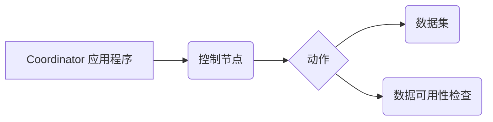

# Oozie Coordinator原理与代码实例讲解

作者：禅与计算机程序设计艺术

## 1. 背景介绍

### 1.1 大数据处理流程的挑战

在大数据时代，海量数据的处理和分析已经成为企业和组织的核心竞争力之一。为了应对大数据处理的挑战，各种分布式计算框架应运而生，例如 Hadoop、Spark、Flink 等。这些框架为大规模数据的存储、处理和分析提供了强大的支持。

然而，随着数据规模的不断增长和业务需求的日益复杂，大数据处理流程也变得越来越复杂。一个典型的大数据处理流程通常包含多个步骤，例如数据采集、数据清洗、数据转换、特征工程、模型训练、模型评估等。这些步骤之间往往存在着复杂的依赖关系，例如数据清洗步骤需要在数据采集步骤完成后才能执行，模型训练步骤需要在特征工程步骤完成后才能执行，等等。

为了有效地管理和调度这些复杂的大数据处理流程，我们需要一种专门的工具。Oozie Coordinator 就是这样一种工具，它可以帮助我们定义、管理和调度复杂的大数据工作流。

### 1.2 Oozie Coordinator 简介

Oozie 是一个开源的工作流调度系统，它运行在 Hadoop 集群上，用于管理 Hadoop 作业。Oozie Coordinator 是 Oozie 的一个组件，它提供了一种声明式的方式来定义和调度周期性的工作流。

与 Oozie Workflow 不同，Oozie Coordinator 并不关心工作流内部的具体执行逻辑，它只关心工作流的执行时间和执行条件。Oozie Coordinator 使用一种基于 XML 的语言来定义工作流的调度策略，包括：

* 工作流的执行频率（例如每天、每周、每月等）
* 工作流的执行时间（例如每天凌晨 2 点、每周一早上 8 点等）
* 工作流的执行条件（例如依赖于某个文件的存在、某个数据的更新等）

Oozie Coordinator 会根据定义的调度策略自动触发工作流的执行，并监控工作流的执行状态。如果工作流执行失败，Oozie Coordinator 可以根据配置进行重试或报警。

## 2. 核心概念与联系

### 2.1 Coordinator 应用程序

Coordinator 应用程序是 Oozie Coordinator 的基本单元，它定义了一个周期性的工作流。一个 Coordinator 应用程序包含以下几个部分：

* **控制节点（Control Node）**: 控制节点是 Coordinator 应用程序的入口点，它负责解析 Coordinator 应用程序的定义文件，并根据定义的调度策略创建和管理 Action。
* **动作（Action）**:  动作是 Coordinator 应用程序中的最小执行单元，它通常对应于一个 Oozie Workflow 或一个 Hadoop Job。
* **数据集（Dataset）**: 数据集代表 Coordinator 应用程序所依赖的外部数据，例如 HDFS 上的文件、Hive 表等。
* **数据可用性检查（Data Availability Check）**: 数据可用性检查用于检查数据集是否满足执行条件，例如文件是否存在、数据是否更新等。

### 2.2 Coordinator 应用程序的生命周期

一个 Coordinator 应用程序的生命周期可以分为以下几个阶段：

1. **定义阶段**: 在这个阶段，用户使用 XML 文件定义 Coordinator 应用程序的调度策略、依赖关系等信息。
2. **提交阶段**: 用户将定义好的 Coordinator 应用程序提交到 Oozie 服务器。
3. **初始化阶段**: Oozie 服务器解析 Coordinator 应用程序的定义文件，并创建相应的控制节点和动作。
4. **运行阶段**: Oozie 服务器根据定义的调度策略，周期性地检查数据可用性，并在满足条件时触发动作的执行。
5. **结束阶段**: 当 Coordinator 应用程序完成所有周期性的执行，或者被用户手动终止时，进入结束阶段。

### 2.3 核心概念之间的联系

下图展示了 Oozie Coordinator 中各个核心概念之间的联系：



* Coordinator 应用程序包含一个控制节点和多个动作。
* 动作依赖于数据集，并通过数据可用性检查来判断是否满足执行条件。

## 3. 核心算法原理具体操作步骤

### 3.1 数据集定义与数据可用性检查

在 Oozie Coordinator 中，数据集使用 XML 文件进行定义，并使用  `dataset`  元素进行标识。一个数据集的定义通常包含以下信息：

* 数据集的名称
* 数据集的 URI 模板，用于指定数据集的路径
* 数据集的频率，用于指定数据集的更新频率
* 数据集的初始实例，用于指定数据集的第一个实例

```xml
<datasets>
  <dataset name="input-data" frequency="${coord:days(1)}" initial-instance="2024-05-22T00:00Z">
    <uri-template>hdfs://namenode:8020/user/hadoop/input/${YEAR}-${MONTH}-${DAY}</uri-template>
  </dataset>
</datasets>
```

数据可用性检查用于判断数据集是否满足执行条件，例如文件是否存在、数据是否更新等。Oozie Coordinator 提供了多种数据可用性检查方法，例如：

* **`done-flag`**: 检查指定路径下是否存在指定的文件。
* **`last-modified`**: 检查指定路径下文件的最后修改时间是否晚于指定时间。

```xml
<data-in name="input-data" dataset="input-data">
  <instance>${coord:current(0)}</instance>
</data-in>
```

### 3.2 动作定义与调度策略

动作使用 XML 文件进行定义，并使用  `action`  元素进行标识。一个动作的定义通常包含以下信息：

* 动作的名称
* 动作的类型，例如  `workflow`、`java`  等
* 动作的执行脚本或程序
* 动作的依赖关系，例如依赖于哪些数据集

```xml
<action>
  <workflow>
    <app-path>hdfs://namenode:8020/user/hadoop/workflow.xml</app-path>
    <configuration>
      <property>
        <name>inputPath</name>
        <value>${coord:dataIn('input-data')}</value>
      </property>
    </configuration>
  </workflow>
  <ok to="end"/>
  <error to="fail"/>
</action>
```

调度策略定义了动作的执行时间和执行条件。Oozie Coordinator 提供了多种调度策略，例如：

* **`frequency`**: 指定动作的执行频率，例如每天、每周、每月等。
* **`start`**: 指定动作的开始执行时间。
* **`end`**: 指定动作的结束执行时间。
* **`timezone`**: 指定动作执行时区。

```xml
<coordinator-app name="my-coordinator-app" frequency="${coord:days(1)}" start="2024-05-23T00:00Z" end="2024-05-30T00:00Z" timezone="UTC">
  ...
</coordinator-app>
```

### 3.3 Coordinator 应用程序的执行流程

当一个 Coordinator 应用程序被提交到 Oozie 服务器后，Oozie 服务器会根据定义的调度策略，周期性地检查数据可用性，并在满足条件时触发动作的执行。

1. Oozie 服务器会根据  `frequency`  参数计算出下一个执行周期。
2. 对于每个执行周期，Oozie 服务器会检查  `start`  和  `end`  参数，判断当前时间是否在执行时间范围内。
3. 如果当前时间在执行时间范围内，Oozie 服务器会检查动作所依赖的数据集是否满足数据可用性条件。
4. 如果所有依赖的数据集都满足数据可用性条件，Oozie 服务器会触发动作的执行。
5. 如果动作执行成功，Oozie 服务器会更新动作的执行状态，并进入下一个执行周期。
6. 如果动作执行失败，Oozie 服务器会根据配置进行重试或报警。

## 4. 数学模型和公式详细讲解举例说明

Oozie Coordinator 没有涉及复杂的数学模型和公式，其核心原理是基于时间和依赖关系的调度。

## 5. 项目实践：代码实例和详细解释说明

### 5.1 需求描述

假设我们需要每天从 HDFS 上读取前一天的数据，并使用 Spark 进行数据处理。

### 5.2 代码实现

**1. 创建 Coordinator 应用程序的定义文件 `coordinator.xml`**

```xml
<coordinator-app name="data-processing-coordinator" frequency="${coord:days(1)}" start="2024-05-23T00:00Z" end="2024-05-30T00:00Z" timezone="UTC"
                 xmlns="uri:oozie:coordinator:0.1">
  <datasets>
    <dataset name="input-data" frequency="${coord:days(1)}" initial-instance="2024-05-22T00:00Z">
      <uri-template>hdfs://namenode:8020/user/hadoop/input/${YEAR}-${MONTH}-${DAY}</uri-template>
    </dataset>
  </datasets>
  <controls>
    <concurrency>1</concurrency>
  </controls>
  <action>
    <workflow>
      <app-path>hdfs://namenode:8020/user/hadoop/spark-job.xml</app-path>
      <configuration>
        <property>
          <name>inputPath</name>
          <value>${coord:dataIn('input-data')}</value>
        </property>
      </configuration>
    </workflow>
    <ok to="end"/>
    <error to="fail"/>
  </action>
</coordinator-app>
```

**参数说明：**

* `frequency`: 指定 Coordinator 应用程序的执行频率为每天一次。
* `start`: 指定 Coordinator 应用程序的开始执行时间为 2024 年 5 月 23 日 00:00 (UTC)。
* `end`: 指定 Coordinator 应用程序的结束执行时间为 2024 年 5 月 30 日 00:00 (UTC)。
* `dataset`: 定义了一个名为 `input-data` 的数据集，其 URI 模板为 `hdfs://namenode:8020/user/hadoop/input/${YEAR}-${MONTH}-${DAY}`，表示每天都会生成一个新的数据目录。
* `concurrency`: 指定 Coordinator 应用程序最多同时运行 1 个 Action。
* `action`: 定义了一个名为 `spark-job` 的 Action，其类型为 `workflow`，执行脚本为 `hdfs://namenode:8020/user/hadoop/spark-job.xml`。
* `inputPath`: 指定 Spark 作业的输入路径为 `input-data` 数据集的 URI。

**2. 创建 Spark 作业的定义文件 `spark-job.xml`**

```xml
<workflow-app name="spark-job" xmlns="uri:oozie:workflow:0.5">
  <start to="spark-job"/>
  <action name="spark-job">
    <spark xmlns="uri:oozie:spark-action:0.1">
      <job-tracker>${jobTracker}</job-tracker>
      <name-node>${nameNode}</name-node>
      <master>yarn-cluster</master>
      <mode>cluster</mode>
      <application-name>spark-job</application-name>
      <class>com.example.SparkJob</class>
      <jar>hdfs://namenode:8020/user/hadoop/spark-job.jar</jar>
      <arg>${inputPath}</arg>
    </spark>
    <ok to="end"/>
    <error to="fail"/>
  </action>
  <kill name="fail">
    <message>Workflow failed, error message[${wf:errorMessage(wf:lastErrorNode())}]</message>
  </kill>
  <end name="end"/>
</workflow-app>
```

**参数说明：**

* `job-tracker`: 指定 Hadoop JobTracker 的地址。
* `name-node`: 指定 Hadoop NameNode 的地址。
* `master`: 指定 Spark Master 的地址。
* `mode`: 指定 Spark 运行模式为 `cluster` 模式。
* `application-name`: 指定 Spark 应用程序的名称。
* `class`: 指定 Spark 应用程序的主类。
* `jar`: 指定 Spark 应用程序的 JAR 包路径。
* `arg`: 指定 Spark 应用程序的参数，这里将 `inputPath` 参数传递给 Spark 应用程序。

**3. 将 Coordinator 应用程序和 Spark 作业提交到 Oozie 服务器**

```
oozie job -oozie http://oozie-server:11000/oozie -config coordinator.xml -run
```

### 5.3 代码解释

1. 在 `coordinator.xml` 文件中，我们定义了一个名为 `data-processing-coordinator` 的 Coordinator 应用程序，它每天都会执行一次。
2. Coordinator 应用程序依赖于一个名为 `input-data` 的数据集，该数据集每天都会生成一个新的数据目录。
3. Coordinator 应用程序中定义了一个名为 `spark-job` 的 Action，该 Action 会执行一个 Spark 作业。
4. 在 `spark-job.xml` 文件中，我们定义了一个名为 `spark-job` 的 Spark 作业，该作业会读取 `inputPath` 参数指定的路径下的数据，并进行处理。
5. 在提交 Coordinator 应用程序时，我们使用 `-config` 参数指定了 Coordinator 应用程序的定义文件，并使用 `-run` 参数启动 Coordinator 应用程序。

## 6. 实际应用场景

Oozie Coordinator 适用于各种需要周期性执行的大数据处理场景，例如：

* **数据仓库 ETL**: 定期从源数据库抽取数据，进行清洗、转换后加载到数据仓库中。
* **日志分析**: 定期收集和分析服务器日志，生成报表和告警信息。
* **机器学习**: 定期训练和评估机器学习模型，并根据模型性能进行参数调整。

## 7. 工具和资源推荐

* **Oozie 官网**: http://oozie.apache.org/
* **Oozie Coordinator 文档**: http://oozie.apache.org/docs/4.2.0/CoordinatorFunctionalSpec.html

## 8. 总结：未来发展趋势与挑战

Oozie Coordinator 作为 Hadoop 生态系统中重要的工作流调度工具，在未来仍将扮演着重要的角色。

### 8.1 未来发展趋势

* **更细粒度的调度**: 支持更灵活的调度策略，例如基于事件触发、基于资源可用性调度等。
* **更智能的监控和报警**: 提供更丰富的监控指标和更智能的报警机制，帮助用户及时发现和解决问题。
* **与云平台的集成**: 支持与云平台的集成，例如 AWS、Azure、GCP 等，方便用户在云环境中使用 Oozie Coordinator。

### 8.2 面临的挑战

* **性能和扩展性**: 随着数据规模的不断增长，Oozie Coordinator 需要不断提升自身的性能和扩展性，以满足海量数据的处理需求。
* **易用性**: Oozie Coordinator 的配置和使用相对复杂，需要用户具备一定的 Hadoop 和 XML 知识，未来需要进一步提升其易用性。
* **与其他工具的集成**: Oozie Coordinator 需要与其他大数据处理工具进行更好的集成，例如 Spark、Flink 等，以构建更完整的大数据处理生态系统。

## 9. 附录：常见问题与解答

### 9.1 如何调试 Oozie Coordinator 应用程序？

可以使用以下方法调试 Oozie Coordinator 应用程序：

* 查看 Oozie Web UI 上的日志信息。
* 在 Coordinator 应用程序的定义文件中添加 `debug` 元素，开启调试模式。
* 使用远程调试工具，例如 Eclipse 远程调试工具，连接到 Oozie 服务器进行调试。

### 9.2 如何处理 Oozie Coordinator 应用程序执行失败？

如果 Oozie Coordinator 应用程序执行失败，可以尝试以下方法解决：

* 查看 Oozie Web UI 上的错误信息，找到问题原因。
* 检查 Coordinator 应用程序的定义文件是否正确。
* 检查依赖的数据集是否满足数据可用性条件。
* 尝试重新运行失败的 Action。
