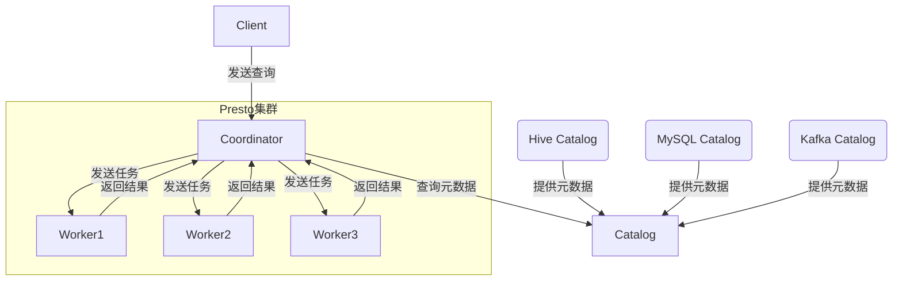
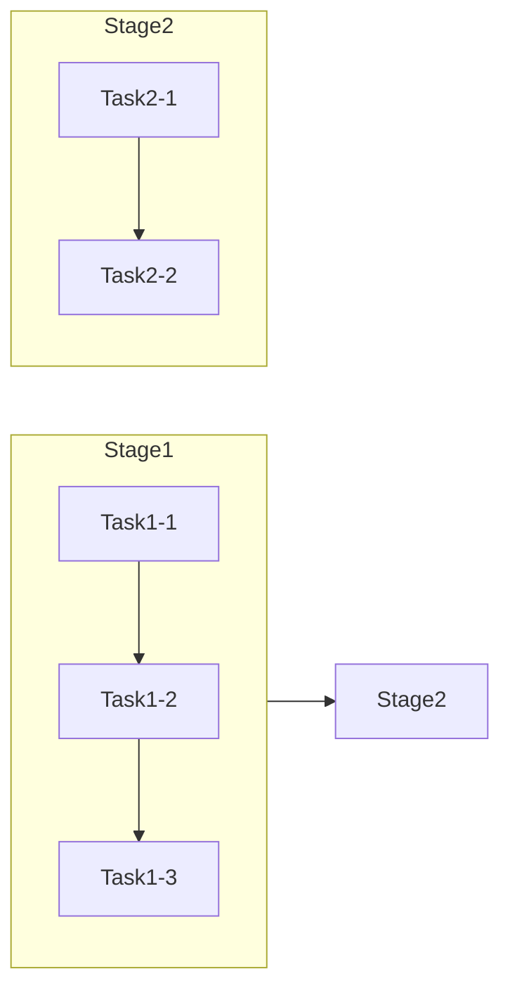

# Presto原理与代码实例讲解

## 1.背景介绍

### 1.1 什么是Presto

Presto是一个开源的分布式SQL查询引擎,由Facebook开发和维护。它旨在对大数据集进行交互式分析查询,能够快速高效地处理大规模数据。Presto最初是为了解决Facebook内部的大数据分析问题而开发的,后来逐渐开源并被广泛使用。

### 1.2 Presto的特点

- **高性能**:Presto采用了多种优化技术,如向量化执行、编码数据、多并发等,查询速度极快,能够在短时间内处理大规模数据。
- **统一数据访问**:Presto支持多种数据源,包括HDFS、Alluxio、Cassandra、MySQL等,可以像访问单个数据源一样轻松查询多个异构数据源。
- **标准SQL支持**:Presto支持ANSI SQL标准,支持大部分SQL语法,易于上手。
- **容错性强**:Presto采用主从架构,主节点故障时可以自动选举出新的主节点,查询不会中断。
- **高可扩展性**:Presto可以通过添加worker节点来线性扩展集群的计算能力。

### 1.3 Presto的适用场景

- **交互式分析**:Presto擅长交互式的数据探索和分析,查询响应速度快。
- **统一大数据分析**:可以对Hadoop、Hive、关系数据库等多个数据源进行统一查询和分析。
- **ETL工作负载**:Presto可用于提取、转换和加载大数据集。
- **数据虚拟化**:将异构数据源虚拟为单个数据视图,简化数据访问。

## 2.核心概念与联系

### 2.1 Presto架构

Presto采用主从架构,包括以下几个核心组件:

- **Coordinator**:接收客户端的查询请求,负责查询的解析、优化、调度和管理。
- **Worker**:执行具体的查询任务,负责从数据源读取数据并进行处理。
- **Catalog**:元数据管理组件,存储数据源的元数据信息。

Presto的整体架构如下图所示:



### 2.2 查询执行流程

一个典型的Presto查询执行流程如下:

1. 客户端向Coordinator发送SQL查询请求。
2. Coordinator对SQL语句进行解析、优化,生成分布式执行计划。
3. Coordinator将执行计划分解为多个任务(Task),分发给不同的Worker节点执行。
4. Worker节点从数据源读取数据,并执行相应的计算逻辑。
5. Worker节点将中间结果通过高效的数据传输协议传回给Coordinator。
6. Coordinator汇总Worker的结果,返回给客户端。

### 2.3 数据模型

Presto采用列存储的数据模型,即按列而不是按行存储数据。这种模型在分析型查询中有着极佳的性能表现,因为大多数查询只需访问部分列。

Presto将数据划分为数据块(Data Block),每个数据块包含一列的一段连续数据。这种数据布局有利于向量化执行、编码数据等优化技术的应用。

## 3.核心算法原理具体操作步骤  

### 3.1 查询优化

Presto的查询优化主要包括以下几个步骤:

1. **解析SQL**:将SQL语句解析为抽象语法树(AST)。
2. **语义分析**:对AST进行类型检查、视图展开、函数解析等操作。
3. **逻辑优化**:对查询进行一些逻辑等价变换,如谓词下推、投影剪裁等。
4. **成本估算**:对不同的执行计划进行代价估算,选择代价最小的计划。
5. **物理优化**:对选定的计划进行一些底层优化,如合并局部交换等。

### 3.2 查询执行

Presto采用**基于Stages的执行模型**,每个Stage由多个并行的Task组成。具体执行步骤如下:

1. 根据查询计划,将查询划分为多个Stage。
2. 每个Stage由多个Task并行执行,Task之间通过高效的数据传输协议(如HTTP/2)进行通信。
3. 在每个Task内部,采用**基于Pipeline的执行模型**,将操作符组织成有向无环管道。
4. 管道中的每个操作符都是向量化实现的,可以高效地处理批量数据。

Presto的执行流水线如下图所示:



### 3.3 向量化执行

Presto的一大核心优化就是向量化执行(Vectorized Execution),即对一批数据执行批量操作,而不是逐个元素地执行。这种方式可以极大地提高CPU利用率,降低内存访问开销。

向量化执行的具体步骤如下:

1. 从数据源读取一批数据到内存块(Data Block)中。
2. 对内存块中的数据执行批量操作,如过滤、投影、聚合等。
3. 将处理后的结果写回内存块或传输到下游操作符。

向量化执行的好处在于:

- 批量处理可以充分利用现代CPU的SIMD指令集,提高计算性能。
- 减少内存访问次数,降低内存带宽压力。
- 减少函数调用开销,提高代码局部性。

### 3.4 编码数据

Presto采用高效的数据编码格式来存储和传输中间数据,从而节省内存和网络带宽。常用的编码格式包括:

- **Run-Length Encoding**:对于连续重复值,只存储值和重复次数。
- **Dictionary Encoding**:为每个唯一值分配一个字典ID,存储字典ID而不是原始值。
- **Bit-Packing**:将多个小整数打包存储在一个64位整数中。

编码数据可以极大地减小中间数据的存储和传输开销,从而提高整体查询性能。

## 4.数学模型和公式详细讲解举例说明

### 4.1 代价模型

Presto在查询优化阶段需要估算不同执行计划的代价,以选择最优计划。Presto采用的是**基于统计信息的代价模型**,主要考虑以下几个因素:

- 输入数据量
- 中间数据量
- CPU代价
- 内存代价
- 网络传输代价

输入数据量和中间数据量可以从元数据或统计信息中获取,CPU代价和内存代价根据具体操作符的实现进行估算,网络代价主要考虑节点间的数据传输量。

假设一个查询包括n个操作符,第i个操作符的代价为$C_i$,则整个查询的代价可以表示为:

$$Cost = \sum_{i=1}^{n}C_i$$

其中,$C_i$可以进一步细分为:

$$C_i = CPU_i + Memory_i + Network_i$$

CPU代价可以根据操作符的CPU复杂度和输入数据量进行估算,内存代价与操作符的内存使用量和输入数据量有关,网络代价则取决于需要传输的数据量。

### 4.2 Join重排序

在多表连接查询中,不同的连接顺序会导致执行代价的差异。Presto采用了一种启发式算法来确定连接顺序,旨在最小化中间数据的大小。

具体来说,算法会构建一个Join树,其中每个节点代表一个表或者一个子查询。算法会遍历所有可能的连接顺序,并根据代价模型估算每种顺序的代价,选择代价最小的顺序作为最终执行计划。

Join重排序算法的复杂度为$O(n!)$,其中n为表的个数。对于较大的连接查询,这种算法的代价会很高。因此Presto采用了一些优化策略,如基于表统计信息的启发式剪枝,动态规划等。

## 4.项目实践:代码实例和详细解释说明

本节将通过一个具体的代码示例,演示如何使用Presto执行一个简单的查询。我们将使用Presto内置的TPC-H数据集,它模拟了一个典型的供应链场景。

首先,我们需要启动Presto集群。可以使用官方提供的单机伪集群模式进行测试:

```bash
./presto-server-<version>/bin/launcher run
```

启动后,可以使用Presto命令行客户端连接到集群:

```bash 
./presto-cli-<version>/bin/presto-cli --server localhost:8080 --catalog hive --schema tpch
```

现在我们尝试执行一个查询,查找1995年的订单及相关客户和供应商信息:

```sql
SELECT
    c.custkey, c.name, n.name, l.extendedprice * (1 - l.discount) AS revenue
FROM
    customer c
    JOIN orders o ON c.custkey = o.custkey
    JOIN lineitem l ON o.orderkey = l.orderkey
    JOIN supplier s ON l.suppkey = s.suppkey
    JOIN nation n ON s.nationkey = n.nationkey
WHERE
    o.orderdate >= DATE '1995-01-01'
    AND o.orderdate < DATE '1996-01-01'
LIMIT 10;
```

这个查询包含了多表连接、谓词过滤和聚合计算等操作,可以体现Presto的一些核心特性。

查询执行过程如下:

1. 解析SQL,生成抽象语法树AST。
2. 对AST进行语义分析,检查类型、解析函数等。
3. 逻辑优化,如谓词下推、投影剪裁等。
4. 选择最佳的Join顺序,并构建执行计划树。
5. 物理优化,如合并局部交换操作符等。
6. 生成分布式执行计划,划分为多个Stage和Task。
7. 在Worker节点上并行执行Task,并向量化执行每个操作符。
8. 汇总结果并返回给客户端。

通过这个简单的示例,我们可以看到Presto能够高效地执行复杂查询,并充分利用现代硬件的计算能力。在后续章节中,我们还将介绍更多Presto的高级特性。

## 5.实际应用场景

Presto凭借其高性能和统一数据访问的优势,在实际场景中得到了广泛应用,尤其在以下几个领域:

### 5.1 交互式数据分析

Presto最初的设计目标就是为了支持交互式的大数据分析。由于查询响应速度快,Presto非常适合用于数据探索、实时报表等交互式分析场景。

例如,在Facebook内部,Presto被广泛用于对Hive、HDFS等数据源进行实时查询和分析,支持产品开发、运营分析等各种业务需求。

### 5.2 ETL工作负载

除了交互式分析,Presto也可以用于ETL(提取、转换、加载)工作负载。利用Presto强大的SQL能力,可以方便地从多个异构数据源提取数据,并进行复杂的转换和清洗操作。

例如,在Uber公司,Presto被用于ETL管道,从各种在线系统中提取数据,并加载到Hadoop集群中用于离线分析。

### 5.3 数据虚拟化

Presto的统一数据访问特性使其成为构建数据虚拟化平台的理想选择。通过Presto,可以将分散在不同系统中的数据源虚拟为统一的数据视图,简化数据访问流程。

例如,Netflix公司使用Presto作为其数据平台的核心组件,为各种业务系统提供统一的数据访问服务。

### 5.4 机器学习特征工程

在机器学习领域,数据预处理和特征工程是非常重要的环节。Presto可以高效地对海量数据进行特征提取和转换,为机器学习模型训练提供高质量的输入数据。

例如,在Meta公司,Presto被用于构建机器学