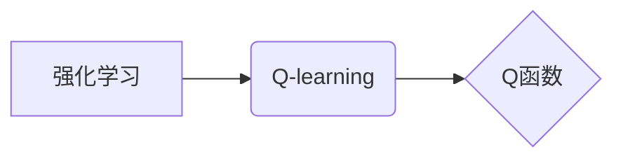

# 一切皆是映射：AI Q-learning基础概念理解

作者：禅与计算机程序设计艺术

## 1. 背景介绍

### 1.1 强化学习：与环境交互中学习

强化学习（Reinforcement Learning, RL）作为机器学习的一个重要分支，近年来取得了令人瞩目的成就。不同于传统的监督学习和无监督学习，强化学习强调智能体（Agent）在与环境的交互过程中，通过试错的方式学习如何最大化累积奖励。这一学习范式更贴近人类和动物的学习方式，也因此在游戏AI、机器人控制、推荐系统等领域展现出巨大的应用潜力。

### 1.2 Q-learning：基于价值迭代的经典算法

在众多强化学习算法中，Q-learning以其简洁优雅的思想和强大的学习能力，成为最基础也最常用的算法之一。其核心思想是学习一个状态-动作价值函数（Q函数），该函数能够评估在特定状态下采取特定行动的长期价值。智能体通过不断地与环境交互，更新Q函数，最终学习到最优策略，即在任何状态下都能选择价值最高的行动。

### 1.3 本文目标：深入浅出，理解Q-learning精髓

本文旨在以通俗易懂的语言，深入浅出地介绍Q-learning算法的核心概念、算法流程、数学模型以及实际应用。通过阅读本文，读者将能够：

* 清晰理解强化学习和Q-learning的基本概念
* 掌握Q-learning算法的具体操作步骤
* 深入理解Q-learning算法背后的数学原理
* 了解Q-learning算法的实际应用场景
* 掌握一些常用的Q-learning工具和资源

## 2. 核心概念与联系

### 2.1 强化学习基本要素

在深入探讨Q-learning算法之前，我们先来回顾一下强化学习的基本要素：

* **智能体（Agent）**:  学习者和决策者，通过与环境交互来学习最优策略。
* **环境（Environment）**:  智能体所处的外部世界，智能体的行动会对环境产生影响。
* **状态（State）**: 对环境的描述，包含了智能体进行决策所需的所有信息。
* **行动（Action）**: 智能体在特定状态下可以采取的操作。
* **奖励（Reward）**: 环境对智能体行动的反馈，用于指导智能体学习。
* **策略（Policy）**:  智能体根据当前状态选择行动的规则。
* **价值函数（Value Function）**:  用于评估在特定状态下采取特定行动的长期价值。

### 2.2 Q-learning核心概念

Q-learning算法的核心概念是**状态-动作价值函数（Q函数）**。Q函数用 $Q(s,a)$ 表示，它表示在状态 $s$ 下采取行动 $a$ 的预期累积奖励。

Q-learning算法的目标是学习一个最优的Q函数，使得智能体在任何状态下都能选择价值最高的行动。

### 2.3 核心概念联系

下图展示了强化学习、Q-learning、Q函数之间的关系：



## 3. 核心算法原理具体操作步骤

### 3.1 Q-learning算法流程

Q-learning算法的流程可以概括如下：

1. 初始化Q函数，通常将所有 $Q(s,a)$ 初始化为0。
2. 循环遍历每一个episode：
    * 初始化状态 $s$。
    * 循环遍历episode中的每一步：
        * 根据当前状态 $s$ 和Q函数，选择行动 $a$ (例如，使用ε-greedy策略)。
        * 执行行动 $a$，观察环境的下一个状态 $s'$ 和奖励 $r$。
        * 更新Q函数：
        $$Q(s,a) \leftarrow Q(s,a) + \alpha [r + \gamma \max_{a'} Q(s',a') - Q(s,a)]$$
        * 更新状态： $s \leftarrow s'$。
        * 如果 $s'$ 是终止状态，则结束当前episode。

其中：

* $\alpha$ 是学习率，用于控制每次更新的幅度。
* $\gamma$ 是折扣因子，用于平衡当前奖励和未来奖励的重要性。

### 3.2 ε-greedy策略

ε-greedy策略是一种常用的行动选择策略，它以一定的概率选择当前Q值最高的行动，以一定的概率随机选择行动。

具体来说，ε-greedy策略以 $\epsilon$ 的概率随机选择行动，以 $1-\epsilon$ 的概率选择当前Q值最高的行动。

### 3.3 Q函数更新公式

Q函数更新公式是Q-learning算法的核心，它用于根据智能体的经验更新Q函数。

Q函数更新公式如下：

$$Q(s,a) \leftarrow Q(s,a) + \alpha [r + \gamma \max_{a'} Q(s',a') - Q(s,a)]$$

其中：

* $Q(s,a)$ 是状态 $s$ 下采取行动 $a$ 的当前Q值。
* $\alpha$ 是学习率。
* $r$ 是在状态 $s$ 下采取行动 $a$ 后获得的奖励。
* $\gamma$ 是折扣因子。
* $\max_{a'} Q(s',a')$ 是在下一个状态 $s'$ 下所有可能行动中Q值最高的行动的Q值。

### 3.4 算法流程图

```mermaid
graph TD
    A[初始化Q函数] --> B{开始新的Episode}
    B --> C{获取当前状态s}
    C --> D{选择行动a}
    D --> E{执行行动a，观察奖励r和下一个状态s'}
    E --> F{更新Q(s,a)}
    F --> G{s = s'}
    G --> H{s'是否是终止状态？}
    H -- 是 --> I{结束Episode}
    H -- 否 --> C
    I --> B
```

## 4. 数学模型和公式详细讲解举例说明

### 4.1 Bellman方程

Q-learning算法的数学基础是贝尔曼方程（Bellman Equation）。贝尔曼方程描述了状态-动作价值函数（Q函数）之间的关系。

贝尔曼方程如下：

$$Q(s,a) = R(s,a) + \gamma \sum_{s'} P(s'|s,a) \max_{a'} Q(s',a')$$

其中：

* $Q(s,a)$ 是状态 $s$ 下采取行动 $a$ 的Q值。
* $R(s,a)$ 是在状态 $s$ 下采取行动 $a$ 后获得的奖励。
* $\gamma$ 是折扣因子。
* $P(s'|s,a)$ 是在状态 $s$ 下采取行动 $a$ 后转移到状态 $s'$ 的概率。
* $\max_{a'} Q(s',a')$ 是在状态 $s'$ 下所有可能行动中Q值最高的行动的Q值。

### 4.2 Q-learning更新公式推导

Q-learning算法的更新公式可以从贝尔曼方程推导出来。

将贝尔曼方程中的期望值替换为样本均值，得到：

$$Q(s,a) \approx r + \gamma \max_{a'} Q(s',a')$$

将上式变形，得到Q-learning算法的更新公式：

$$Q(s,a) \leftarrow Q(s,a) + \alpha [r + \gamma \max_{a'} Q(s',a') - Q(s,a)]$$

### 4.3 举例说明

假设有一个迷宫环境，智能体目标是从起点走到终点。迷宫环境的状态空间为所有可能的格子位置，行动空间为{上，下，左，右}。奖励函数为：走到终点奖励100，其他情况奖励0。

假设智能体初始状态在起点，使用Q-learning算法学习最优策略。

* 初始化Q函数，将所有 $Q(s,a)$ 初始化为0。
* 智能体在起点处，随机选择一个行动，例如向上走。
* 智能体向上走了一步，发现撞墙了，奖励为0，下一个状态还是起点。
* 更新Q函数： $Q(起点,上) \leftarrow 0 + 0.1 * [0 + 0.9 * max{Q(起点,上), Q(起点,下), Q(起点,左), Q(起点,右)} - 0] = 0$。
* 智能体继续尝试其他行动，直到走到终点。
* 每走一步，都更新一次Q函数。
* 最终，智能体将学习到一个最优策略，能够以最短路径从起点走到终点。

## 5. 项目实践：代码实例和详细解释说明

### 5.1 Python代码实现

```python
import numpy as np

# 定义环境
class Maze:
    def __init__(self):
        self.states = [(0, 0), (0, 1), (0, 2),
                       (1, 0), (1, 2),
                       (2, 0), (2, 1), (2, 2)]
        self.actions = ['up', 'down', 'left', 'right']
        self.rewards = {(0, 2): 100}  # 终点奖励

    def get_next_state(self, state, action):
        # 根据当前状态和行动，返回下一个状态
        i, j = state
        if action == 'up':
            i -= 1
        elif action == 'down':
            i += 1
        elif action == 'left':
            j -= 1
        elif action == 'right':
            j += 1
        next_state = (i, j)
        if next_state in self.states:
            return next_state
        else:
            return state

    def get_reward(self, state, action):
        # 根据当前状态和行动，返回奖励
        next_state = self.get_next_state(state, action)
        return self.rewards.get(next_state, 0)

# 定义Q-learning算法
class QLearning:
    def __init__(self, env, alpha=0.1, gamma=0.9, epsilon=0.1):
        self.env = env
        self.alpha = alpha  # 学习率
        self.gamma = gamma  # 折扣因子
        self.epsilon = epsilon  # ε-greedy策略参数
        self.q_table = {}  # Q函数表

    def choose_action(self, state):
        # 使用ε-greedy策略选择行动
        if np.random.uniform(0, 1) < self.epsilon:
            action = np.random.choice(self.env.actions)  # 随机选择
        else:
            actions = self.q_table.get(state, {})
            if actions:
                action = max(actions, key=actions.get)  # 选择Q值最高的行动
            else:
                action = np.random.choice(self.env.actions)  # 随机选择
        return action

    def learn(self, state, action, reward, next_state):
        # 更新Q函数
        if state not in self.q_table:
            self.q_table[state] = {}
        if action not in self.q_table[state]:
            self.q_table[state][action] = 0
        next_actions = self.q_table.get(next_state, {})
        if next_actions:
            max_q = max(next_actions.values())
        else:
            max_q = 0
        self.q_table[state][action] += self.alpha * (
                reward + self.gamma * max_q - self.q_table[state][action])

# 主程序
if __name__ == '__main__':
    env = Maze()
    agent = QLearning(env)

    # 训练
    for episode in range(1000):
        state = (0, 0)  # 起点
        while state != (0, 2):  # 直到到达终点
            action = agent.choose_action(state)
            next_state = env.get_next_state(state, action)
            reward = env.get_reward(state, action)
            agent.learn(state, action, reward, next_state)
            state = next_state

    # 测试
    state = (0, 0)
    while state != (0, 2):
        action = agent.choose_action(state)
        print(f"当前状态：{state}，选择行动：{action}")
        state = env.get_next_state(state, action)
    print("到达终点！")
```

### 5.2 代码解释

* `Maze` 类定义了迷宫环境，包括状态空间、行动空间、奖励函数等。
* `QLearning` 类定义了Q-learning算法，包括学习率、折扣因子、ε-greedy策略参数、Q函数表等。
* `choose_action` 方法使用ε-greedy策略选择行动。
* `learn` 方法更新Q函数。
* 主程序中，首先创建了迷宫环境和Q-learning算法实例。然后，进行1000个episode的训练，每个episode中，智能体从起点出发，直到到达终点。最后，测试学习到的策略，打印出智能体在每个状态下选择的行动。

## 6. 实际应用场景

Q-learning算法应用广泛，例如：

* **游戏AI**:  例如，DeepMind开发的AlphaGo和AlphaZero都使用了Q-learning算法。
* **机器人控制**:  例如，可以用Q-learning算法训练机器人手臂抓取物体。
* **推荐系统**:  例如，可以用Q-learning算法为用户推荐商品或内容。
* **金融交易**:  例如，可以用Q-learning算法进行股票交易。

## 7. 工具和资源推荐

* **OpenAI Gym**:  一个用于开发和比较强化学习算法的工具包。
* **Ray RLlib**:  一个可扩展的强化学习库，支持多种算法和环境。
* **Dopamine**:  一个用于快速原型设计和基准测试强化学习算法的框架。

## 8. 总结：未来发展趋势与挑战

### 8.1 未来发展趋势

* **深度强化学习**:  将深度学习与强化学习相结合，可以处理更复杂的环境和任务。
* **多智能体强化学习**:  研究多个智能体在同一个环境中学习和交互。
* **强化学习的安全性**:  研究如何确保强化学习算法的安全性，避免产生意外的行为。

### 8.2 面临挑战

* **样本效率**:  强化学习算法通常需要大量的训练数据才能达到良好的性能。
* **泛化能力**:  强化学习算法在训练环境中学习到的策略，在新的环境中可能无法泛化。
* **可解释性**:  强化学习算法的决策过程通常难以解释。

## 9. 附录：常见问题与解答

### 9.1 Q-learning和SARSA算法的区别是什么？

Q-learning算法和SARSA算法都是基于时序差分学习的强化学习算法，它们的主要区别在于更新Q函数的方式不同。

Q-learning算法在更新Q函数时，使用的是下一个状态 $s'$ 下所有可能行动中Q值最高的行动的Q值，而SARSA算法使用的是实际选择的行动 $a'$ 的Q值。

### 9.2 Q-learning算法的优缺点是什么？

**优点**:

* 易于理解和实现。
* 可以处理离散状态和行动空间。

**缺点**:

* 在高维状态和行动空间中效率较低。
* 容易陷入局部最优解。

### 9.3 如何选择Q-learning算法的参数？

Q-learning算法的参数包括学习率 $\alpha$、折扣因子 $\gamma$ 和ε-greedy策略参数 $\epsilon$。

* **学习率 $\alpha$**:  控制每次更新的幅度，通常设置为一个较小的值，例如0.1。
* **折扣因子 $\gamma$**:  平衡当前奖励和未来奖励的重要性，通常设置为一个接近1的值，例如0.9。
* **ε-greedy策略参数 $\epsilon$**:  控制探索和利用的平衡，通常设置为一个较小的值，例如0.1。

参数的选择通常需要根据具体的应用场景进行调整。