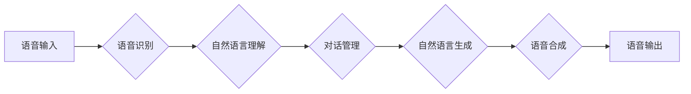

# 一切皆是映射：智能助手和语音交互系统的未来

作者：禅与计算机程序设计艺术

## 1. 背景介绍

### 1.1 从键盘到鼠标，从触摸屏到语音交互

人类与机器的交互方式一直在不断演变。从最初的打孔卡到命令行界面，再到图形用户界面 (GUI) 和触摸屏，每一次进步都极大地提升了人机交互的效率和便捷性。而近年来，随着人工智能 (AI) 技术的飞速发展，语音交互作为一种更自然、更直观的交互方式，正逐渐成为人机交互的新趋势。

### 1.2 语音交互的兴起和智能助手的普及

智能手机、智能音箱等智能设备的普及，为语音交互的应用提供了广阔的平台。苹果的 Siri、谷歌的 Google Assistant、亚马逊的 Alexa、微软的 Cortana 等智能助手，已经深入到人们的日常生活，为用户提供各种便捷的服务，例如语音搜索、日程管理、音乐播放、智能家居控制等等。

### 1.3 语音交互系统的核心挑战

尽管语音交互技术发展迅速，但要实现真正自然、流畅的人机对话，仍然面临着诸多挑战：

* **语音识别 (ASR) 的准确率和鲁棒性**：语音识别是语音交互的基础，但现实环境中的噪声、口音、语速等因素都会影响语音识别的准确率。
* **自然语言理解 (NLU) 的深度和广度**：自然语言理解是语音交互的核心，需要让机器理解用户的意图、情感和上下文，才能做出准确的回应。
* **对话管理 (DM) 的灵活性和智能化**：对话管理负责控制对话的流程，处理用户的多轮对话，并根据用户的反馈调整对话策略。
* **语音合成 (TTS) 的自然度和表现力**：语音合成是语音交互的输出方式，需要合成自然、流畅、富有情感的语音，才能提升用户体验。

## 2. 核心概念与联系

### 2.1 语音交互系统的基本架构

一个典型的语音交互系统通常包括以下几个核心模块：

* **语音识别 (ASR)**：将用户的语音信号转换为文本信息。
* **自然语言理解 (NLU)**：分析文本信息，理解用户的意图和语义。
* **对话管理 (DM)**：管理对话流程，根据用户的输入和系统状态选择合适的动作。
* **自然语言生成 (NLG)**：将系统响应转换为自然语言文本。
* **语音合成 (TTS)**：将文本信息转换为语音信号，输出给用户。



### 2.2  "一切皆是映射" 的理念

"一切皆是映射" 的理念贯穿于整个语音交互系统的设计和实现过程中。

* **语音信号到文本的映射**：语音识别模块将声学信号映射到文本符号序列。
* **文本到语义的映射**：自然语言理解模块将文本信息映射到语义表示，例如意图、实体、关系等。
* **语义到动作的映射**：对话管理模块将语义表示映射到系统动作，例如查询数据库、播放音乐、控制智能家居设备等。
* **动作到文本的映射**：自然语言生成模块将系统动作映射到自然语言文本，用于回复用户。
* **文本到语音的映射**：语音合成模块将文本信息映射到语音信号。

### 2.3 模块之间的相互协作

语音交互系统的各个模块之间并不是孤立的，而是相互协作，共同完成语音交互的任务。例如，自然语言理解模块可以利用语音识别模块提供的置信度信息来辅助语义分析，对话管理模块可以根据自然语言理解模块的输出结果来调整对话策略，等等。

## 3. 核心算法原理具体操作步骤

### 3.1 语音识别 (ASR)

#### 3.1.1  声学特征提取

语音识别第一步是将语音信号转换为声学特征，常用的声学特征包括 MFCC、PLP 等。

#### 3.1.2  声学模型

声学模型用于描述声学特征和音素之间的关系，常用的声学模型包括隐马尔可夫模型 (HMM)、深度神经网络 (DNN) 等。

#### 3.1.3  解码器

解码器用于搜索最有可能的词序列，常用的解码算法包括维特比算法、beam search 等。

### 3.2 自然语言理解 (NLU)

#### 3.2.1  分词和词性标注

分词和词性标注是自然语言处理的基础任务，用于将文本信息切分成词语，并标注每个词语的词性。

#### 3.2.2  命名实体识别

命名实体识别用于识别文本中的实体，例如人名、地名、机构名等。

#### 3.2.3  意图识别和槽位填充

意图识别用于识别用户的意图，例如查询天气、播放音乐等。槽位填充用于提取用户意图相关的参数，例如查询天气的地点、播放音乐的歌曲名等。

### 3.3 对话管理 (DM)

#### 3.3.1  对话状态跟踪

对话状态跟踪用于记录对话的历史信息，例如用户的历史意图、槽位填充结果等。

#### 3.3.2  对话策略学习

对话策略学习用于根据对话状态选择合适的系统动作，常用的对话策略学习方法包括强化学习、深度学习等。

#### 3.3.3  动作执行

动作执行模块负责执行系统动作，例如查询数据库、播放音乐、控制智能家居设备等。

## 4. 数学模型和公式详细讲解举例说明

### 4.1 隐马尔可夫模型 (HMM) 在语音识别中的应用

隐马尔可夫模型 (HMM) 是一种统计模型，用于描述一个系统在不同状态之间的转移概率和每个状态下观测值的概率分布。在语音识别中，HMM 可以用于对语音信号进行建模，其中状态对应于音素，观测值对应于声学特征。

#### 4.1.1  HMM 的基本要素

* 状态集合 $S = \{s_1, s_2, ..., s_N\}$
* 观测值集合 $O = \{o_1, o_2, ..., o_M\}$
* 状态转移概率矩阵 $A = \{a_{ij}\}$, 其中 $a_{ij} = P(s_j|s_i)$ 表示从状态 $s_i$ 转移到状态 $s_j$ 的概率
* 观测值概率矩阵 $B = \{b_j(k)\}$, 其中 $b_j(k) = P(o_k|s_j)$ 表示在状态 $s_j$ 下观测到 $o_k$ 的概率
* 初始状态概率分布 $\pi = \{\pi_i\}$, 其中 $\pi_i = P(s_i)$ 表示初始状态为 $s_i$ 的概率

#### 4.1.2  HMM 的三个基本问题

* **评估问题**：给定 HMM 模型 $\lambda = (A, B, \pi)$ 和观测值序列 $O = \{o_1, o_2, ..., o_T\}$, 计算 $P(O|\lambda)$, 即在模型 $\lambda$ 下观测到序列 $O$ 的概率.
* **解码问题**：给定 HMM 模型 $\lambda = (A, B, \pi)$ 和观测值序列 $O = \{o_1, o_2, ..., o_T\}$, 找到最有可能的状态序列 $S = \{s_1, s_2, ..., s_T\}$.
* **学习问题**：给定观测值序列 $O = \{o_1, o_2, ..., o_T\}$, 估计 HMM 模型 $\lambda = (A, B, \pi)$ 的参数.

### 4.2  循环神经网络 (RNN) 在自然语言处理中的应用

循环神经网络 (RNN) 是一种特殊的神经网络，擅长处理序列数据，例如文本、语音等。RNN 的隐藏层状态可以存储之前的输入信息，因此可以捕捉到序列数据中的长期依赖关系。

#### 4.2.1  RNN 的基本结构

RNN 的基本结构包括输入层、隐藏层和输出层。隐藏层状态 $h_t$ 的更新公式如下：

$$h_t = f(W_{xh}x_t + W_{hh}h_{t-1} + b_h)$$

其中，$x_t$ 表示时刻 $t$ 的输入，$W_{xh}$ 表示输入到隐藏层的权重矩阵，$W_{hh}$ 表示隐藏层到隐藏层的权重矩阵，$b_h$ 表示隐藏层的偏置向量，$f$ 表示激活函数。

#### 4.2.2  RNN 在自然语言处理中的应用

RNN 可以用于各种自然语言处理任务，例如：

* **语言模型**: 预测下一个词语的概率
* **机器翻译**: 将一种语言的句子翻译成另一种语言的句子
* **文本分类**: 将文本信息分类到预定义的类别中
* **问答系统**: 回答用户提出的问题

## 5. 项目实践：代码实例和详细解释说明

### 5.1  使用 Python 实现简单的语音识别系统

```python
import speech_recognition as sr

# 初始化识别器
r = sr.Recognizer()

# 使用麦克风录制语音
with sr.Microphone() as source:
    print("请说话：")
    audio = r.listen(source)

# 识别语音
try:
    text = r.recognize_google(audio, language="zh-CN")
    print("识别结果：" + text)
except sr.UnknownValueError:
    print("无法识别语音")
except sr.RequestError as e:
    print("请求错误：" + str(e))
```

**代码解释**:

1. 首先，我们导入 `speech_recognition` 库，并初始化一个识别器 `r`。
2. 然后，我们使用 `sr.Microphone()` 创建一个麦克风对象 `source`，并使用 `r.listen(source)` 录制语音。
3. 最后，我们使用 `r.recognize_google(audio, language="zh-CN")` 将语音识别成文本，并打印识别结果。

### 5.2  使用 TensorFlow 实现简单的文本分类模型

```python
import tensorflow as tf

# 定义模型
model = tf.keras.models.Sequential([
  tf.keras.layers.Embedding(input_dim=10000, output_dim=16),
  tf.keras.layers.GlobalAveragePooling1D(),
  tf.keras.layers.Dense(16, activation='relu'),
  tf.keras.layers.Dense(1, activation='sigmoid')
])

# 编译模型
model.compile(optimizer='adam',
              loss='binary_crossentropy',
              metrics=['accuracy'])

# 训练模型
model.fit(x_train, y_train, epochs=10)

# 评估模型
loss, accuracy = model.evaluate(x_test, y_test)
print("Loss:", loss)
print("Accuracy:", accuracy)
```

**代码解释**:

1. 首先，我们定义一个简单的文本分类模型，该模型包括一个嵌入层、一个全局平均池化层、一个全连接层和一个 sigmoid 输出层。
2. 然后，我们使用 `model.compile()` 编译模型，指定优化器、损失函数和评估指标。
3. 接下来，我们使用 `model.fit()` 训练模型，传入训练数据和标签。
4. 最后，我们使用 `model.evaluate()` 评估模型，传入测试数据和标签，并打印损失和准确率。

## 6. 实际应用场景

语音交互系统和智能助手在各个领域都有着广泛的应用：

* **智能家居**: 语音控制智能家居设备，例如灯光、空调、电视等。
* **车联网**: 语音交互控制车载系统，例如导航、音乐、电话等。
* **医疗健康**: 语音记录病历、语音问诊、语音提醒服药等。
* **教育**: 语音交互辅助教学、语音评测等。
* **客服**: 语音机器人客服、智能语音导航等。

## 7. 总结：未来发展趋势与挑战

### 7.1 未来发展趋势

* **多模态交互**: 语音交互将与其他交互方式，例如图像、手势等，结合起来，提供更自然、更丰富的交互体验。
* **个性化**: 语音交互系统将更加智能化，能够根据用户的个性、习惯和偏好，提供个性化的服务。
* **情感计算**: 语音交互系统将能够识别和理解用户的情感，并做出相应的回应，例如安慰、鼓励等。
* **端到端**: 语音交互系统的各个模块将更加紧密地集成，形成端到端的解决方案，简化开发流程，提升系统性能。

### 7.2 面临的挑战

* **数据**: 语音交互系统需要大量的训练数据，才能实现高精度和鲁棒性。
* **隐私**: 语音交互系统收集用户的语音信息，如何保护用户隐私是一个重要问题。
* **伦理**: 语音交互系统的设计和应用需要符合伦理道德，避免歧视、偏见等问题。


## 8. 附录：常见问题与解答

### 8.1  如何提高语音识别的准确率？

* **使用高质量的麦克风**: 麦克风的质量会直接影响语音识别的效果。
* **降低环境噪声**: 环境噪声会干扰语音识别，尽量在安静的环境下使用语音交互系统。
* **使用标准的语音**: 使用标准的语音可以提高语音识别的准确率。
* **训练个性化模型**: 针对特定用户或场景训练个性化模型，可以进一步提高语音识别的准确率。

### 8.2  如何设计一个好的语音交互流程？

* **简洁明了**: 语音交互流程应该简洁明了，避免过多的步骤和选项。
* **自然流畅**: 语音交互流程应该自然流畅，符合用户的语言习惯。
* **容错性强**: 语音交互流程应该具有一定的容错性，能够处理用户的误操作和语音识别错误。
* **提供反馈**: 语音交互流程应该及时地向用户提供反馈，例如确认用户的指令、提示下一步操作等。
