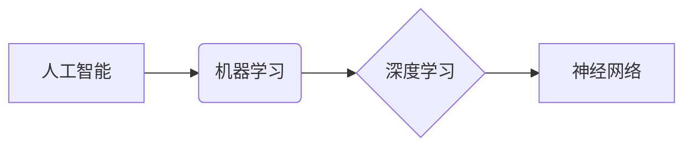

##  1. 背景介绍

### 1.1 人工智能的起源与发展

人工智能(Artificial Intelligence, AI) 的概念最早可以追溯到上世纪50年代，图灵在1950年的论文《计算机器与智能》中提出了著名的“图灵测试”，为人工智能的发展奠定了基础。此后，人工智能经历了几次高潮和低谷，近年来，随着计算能力的提升、大数据的涌现以及深度学习算法的突破，人工智能迎来了新一轮的快速发展。

### 1.2 人工智能的定义与分类

人工智能是指利用计算机模拟人类智能的技术，其目标是使机器能够像人类一样思考、学习和解决问题。根据人工智能的能力强弱，可以将其分为弱人工智能、强人工智能和超人工智能三种类型。

* **弱人工智能 (ANI)**：只能完成特定领域的任务，例如图像识别、语音识别等。
* **强人工智能 (AGI)**：能够像人类一样进行思考、学习和解决问题，具备通用智能。
* **超人工智能 (ASI)**：在所有领域都超越人类智能。

### 1.3 人工智能的应用领域

人工智能已经渗透到各个领域，例如：

* **自然语言处理 (NLP)**：机器翻译、语音识别、文本生成等。
* **计算机视觉 (CV)**：图像识别、目标检测、人脸识别等。
* **数据挖掘与机器学习 (DM & ML)**：推荐系统、风险控制、精准营销等。
* **机器人技术 (Robotics)**：工业机器人、服务机器人、无人驾驶等。

## 2. 核心概念与联系

### 2.1 机器学习

机器学习是人工智能的核心，其基本思想是让机器从数据中学习规律，并利用学习到的规律对未知数据进行预测。机器学习算法可以分为以下几类：

* **监督学习 (Supervised Learning)**：从带有标签的数据中学习，例如分类、回归等。
* **无监督学习 (Unsupervised Learning)**：从没有标签的数据中学习，例如聚类、降维等。
* **强化学习 (Reinforcement Learning)**：通过与环境交互学习，例如游戏AI、机器人控制等。

### 2.2 深度学习

深度学习是机器学习的一种，其特点是使用多层神经网络进行学习。深度学习在图像识别、语音识别等领域取得了突破性进展。

### 2.3 神经网络

神经网络是模拟人脑神经元结构的计算模型，它由多个神经元组成，神经元之间通过权重连接。深度学习使用的多层神经网络通常包含输入层、隐藏层和输出层。

### 2.4 核心概念之间的联系

机器学习是人工智能的核心，深度学习是机器学习的一种，而神经网络是深度学习的基础。



## 3. 核心算法原理具体操作步骤

### 3.1 线性回归

线性回归是一种监督学习算法，用于预测连续值。其基本思想是找到一条直线或超平面，使得所有样本点到该直线或超平面的距离之和最小。

#### 3.1.1 算法原理

线性回归的目标函数是均方误差 (Mean Squared Error, MSE)：

$$
J(\theta) = \frac{1}{2m} \sum_{i=1}^{m}(h_{\theta}(x^{(i)}) - y^{(i)})^2
$$

其中，$h_{\theta}(x)$ 是预测值，$y$ 是真实值，$m$ 是样本数量，$\theta$ 是模型参数。

#### 3.1.2 具体操作步骤

1. 准备数据：收集并清洗数据，将数据分为训练集和测试集。
2. 选择模型：选择线性回归模型。
3. 训练模型：使用梯度下降等优化算法最小化目标函数，得到模型参数。
4. 评估模型：使用测试集评估模型性能，例如使用均方误差、决定系数等指标。
5. 预测：使用训练好的模型对新数据进行预测。

### 3.2 逻辑回归

逻辑回归是一种监督学习算法，用于预测离散值，通常用于二分类问题。其基本思想是将线性回归的输出值映射到sigmoid函数，得到概率值。

#### 3.2.1 算法原理

逻辑回归的预测函数是：

$$
h_{\theta}(x) = g(\theta^T x)
$$

其中，$g(z)$ 是sigmoid函数：

$$
g(z) = \frac{1}{1 + e^{-z}}
$$

逻辑回归的目标函数是对数似然函数：

$$
J(\theta) = -\frac{1}{m} \sum_{i=1}^{m} [y^{(i)} \log(h_{\theta}(x^{(i)})) + (1 - y^{(i)}) \log(1 - h_{\theta}(x^{(i)}))]
$$

#### 3.2.2 具体操作步骤

1. 准备数据：收集并清洗数据，将数据分为训练集和测试集。
2. 选择模型：选择逻辑回归模型。
3. 训练模型：使用梯度下降等优化算法最大化目标函数，得到模型参数。
4. 评估模型：使用测试集评估模型性能，例如使用准确率、精确率、召回率等指标。
5. 预测：使用训练好的模型对新数据进行预测。

### 3.3 K近邻算法 (KNN)

KNN是一种简单但有效的监督学习算法，既可以用于分类，也可以用于回归。其基本思想是找到距离目标样本最近的K个样本，然后根据这K个样本的标签进行预测。

#### 3.3.1 算法原理

KNN算法没有显式的训练过程，其预测过程如下：

1. 计算目标样本与训练集中所有样本的距离。
2. 选择距离目标样本最近的K个样本。
3. 如果是分类问题，则根据这K个样本中出现次数最多的类别进行预测；如果是回归问题，则将这K个样本的平均值作为预测值。

#### 3.3.2 具体操作步骤

1. 准备数据：收集并清洗数据，将数据分为训练集和测试集。
2. 选择模型：选择KNN模型。
3. 确定参数：确定K值。
4. 预测：使用KNN算法对新数据进行预测。

## 4. 数学模型和公式详细讲解举例说明

### 4.1 线性回归的数学模型

线性回归的数学模型可以表示为：

$$
y = \theta_0 + \theta_1 x_1 + \theta_2 x_2 + ... + \theta_n x_n
$$

其中，$y$ 是预测值，$x_1, x_2, ..., x_n$ 是特征，$\theta_0, \theta_1, \theta_2, ..., \theta_n$ 是模型参数。

#### 4.1.1 例子

假设我们想根据房屋面积和房间数量预测房屋价格，可以使用线性回归模型：

$$
\text{价格} = \theta_0 + \theta_1 \times \text{面积} + \theta_2 \times \text{房间数量}
$$

其中，$\theta_0$ 是截距，$\theta_1$ 是面积的权重，$\theta_2$ 是房间数量的权重。

### 4.2 逻辑回归的数学模型

逻辑回归的数学模型可以表示为：

$$
p = \frac{1}{1 + e^{-(\theta_0 + \theta_1 x_1 + \theta_2 x_2 + ... + \theta_n x_n)}}
$$

其中，$p$ 是预测概率，$x_1, x_2, ..., x_n$ 是特征，$\theta_0, \theta_1, \theta_2, ..., \theta_n$ 是模型参数。

#### 4.2.1 例子

假设我们想根据用户的年龄和收入预测用户是否会点击广告，可以使用逻辑回归模型：

$$
p(\text{点击}) = \frac{1}{1 + e^{-(\theta_0 + \theta_1 \times \text{年龄} + \theta_2 \times \text{收入})}}
$$

其中，$p(\text{点击})$ 是用户点击广告的概率，$\theta_0$ 是截距，$\theta_1$ 是年龄的权重，$\theta_2$ 是收入的权重。

## 5. 项目实践：代码实例和详细解释说明

### 5.1 使用Python实现线性回归

```python
import numpy as np
from sklearn.linear_model import LinearRegression
from sklearn.model_selection import train_test_split
from sklearn.metrics import mean_squared_error

# 准备数据
X = np.array([[100], [150], [200], [250], [300]])
y = np.array([15, 20, 25, 30, 35])

# 将数据分为训练集和测试集
X_train, X_test, y_train, y_test = train_test_split(X, y, test_size=0.2, random_state=42)

# 创建线性回归模型
model = LinearRegression()

# 训练模型
model.fit(X_train, y_train)

# 预测
y_pred = model.predict(X_test)

# 评估模型
mse = mean_squared_error(y_test, y_pred)
print("均方误差:", mse)
```

### 5.2 使用Python实现逻辑回归

```python
import numpy as np
from sklearn.linear_model import LogisticRegression
from sklearn.model_selection import train_test_split
from sklearn.metrics import accuracy_score

# 准备数据
X = np.array([[20, 50000], [25, 60000], [30, 70000], [35, 80000], [40, 90000]])
y = np.array([0, 0, 1, 1, 1])

# 将数据分为训练集和测试集
X_train, X_test, y_train, y_test = train_test_split(X, y, test_size=0.2, random_state=42)

# 创建逻辑回归模型
model = LogisticRegression()

# 训练模型
model.fit(X_train, y_train)

# 预测
y_pred = model.predict(X_test)

# 评估模型
accuracy = accuracy_score(y_test, y_pred)
print("准确率:", accuracy)
```

## 6. 实际应用场景

### 6.1 图像识别

* 人脸识别：用于身份验证、安防监控等。
* 物体检测：用于自动驾驶、智能安防等。
* 图像分类：用于电商平台商品分类、医疗影像诊断等。

### 6.2 自然语言处理

* 机器翻译：用于跨语言交流、文档翻译等。
* 语音识别：用于语音助手、智能客服等。
* 文本生成：用于自动写作、聊天机器人等。

### 6.3 数据挖掘与机器学习

* 推荐系统：用于电商平台商品推荐、视频网站内容推荐等。
* 风险控制：用于金融行业反欺诈、信用评估等。
* 精准营销：用于广告投放、用户画像等。

## 7. 工具和资源推荐

### 7.1 Python库

* NumPy：用于科学计算。
* Pandas：用于数据分析。
* Scikit-learn：用于机器学习。
* TensorFlow：用于深度学习。
* PyTorch：用于深度学习。

### 7.2 在线课程

* Coursera：提供各种人工智能课程。
* Udacity：提供纳米学位课程。
* edX：提供来自世界顶尖大学的课程。

### 7.3 书籍

* 《机器学习实战》：入门书籍。
* 《深度学习》：深度学习领域的经典书籍。
* 《Python机器学习》：使用Python进行机器学习的实践指南。

## 8. 总结：未来发展趋势与挑战

### 8.1 未来发展趋势

* 人工智能将更加普及和智能化，应用领域将更加广泛。
* 人工智能与其他技术的融合将更加紧密，例如物联网、云计算等。
* 人工智能的伦理和社会影响将越来越受到关注。

### 8.2 面临的挑战

* 数据隐私和安全问题。
* 人工智能的可解释性和可信度问题。
* 人工智能的伦理和社会影响问题。

## 9. 附录：常见问题与解答

### 9.1 什么是人工智能？

人工智能是指利用计算机模拟人类智能的技术，其目标是使机器能够像人类一样思考、学习和解决问题。

### 9.2 人工智能有哪些应用领域？

人工智能的应用领域非常广泛，例如图像识别、自然语言处理、数据挖掘、机器人技术等。

### 9.3 学习人工智能需要哪些基础？

学习人工智能需要一定的数学基础，例如线性代数、微积分、概率论等，还需要掌握一门编程语言，例如Python。
