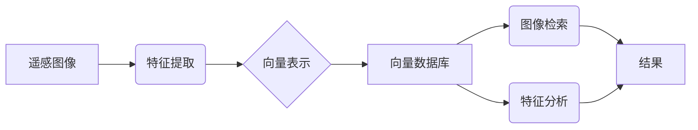

## 利用向量数据库进行高效的遥感图像处理

作者：禅与计算机程序设计艺术

## 1. 背景介绍

### 1.1 遥感图像处理的意义

遥感技术，作为一种获取地球表面信息的重要手段，近年来发展迅速，并在资源调查、环境监测、城市规划、灾害预警等领域发挥着越来越重要的作用。然而，海量的遥感数据也给数据处理和分析带来了巨大的挑战。传统的遥感图像处理方法通常依赖于像素级的操作，难以有效地处理大规模、高维度、多时相的遥感数据。

### 1.2 向量数据库的兴起

近年来，向量数据库作为一种新型的数据管理技术，凭借其高效的向量检索和分析能力，在人工智能、机器学习等领域得到了广泛应用。向量数据库能够将高维数据（如图像、文本、音频等）转化为向量表示，并通过计算向量之间的相似度进行快速检索和分析。

### 1.3 向量数据库与遥感图像处理的结合

将向量数据库应用于遥感图像处理，可以有效地解决传统方法面临的挑战。通过将遥感图像转化为向量表示，并存储在向量数据库中，可以实现以下目标：

* **高效的图像检索：** 利用向量数据库的快速检索能力，可以快速地从海量遥感数据中检索出与目标图像相似的图像，例如，查找同一地区不同时间的图像、查找具有相似特征的不同地区的图像等。
* **快速的特征提取：** 向量数据库可以用于存储和管理从遥感图像中提取的特征向量，例如，利用深度学习模型提取的图像特征。
* **便捷的数据分析：** 向量数据库提供了丰富的分析工具，可以用于对遥感图像进行聚类、分类、异常检测等分析。

## 2. 核心概念与联系

### 2.1 遥感图像的向量表示

将遥感图像转化为向量表示是利用向量数据库进行遥感图像处理的关键步骤。常用的向量表示方法包括：

* **基于特征的表示：** 从遥感图像中提取颜色、纹理、形状等特征，并将其组合成一个特征向量。
* **基于深度学习的表示：** 利用预训练的深度学习模型（如卷积神经网络）提取图像特征，并将最后一层的输出作为图像的向量表示。

### 2.2 向量数据库的基本概念

向量数据库是一种专门用于存储和查询向量的数据库。与传统的关系型数据库不同，向量数据库使用向量之间的距离度量来进行相似性搜索。常见的向量数据库包括：

* **Faiss:** Facebook AI Similarity Search，由 Facebook 开发的高效向量检索库。
* **Milvus:** 一款开源的云原生向量数据库，支持多种向量索引和距离度量。
* **Pinecone:** 一款商业化的向量数据库，提供高性能、可扩展的向量检索服务。

### 2.3 核心概念之间的联系

下图展示了利用向量数据库进行遥感图像处理的核心概念之间的联系：



## 3. 核心算法原理具体操作步骤

### 3.1 数据预处理

在将遥感图像存储到向量数据库之前，通常需要进行一些预处理操作，例如：

* **图像裁剪：** 将图像裁剪为统一的大小，以便于存储和处理。
* **辐射校正：** 消除传感器和大气对图像的影响，提高图像的精度。
* **几何校正：** 校正图像的几何畸变，使图像与地理坐标系对齐。

### 3.2 特征提取

特征提取是将遥感图像转化为向量表示的关键步骤。常用的特征提取方法包括：

* **颜色特征：** 例如，RGB颜色直方图、颜色矩等。
* **纹理特征：** 例如，灰度共生矩阵、局部二值模式等。
* **形状特征：** 例如，边缘检测、形状描述符等。
* **深度学习特征：** 利用预训练的深度学习模型提取图像特征。

### 3.3 向量存储

将提取的特征向量存储到向量数据库中，以便于后续的检索和分析。

### 3.4 相似性搜索

利用向量数据库的相似性搜索功能，可以快速地从海量遥感数据中检索出与目标图像相似的图像。

### 3.5 结果分析

对检索结果进行分析，例如，可视化检索结果、计算图像之间的相似度等。

## 4. 数学模型和公式详细讲解举例说明

### 4.1 向量距离度量

向量数据库使用向量之间的距离度量来进行相似性搜索。常用的距离度量包括：

* **欧氏距离：** $$d(x, y) = \sqrt{\sum_{i=1}^{n}(x_i - y_i)^2}$$
* **曼哈顿距离：** $$d(x, y) = \sum_{i=1}^{n}|x_i - y_i|$$
* **余弦相似度：** $$cos(\theta) = \frac{x \cdot y}{||x|| ||y||}$$

### 4.2 向量索引

为了加速相似性搜索，向量数据库通常使用向量索引技术。常用的向量索引包括：

* **树状索引：** 例如，KD树、球树等。
* **哈希索引：** 例如，局部敏感哈希（LSH）等。
* **图索引：** 例如，近似最近邻图（ANNG）等。

## 5. 项目实践：代码实例和详细解释说明

### 5.1 Python代码示例

以下是一个使用 Milvus 向量数据库进行遥感图像检索的 Python 代码示例：

```python
from milvus import Milvus, DataType
from PIL import Image
import numpy as np

# 连接 Milvus 服务器
client = Milvus(host='localhost', port='19530')

# 创建集合
collection_name = 'remote_sensing_images'
dim = 512  # 特征向量维度
client.create_collection(
    collection_name=collection_name,
    fields=[
        {'name': 'id', 'type': DataType.INT64, 'is_primary': True},
        {'name': 'vector', 'type': DataType.FLOAT_VECTOR, 'dim': dim}
    ]
)

# 插入数据
image_paths = ['image1.jpg', 'image2.jpg', 'image3.jpg']
vectors = []
for image_path in image_paths:
    # 加载图像并提取特征
    image = Image.open(image_path)
    # ... 特征提取代码 ...
    vector = np.random.rand(dim).astype(np.float32)  # 随机生成特征向量
    vectors.append(vector)

# 插入数据到 Milvus
client.insert(
    collection_name=collection_name,
    entities=[
        {'id': i + 1, 'vector': vector} for i, vector in enumerate(vectors)
    ]
)

# 搜索相似图像
query_image_path = 'query_image.jpg'
# 加载查询图像并提取特征
query_image = Image.open(query_image_path)
# ... 特征提取代码 ...
query_vector = np.random.rand(dim).astype(np.float32)  # 随机生成特征向量

# 搜索相似图像
search_params = {'metric_type': 'L2', 'params': {'nprobe': 10}}
results = client.search(
    collection_name=collection_name,
    query_records=[query_vector],
    top_k=10,
    params=search_params
)

# 打印检索结果
print(results)

# 关闭连接
client.close()
```

### 5.2 代码解释

* 首先，连接 Milvus 服务器并创建一个名为 `remote_sensing_images` 的集合。
* 然后，加载三张遥感图像，并使用随机生成的特征向量将其插入到 Milvus 中。
* 接下来，加载查询图像并提取其特征向量。
* 使用 `client.search()` 方法搜索与查询图像相似的图像，并指定搜索参数，例如使用的距离度量和索引类型。
* 最后，打印检索结果并关闭与 Milvus 服务器的连接。

## 6. 实际应用场景

向量数据库在遥感图像处理领域有着广泛的应用场景，例如：

* **土地利用分类：** 利用向量数据库可以对遥感图像进行快速分类，例如，识别耕地、林地、水体等不同类型的土地利用。
* **目标检测：** 利用向量数据库可以快速地从遥感图像中检测出感兴趣的目标，例如，建筑物、车辆、船舶等。
* **变化检测：** 利用向量数据库可以比较不同时间的遥感图像，识别出发生变化的区域，例如，森林砍伐、城市扩张等。
* **灾害监测：** 利用向量数据库可以快速地从遥感图像中识别出灾害区域，例如，洪水、地震、火灾等。

## 7. 工具和资源推荐

* **Faiss:** https://github.com/facebookresearch/faiss
* **Milvus:** https://milvus.io/
* **Pinecone:** https://www.pinecone.io/
* **GDAL:** https://gdal.org/
* **OpenCV:** https://opencv.org/
* **Scikit-learn:** https://scikit-learn.org/

## 8. 总结：未来发展趋势与挑战

### 8.1 未来发展趋势

* **更强大的向量表示方法：** 随着深度学习技术的发展，将出现更强大的向量表示方法，能够更好地捕捉遥感图像的特征。
* **更高效的向量数据库：** 向量数据库技术将不断发展，提供更高效的向量存储、索引和检索能力。
* **更广泛的应用场景：** 随着向量数据库技术的普及，将涌现出更多利用向量数据库进行遥感图像处理的应用场景。

### 8.2 面临的挑战

* **数据质量：** 遥感图像的质量对特征提取和相似性搜索的结果有很大影响，因此需要有效的数据预处理方法来提高数据质量。
* **计算资源：** 处理海量遥感数据需要大量的计算资源，因此需要开发高效的算法和系统来降低计算成本。
* **领域知识：** 将向量数据库应用于遥感图像处理需要一定的领域知识，例如，对遥感图像特征的理解、对不同应用场景的分析等。

## 9. 附录：常见问题与解答

### 9.1 如何选择合适的向量数据库？

选择合适的向量数据库需要考虑以下因素：

* **数据规模：** 不同的向量数据库适用于不同规模的数据集。
* **性能需求：** 不同的向量数据库提供不同的性能指标，例如，检索速度、插入速度等。
* **功能需求：** 不同的向量数据库提供不同的功能，例如，距离度量、索引类型等。
* **成本：** 不同的向量数据库有不同的成本，包括硬件成本、软件成本等。

### 9.2 如何评估向量数据库的性能？

可以使用以下指标来评估向量数据库的性能：

* **召回率：** 检索到的相关结果数量占所有相关结果数量的比例。
* **精确率：** 检索到的相关结果数量占所有检索结果数量的比例。
* **查询延迟：** 执行查询所需的平均时间。
* **插入速度：** 每秒可以插入的向量数量。

### 9.3 如何提高遥感图像检索的精度？

可以尝试以下方法来提高遥感图像检索的精度：

* **使用更强大的特征提取方法：** 例如，使用深度学习模型提取图像特征。
* **使用更合适的距离度量：** 不同的距离度量适用于不同的数据分布。
* **优化向量数据库参数：** 例如，调整索引类型、搜索参数等。
