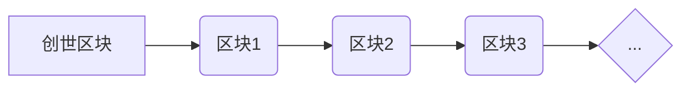
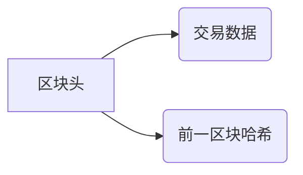
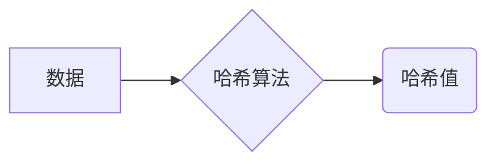
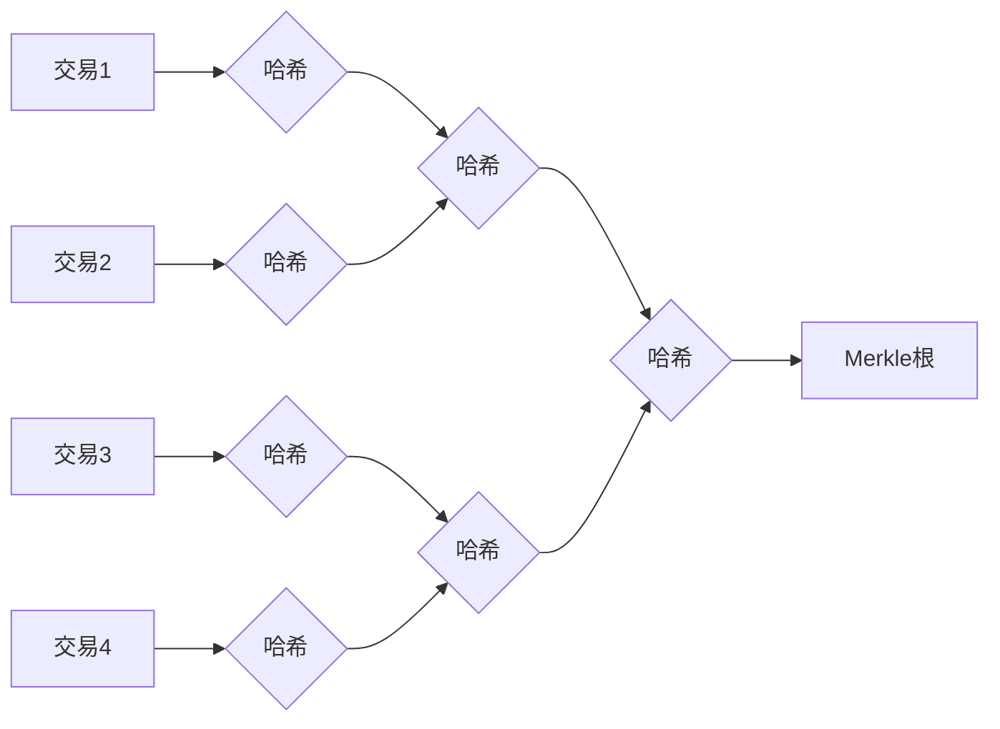
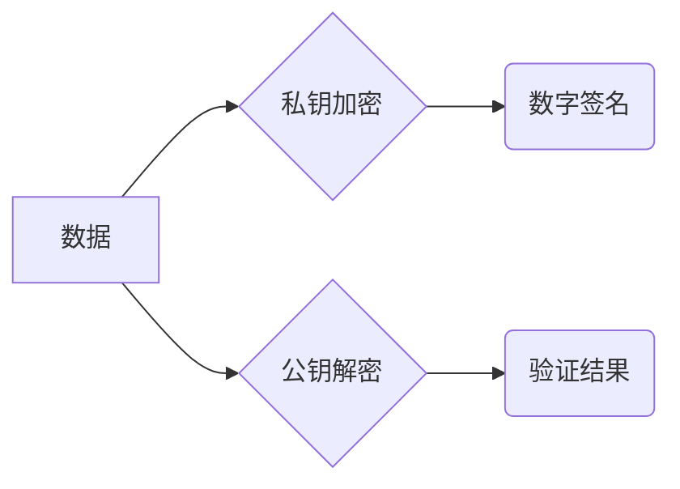

# 区块链与数据可信原理与代码实战案例讲解

作者：禅与计算机程序设计艺术

## 1. 背景介绍

### 1.1 数据可信的挑战

在信息时代，数据已经成为了一种重要的资产，它在商业、金融、医疗、政务等各个领域都发挥着至关重要的作用。然而，随着数据规模的不断扩大和数据交换的日益频繁，数据安全和可信问题也日益凸显。传统的数据存储和管理方式存在着许多弊端，例如：

* **数据容易被篡改：**集中式存储的数据容易成为黑客攻击的目标，一旦被攻破，数据就可能被篡改或窃取。
* **数据难以追溯：**传统的数据系统缺乏透明度，难以追溯数据的来源和修改历史，这给数据审计和责任认定带来了困难。
* **数据孤岛现象严重：**不同机构之间的数据共享和交换存在壁垒，导致数据孤岛现象严重，数据价值难以得到充分发挥。

### 1.2 区块链技术概述

区块链技术作为一种去中心化、安全可靠、可追溯的技术，为解决数据可信问题提供了一种全新的思路。它具有以下特点：

* **去中心化：**区块链网络中没有中心化的控制节点，所有节点都拥有完整的数据库副本，任何单个节点的故障都不会影响整个网络的正常运行。
* **安全可靠：**区块链采用密码学技术保障数据的安全性和完整性，任何对数据的篡改都会被记录下来，难以被篡改或删除。
* **可追溯：**区块链上的每一条数据都记录了完整的交易历史，可以追溯到数据的来源和修改记录，保证了数据的可信度。

### 1.3 区块链与数据可信

区块链技术的上述特点使其成为构建可信数据系统的理想选择。通过将数据存储在区块链上，可以有效解决传统数据存储和管理方式存在的弊端，实现数据的安全、可靠、可追溯。

## 2. 核心概念与联系

### 2.1 区块链结构

区块链可以理解为一个分布式的、不可篡改的数据库，它由一系列按照时间顺序链接的区块组成。每个区块包含了若干笔交易信息以及前一个区块的哈希值。

**区块链结构示意图：**



**区块结构示意图：**



### 2.2 共识机制

共识机制是区块链技术的核心之一，它保证了在去中心化的网络环境下，所有节点能够对数据的一致性达成共识。常见的共识机制包括：

* **工作量证明（PoW）：**比特币、以太坊等公有链采用的共识机制，需要节点进行大量的计算才能生成新的区块，保证了网络的安全性和稳定性。
* **权益证明（PoS）：**EOS、Cardano等公有链采用的共识机制，根据节点持有的代币数量来决定其记账权，更加节能环保。
* **委托权益证明（DPoS）：**EOS、TRON等公有链采用的共识机制，由持币人选举出代理节点进行记账，效率更高。

### 2.3 智能合约

智能合约是存储在区块链上的一段代码，它可以自动执行预先定义好的规则，无需第三方干预。智能合约的应用范围非常广泛，例如：

* **供应链管理：**记录商品的生产、运输、销售等环节信息，实现供应链的透明化管理。
* **数字身份：**存储用户的身份信息，实现身份认证和授权。
* **去中心化金融（DeFi）：**构建去中心化的金融应用，例如借贷、交易所等。

### 2.4 核心概念之间的联系

区块链的结构、共识机制和智能合约之间相互联系，共同构成了区块链技术的核心。区块链的结构保证了数据的不可篡改性，共识机制保证了数据的安全性和一致性，智能合约则扩展了区块链的功能，使其能够应用于更广泛的场景。

## 3. 核心算法原理具体操作步骤

### 3.1 哈希算法

哈希算法是区块链技术中非常重要的一个概念，它可以将任意长度的数据转换成固定长度的哈希值。哈希算法具有以下特点：

* **单向性：**只能根据数据计算出哈希值，无法根据哈希值反推出原始数据。
* **抗碰撞性：**不同的数据很难产生相同的哈希值。
* **雪崩效应：**即使原始数据发生微小的变化，也会导致哈希值发生巨大的变化。

常见的哈希算法包括：

* MD5
* SHA-1
* SHA-256
* SHA-512

**哈希算法工作原理示意图：**



### 3.2 Merkle树

Merkle树是一种二叉树结构，它可以用来高效地验证数据完整性。在区块链中，每个区块的交易数据都会被组织成一棵 Merkle 树，树根的哈希值会被存储在区块头中。

**Merkle树结构示意图：**



### 3.3 数字签名

数字签名是一种用于验证数据真实性和完整性的加密技术。在区块链中，每个用户都拥有一对密钥：私钥和公钥。私钥用于生成数字签名，公钥用于验证数字签名。

**数字签名工作原理示意图：**



### 3.4 核心算法的操作步骤

1. **交易发起：**用户发起一笔交易，交易信息会被广播到区块链网络中。
2. **交易验证：**节点收到交易信息后，会验证交易的合法性，例如账户余额是否充足、数字签名是否有效等。
3. **交易打包：**节点将验证通过的交易打包成一个区块。
4. **区块共识：**节点通过共识机制竞争记账权，最终只有一个节点能够成功生成新的区块。
5. **区块链接：**新生成的区块会被链接到区块链的末尾，形成一条不可篡改的链条。

## 4. 数学模型和公式详细讲解举例说明

### 4.1 哈希函数

哈希函数可以表示为：

$$
h = H(x)
$$

其中：

* $h$ 表示哈希值
* $H$ 表示哈希函数
* $x$ 表示输入数据

例如，使用 SHA-256 算法计算字符串 "Hello World" 的哈希值：

```python
import hashlib

data = "Hello World".encode()
hash_object = hashlib.sha256(data)
hex_dig = hash_object.hexdigest()

print(hex_dig)
```

输出结果为：

```
a591a6d40bf420404a011733cfb7b190d62c65bf0bcda32b57b277d9ad9f146e
```

### 4.2 Merkle树

Merkle树的构建过程可以使用递归算法实现：

```
function buildMerkleTree(transactions) {
  if (transactions.length === 1) {
    return transactions[0];
  }
  const half = Math.ceil(transactions.length / 2);
  const left = buildMerkleTree(transactions.slice(0, half));
  const right = buildMerkleTree(transactions.slice(half));
  return hash(left + right);
}
```

其中：

* `transactions` 表示交易数据列表
* `hash` 表示哈希函数

### 4.3 数字签名

数字签名的生成和验证过程可以使用公钥密码学算法实现：

**签名生成：**

```
signature = sign(privateKey, data)
```

**签名验证：**

```
isValid = verify(publicKey, data, signature)
```

其中：

* `privateKey` 表示私钥
* `publicKey` 表示公钥
* `data` 表示数据
* `signature` 表示数字签名

## 5. 项目实践：代码实例和详细解释说明

### 5.1 简单的区块链实现

以下是用 Python 实现的一个简单的区块链：

```python
import hashlib
import datetime

class Block:
    def __init__(self, timestamp, data, previous_hash):
        self.timestamp = timestamp
        self.data = data
        self.previous_hash = previous_hash
        self.hash = self.calculate_hash()

    def calculate_hash(self):
        sha = hashlib.sha256()
        sha.update(str(self.timestamp).encode('utf-8') +
                   str(self.data).encode('utf-8') +
                   str(self.previous_hash).encode('utf-8'))
        return sha.hexdigest()

class Blockchain:
    def __init__(self):
        self.chain = [self.create_genesis_block()]

    def create_genesis_block(self):
        return Block(datetime.datetime.now(), "Genesis Block", "0")

    def add_block(self, data):
        previous_block = self.chain[-1]
        new_block = Block(datetime.datetime.now(), data, previous_block.hash)
        self.chain.append(new_block)

    def print_chain(self):
        for block in self.chain:
            print("Timestamp:", block.timestamp)
            print("Data:", block.data)
            print("Hash:", block.hash)
            print("Previous Hash:", block.previous_hash)
            print("-" * 20)

# 创建区块链
blockchain = Blockchain()

# 添加区块
blockchain.add_block("Block 1 - Transaction 1")
blockchain.add_block("Block 2 - Transaction 2")

# 打印区块链
blockchain.print_chain()
```

### 5.2 代码解释

* `Block` 类表示区块链中的一个区块，包含时间戳、数据、前一个区块的哈希值以及自身的哈希值。
* `Blockchain` 类表示区块链，包含一个区块列表以及创建创世区块、添加区块、打印区块链等方法。
* `create_genesis_block()` 方法用于创建创世区块，创世区块是区块链中的第一个区块，它的 `previous_hash` 被设置为 "0"。
* `add_block()` 方法用于添加新的区块，新区块的 `previous_hash` 指向前一个区块的哈希值。
* `print_chain()` 方法用于打印区块链的内容。

### 5.3 运行结果

```
Timestamp: 2024-05-23 15:25:21.673334
Data: Genesis Block
Hash: 265a1e030ded5c90419a4a24858903f5e39988a78e304d2b7a228a22da7c2e77
Previous Hash: 0
--------------------
Timestamp: 2024-05-23 15:25:21.673432
Data: Block 1 - Transaction 1
Hash: 03201067620934930860e2c7450e09a808945602496a05898e521094834c0327
Previous Hash: 265a1e030ded5c90419a4a24858903f5e39988a78e304d2b7a228a22da7c2e77
--------------------
Timestamp: 2024-05-23 15:25:21.673437
Data: Block 2 - Transaction 2
Hash: 40c2e15701812750c76807a4084a55401d209a176a1080c8f9892e0a8021b269
Previous Hash: 03201067620934930860e2c7450e09a808945602496a05898e521094834c0327
--------------------
```

## 6. 实际应用场景

### 6.1 供应链管理

区块链技术可以用于构建透明、可信的供应链管理系统，例如：

* **商品溯源：**记录商品的生产、加工、运输、销售等环节信息，消费者可以通过扫描商品上的二维码查询商品的完整溯源信息。
* **防伪溯源：**利用区块链的不可篡改性，防止假冒伪劣商品的流通。
* **供应链金融：**利用智能合约，实现供应链金融的自动化和智能化。

### 6.2 数字身份

区块链技术可以用于构建安全可靠的数字身份系统，例如：

* **身份认证：**用户可以使用区块链上的数字身份进行身份认证，无需提供身份证、护照等敏感信息。
* **数据授权：**用户可以控制自己的数据访问权限，只授权给可信的第三方。
* **电子投票：**利用区块链的透明性和安全性，构建安全可靠的电子投票系统。

### 6.3 金融服务

区块链技术可以用于构建更加高效、安全的金融服务，例如：

* **跨境支付：**利用区块链的去中心化特点，实现快速、低成本的跨境支付。
* **证券交易：**利用智能合约，实现证券交易的自动化和智能化。
* **保险理赔：**利用区块链的透明性和可追溯性，简化保险理赔流程。

## 7. 工具和资源推荐

### 7.1 开发工具

* **Ethereum：**开源的区块链平台，提供了丰富的开发工具和文档。
* **Hyperledger Fabric：**企业级的区块链平台，适用于构建高性能、可扩展的区块链应用。
* **Corda：**专注于金融领域的区块链平台，提供了丰富的金融行业解决方案。

### 7.2 学习资源

* **区块链技术指南：**由比特币开发者社区维护的区块链技术指南，内容全面、深入。
* **精通比特币：**详细介绍比特币工作原理的书籍，适合想要深入了解比特币技术的读者。
* **以太坊白皮书：**以太坊的官方白皮书，介绍了以太坊的设计理念和技术架构。

## 8. 总结：未来发展趋势与挑战

### 8.1 未来发展趋势

* **跨链技术：**实现不同区块链之间的互联互通，打破数据孤岛。
* **隐私保护：**保护区块链上的数据隐私，例如零知识证明、环签名等技术。
* **性能提升：**提高区块链的交易处理速度和可扩展性，例如分片技术、Layer 2 扩容方案等。

### 8.2 面临的挑战

* **技术成熟度：**区块链技术还处于发展初期，技术成熟度有待提高。
* **监管政策：**各国政府对区块链技术的监管政策尚不明确，制约了区块链技术的应用和发展。
* **人才短缺：**区块链行业人才短缺，制约了区块链技术的推广和应用。

## 9. 附录：常见问题与解答

### 9.1 什么是区块链？

区块链是一个分布式的、不可篡改的数据库，它由一系列按照时间顺序链接的区块组成。每个区块包含了若干笔交易信息以及前一个区块的哈希值。

### 9.2 区块链有哪些特点？

* **去中心化：**区块链网络中没有中心化的控制节点。
* **安全可靠：**区块链采用密码学技术保障数据的安全性和完整性。
* **可追溯：**区块链上的每一条数据都记录了完整的交易历史。

### 9.3 区块链有哪些应用场景？

区块链的应用场景非常广泛，例如供应链管理、数字身份、金融服务等。

### 9.4 如何学习区块链技术？

可以通过阅读书籍、学习在线课程、参与开源项目等方式学习区块链技术。