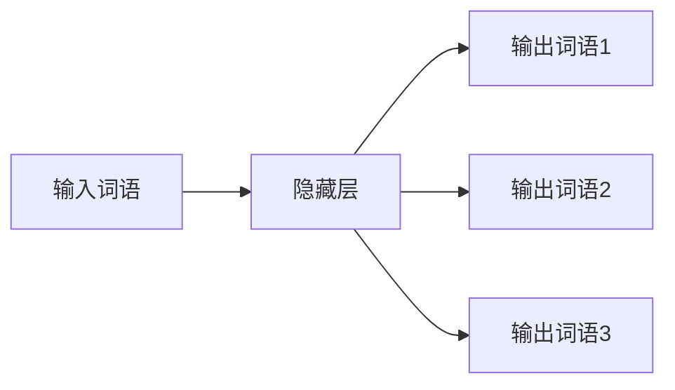

# 大语言模型原理与工程实践：输入模块

作者：禅与计算机程序设计艺术

## 1. 背景介绍

### 1.1 大语言模型的兴起与挑战

近年来，随着深度学习技术的飞速发展，大语言模型（Large Language Model, LLM）在自然语言处理领域取得了突破性进展。从 GPT-3 到 ChatGPT，这些模型展现出惊人的语言理解和生成能力，并在文本创作、机器翻译、代码生成等方面展现出巨大潜力。

然而，构建和应用大语言模型也面临着诸多挑战，其中一个关键挑战是如何有效地将用户的输入信息传递给模型，并确保模型能够准确理解和处理这些信息。

### 1.2 输入模块的重要性

输入模块作为大语言模型与用户交互的桥梁，其设计和实现对模型的整体性能和用户体验至关重要。一个高效的输入模块能够：

- 将不同形式的用户输入（如文本、语音、图像等）转换为模型能够理解的统一表示形式。
- 对输入信息进行预处理和优化，提高模型的效率和准确性。
- 提供用户友好的交互方式，降低用户使用门槛。

### 1.3 本文目标

本文将深入探讨大语言模型输入模块的设计与实现，内容涵盖：

- 输入模块的核心概念和功能
- 常用的输入表示方法
- 输入预处理和优化的关键技术
- 输入模块的评估指标和方法
- 未来发展趋势和挑战

通过本文的介绍，读者将对大语言模型输入模块有一个全面深入的了解，并能够根据实际需求设计和实现高效的输入模块。

## 2. 核心概念与联系

### 2.1 输入模块的功能和作用

输入模块的主要功能是将用户的输入信息转换为模型能够理解的表示形式，并将其传递给模型进行处理。具体来说，输入模块需要完成以下任务：

- **输入接收:** 接收来自用户的各种形式的输入信息，例如文本、语音、图像等。
- **模态转换:** 将不同模态的输入信息转换为统一的文本表示形式。
- **分词:** 将文本序列分割成一个个独立的词语或字符。
- **词嵌入:** 将词语或字符映射到向量空间，形成低维稠密的词向量表示。
- **位置编码:** 为词语或字符添加位置信息，帮助模型理解词语之间的顺序关系。
- **输入编码:** 将词向量序列和其他辅助信息（如句子长度、任务类型等）编码成模型能够处理的输入张量。

### 2.2 输入模块与其他模块的关系

输入模块与大语言模型的其他模块密切相关，其输出是模型进行后续处理的基础。下图展示了输入模块与其他模块之间的关系：


- **编码器:** 接收来自输入模块的输入张量，并将其编码成上下文向量，用于后续的解码过程。
- **解码器:** 根据上下文向量和解码策略生成最终的输出结果。

### 2.3 输入模块的设计原则

设计高效的输入模块需要遵循以下原则：

- **通用性:** 能够处理各种形式和领域的输入信息。
- **高效性:** 能够快速准确地将输入信息转换为模型能够理解的表示形式。
- **可扩展性:** 能够方便地添加新的输入模态和预处理方法。
- **可解释性:** 输入模块的设计和实现应该是透明可解释的，方便调试和优化。

## 3. 核心算法原理具体操作步骤

### 3.1 分词

#### 3.1.1 基于规则的分词方法

- **正向最大匹配法:** 从左到右扫描文本，找到最长的词典匹配结果作为分词结果。
- **逆向最大匹配法:** 从右到左扫描文本，找到最长的词典匹配结果作为分词结果。
- **双向最大匹配法:** 结合正向和逆向最大匹配法的优点，选择匹配结果更合理的作为最终分词结果。

#### 3.1.2 基于统计的分词方法

- **隐马尔可夫模型 (HMM):** 利用词语出现的概率和词语之间的转移概率进行分词。
- **条件随机场 (CRF):** 考虑了词语之间的上下文信息，能够更好地处理歧义分词问题。

#### 3.1.3 基于深度学习的分词方法

- **BiLSTM-CRF:** 使用双向 LSTM 网络对文本进行编码，并使用 CRF 层进行序列标注，实现分词。

### 3.2 词嵌入

#### 3.2.1 基于统计的词嵌入方法

- **One-hot 编码:** 为每个词语构建一个独立的维度，词语出现的位置置为 1，其他位置置为 0。
- **词袋模型 (Bag-of-Words, BoW):** 统计每个词语在文本中出现的频率，构建词向量。
- **TF-IDF:** 考虑了词语在语料库中的重要程度，对词频进行加权。

#### 3.2.2 基于神经网络的词嵌入方法

- **Word2Vec:** 使用浅层神经网络学习词向量，包括 CBOW 和 Skip-gram 两种模型。
- **GloVe:** 结合了全局和局部上下文信息学习词向量。
- **FastText:** 考虑了词语的字符级别信息，能够更好地处理未登录词问题。

### 3.3 位置编码

#### 3.3.1 绝对位置编码

为每个位置分配一个唯一的标识符，例如使用整数序列表示位置信息。

#### 3.3.2 相对位置编码

根据词语之间的距离计算位置编码，例如使用 Sinusoidal 函数生成位置编码。

## 4. 数学模型和公式详细讲解举例说明

### 4.1  Word2Vec 模型

Word2Vec 模型是一种基于神经网络的词嵌入方法，其目标是学习一个词向量空间，使得语义相似的词语在向量空间中的距离更近。Word2Vec 包括两种模型：

#### 4.1.1 CBOW 模型

CBOW (Continuous Bag-of-Words) 模型的输入是目标词语的上下文词语，输出是目标词语的词向量。模型结构如下：


模型的损失函数为：

$$
J(\theta) = -\frac{1}{T} \sum_{t=1}^{T} \sum_{-c \leq j \leq c, j \neq 0} \log p(w_{t+j} | w_t)
$$

其中，$T$ 表示文本序列长度，$c$ 表示上下文窗口大小，$w_t$ 表示目标词语，$w_{t+j}$ 表示上下文词语，$p(w_{t+j} | w_t)$ 表示在给定目标词语的情况下，上下文词语出现的概率。

#### 4.1.2 Skip-gram 模型

Skip-gram 模型的输入是目标词语，输出是目标词语的上下文词语。模型结构如下：



模型的损失函数为：

$$
J(\theta) = -\frac{1}{T} \sum_{t=1}^{T} \sum_{-c \leq j \leq c, j \neq 0} \log p(w_{t+j} | w_t)
$$

其中，$T$ 表示文本序列长度，$c$ 表示上下文窗口大小，$w_t$ 表示目标词语，$w_{t+j}$ 表示上下文词语，$p(w_{t+j} | w_t)$ 表示在给定目标词语的情况下，上下文词语出现的概率。

### 4.2 Transformer 中的位置编码

Transformer 模型使用 Sinusoidal 函数生成位置编码，公式如下：

$$
PE_{(pos,2i)} = sin(pos / 10000^{2i/d_{model}})
$$

$$
PE_{(pos,2i+1)} = cos(pos / 10000^{2i/d_{model}})
$$

其中，$pos$ 表示词语的位置，$i$ 表示位置编码向量的维度，$d_{model}$ 表示模型的维度。

## 5. 项目实践：代码实例和详细解释说明

### 5.1 使用 TensorFlow 实现 Word2Vec 模型

```python
import tensorflow as tf

# 定义模型参数
vocab_size = 10000
embedding_dim = 128
window_size = 5

# 创建 CBOW 模型
model = tf.keras.Sequential([
    tf.keras.layers.Embedding(vocab_size, embedding_dim, input_length=2*window_size),
    tf.keras.layers.Lambda(lambda x: tf.reduce_mean(x, axis=1)),
    tf.keras.layers.Dense(vocab_size, activation='softmax')
])

# 定义损失函数和优化器
model.compile(optimizer='adam',
              loss='sparse_categorical_crossentropy',
              metrics=['accuracy'])

# 训练模型
model.fit(x_train, y_train, epochs=10)

# 获取词向量
embeddings = model.layers[0].get_weights()[0]
```

### 5.2 使用 PyTorch 实现 Transformer 中的位置编码

```python
import torch
import math

def positional_encoding(max_len, d_model):
    """
    计算位置编码
    """
    pe = torch.zeros(max_len, d_model)
    position = torch.arange(0, max_len, dtype=torch.float).unsqueeze(1)
    div_term = torch.exp(torch.arange(0, d_model, 2).float() * (-math.log(10000.0) / d_model))
    pe[:, 0::2] = torch.sin(position * div_term)
    pe[:, 1::2] = torch.cos(position * div_term)
    return pe
```

## 6. 实际应用场景

### 6.1 文本分类

在文本分类任务中，输入模块负责将文本转换为模型能够理解的向量表示，例如使用词嵌入方法将文本中的词语映射到向量空间。

### 6.2 机器翻译

在机器翻译任务中，输入模块负责将源语言文本转换为目标语言文本，例如使用编码器-解码器结构将源语言文本编码成上下文向量，然后使用解码器生成目标语言文本。

### 6.3 代码生成

在代码生成任务中，输入模块负责将自然语言描述转换为代码，例如使用 Transformer 模型将自然语言描述编码成上下文向量，然后使用解码器生成代码。

## 7. 总结：未来发展趋势与挑战

### 7.1 多模态输入

未来的大语言模型将能够处理更加丰富的输入信息，例如图像、视频、音频等。多模态输入模块需要解决模态融合和对齐等挑战。

### 7.2  跨语言学习

跨语言学习旨在利用不同语言之间的共性，提高模型的泛化能力。跨语言输入模块需要解决语言差异和数据稀疏等挑战。

### 7.3  个性化定制

个性化定制旨在根据用户的个性化需求，提供更加精准的服务。个性化输入模块需要解决用户建模和隐私保护等挑战。

## 8. 附录：常见问题与解答

### 8.1  如何选择合适的词嵌入方法？

选择词嵌入方法需要考虑以下因素：

- 语料库的大小和领域
- 任务的类型
- 模型的复杂度

### 8.2 如何评估输入模块的性能？

评估输入模块的性能可以使用以下指标：

- 分词准确率
- 词向量相似度
- 模型在下游任务上的性能

### 8.3 如何处理未登录词问题？

处理未登录词问题可以使用以下方法：

- 使用字符级别的词嵌入方法
- 使用基于上下文的词向量表示
- 使用专门的未登录词处理模块
