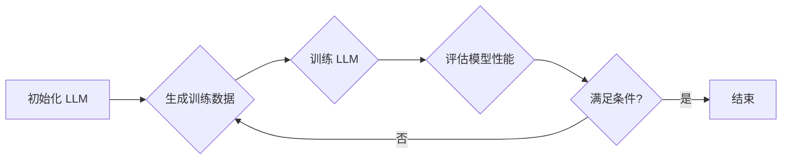

# 大语言模型原理基础与前沿 基于自我反馈进行迭代优化

作者：禅与计算机程序设计艺术

## 1. 背景介绍

### 1.1 大语言模型的兴起

近年来，随着深度学习技术的飞速发展，自然语言处理（NLP）领域取得了突破性进展。其中，大语言模型（LLM）作为一种新兴的技术方向，受到了学术界和工业界的广泛关注。LLM通常指的是参数量巨大、训练数据规模庞大的神经网络模型，例如 GPT-3、BERT、LaMDA 等。这些模型在各种 NLP 任务中表现出色，例如文本生成、机器翻译、问答系统等，展现出了巨大的应用潜力。

### 1.2 自我反馈学习的优势

传统的 LLM 训练方法主要依赖于人工标注的数据集，需要耗费大量的人力和时间成本。为了克服这一问题，自我反馈学习（Self-Feedback Learning）应运而生。自我反馈学习是一种无监督或半监督学习方法，它利用模型自身的输出来进行训练，无需人工标注数据。这种方法可以有效降低数据标注成本，提高模型的泛化能力。

### 1.3 本文目标

本文旨在深入探讨基于自我反馈进行迭代优化的大语言模型原理、方法和应用。文章将从以下几个方面展开：

* 阐述大语言模型的基本概念、发展历程和主要挑战；
* 介绍自我反馈学习的基本原理和常用方法；
* 详细讲解基于自我反馈进行 LLM 迭代优化的算法流程、关键技术和代码实例；
* 分析基于自我反馈的 LLM 优化方法的优势和局限性；
* 展望未来 LLM 和自我反馈学习的发展趋势。

## 2. 核心概念与联系

### 2.1 大语言模型

#### 2.1.1 定义

大语言模型是一种基于深度学习的自然语言处理模型，其特点是参数量巨大、训练数据规模庞大。LLM 通常采用 Transformer、RNN 等神经网络架构，能够学习到丰富的语言知识和语义信息。

#### 2.1.2 典型架构

* **Transformer：**  Transformer 是一种基于自注意力机制的神经网络架构，它在处理长序列数据时表现出色，已成为 LLM 的主流架构之一。
* **RNN：**  循环神经网络（RNN）是一种能够处理序列数据的神经网络，它在处理时间序列数据时表现出色。

#### 2.1.3 训练目标

LLM 的训练目标通常是最大化语言模型的似然函数，即预测下一个词的概率。

### 2.2 自我反馈学习

#### 2.2.1 定义

自我反馈学习是一种无监督或半监督学习方法，它利用模型自身的输出来进行训练，无需人工标注数据。

#### 2.2.2 分类

* **基于生成的任务：**  例如文本生成、机器翻译等。
* **基于判别任务：**  例如文本分类、情感分析等。

#### 2.2.3 优势

* 降低数据标注成本。
* 提高模型的泛化能力。

## 3. 核心算法原理具体操作步骤

### 3.1 基于自我反馈的 LLM 迭代优化流程



1. **初始化 LLM：** 选择合适的 LLM 架构，并使用预训练模型或随机初始化参数。
2. **生成训练数据：** 利用当前 LLM 生成大量的文本数据，作为训练集。
3. **训练 LLM：** 使用生成的训练数据对 LLM 进行微调，优化模型参数。
4. **评估模型性能：** 使用测试集评估微调后 LLM 的性能，例如困惑度、BLEU 分数等。
5. **迭代优化：**  根据模型性能，判断是否满足预设条件。若满足，则结束训练；否则，重复步骤 2-4，直到满足条件。

### 3.2 关键技术

#### 3.2.1 数据增强

为了提高训练数据的质量和数量，可以使用以下数据增强方法：

* **回译：** 将文本翻译成另一种语言，再翻译回源语言。
* **掩码语言模型：** 随机掩盖文本中的一些词，让模型预测被掩盖的词。
* **噪声注入：** 向文本中添加随机噪声，例如拼写错误、语法错误等。

#### 3.2.2 模型正则化

为了防止 LLM 过拟合，可以使用以下模型正则化方法：

* **Dropout：** 随机丢弃神经网络中的一些神经元。
* **权重衰减：**  对模型参数进行惩罚，防止参数过大。

#### 3.2.3 学习率调度

为了加速模型训练和提高模型性能，可以使用以下学习率调度方法：

* **Warmup：**  在训练初期使用较小的学习率，然后逐渐增加学习率。
* **学习率衰减：**  随着训练的进行，逐渐降低学习率。

## 4. 数学模型和公式详细讲解举例说明

### 4.1 语言模型

语言模型的数学模型可以用以下公式表示：

$$
P(w_1, w_2, ..., w_n) = \prod_{i=1}^n P(w_i | w_1, w_2, ..., w_{i-1})
$$

其中，$w_1, w_2, ..., w_n$ 表示一个文本序列，$P(w_i | w_1, w_2, ..., w_{i-1})$ 表示在已知前面词的情况下，预测当前词 $w_i$ 的概率。

### 4.2 Transformer 架构

Transformer 架构的核心是自注意力机制。自注意力机制可以让模型关注输入序列中所有位置的信息，从而学习到更丰富的语义信息。

自注意力机制的数学模型可以用以下公式表示：

$$
\text{Attention}(Q, K, V) = \text{softmax}(\frac{QK^T}{\sqrt{d_k}})V
$$

其中，$Q$、$K$、$V$ 分别表示查询矩阵、键矩阵和值矩阵，$d_k$ 表示键矩阵的维度。

## 5. 项目实践：代码实例和详细解释说明

### 5.1 使用 GPT-2 进行文本生成

```python
import torch
from transformers import GPT2Tokenizer, GPT2LMHeadModel

# 初始化 tokenizer 和模型
tokenizer = GPT2Tokenizer.from_pretrained('gpt2')
model = GPT2LMHeadModel.from_pretrained('gpt2')

# 设置生成文本的初始文本
text = "The quick brown fox jumps over the"

# 将文本编码为模型输入
input_ids = tokenizer.encode(text, add_special_tokens=True)
input_ids = torch.tensor([input_ids])

# 生成文本
with torch.no_grad():
    output = model.generate(input_ids, max_length=50, num_beams=5, no_repeat_ngram_size=2, early_stopping=True)

# 解码生成的文本
generated_text = tokenizer.decode(output[0], skip_special_tokens=True)

# 打印生成的文本
print(generated_text)
```

### 5.2 使用 BERT 进行文本分类

```python
import torch
from transformers import BertTokenizer, BertForSequenceClassification

# 初始化 tokenizer 和模型
tokenizer = BertTokenizer.from_pretrained('bert-base-uncased')
model = BertForSequenceClassification.from_pretrained('bert-base-uncased')

# 准备输入文本和标签
text = "This is a positive sentence."
label = 1

# 将文本编码为模型输入
input_ids = tokenizer.encode(text, add_special_tokens=True)
input_ids = torch.tensor([input_ids])

# 进行预测
with torch.no_grad():
    output = model(input_ids)

# 获取预测结果
logits = output.logits
predicted_label = torch.argmax(logits).item()

# 打印预测结果
print(f"Predicted label: {predicted_label}")
```

## 6. 实际应用场景

### 6.1 文本生成

* **机器写作：**  自动生成新闻报道、小说、诗歌等。
* **对话系统：**  构建智能客服、聊天机器人等。
* **代码生成：**  自动生成代码，提高编程效率。

### 6.2 自然语言理解

* **机器翻译：**  将一种语言翻译成另一种语言。
* **情感分析：**  分析文本的情感倾向，例如正面、负面、中性。
* **问答系统：**  回答用户提出的问题。

## 7. 总结：未来发展趋势与挑战

### 7.1 未来发展趋势

* **更大规模的模型：**  随着计算能力的提升和数据量的增加，LLM 的规模将会越来越大。
* **更强大的学习能力：**  研究人员将不断探索新的学习算法，提高 LLM 的学习能力和泛化能力。
* **更广泛的应用场景：**  LLM 将被应用于更多的领域，例如医疗、金融、教育等。

### 7.2 面临挑战

* **计算资源消耗巨大：**  训练和部署 LLM 需要大量的计算资源。
* **数据偏见问题：**  训练数据中的偏见会导致 LLM 产生偏见。
* **可解释性问题：**  LLM 的决策过程难以解释。


## 8. 附录：常见问题与解答

### 8.1 什么是困惑度？

困惑度（Perplexity）是衡量语言模型性能的指标之一。困惑度越低，说明语言模型的预测能力越强。

### 8.2 什么是 BLEU 分数？

BLEU（Bilingual Evaluation Understudy）分数是衡量机器翻译质量的指标之一。BLEU 分数越高，说明机器翻译的质量越好。

### 8.3 如何选择合适的 LLM？

选择合适的 LLM 需要考虑多个因素，例如模型规模、训练数据、应用场景等。