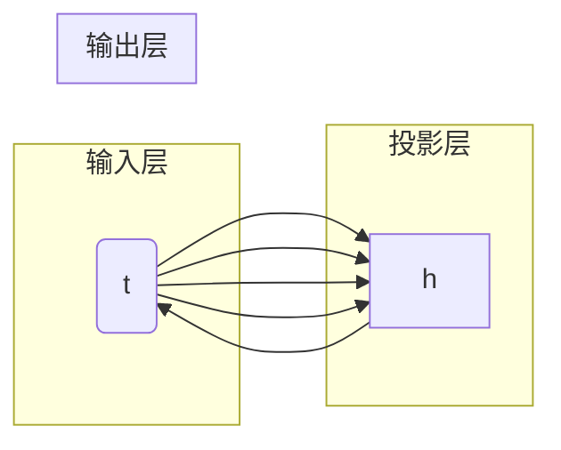
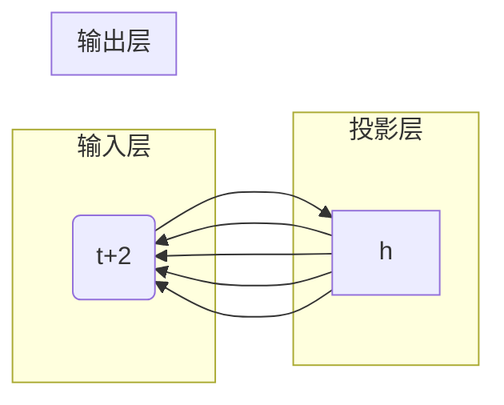

# 大语言模型应用指南：文本的向量化

作者：禅与计算机程序设计艺术

## 1. 背景介绍

### 1.1  自然语言处理的挑战与机遇

自然语言处理（Natural Language Processing, NLP）旨在让计算机理解和处理人类语言，是人工智能领域的核心课题之一。近年来，随着深度学习技术的飞速发展，NLP领域取得了突破性进展，机器翻译、情感分析、问答系统等应用场景日益成熟。

然而，自然语言的复杂性、歧义性以及高度依赖于上下文等特点，仍然给 NLP 领域带来了巨大的挑战。例如，如何有效地表示文本语义、如何处理长文本序列、如何构建通用的 NLP 模型等，都是亟待解决的问题。

### 1.2  文本向量化的意义

文本向量化是将文本数据转换为数值向量表示的过程，是 NLP 任务的基础。通过将文本转化为向量，可以利用机器学习算法对文本进行分析和处理，例如文本分类、文本相似度计算、文本聚类等。

文本向量化的意义在于：

* **克服文本数据稀疏性问题：** 文本数据通常以离散的词语形式存在，存在数据稀疏性问题。向量化可以将文本映射到连续的向量空间，有效缓解数据稀疏性问题。
* **便于机器学习算法处理：** 机器学习算法通常只能处理数值型数据，无法直接处理文本数据。向量化可以将文本转化为数值向量，使得机器学习算法可以对文本数据进行处理。
* **提高 NLP 任务效率：** 向量化后的文本数据可以方便地进行存储、索引和检索，提高 NLP 任务的效率。

## 2. 核心概念与联系

### 2.1 词嵌入（Word Embedding）

词嵌入是将词汇表中的每个词语映射到一个低维稠密向量空间的技术。词嵌入向量可以捕捉词语的语义信息，使得语义相似的词语在向量空间中距离更近。

常见的词嵌入模型包括：

* **Word2Vec:**  利用浅层神经网络模型，通过预测目标词的上下文或根据上下文预测目标词，学习词语的向量表示。
* **GloVe (Global Vectors for Word Representation):**  利用全局词共现矩阵，通过矩阵分解的方式学习词语的向量表示。
* **FastText:**  在 Word2Vec 的基础上，将词语表示为字符 n-gram 的向量和，可以学习到未登录词的词向量。

### 2.2  句子嵌入（Sentence Embedding）

句子嵌入是将整个句子映射到一个低维稠密向量空间的技术。句子嵌入向量可以捕捉句子的语义信息，使得语义相似的句子在向量空间中距离更近。

常见的句子嵌入模型包括：

* **Bag-of-Words (BoW):**  将句子表示为词袋模型，忽略词序信息，只考虑词语出现的频率。
* **Term Frequency-Inverse Document Frequency (TF-IDF):**  在 BoW 的基础上，考虑词语在语料库中的重要程度，对词频进行加权。
* **Doc2Vec:**  利用 Word2Vec 模型的思想，将句子视为一个特殊的词语，学习句子的向量表示。
* **Universal Sentence Encoder (USE):**  Google 提出的预训练句子编码器，可以生成高质量的句子嵌入向量。

### 2.3  文本向量化与 NLP 任务的关系

文本向量化是 NLP 任务的基础，可以应用于各种 NLP 任务，例如：

* **文本分类：** 将文本向量化后，可以使用分类算法对文本进行分类，例如情感分类、主题分类等。
* **文本相似度计算：** 计算文本向量之间的距离或相似度，可以用于文本匹配、问答系统等任务。
* **文本聚类：** 将文本向量化后，可以使用聚类算法对文本进行分组，例如新闻聚类、文档聚类等。
* **机器翻译：** 将源语言和目标语言的文本向量化，可以使用神经机器翻译模型进行翻译。

## 3. 核心算法原理具体操作步骤

### 3.1  Word2Vec 算法原理

Word2Vec 算法是一种基于预测的词嵌入模型，其核心思想是：**上下文相似的词语，其语义也相似。**

Word2Vec 算法包括两种模型：

* **CBOW (Continuous Bag-of-Words):**  利用目标词的上下文预测目标词。
* **Skip-gram:**  利用目标词预测其上下文。

#### 3.1.1  CBOW 模型

CBOW 模型的结构如下图所示：



* 输入层：目标词 $w(t)$ 的上下文词语 $w(t-2), w(t-1), w(t+1), w(t+2)$ 的 one-hot 向量表示。
* 投影层：将输入层的词向量求和平均，得到上下文向量。
* 输出层：使用 softmax 函数将上下文向量映射到词汇表上的概率分布，预测目标词 $w(t)$。

CBOW 模型的训练目标是最大化目标词 $w(t)$ 在给定上下文情况下的对数似然函数：

$$
\begin{aligned}
J &= \sum_{t=1}^T \log p(w(t) | w(t-2), w(t-1), w(t+1), w(t+2)) \\
&= \sum_{t=1}^T \log \frac{\exp(v_{w(t)}^T h)}{\sum_{w' \in V} \exp(v_{w'}^T h)}
\end{aligned}
$$

其中，$T$ 是语料库中词语的个数，$V$ 是词汇表，$v_w$ 是词语 $w$ 的词向量，$h$ 是上下文向量。

#### 3.1.2  Skip-gram 模型

Skip-gram 模型的结构如下图所示：



* 输入层：目标词 $w(t)$ 的 one-hot 向量表示。
* 投影层：目标词 $w(t)$ 的词向量。
* 输出层：使用 softmax 函数将目标词向量映射到词汇表上的概率分布，预测目标词的上下文词语 $w(t-2), w(t-1), w(t+1), w(t+2)$。

Skip-gram 模型的训练目标是最大化目标词 $w(t)$ 的上下文词语 $w(t-c), ..., w(t-1), w(t+1), ..., w(t+c)$ 在给定目标词情况下的对数似然函数：

$$
\begin{aligned}
J &= \sum_{t=1}^T \sum_{-c \le j \le c, j \ne 0} \log p(w(t+j) | w(t)) \\
&= \sum_{t=1}^T \sum_{-c \le j \le c, j \ne 0} \log \frac{\exp(v_{w(t+j)}^T v_{w(t)})}{\sum_{w' \in V} \exp(v_{w'}^T v_{w(t)})}
\end{aligned}
$$

其中，$c$ 是上下文窗口大小。

### 3.2  GloVe 算法原理

GloVe 算法是一种基于全局词共现矩阵的词嵌入模型，其核心思想是：**利用词语的全局共现信息学习词向量。**

GloVe 算法的步骤如下：

1. **构建词共现矩阵：** 统计语料库中词语的共现频率，构建词共现矩阵 $X$。
2. **定义损失函数：**  GloVe 算法的损失函数定义如下：

$$
J = \sum_{i,j=1}^V f(X_{ij})(v_i^T v_j + b_i + b_j - \log X_{ij})^2
$$

其中，$f(x)$ 是一个权重函数，用于降低低频词的影响；$v_i$ 和 $v_j$ 分别是词语 $i$ 和 $j$ 的词向量；$b_i$ 和 $b_j$ 分别是词语 $i$ 和 $j$ 的偏置项。

3. **优化损失函数：**  使用梯度下降法对损失函数进行优化，学习词向量。

### 3.3  Doc2Vec 算法原理

Doc2Vec 算法是 Word2Vec 算法的扩展，可以学习句子的向量表示。Doc2Vec 算法将句子视为一个特殊的词语，并在训练过程中同时学习词向量和句子向量。

Doc2Vec 算法包括两种模型：

* **Distributed Memory Model of Paragraph Vectors (PV-DM):**  类似于 Word2Vec 的 CBOW 模型，利用目标句子的上下文句子和目标句子中的词语预测目标句子。
* **Distributed Bag of Words version of Paragraph Vector (PV-DBOW):**  类似于 Word2Vec 的 Skip-gram 模型，利用目标句子预测目标句子中的词语。

## 4. 数学模型和公式详细讲解举例说明

### 4.1  余弦相似度

余弦相似度是一种常用的计算向量之间相似度的方法，其取值范围为 $[-1, 1]$，值越大表示向量越相似。

两个向量 $\mathbf{a}$ 和 $\mathbf{b}$ 的余弦相似度计算公式如下：

$$
\cos(\theta) = \frac{\mathbf{a} \cdot \mathbf{b}}{\|\mathbf{a}\| \|\mathbf{b}\|}
$$

其中，$\cdot$ 表示向量点积，$\|\mathbf{a}\|$ 表示向量 $\mathbf{a}$ 的模长。

例如，计算向量 $\mathbf{a} = [1, 2, 3]$ 和 $\mathbf{b} = [4, 5, 6]$ 的余弦相似度：

$$
\begin{aligned}
\cos(\theta) &= \frac{[1, 2, 3] \cdot [4, 5, 6]}{\|[1, 2, 3]\| \|[4, 5, 6]\|} \\
&= \frac{1 \times 4 + 2 \times 5 + 3 \times 6}{\sqrt{1^2 + 2^2 + 3^2} \sqrt{4^2 + 5^2 + 6^2}} \\
&= 0.9746
\end{aligned}
$$

### 4.2  Softmax 函数

Softmax 函数可以将一个 $K$ 维的实数向量 $\mathbf{z}$ 转换为一个 $K$ 维的概率分布，其计算公式如下：

$$
\sigma(\mathbf{z})_i = \frac{\exp(z_i)}{\sum_{j=1}^K \exp(z_j)}
$$

其中，$i = 1, 2, ..., K$。

例如，对于向量 $\mathbf{z} = [1, 2, 3]$，其 softmax 函数值为：

$$
\begin{aligned}
\sigma(\mathbf{z})_1 &= \frac{\exp(1)}{\exp(1) + \exp(2) + \exp(3)} = 0.0900 \\
\sigma(\mathbf{z})_2 &= \frac{\exp(2)}{\exp(1) + \exp(2) + \exp(3)} = 0.2447 \\
\sigma(\mathbf{z})_3 &= \frac{\exp(3)}{\exp(1) + \exp(2) + \exp(3)} = 0.6652
\end{aligned}
$$

## 5. 项目实践：代码实例和详细解释说明

### 5.1  使用 Gensim 训练 Word2Vec 模型

```python
from gensim.models import Word2Vec

# 读取语料库
sentences = [["cat", "sat", "on", "the", "mat"],
             ["dog", "chased", "the", "cat"]]

# 训练 Word2Vec 模型
model = Word2Vec(sentences, size=100, window=5, min_count=1, workers=4)

# 保存模型
model.save("word2vec.model")

# 加载模型
model = Word2Vec.load("word2vec.model")

# 获取词向量
vector = model.wv["cat"]

# 计算词语相似度
similarity = model.wv.similarity("cat", "dog")
```

**代码解释：**

* `gensim.models.Word2Vec` 是 Gensim 库中用于训练 Word2Vec 模型的类。
* `sentences` 是训练语料库，每个元素是一个句子，每个句子是一个词语列表。
* `size` 是词向量维度。
* `window` 是上下文窗口大小。
* `min_count` 是词语出现频率的阈值，低于该阈值的词语将被忽略。
* `workers` 是训练模型时使用的线程数。
* `model.wv["cat"]` 获取词语 "cat" 的词向量。
* `model.wv.similarity("cat", "dog")` 计算词语 "cat" 和 "dog" 的余弦相似度。

### 5.2  使用 TensorFlow 训练 Doc2Vec 模型

```python
import tensorflow as tf

# 定义模型参数
max_length = 100
embedding_dim = 128
vocab_size = 10000

# 定义模型结构
model = tf.keras.Sequential([
    tf.keras.layers.Embedding(vocab_size, embedding_dim, input_length=max_length),
    tf.keras.layers.GlobalAveragePooling1D(),
    tf.keras.layers.Dense(128, activation='relu'),
    tf.keras.layers.Dense(1, activation='sigmoid')
])

# 编译模型
model.compile(optimizer='adam',
              loss='binary_crossentropy',
              metrics=['accuracy'])

# 训练模型
model.fit(x_train, y_train, epochs=10)

# 保存模型
model.save("doc2vec.h5")

# 加载模型
model = tf.keras.models.load_model("doc2vec.h5")

# 获取句子向量
vector = model.predict(x_test[0])
```

**代码解释：**

* `tf.keras.layers.Embedding` 是 TensorFlow 中用于创建词嵌入层的类。
* `tf.keras.layers.GlobalAveragePooling1D` 是 TensorFlow 中用于对句子进行全局平均池化的类。
* `tf.keras.layers.Dense` 是 TensorFlow 中用于创建全连接层的类。
* `model.fit(x_train, y_train, epochs=10)` 训练模型，`x_train` 是训练集特征，`y_train` 是训练集标签，`epochs` 是训练轮数。
* `model.predict(x_test[0])` 获取测试集第一个句子的向量表示。

## 6. 实际应用场景

### 6.1  文本分类

文本分类是 NLP 中的一项基础任务，可以应用于垃圾邮件过滤、情感分析、新闻分类等场景。

例如，可以使用文本向量化技术对邮件进行分类：

1. 将邮件文本向量化，例如使用 TF-IDF 算法。
2. 使用分类算法训练分类模型，例如逻辑回归、支持向量机等。
3. 使用训练好的模型对新邮件进行分类。

### 6.2  文本相似度计算

文本相似度计算可以用于搜索引擎、问答系统、推荐系统等场景。

例如，可以使用文本向量化技术计算两个问题的相似度：

1. 将两个问题文本向量化，例如使用 USE 模型。
2. 计算两个问题向量之间的余弦相似度。
3. 根据相似度得分对问题进行排序，返回相似度最高的答案。

### 6.3  文本聚类

文本聚类可以用于新闻聚类、文档聚类、用户画像等场景。

例如，可以使用文本向量化技术对新闻进行聚类：

1. 将新闻文本向量化，例如使用 Doc2Vec 模型。
2. 使用聚类算法对新闻向量进行聚类，例如 K-Means 算法。
3. 根据聚类结果对新闻进行分组。

## 7. 工具和资源推荐

### 7.1  Gensim

Gensim 是一个 Python 库，用于主题建模、文档索引和相似度检索。Gensim 提供了 Word2Vec、Doc2Vec 等词嵌入模型的实现。

* **官方网站：** https://radimrehurek.com/gensim/
* **GitHub 地址：** https://github.com/RaRe-Technologies/gensim

### 7.2  TensorFlow

TensorFlow 是一个开源的机器学习平台，可以用于构建和训练各种机器学习模型，包括 NLP 模型。

* **官方网站：** https://www.tensorflow.org/
* **GitHub 地址：** https://github.com/tensorflow/tensorflow

### 7.3  SpaCy

SpaCy 是一个 Python 库