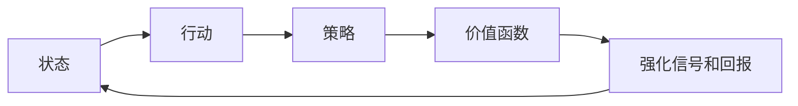

## 1.背景介绍

强化学习(Reinforcement Learning) 是机器学习的一个重要分支，与监督学习和无监督学习并列。不同于监督学习需要大量标签数据，或者无监督学习试图从无标签数据中找到隐藏的结构，强化学习是通过智能体(agent)在环境中的探索和试验，学习如何做出最优的决策。它基于的是试错学习(trial-and-error)和延迟奖励(delayed reward)的概念。

在强化学习的世界里，智能体(agent)会采取行动(action)，对环境(state)产生影响，环境会给出奖励(reward)，智能体需要学习如何选择最佳行动，以便最大化累积奖励。这种学习过程涉及到许多核心概念，例如状态转移(state transition)，策略(policy)，价值函数(value function)，强化信号(reinforcement signal)，回报(reward)等等。

## 2.核心概念与联系

### 2.1 状态和行动

在强化学习中，状态(state)是对环境的描述，行动(action)是智能体可以在某个状态下采取的操作。状态和行动构成了强化学习的基本框架。

### 2.2 策略

策略(policy)定义了智能体在给定状态下应该采取的行动，是智能体的行为模式。策略可以是确定性的，也可以是随机性的。在确定性策略中，给定状态，智能体的行动是确定的；在随机性策略中，智能体的行动是按照某种概率分布选择的。

### 2.3 价值函数

价值函数(value function)用来评估在某个状态下采取某个行动或者遵循某个策略的长期回报。根据考虑的是状态还是行动，价值函数可以分为状态价值函数和行动价值函数。

### 2.4 强化信号和回报

强化信号(reinforcement signal)是环境对智能体行动的反馈，通常体现为回报(reward)。回报可以是立即的，也可以是延迟的，智能体的目标就是最大化长期累积回报。

这些概念之间的关系可以通过下图表示：



## 3.核心算法原理具体操作步骤

在强化学习中，一个重要的任务是通过学习找到最优策略。策略迭代(policy iteration)是一种常用的方法，它通过交替的策略评估和策略改进步骤来逐步改进策略，直到找到最优策略。下面我们来详细介绍策略迭代的步骤。

### 3.1 策略评估

策略评估(policy evaluation)是计算当前策略下的状态价值函数。给定一个策略$\pi$，状态价值函数$V^\pi(s)$可以通过以下迭代公式计算：

$$
V^\pi(s) = \sum_{a \in A} \pi(a|s) \sum_{s' \in S} P_{ss'}^a [R_{ss'}^a + \gamma V^\pi(s')]
$$

其中，$A$是行动集，$S$是状态集，$P_{ss'}^a$是在状态$s$下采取行动$a$转移到状态$s'$的概率，$R_{ss'}^a$是从状态$s$采取行动$a$转移到状态$s'$的立即回报，$\gamma$是折扣因子。

### 3.2 策略改进

策略改进(policy improvement)是通过贪婪地选择使得行动价值函数最大的行动来改进策略。给定状态价值函数$V$，行动价值函数$Q$可以通过以下公式计算：

$$
Q(s,a) = \sum_{s' \in S} P_{ss'}^a [R_{ss'}^a + \gamma V(s')]
$$

然后，我们可以通过以下公式更新策略：

$$
\pi'(s) = \arg\max_{a \in A} Q(s,a)
$$

### 3.3 策略迭代

策略迭代就是通过交替地进行策略评估和策略改进，直到策略收敛到最优策略。以下是策略迭代的伪代码：

```python
Initialize policy pi
Repeat:
    Policy evaluation: calculate V^pi
    Policy improvement: update pi using V^pi
Until pi converges
Return pi
```

## 4.数学模型和公式详细讲解举例说明

我们已经介绍了策略迭代的基本步骤和相关公式，下面我们来通过一个具体的例子来说明这些公式的应用。

假设我们有一个简单的格子世界，智能体可以在格子中上下左右移动，目标是从起点到达终点，每走一步得到-1的回报，到达终点得到+10的回报。我们用$S=\{s_0,s_1,...,s_9\}$表示状态集，用$A=\{a_0,a_1,a_2,a_3\}$表示行动集，其中$a_0,a_1,a_2,a_3$分别表示上、下、左、右。我们初始化策略为在每个状态下随机选择行动。 

我们先进行策略评估，计算状态价值函数$V^\pi(s)$。假设折扣因子$\gamma=0.9$，我们可以通过迭代公式计算每个状态的价值，直到价值函数收敛。

然后我们进行策略改进，更新策略。对于每个状态$s$，我们计算每个行动$a$的行动价值$Q(s,a)$，然后选择使得$Q(s,a)$最大的行动作为新的策略。

通过多轮的策略评估和策略改进，我们最终可以找到最优策略，使得智能体可以以最短的路径从起点到达终点。

## 4.项目实践：代码实例和详细解释说明

下面我们来看一下策略迭代的Python代码实现。

```python
import numpy as np

# Initialize policy
pi = np.ones((10, 4)) / 4

# Initialize state value function
V = np.zeros(10)

# Initialize transition and reward matrices
P = np.zeros((10, 4, 10))
R = np.zeros((10, 4, 10))
# Fill in P and R based on the problem

# Set discount factor
gamma = 0.9

# Policy iteration
while True:
    # Policy evaluation
    while True:
        delta = 0
        for s in range(10):
            v = V[s]
            V[s] = sum([pi[s, a] * sum([P[s, a, s_prime] * (R[s, a, s_prime] + gamma * V[s_prime]) for s_prime in range(10)]) for a in range(4)])
            delta = max(delta, abs(v - V[s]))
        if delta < 0.001:
            break

    # Policy improvement
    policy_stable = True
    for s in range(10):
        old_action = np.argmax(pi[s])
        action_values = np.zeros(4)
        for a in range(4):
            action_values[a] = sum([P[s, a, s_prime] * (R[s, a, s_prime] + gamma * V[s_prime]) for s_prime in range(10)])
        new_action = np.argmax(action_values)
        if old_action != new_action:
            policy_stable = False
        pi[s] = np.eye(4)[new_action]

    if policy_stable:
        break
```

上述代码实现了策略迭代的主要步骤，包括策略评估和策略改进。其中，状态转移和回报矩阵的填充需要根据具体的问题来设定。我们需要注意的是，策略评估的停止条件是价值函数的变化小于一个小的阈值，策略改进的停止条件是策略不再发生变化。

## 5.实际应用场景

强化学习已经在许多实际应用场景中展现出了强大的能力，例如游戏、机器人、自动驾驶、推荐系统等等。在游戏中，例如围棋、象棋、桥牌等，强化学习可以通过大量的自我对弈来学习策略，甚至超过人类的水平。在机器人中，强化学习可以用来学习各种复杂的控制策略，例如行走、跳跃、抓取等。在自动驾驶中，强化学习可以用来学习驾驶策略，例如车道保持、换道、避障等。在推荐系统中，强化学习可以用来学习用户的行为模式，以提供更个性化的推荐。

## 6.工具和资源推荐

如果你对强化学习感兴趣，以下是一些推荐的工具和资源：

- Gym: 是一个开源的强化学习环境库，提供了许多预定义的环境，可以方便地用来测试和比较强化学习算法。

- TensorFlow Agents: 是一个基于TensorFlow的强化学习库，提供了一些常用的强化学习算法的实现。

- "Reinforcement Learning: An Introduction" by Richard S. Sutton and Andrew G. Barto: 这是一本经典的强化学习教材，对强化学习的基本概念和算法进行了详细的介绍。

- "Deep Reinforcement Learning" by Pieter Abbeel and John Schulman: 这是一门在线的课程，对深度强化学习进行了深入的讲解。

## 7.总结：未来发展趋势与挑战

强化学习是一个非常活跃的研究领域，未来有很大的发展潜力。一方面，强化学习的理论还有很多需要进一步探索的问题，例如如何更好地理解和利用探索与利用的平衡，如何处理部分可观测的环境，如何处理连续的状态和行动空间等。另一方面，强化学习的应用也有很大的发展空间，例如如何将强化学习应用到更复杂的实际问题中，如何解决样本效率低的问题，如何提高智能体的安全性和可解释性等。

尽管强化学习面临着许多挑战，但是随着研究的深入和技术的发展，我相信强化学习将会在未来发挥更大的作用。

## 8.附录：常见问题与解答

Q: 强化学习和监督学习有什么区别？

A: 监督学习是通过学习输入和标签的映射关系来进行预测，需要大量的标签数据；强化学习是通过智能体在环境中的探索和试验，学习如何做出最优的决策，不需要标签数据，而是通过交互获取反馈。

Q: 强化学习如何处理连续的状态和行动空间？

A: 对于连续的状态空间，可以使用函数逼近器，例如神经网络，来表示价值函数或策略；对于连续的行动空间，可以使用策略梯度方法，例如深度确定性策略梯度(DDPG)，或者使用离散化的方法。

Q: 强化学习如何处理部分可观测的环境？

A: 对于部分可观测的环境，可以使用部分可观测马尔可夫决策过程(POMDP)模型，或者使用记忆性的策略，例如循环神经网络(LSTM)。

Q: 强化学习的样本效率如何提高？

A: 提高强化学习的样本效率的方法有很多，例如使用模型的方法，例如模型预测控制(MPC)；使用经验回放，将过去的经验存储起来，进行重复学习；使用更有效的探索策略，例如信息熵最大化。

Q: 强化学习的安全性和可解释性如何提高？

A: 提高强化学习的安全性和可解释性是一个重要的研究方向，可以从多个方面来考虑，例如设计安全的奖励函数，使用安全的探索策略，进行模型验证和验证，使用可解释的模型等。