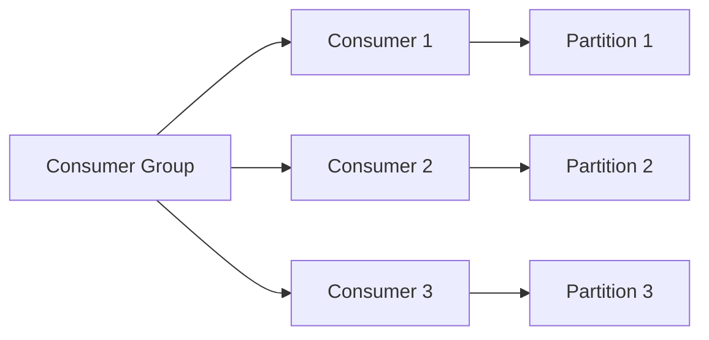

# 消费者组 原理与代码实例讲解

## 1.背景介绍

### 1.1 消息队列的作用

在分布式系统中，不同的组件或服务之间需要进行通信和数据交换。消息队列作为一种异步通信机制,可以在发送方和接收方之间提供一个中介,解耦它们的直接依赖关系。这种通信模式具有以下优势:

- **解耦**:发送方和接收方不需要同时在线,可以减少耦合度。
- **冗余**:允许发送相同的消息给多个接收方。
- **流控**:在高峰期能够缓存消息,防止发送方被淹没。
- **可靠通信**:消息队列一般会实现持久化和确认机制,保证消息不被丢失。

### 1.2 消费者组的作用

在传统的消息队列模型中,消息会被发送到一个队列,并被单个消费者依次拉取处理。但在很多场景下,我们希望同一个消息能够被多个消费者同时消费,以实现不同的业务需求。

消费者组(Consumer Group)允许将多个消费者划分到不同的组中,每个组获取同一个主题(Topic)的消息,但每个消息只会被组中的一个消费者消费。这样可以实现以下目的:

- **负载均衡**: 将消息均匀分配给组内的不同消费者,提高处理能力。
- **广播**: 将同一消息发送给组内所有消费者,实现不同的业务逻辑。
- **冗余**: 在某个消费者失败时,其他消费者可以继续消费消息,提高容错性。

## 2.核心概念与联系

### 2.1 消费者组组成

一个消费者组由以下几个核心组成部分构成:

- **Consumer Group**:同一组内的消费者订阅同一个主题(Topic),消息只会被组内一个消费者消费。
- **Consumer**:消费者,负责从Broker拉取消息并进行业务逻辑处理。
- **Partition**:主题被分为多个分区,每个分区在组内由一个消费者独占。
- **Rebalance**:当消费者加入或离开组时,分区会自动重新分配给组内的消费者。



### 2.2 消费位移(Offset)

消费者组跟踪每个分区中已经被消费的消息位置,这个位置就是消费位移(Offset)。当消费者重新启动时,它会从上次提交的位移继续消费。

消费位移有两种管理方式:

1. **自动提交** 消费者自动周期性地向服务器提交位移。
2. **手动提交** 由应用代码手动控制提交位移的时机。

手动提交模式提供了更多的灵活性,如实现事务消息处理。但需要更多的代码和精心设计以避免数据重复或丢失。

## 3.核心算法原理具体操作步骤 

### 3.1 消费者组成员协调

Kafka使用一种分布式协议来管理消费者组成员和分区分配。这个协议的关键步骤包括:

1. **加入组**:新的消费者向组协调器发送加入组的请求。
2. **同步组元数据**:协调器从Kafka集群获取分区信息并将其发送给消费者。
3. **分区分配**:协调器为每个消费者分配可消费的分区。
4. **同步位移**:消费者从Kafka获取上次提交的位移,继续消费。
5. **心跳**:消费者定期向协调器发送心跳,证明自己还存活。
6. **重新平衡**:当消费者加入或离开时,协调器会重新分配分区。

这个过程通过Zookeeper或Kafka内置的组协调器实现,确保组内消费者的协调一致。

### 3.2 消费者重平衡

当消费者组成员发生变化时,需要进行重平衡以重新分配分区。重平衡算法包括以下步骤:

1. **撤销旧分配**:移除离开消费者的分区所有权。
2. **分区分配**:将所有分区重新分配给当前组内的消费者。
3. **新消费者订阅**:新加入的消费者开始从最新位移消费分配的分区。
4. **提交位移**:消费者提交新的位移,完成重平衡。

重平衡算法力求使分区均匀分布在组内消费者上,提高并行处理能力。同时也要尽量减少分区所有权的转移,避免数据被重复消费。

### 3.3 消费失败处理

在实际应用中,消费者可能由于各种原因而失败,例如网络故障、程序错误等。为了确保消息不会丢失,Kafka提供了以下几种失败处理机制:

1. **重试机制**:消费者在消费失败时可以重试,直到成功为止。
2. **死信队列**:无法被正常消费的消息会被发送到死信队列,以备后续处理。
3. **手动位移提交**:消费者在消息处理完成后再提交位移,防止消息丢失。
4. **幂等性**:通过去重和幂等性处理,避免消息被重复消费。

## 4.数学模型和公式详细讲解举例说明

消费者组在实现负载均衡和容错时,需要合理分配分区。我们可以使用一些数学模型和公式来指导分区分配算法的设计。

### 4.1 负载均衡模型

假设有n个消费者和m个分区,我们的目标是将分区均匀分配给每个消费者,使得每个消费者处理的负载相近。

令$x_i$表示第i个消费者分配到的分区数,则有:

$$\sum_{i=1}^n x_i = m$$

为了实现负载均衡,我们需要最小化目标函数:

$$F(x_1, x_2, ..., x_n) = \sum_{i=1}^n (x_i - \bar{x})^2$$

其中$\bar{x} = \frac{m}{n}$是平均分配的分区数。

这个目标函数实际上是方差,当方差为0时,所有消费者分配到的分区数都相等,达到了完全均衡。

在实际算法中,我们可以采用贪心策略,尽量将分区均匀分配,使目标函数值最小化。

### 4.2 容错能力模型

在消费者组中,当一个消费者失效时,其分区需要被其他消费者接管。为了提高容错能力,我们希望每个分区都有足够的备份消费者。

令$p_i$表示第i个分区被分配给的消费者数,则容错能力可以用以下函数表示:

$$R = \min\limits_{1 \leq i \leq m} p_i$$

当$R \geq k$时,表示每个分区至少有k个备份消费者,从而能够容忍k-1个消费者同时失效。

在分配分区时,我们可以将上述函数作为辅助目标,在保证负载均衡的前提下,尽量提高分区的容错能力。

通过将负载均衡和容错能力两个目标函数结合,我们可以设计出合理的分区分配算法,实现高效且可靠的消费者组。

## 5.项目实践:代码实例和详细解释说明

下面我们通过一个基于Apache Kafka的Java示例代码,演示如何创建消费者组并实现消息消费。

### 5.1 创建消费者组

```java
Properties props = new Properties();
props.put("bootstrap.servers", "kafka1:9092,kafka2:9092");
props.put("group.id", "my-group");
props.put("enable.auto.commit", "true");
props.put("auto.commit.interval.ms", "1000");
props.put("key.deserializer", "org.apache.kafka.common.serialization.StringDeserializer");
props.put("value.deserializer", "org.apache.kafka.common.serialization.StringDeserializer");

KafkaConsumer<String, String> consumer = new KafkaConsumer<>(props);
consumer.subscribe(Collections.singletonList("my-topic"));
```

在这个示例中,我们首先创建一个Kafka消费者配置,指定了:

- `bootstrap.servers`: Kafka集群的Broker地址
- `group.id`: 消费者所属的组ID
- `enable.auto.commit`: 是否自动提交消费位移
- `key.deserializer`和`value.deserializer`: 反序列化消息的类

然后,我们创建了一个`KafkaConsumer`实例,并订阅了名为`"my-topic"`的主题。

### 5.2 消费消息

```java
while (true) {
    ConsumerRecords<String, String> records = consumer.poll(Duration.ofMillis(100));
    for (ConsumerRecord<String, String> record : records) {
        System.out.printf("offset = %d, key = %s, value = %s%n", record.offset(), record.key(), record.value());
        // 处理消息
    }
}
```

在这个循环中,我们不断从Kafka拉取消息。`consumer.poll()`方法会从分配给当前消费者的分区中获取新的消息记录。

对于每条消息记录,我们打印出它的位移(offset)、键(key)和值(value)。然后,我们可以在这里添加自己的业务逻辑,对消息进行处理。

### 5.3 手动提交位移

如果我们选择手动提交消费位移,可以使用以下代码:

```java
while (true) {
    ConsumerRecords<String, String> records = consumer.poll(Duration.ofMillis(100));
    for (ConsumerRecord<String, String> record : records) {
        // 处理消息
        ...
    }
    consumer.commitSync();
}
```

在处理完一批消息后,我们调用`consumer.commitSync()`方法,手动将消费位移提交到Kafka。这样可以确保只有成功处理的消息才会被提交,避免数据丢失或重复消费。

### 5.4 重平衡监听器

当消费者组发生重平衡时,我们可以添加一个监听器来捕获这个事件:

```java
consumer.subscribe(Collections.singletonList("my-topic"), new ConsumerRebalanceListener() {
    @Override
    public void onPartitionsRevoked(Collection<TopicPartition> partitions) {
        // 保存消费位移
        ...
    }

    @Override
    public void onPartitionsAssigned(Collection<TopicPartition> partitions) {
        // 恢复消费位移
        ...
    }
});
```

在`onPartitionsRevoked`方法中,我们可以保存当前分区的消费位移。而在`onPartitionsAssigned`方法中,我们可以从保存的位移继续消费新分配的分区。

这样可以确保在重平衡期间,消息不会被丢失或重复消费。

通过上述代码示例,我们展示了如何在Java应用程序中创建消费者组,订阅主题并消费消息。同时,我们也介绍了手动提交位移和重平衡监听器的使用方法,以实现更加可靠和健壮的消息消费。

## 6.实际应用场景

消费者组在实际应用中有很多常见的使用场景,例如:

### 6.1 日志收集

在分布式系统中,每个服务实例都会产生日志。我们可以使用消费者组从Kafka消费这些日志消息,并进行集中存储和分析。不同的消费者组可以负责处理不同级别或类型的日志,实现日志收集的扩展性和容错能力。

### 6.2 流式处理

Kafka常被用作流式处理系统的消息队列。我们可以将实时数据流发送到Kafka主题,然后使用消费者组对这些数据流进行并行处理,例如过滤、转换、聚合等操作。每个消费者组可以执行不同的处理逻辑,从而实现复杂的流式计算管道。

### 6.3 事件驱动架构

在事件驱动架构中,不同的服务通过生产和消费事件进行通信。消费者组可以订阅特定的事件主题,并对事件执行相应的业务逻辑。这种松耦合的设计使得系统更加灵活和可扩展。

### 6.4 任务队列

我们可以将需要异步执行的任务发送到Kafka队列中,然后使用消费者组并行地从队列中拉取任务并执行。这种模式常见于大规模并行数据处理、文件上传等场景。

### 6.5 数据管道

在大数据领域,Kafka常被用作数据管道,将数据从各种来源传输到不同的目