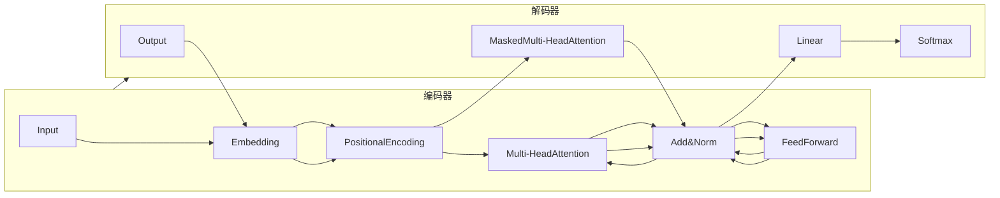

# AIGC从入门到实战：探究 ChatGPT 的原理和成本

作者：禅与计算机程序设计艺术

## 1. 背景介绍

### 1.1 AIGC 浪潮席卷全球
近年来，人工智能领域迎来了一波新的技术浪潮——AIGC（Artificial Intelligence Generated Content，人工智能生成内容）。这项技术使得机器能够像人类一样进行创作，涵盖了文本、图像、音频、视频等多种形式的内容。从自动生成新闻稿件、撰写营销文案，到创作诗歌、剧本甚至绘画作品，AIGC 正以惊人的速度渗透到我们生活的方方面面。

### 1.2 ChatGPT 引领 AIGC 热潮
在众多 AIGC 工具中，ChatGPT 无疑是最耀眼的明星之一。自 2022 年 11 月发布以来，ChatGPT 以其强大的语言理解和生成能力迅速风靡全球，成为史上用户增长最快的消费级应用程序。它不仅可以与人类进行自然流畅的对话，还能完成各种复杂的任务，例如：

* 回答问题、提供信息
* 生成不同类型的文本，如诗歌、代码、剧本、音乐片段等
* 翻译语言
* 编写不同类型的创意内容
* 为个人提供定制化的服务

ChatGPT 的出现，标志着 AIGC 技术进入了一个全新的阶段，也为各行各业带来了前所未有的机遇和挑战。

### 1.3 本文目标和结构
本文旨在深入浅出地探讨 ChatGPT 的原理和成本，帮助读者更好地理解这项技术背后的奥秘。文章结构如下：

* **第二章：核心概念与联系**：介绍自然语言处理、深度学习、Transformer 模型等 ChatGPT 的核心概念，并阐述它们之间的联系。
* **第三章：核心算法原理具体操作步骤**：详细解释 ChatGPT 的核心算法——GPT（Generative Pre-trained Transformer）的原理，并使用简单的例子说明其具体操作步骤。
* **第四章：数学模型和公式详细讲解举例说明**：深入分析 GPT 模型的数学模型和公式，并通过具体的例子进行讲解，帮助读者更好地理解其工作原理。
* **第五章：项目实践：代码实例和详细解释说明**：提供使用 Python 和相关库调用 ChatGPT API 进行文本生成的代码实例，并对代码进行详细的解释说明。
* **第六章：实际应用场景**：探讨 ChatGPT 在各个领域的实际应用场景，例如：客服机器人、智能助手、内容创作、教育培训等。
* **第七章：工具和资源推荐**：推荐一些学习 ChatGPT 和 AIGC 相关的工具、库、框架和学习资源。
* **第八章：总结：未来发展趋势与挑战**：总结 ChatGPT 的优势和局限性，并展望 AIGC 技术的未来发展趋势和面临的挑战。
* **第九章：附录：常见问题与解答**：解答一些关于 ChatGPT 的常见问题。

## 2. 核心概念与联系

### 2.1 自然语言处理 (NLP)
自然语言处理（Natural Language Processing，NLP）是人工智能的一个重要分支，旨在让计算机能够理解和处理人类语言。NLP 的研究内容包括：

* **自然语言理解 (NLU)**：让计算机能够理解人类语言的含义，例如：词义消歧、句法分析、语义角色标注等。
* **自然语言生成 (NLG)**：让计算机能够生成自然流畅的人类语言，例如：机器翻译、文本摘要、对话系统等。

ChatGPT 就是一个典型的 NLG 应用，它能够根据用户的输入生成自然流畅的文本。

### 2.2 深度学习 (Deep Learning)
深度学习是机器学习的一个分支，其核心思想是通过构建多层神经网络来学习数据的表示。深度学习在图像识别、语音识别、自然语言处理等领域取得了突破性进展。

### 2.3 Transformer 模型
Transformer 模型是一种基于自注意力机制的神经网络架构，它在自然语言处理领域取得了巨大的成功。与传统的循环神经网络 (RNN) 相比，Transformer 模型具有以下优势：

* **并行计算**：Transformer 模型可以并行处理序列数据，训练速度更快。
* **长距离依赖**：Transformer 模型的自注意力机制可以捕捉到序列中任意两个位置之间的依赖关系，更适合处理长文本。

ChatGPT 的核心算法——GPT 就是基于 Transformer 模型构建的。


## 3. 核心算法原理具体操作步骤

### 3.1 GPT 模型概述
GPT（Generative Pre-trained Transformer）是一种基于 Transformer 模型的生成式预训练模型。它通过在大规模文本数据上进行无监督学习，学习到了丰富的语言知识，并能够根据输入的文本生成流畅自然的文本。

### 3.2 GPT 模型训练过程
GPT 模型的训练过程可以分为两个阶段：

**1. 预训练阶段:**
* 使用海量的文本数据对 GPT 模型进行无监督学习。
* 目标是让模型学习到语言的统计规律和语义信息。

**2. 微调阶段:**
* 使用特定任务的数据对预训练好的 GPT 模型进行微调。
* 目标是让模型适应特定任务，例如：文本生成、机器翻译等。

### 3.3 GPT 模型文本生成过程
GPT 模型的文本生成过程如下：

1. 将输入文本转换成词向量。
2. 将词向量输入到 GPT 模型中。
3. GPT 模型根据输入的词向量，预测下一个词的概率分布。
4. 根据概率分布，选择概率最高的词作为下一个词。
5. 将生成的词添加到已生成的文本序列中。
6. 重复步骤 3-5，直到生成完整的文本。

### 3.4 示例
以下是一个使用 GPT 模型生成文本的例子：

**输入文本：**

> The cat sat on the

**GPT 模型预测的下一个词概率分布：**

| 词汇 | 概率 |
|---|---|
| mat | 0.5 |
| chair | 0.3 |
| table | 0.2 |

**生成的文本：**

> The cat sat on the mat

## 4. 数学模型和公式详细讲解举例说明

### 4.1 Transformer 模型架构
Transformer 模型的架构如下图所示：



### 4.2 自注意力机制
自注意力机制是 Transformer 模型的核心，它允许模型关注输入序列中所有位置的信息，并计算它们之间的相关性。自注意力机制的计算过程如下：

1. **计算查询向量 (Query), 键向量 (Key) 和值向量 (Value):** 对于输入序列中的每个词，分别计算其对应的查询向量、键向量和值向量。
   
   $$ Q = W_Q X $$
   $$ K = W_K X $$
   $$ V = W_V X $$

   其中，$X$ 是输入序列的词向量表示，$W_Q$、$W_K$ 和 $W_V$ 是可学习的参数矩阵。

2. **计算注意力得分:**  计算查询向量和每个键向量之间的点积，得到注意力得分。

   $$ Score = QK^T $$

3. **对注意力得分进行缩放:** 将注意力得分除以 $\sqrt{d_k}$，其中 $d_k$ 是键向量的维度。

   $$ ScaledScore = \frac{Score}{\sqrt{d_k}} $$

4. **对注意力得分进行 softmax 操作:** 对缩放后的注意力得分进行 softmax 操作，得到每个词的注意力权重。

   $$ AttentionWeights = softmax(ScaledScore) $$

5. **计算加权平均:** 将值向量乘以对应的注意力权重，然后求和，得到最终的输出向量。

   $$ Output = AttentionWeightsV $$

### 4.3 多头注意力机制
多头注意力机制是自注意力机制的扩展，它允许模型从多个不同的角度关注输入序列的信息。多头注意力机制的计算过程如下：

1. **将查询向量、键向量和值向量分别投影到多个不同的子空间中。**
2. **对每个子空间分别应用自注意力机制。**
3. **将所有子空间的输出向量拼接起来。**
4. **将拼接后的向量进行线性变换，得到最终的输出向量。**

### 4.4 位置编码
由于 Transformer 模型没有循环结构，无法捕捉到输入序列的顺序信息。为了解决这个问题，Transformer 模型引入了位置编码 (Positional Encoding)。位置编码是一个与词向量维度相同的向量，它包含了词在序列中的位置信息。位置编码的计算公式如下：

$$ PE_{(pos,2i)} = sin(\frac{pos}{10000^{2i/d_{model}}}) $$

$$ PE_{(pos,2i+1)} = cos(\frac{pos}{10000^{2i/d_{model}}}) $$

其中，$pos$ 是词在序列中的位置，$i$ 是位置编码向量的维度索引，$d_{model}$ 是词向量的维度。

## 5. 项目实践：代码实例和详细解释说明

### 5.1 安装必要的库
在运行代码之前，需要先安装以下 Python 库：

```bash
pip install transformers torch
```

### 5.2 代码实例
以下是一个使用 `transformers` 库调用 ChatGPT API 进行文本生成的例子：

```python
from transformers import pipeline

# 加载预训练的 GPT-2 模型
generator = pipeline('text-generation', model='gpt2')

# 设置生成文本的参数
text = "The cat sat on the"
max_length = 20
num_return_sequences = 3

# 生成文本
results = generator(text, max_length=max_length, num_return_sequences=num_return_sequences)

# 打印生成的文本
for result in results:
    print(result['generated_text'])
```

### 5.3 代码解释
1. **加载预训练的 GPT-2 模型：** 使用 `pipeline()` 函数加载预训练的 GPT-2 模型，并指定任务类型为 `text-generation`。
2. **设置生成文本的参数：** 设置生成文本的参数，包括：
    * `text`：输入的文本。
    * `max_length`：生成的文本的最大长度。
    * `num_return_sequences`：生成文本的数量。
3. **生成文本：** 调用 `generator()` 函数生成文本。
4. **打印生成的文本：** 遍历 `results` 列表，打印每个生成的文本。

### 5.4 运行结果
运行以上代码，会得到类似以下的输出结果：

```
The cat sat on the mat, staring intently at the
The cat sat on the edge of the bed, watching me with
The cat sat on the windowsill, basking in the warm
```

## 6. 实际应用场景

ChatGPT 在各个领域都有着广泛的应用场景，例如：

### 6.1 客服机器人
ChatGPT 可以用于构建智能客服机器人，为用户提供 24 小时在线服务，回答用户的问题，解决用户的疑问。

### 6.2 智能助手
ChatGPT 可以作为智能助手，帮助用户完成各种任务，例如：发送邮件、设置提醒、查询信息等。

### 6.3 内容创作
ChatGPT 可以用于生成各种类型的文本内容，例如：新闻稿件、广告文案、诗歌、剧本等。

### 6.4 教育培训
ChatGPT 可以用于构建智能教育平台，为学生提供个性化的学习体验。

## 7. 工具和资源推荐

### 7.1 工具和库

* **transformers:**  Hugging Face 开发的自然语言处理库，提供了预训练的 Transformer 模型和用于微调模型的 API。
* **OpenAI API:** OpenAI 提供的 API，可以用于访问 ChatGPT 和其他 OpenAI 模型。

### 7.2 学习资源

* **The Illustrated Transformer:**  Jay Alammar 撰写的博客文章，以图文并茂的方式讲解了 Transformer 模型的原理。
* **CS224n: Natural Language Processing with Deep Learning:**  斯坦福大学的自然语言处理课程，涵盖了深度学习在自然语言处理领域的应用。

## 8. 总结：未来发展趋势与挑战

### 8.1 优势
ChatGPT 作为一种先进的 AIGC 工具，具有以下优势：

* **强大的语言理解和生成能力：** ChatGPT 能够理解和生成自然流畅的文本，可以与人类进行自然对话。
* **广泛的应用场景：** ChatGPT 可以应用于客服机器人、智能助手、内容创作、教育培训等多个领域。
* **不断进化：**  OpenAI 不断对 ChatGPT 进行改进和升级，使其性能不断提升。

### 8.2 局限性
ChatGPT 也存在一些局限性：

* **缺乏常识和逻辑推理能力：** ChatGPT 的知识来自于训练数据，它缺乏常识和逻辑推理能力，可能会生成一些不符合逻辑的文本。
* **存在偏见和歧视：** ChatGPT 的训练数据可能存在偏见和歧视，这可能会导致它生成的文本也存在偏见和歧视。
* **成本高昂：**  训练和部署 ChatGPT 模型需要大量的计算资源，成本高昂。

### 8.3 未来发展趋势
AIGC 技术正处于快速发展阶段，未来将会朝着以下方向发展：

* **更强大的模型：**  随着计算能力的提升和训练数据的增加，AIGC 模型将会变得更加强大。
* **更广泛的应用场景：**  AIGC 技术将会应用于更多领域，例如：医疗、金融、法律等。
* **更人性化的交互体验：** AIGC 工具将会提供更人性化的交互体验，例如：语音交互、虚拟人等。

### 8.4 面临的挑战
AIGC 技术也面临着一些挑战：

* **伦理和社会问题：** AIGC 技术的应用可能会引发一些伦理和社会问题，例如：隐私泄露、失业等。
* **技术瓶颈：** AIGC 技术还存在一些技术瓶颈，例如：常识推理、情感理解等。
* **数据安全：**  AIGC 模型的训练需要大量的敏感数据，如何保障数据的安全是一个重要问题。

## 9. 附录：常见问题与解答

### 9.1 ChatGPT 是如何训练的？
ChatGPT 是使用大量的文本数据进行训练的。训练过程包括两个阶段：预训练和微调。

### 9.2 ChatGPT 的成本是多少？
训练和部署 ChatGPT 模型需要大量的计算资源，成本高昂。OpenAI 提供了 ChatGPT 的 API，用户可以通过 API 访问 ChatGPT，并根据使用量付费。

### 9.3 ChatGPT 可以用于哪些领域？
ChatGPT 可以用于客服机器人、智能助手、内容创作、教育培训等多个领域。

### 9.4 ChatGPT 的未来发展趋势是什么？
AIGC 技术正处于快速发展阶段，未来将会朝着更强大的模型、更广泛的应用场景、更人性化的交互体验等方向发展。
