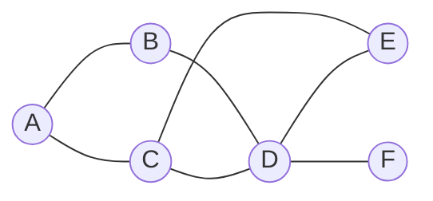
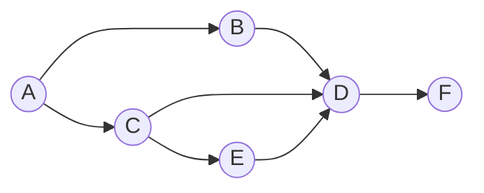
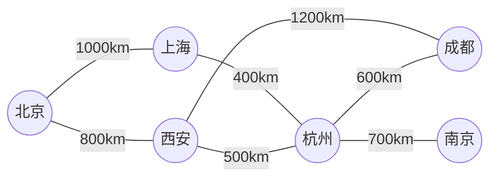

# Graph Traversal图遍历原理与代码实例讲解

作者：禅与计算机程序设计艺术

## 1.背景介绍

图(Graph)是由节点(Vertex)和边(Edge)组成的数据结构,用于描述事物之间的关系网络。图在计算机科学中有着广泛的应用,如社交网络分析、路径规划、推荐系统等。作为开发者,掌握图的遍历算法对于理解和实现图相关的应用至关重要。

本文将深入讲解图遍历的核心概念,介绍两种经典的遍历算法——广度优先搜索(BFS)和深度优先搜索(DFS),结合清晰的流程图和代码实例,帮助读者全面理解图遍历的原理和实现。同时,本文还将探讨图遍历在实际场景中的应用,分享相关工具和资源,并展望图遍历技术未来的发展趋势与挑战。

### 1.1图的基本概念
#### 1.1.1 节点与边
#### 1.1.2 有向图与无向图 
#### 1.1.3 加权图

### 1.2图的存储方式
#### 1.2.1 邻接矩阵
#### 1.2.2 邻接表
#### 1.2.3 两种存储方式的对比

### 1.3图遍历的意义与应用
#### 1.3.1 连通性检测
#### 1.3.2 最短路径问题
#### 1.3.3 拓扑排序

## 2. 核心概念与联系

### 2.1 广度优先搜索(BFS) 
#### 2.1.1 BFS定义与特点
#### 2.1.2 BFS中的队列
#### 2.1.3 BFS时间与空间复杂度

### 2.2 深度优先搜索(DFS)
#### 2.2.1 DFS定义与特点 
#### 2.2.2 DFS中的栈
#### 2.2.3 DFS时间与空间复杂度

### 2.3 BFS与DFS的异同比较
#### 2.3.1 遍历顺序差异
#### 2.3.2 数据结构差异
#### 2.3.3 复杂度差异

## 3. 核心算法原理具体操作步骤

### 3.1 BFS算法步骤
#### 3.1.1 起点入队
#### 3.1.2 出队并标记已访问
#### 3.1.3 访问相邻未访问过的节点并入队
#### 3.1.4 重复直至队空

### 3.2 DFS算法步骤
#### 3.2.1 起点入栈 
#### 3.2.2 出栈并标记已访问
#### 3.2.3 访问相邻未访问过的节点并入栈
#### 3.2.4 重复直至栈空

### 3.3 算法流程图
#### 3.3.1 BFS流程图
#### 3.3.2 DFS流程图

## 4. 数学模型和公式详细讲解举例说明

### 4.1 图数据结构的数学表示
#### 4.1.1 邻接矩阵的数学定义
#### 4.1.2 邻接表的数学定义

### 4.2 BFS与DFS的时间复杂度推导
#### 4.2.1 BFS时间复杂度 $O(V+E)$
#### 4.2.2 DFS时间复杂度 $O(V+E)$
 
### 4.3 具体例子演算
#### 4.3.1 以简单图为例,展示BFS遍历过程
#### 4.3.2 以简单图为例,展示DFS遍历过程

## 5. 项目实践:代码实例和详细解释说明

### 5.1 图的存储实现
#### 5.1.1 邻接矩阵实现
#### 5.1.2 邻接表实现

### 5.2 BFS代码实例与解释
#### 5.2.1 BFS完整代码
#### 5.2.2 关键函数与步骤解析

### 5.3 DFS代码实例与解释
#### 5.3.1 DFS完整代码
#### 5.3.2 关键函数与步骤解析

### 5.4 基于BFS/DFS的应用案例
#### 5.4.1 利用BFS求最短路径
#### 5.4.2 利用DFS检测环路

## 6. 实际应用场景

### 6.1 社交网络分析
#### 6.1.1 六度分隔理论与BFS
#### 6.1.2 影响力分析与最短路径

### 6.2 网页爬虫 
#### 6.2.1 基于DFS的深度爬取策略
#### 6.2.2 基于BFS的广度爬取策略

### 6.3 迷宫与地图路径规划
#### 6.3.1 迷宫问题与DFS回溯
#### 6.3.2 地图最短路径与BFS

## 7. 工具和资源推荐

### 7.1 图可视化工具
#### 7.1.1 Graphviz
#### 7.1.2 Gephi

### 7.2 图数据库
#### 7.2.1 Neo4j
#### 7.2.2 JanusGraph

### 7.3 相关算法库
#### 7.3.1 Networkx(Python)
#### 7.3.2 JGraphT(Java)

## 8. 总结:未来发展趋势与挑战

### 8.1 大规模图数据处理 
#### 8.1.1 分布式图遍历算法
#### 8.1.2 图数据压缩与查询优化

### 8.2 实时动态图遍历
#### 8.2.1 动态加入与删除节点/边
#### 8.2.2 增量式图遍历算法

### 8.3 多目标优化图遍历
#### 8.3.1 结合多种评估维度的遍历
#### 8.3.2 路径选择的权衡与优化

## 9. 附录:常见问题与解答

### 9.1 为什么有时BFS比DFS更合适?
### 9.2 遇到断开的图如何处理?
### 9.3 如何避免遍历过程中的重复访问?
### 9.4 带权图如何选择遍历策略?
### 9.5 如何设计面试中的图遍历问题?

以上就是一篇关于图遍历原理的技术博客文章框架。接下来,我们将围绕这个结构,深入讲解每个章节的具体内容,力求全面系统地阐述图遍历这一重要话题。通过学习本文,相信无论你是图算法的初学者,还是有一定经验的开发者,都能收获满满的知识干货。

让我们一起出发,遨游图遍历的基础理论, 研究其数学模型,再到动手实践环节感受编程的充实,接着开拓视野领略图遍历的实际价值,最后应对未来,创造无限可能。在阅读与思考中,你不仅能真正掌握图遍历,更能提升代码设计与优化能力,锻炼计算机科学的第一性原理思维。期待这次旅程给你带来全新的收获,成为你算法修炼路上矗立的里程碑。

接下来,让我们从第一章"背景介绍"正式开始!

### 1.1 图的基本概念

图(Graph)作为一种抽象的数据结构,由一组顶点(Vertex)和连接顶点的边(Edge)组成。图是现实事物之间关系的抽象,能够直观地表示实体间的联系网络。

#### 1.1.1 节点与边

图的组成要素主要包括节点(Node或Vertex)和边(Edge):

- 节点:图中的基本单元,代表一个实体对象,如社交网络中的用户,地图中的地点等。
- 边:连接图中节点的线段或弧,表示节点之间的关系,如社交网络里的好友关系,地图里的道路等。边可以是有向的,也可以是无向的。

我们常用G=(V, E)来定义一个图,其中V是顶点集,E是边集。如下图所示,该图包含了6个顶点 $\{A,B,C,D,E,F\}$ 和7条边:



在上图中,A与B相连的边记作(A,B)或(B,A),视为同一条无向边。

#### 1.1.2 有向图与无向图

根据边的方向性,图可以分为无向图(Undirected Graph)和有向图(Directed Graph):

- 无向图:边没有方向,若顶点v到顶点w有边,则w到v也一定有边。上文所举例的图便是一个典型的无向图。
- 有向图:边有方向,由弧头指向弧尾,表示单向的关系。例如下图,A到B有向边(A,B),但B到A不一定有边。



#### 1.1.3 加权图

在现实场景中,边往往携带一定的权重信息,如道路的长度,社交关系的亲密度等。我们称边带有权重的图为加权图(Weighted Graph),相应的边称为加权边,权重用w(u,v)表示。

举个例子,下图展示了一个城市间的距离加权图:



其中,节点代表城市,边代表城市间的道路,权重为道路长度。这种带权图在诸如最短路径等问题上有重要应用。

### 1.2 图的存储方式

为了在计算机中表示和操作图,我们需要选择合适的数据结构来存储图的信息。常见的图存储方式有邻接矩阵(Adjacency Matrix)和邻接表(Adjacency List)两种。选择合适的存储方式可以提高图遍历等操作的效率。

#### 1.2.1 邻接矩阵

邻接矩阵使用一个二维数组来表示图的连接关系。设图有n个顶点,则邻接矩阵是一个n×n的方阵。定义如下:
$$
A[i][j]=
\begin{cases}
1 & \text{if (i,j)}\in E \\
0 & \text{otherwise}
\end{cases}
$$

其中,$A[i][j]=1$ 表示顶点i到顶点j有边;$A[i][j]=0$ 则表示没有边。

以Little Examples节中的无向图为例,其邻接矩阵如下:

$$
\begin{bmatrix}
0&1&1&0&0&0\\ 
1&0&0&1&0&0\\
1&0&0&1&1&0\\
0&1&1&0&1&1\\
0&0&1&1&0&0\\
0&0&0&1&0&0\\
\end{bmatrix}
$$

可见,无向图的邻接矩阵是一个对称矩阵,主对角线为0。若要表示带权图,只需将1替换为相应的权重值即可。

邻接矩阵的优点是简单直观,判断两点间是否有边的查询效率高,为$O(1)$。但其缺点也很明显,空间复杂度高,达$O(n^2)$,且不管图的稀疏程度如何,空间消耗都一样大。

#### 1.2.2 邻接表

邻接表维护了每个顶点的邻接点列表,通常用链表或动态数组实现。对于无向图,每条边(u,v)在u和v各自的列表中都要存一次。

我们以上述无向图为例,展示其邻接表存储:

```
A -> B -> C
B -> A -> D  
C -> A -> D -> E
D -> B -> C -> E -> F
E -> C -> D
F -> D
```

使用邻接表,添加和删除一条边的复杂度是$O(1)$,空间复杂度是$O(V+E)$。这对于稀疏图尤其有利,能节省大量空间。不过,判断两点是否相邻的查询效率下降为$O(V)$。

#### 1.2.3 两种存储方式的对比

|   操作   | 邻接矩阵 |  邻接表  |
| -------- | ------- | -------- |
| 新增节点 | $O(V^2)$   | $O(1)$     |
| 新增边   | $O(1)$     | $O(1)$ |
| 检查相邻 | $O(1)$     | $O(V)$     |
| 遍历边   | $O(V^