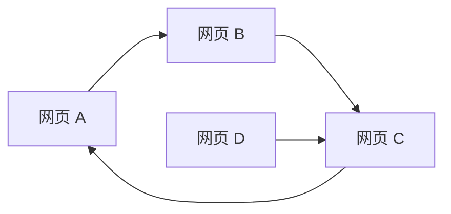

# Pregel图计算模型原理与代码实例讲解

作者：禅与计算机程序设计艺术

## 1. 背景介绍

### 1.1  大数据时代与图计算

步入21世纪，信息技术以前所未有的速度发展，互联网、社交网络、移动互联网等新兴技术的兴起，以及物联网、云计算等技术的不断成熟，数据量呈现爆炸式增长，我们正快速迈入大数据时代。如何有效地存储、管理、分析和挖掘这些海量数据，从中提取有价值的信息和知识，已成为学术界和工业界共同关注的焦点。

图数据作为一种描述事物之间关系的数据结构，在现实世界中普遍存在，例如社交网络、网页链接关系、交通网络、生物网络等都可以用图来表示。图计算是指以图作为数据模型，利用图的结构特征和顶点属性信息进行计算，从而发现和挖掘数据中隐藏的规律和模式。

### 1.2 图计算的挑战

传统的图计算方法在处理大规模图数据时面临着诸多挑战：

* **计算复杂度高:** 图算法通常具有较高的计算复杂度，例如最短路径、社区发现等算法的时间复杂度可达 $O(V^3)$ 或更高，难以满足大规模图数据的实时性要求。
* **数据规模庞大:**  现实世界中的图数据规模往往非常庞大，例如社交网络中的用户和关系数量可达数十亿甚至百亿级别，传统的单机计算模式难以有效处理。
* **图结构复杂:**  现实世界中的图数据往往具有复杂的结构特征，例如稀疏性、异构性、动态性等，传统的图计算模型难以有效应对。

### 1.3 Pregel的诞生

为了应对上述挑战，Google于2010年提出了Pregel图计算模型，并成功应用于 PageRank 等经典图算法的计算。Pregel 采用"思考如顶点，行动像图"的编程模型，将图计算任务分解成多个子任务，每个子任务由一个顶点负责执行，顶点之间通过消息传递进行通信，从而实现分布式计算。

## 2. 核心概念与联系

### 2.1  Pregel基本概念

* **图:** Pregel 将图数据抽象为一个有向图 G=(V, E)，其中 V 表示顶点集合，E 表示边集合。
* **顶点:**  每个顶点都拥有一个唯一的 ID 和一个可变状态，顶点可以存储任意类型的数据，例如数值、字符串、列表等。
* **边:**  每条边连接两个顶点，表示顶点之间的关系，边上可以携带权重等属性信息。
* **消息:**  顶点之间通过消息进行通信，消息可以携带任意类型的数据。
* **超级步:**  Pregel 采用迭代计算的方式进行图计算，每次迭代称为一个超级步。在每个超级步中，所有顶点并行执行相同的计算逻辑，并通过发送消息与邻居顶点进行通信。

### 2.2 Pregel计算模型

Pregel 的计算模型可以概括为以下三个步骤：

1. **初始化:**  在计算开始之前，需要对图数据进行初始化，例如为每个顶点设置初始状态、为每条边设置权重等。
2. **迭代计算:**  Pregel 采用迭代计算的方式进行图计算，每次迭代称为一个超级步。在每个超级步中，所有顶点并行执行以下操作：
    * 接收来自邻居顶点的消息。
    * 根据接收到的消息更新自身状态。
    * 向邻居顶点发送消息。
3. **终止:**  当所有顶点都不再活跃，或者达到预设的迭代次数时，Pregel 计算结束。

### 2.3  Pregel核心概念之间的联系

* **顶点:** 是 Pregel 计算的基本单元，负责执行具体的计算逻辑。
* **消息:** 是顶点之间进行通信的唯一方式，通过消息传递可以实现数据交换和状态同步。
* **超级步:** 是 Pregel 计算的迭代单元，每个超级步中所有顶点并行执行相同的计算逻辑。

## 3. 核心算法原理具体操作步骤

### 3.1  PageRank算法简介

PageRank 算法是由 Google 创始人 Larry Page 和 Sergey Brin 发明的一种网页排名算法，用于评估网页的重要性。PageRank 算法的基本思想是：

* 一个网页的重要程度与链接到该网页的其他网页的数量和质量成正比。
* 如果一个网页被很多重要的网页链接，那么该网页也应该是重要的。

### 3.2  Pregel实现PageRank算法的步骤

1. **初始化:**
   * 为每个顶点设置初始 PageRank 值为 1/N，其中 N 为图中顶点的总数。
2. **迭代计算:**
   * 每个顶点接收来自邻居顶点的消息，消息中包含邻居顶点的 PageRank 值和出度。
   * 每个顶点根据接收到的消息更新自身的 PageRank 值，计算公式如下：
     ```
     PageRank(v) = (1 - d) / N + d * Σ(PageRank(u) / OutDegree(u))
     ```
     其中：
     * v 表示当前顶点
     * u 表示链接到 v 的顶点
     * d 表示阻尼系数，通常设置为 0.85
     * OutDegree(u) 表示顶点 u 的出度
   * 每个顶点向所有邻居顶点发送消息，消息中包含自身的 PageRank 值和出度。
3. **终止:**
   * 当所有顶点的 PageRank 值变化小于预设的阈值，或者达到预设的迭代次数时，Pregel 计算结束。

### 3.3  PageRank算法在Pregel上的执行流程

```mermaid
graph LR
    subgraph "超级步 0"
        A["顶点 A<br>PR=1/N"] -->|PR=1/N| B["顶点 B<br>PR=1/N"]
        A -->|PR=1/N| C["顶点 C<br>PR=1/N"]
        B -->|PR=1/N| C
    end
    subgraph "超级步 1"
        A["顶点 A<br>PR=..."] -->|PR=...| B["顶点 B<br>PR=..."]
        A -->|PR=...| C["顶点 C<br>PR=..."]
        B -->|PR=...| C
    end
    subgraph "超级步 2"
        A["顶点 A<br>PR=..."] -->|PR=...| B["顶点 B<br>PR=..."]
        A -->|PR=...| C["顶点 C<br>PR=..."]
        B -->|PR=...| C
    end
    "超级步 0" --> "超级步 1"
    "超级步 1" --> "超级步 2"
    "超级步 2" --> "..."
```

## 4. 数学模型和公式详细讲解举例说明

### 4.1 PageRank算法的数学模型

PageRank 算法的数学模型可以表示为一个线性方程组：

```
PR = (1 - d) * e / N + d * M * PR
```

其中：

* **PR:**  表示所有网页的 PageRank 值向量，是一个 N 维向量，N 为网页总数。
* **e:**  表示一个所有元素都为 1 的 N 维向量。
* **d:**  表示阻尼系数，通常设置为 0.85。
* **M:**  表示网页链接关系矩阵，是一个 N * N 的矩阵，如果网页 i 链接到网页 j，则 M(i, j) = 1 / OutDegree(i)，否则 M(i, j) = 0。

### 4.2 PageRank算法的计算过程

PageRank 算法的计算过程可以看作是迭代求解上述线性方程组的过程。

1. **初始化:**  将所有网页的 PageRank 值初始化为 1/N。
2. **迭代计算:**  根据上述线性方程组，不断迭代计算 PR 的值，直到 PR 的值收敛为止。
3. **终止:**  当 PR 的值变化小于预设的阈值，或者达到预设的迭代次数时，计算结束。

### 4.3  举例说明

假设有一个由 4 个网页组成的网络，链接关系如下图所示：



根据上述数学模型，可以得到该网络的 PageRank 值向量 PR 为：

```
PR = [0.32, 0.23, 0.28, 0.17]
```

其中，网页 C 的 PageRank 值最高，为 0.28，说明网页 C 的重要性最高。

## 5. 项目实践：代码实例和详细解释说明

### 5.1  环境准备

* **Java Development Kit (JDK):** 版本需要在 1.8 或以上。
* **Apache Maven:**  用于项目构建和依赖管理。
* **文本编辑器或 IDE:** 例如 IntelliJ IDEA、Eclipse 等。

### 5.2  创建 Maven 项目

使用 Maven 创建一个新的 Java 项目，命名为 `pregel-pagerank`。

### 5.3  添加依赖

在 `pom.xml` 文件中添加以下依赖：

```xml
<dependencies>
  <dependency>
    <groupId>org.apache.giraph</groupId>
    <artifactId>giraph-core</artifactId>
    <version>1.3.0</version>
  </dependency>
</dependencies>
```

### 5.4  编写代码

创建 `PageRankComputation.java` 文件，代码如下：

```java
import org.apache.giraph.graph.BasicComputation;
import org.apache.giraph.conf.LongConfOption;
import org.apache.giraph.edge.Edge;
import org.apache.giraph.graph.Vertex;
import org.apache.hadoop.io.DoubleWritable;
import org.apache.hadoop.io.FloatWritable;
import org.apache.hadoop.io.LongWritable;
import org.apache.log4j.Logger;

import java.io.IOException;

/**
 * PageRank 计算实现
 */
public class PageRankComputation extends BasicComputation<
    LongWritable, DoubleWritable, FloatWritable, DoubleWritable> {

  /** 配置项：阻尼系数 */
  public static final LongConfOption DAMPING_FACTOR =
      new LongConfOption("PageRankComputation.dampingFactor", 0.85f,
          "阻尼系数");

  /** 日志记录器 */
  private static final Logger LOG =
      Logger.getLogger(PageRankComputation.class);

  @Override
  public void compute(
      Vertex<LongWritable, DoubleWritable, FloatWritable> vertex,
      Iterable<DoubleWritable> messages) throws IOException {

    // 获取阻尼系数
    float dampingFactor = DAMPING_FACTOR.get(getConf());

    // 第一个超级步：初始化 PageRank 值
    if (getSuperstep() == 0) {
      vertex.setValue(new DoubleWritable((double) 1 / getTotalNumVertices()));
    } else {
      // 计算来自邻居顶点的贡献值
      double sum = 0;
      for (DoubleWritable message : messages) {
        sum += message.get();
      }

      // 更新 PageRank 值
      double pageRank = (1 - dampingFactor) / getTotalNumVertices() +
          dampingFactor * sum;
      vertex.setValue(new DoubleWritable(pageRank));
    }

    // 发送 PageRank 值给所有邻居顶点
    if (getSuperstep() < getMaxNumberOfWorkers()) {
      double pageRank = vertex.getValue().get();
      for (Edge<LongWritable, FloatWritable> edge : vertex.getEdges()) {
        sendMessage(edge.getTargetVertexId(), new DoubleWritable(pageRank));
      }
    } else {
      // 最后一个超级步：投票结束
      vertex.voteToHalt();
    }
  }
}
```

### 5.5  编译打包

使用 Maven 编译并打包项目：

```
mvn clean package
```

### 5.6  运行程序

将打包好的 JAR 文件上传到 Hadoop 集群，并使用以下命令运行 PageRank 算法：

```
hadoop jar pregel-pagerank-1.0-SNAPSHOT.jar org.apache.giraph.GiraphRunner \
  PageRankComputation \
  -vif org.apache.giraph.io.formats.JsonLongDoubleFloatDoubleVertexInputFormat \
  -vip /path/to/input/graph.json \
  -vof org.apache.giraph.io.formats.IdWithValueTextOutputFormat \
  -op /path/to/output \
  -w 2 \
  -ca PageRankComputation.dampingFactor=0.85
```

其中：

* `/path/to/input/graph.json` 是输入图数据的路径，格式为 JSON。
* `/path/to/output` 是输出结果的路径。
* `-w 2` 表示使用 2 个 Worker 节点进行计算。
* `-ca PageRankComputation.dampingFactor=0.85` 表示设置阻尼系数为 0.85。

## 6. 实际应用场景

### 6.1  社交网络分析

* **好友推荐:**  利用 PageRank 算法可以识别社交网络中的重要用户，并根据用户的 PageRank 值进行好友推荐。
* **社区发现:**  利用 PageRank 算法可以识别社交网络中的社区结构，并根据用户的 PageRank 值进行社区划分。
* **影响力分析:**  利用 PageRank 算法可以识别社交网络中的意见领袖，并根据用户的 PageRank 值进行影响力分析。

### 6.2  搜索引擎

* **网页排名:**  利用 PageRank 算法可以评估网页的重要性，并将重要的网页排在搜索结果的前面。
* **垃圾网页识别:**  利用 PageRank 算法可以识别垃圾网页，并将垃圾网页从搜索结果中剔除。

### 6.3  推荐系统

* **商品推荐:**  利用 PageRank 算法可以识别用户感兴趣的商品，并根据用户的 PageRank 值进行商品推荐。
* **广告推荐:**  利用 PageRank 算法可以识别用户感兴趣的广告，并根据用户的 PageRank 值进行广告推荐。

## 7. 总结：未来发展趋势与挑战

### 7.1  未来发展趋势

* **更高效的图计算模型:**  随着图数据规模的不断增长，需要更高效的图计算模型来处理海量数据。
* **更智能的图计算算法:**  需要更智能的图计算算法来挖掘图数据中隐藏的规律和模式。
* **更广泛的应用领域:**  图计算技术将应用于更多的领域，例如生物信息学、金融分析等。

### 7.2  挑战

* **图数据的复杂性:**  现实世界中的图数据往往具有复杂的结构特征，例如稀疏性、异构性、动态性等，这对图计算模型和算法的设计提出了挑战。
* **图计算的效率:**  图计算算法通常具有较高的计算复杂度，如何提高图计算的效率是一个重要的挑战。
* **图计算的可扩展性:**  随着图数据规模的不断增长，如何设计可扩展的图计算模型和算法是一个重要的挑战。

## 8. 附录：常见问题与解答

### 8.1  Pregel 和 Hadoop MapReduce 有什么区别？

Pregel 和 Hadoop MapReduce 都是分布式计算框架，但它们的设计目标和应用场景有所不同。

* **设计目标:**  Pregel 专注于图计算，而 Hadoop MapReduce 则是一个通用的分布式计算框架。
* **编程模型:**  Pregel 采用"思考如顶点，行动像图"的编程模型，而 Hadoop MapReduce 则采用 Map 和 Reduce 两个阶段进行编程。
* **数据结构:**  Pregel 处理的是图数据，而 Hadoop MapReduce 处理的是键值对数据。

### 8.2  Pregel 有哪些优点？

* **高效性:**  Pregel 采用"思考如顶点，行动像图"的编程模型，可以有效地利用图的结构特征进行计算，从而提高计算效率。
* **可扩展性:**  Pregel 可以运行在大型集群上，可以处理数十亿甚至百亿级别的顶点和边。
* **容错性:**  Pregel 具有容错机制，可以保证在节点故障的情况下计算任务仍然能够完成。

### 8.3  Pregel 有哪些缺点？

* **编程模型相对复杂:**  Pregel 的编程模型相对复杂，需要开发者对图计算有一定的了解。
* **只适用于图计算:**  Pregel 只适用于图计算，不适用于其他类型的计算任务。