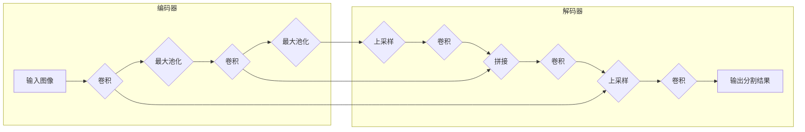

## U-Net++原理与代码实例讲解

# 1. 背景介绍

### 1.1 图像分割的挑战与发展

图像分割是计算机视觉领域的一项基础性任务，其目标是将图像分割成多个具有语义意义的区域。近年来，随着深度学习技术的快速发展，图像分割技术取得了显著的进步，并在医学影像分析、自动驾驶、遥感图像解译等领域展现出巨大的应用潜力。

然而，传统的图像分割方法，如阈值分割、边缘检测等，往往难以处理复杂场景下的图像分割问题，例如目标形状多变、背景复杂、噪声干扰等。为了解决这些挑战，研究者们提出了基于深度学习的图像分割方法，其中U-Net网络结构凭借其优异的性能和灵活的设计，成为了图像分割领域的重要研究方向之一。

### 1.2 U-Net网络结构的优势与局限性

U-Net网络结构于2015年提出，其结构类似于字母“U”，主要由编码器（Encoder）和解码器（Decoder）两部分组成。编码器部分通过一系列卷积和池化操作逐步提取图像的特征信息，并将图像分辨率降低；解码器部分则通过一系列反卷积和上采样操作逐步恢复图像分辨率，并结合编码器部分的特征信息进行精细分割。

U-Net网络结构的优势在于：

* **端到端的训练方式:** U-Net网络可以进行端到端的训练，无需人工设计特征，能够自动学习图像特征和分割规则。
* **多尺度特征融合:** 通过编码器和解码器之间的跳跃连接，U-Net网络能够有效地融合不同尺度的特征信息，提高分割精度。
* **灵活的网络结构:** U-Net网络结构简单灵活，可以根据不同的应用场景进行调整和扩展。

然而，U-Net网络结构也存在一些局限性：

* **对浅层特征利用不足:** U-Net网络主要利用编码器深层的语义信息进行分割，对浅层特征的利用不足，导致分割边界不够精细。
* **对不同尺度目标的分割效果差异较大:** 由于U-Net网络采用固定的网络结构，对不同尺度目标的分割效果差异较大。

### 1.3 U-Net++网络结构的提出与改进

为了解决U-Net网络结构的局限性，研究者们提出了U-Net++网络结构。U-Net++网络结构在U-Net网络的基础上进行了改进，主要包括以下几个方面：

* **引入嵌套的U-Net结构:** U-Net++网络在编码器和解码器之间引入了多个嵌套的U-Net结构，每个嵌套的U-Net结构都能够学习不同尺度的特征信息，并通过跳跃连接进行融合，从而提高了网络对不同尺度目标的分割能力。
* **设计更深的网络结构:** U-Net++网络通过增加网络深度，进一步提高了网络的特征提取能力，从而提高了分割精度。
* **引入深度监督机制:** U-Net++网络在每个嵌套的U-Net结构的输出端都引入了深度监督机制，使得网络能够更好地学习不同尺度的特征信息，并提高了网络的训练效率。

## 2. 核心概念与联系

### 2.1 U-Net++网络结构

U-Net++网络结构可以看作是由多个U-Net网络嵌套而成的，每个嵌套的U-Net网络都包含编码器和解码器两部分。其中，编码器部分用于提取图像的特征信息，解码器部分用于恢复图像分辨率并进行分割。不同嵌套的U-Net网络之间通过跳跃连接进行特征融合，从而实现多尺度特征的有效利用。



### 2.2 嵌套的U-Net结构

U-Net++网络中的每个嵌套的U-Net结构都可以看作是一个独立的U-Net网络，其结构与原始的U-Net网络相同。不同嵌套的U-Net网络之间通过跳跃连接进行特征融合，具体来说，每个嵌套的U-Net网络的解码器部分都会接收来自其对应的编码器部分和前一个嵌套的U-Net网络的解码器部分的特征信息。

### 2.3 跳跃连接

跳跃连接是U-Net++网络结构中非常重要的一个组成部分，它用于将编码器部分的特征信息传递给解码器部分，从而实现多尺度特征的融合。具体来说，跳跃连接将编码器部分的特征图与解码器部分相同分辨率的特征图进行拼接，然后输入到解码器部分的下一层进行处理。

### 2.4 深度监督机制

深度监督机制是指在网络训练过程中，不仅在网络的最终输出端计算损失函数，而且在网络的中间层也计算损失函数，并根据损失函数的值更新网络参数。U-Net++网络在每个嵌套的U-Net结构的输出端都引入了深度监督机制，使得网络能够更好地学习不同尺度的特征信息，并提高了网络的训练效率。

## 3. 核心算法原理具体操作步骤

### 3.1 数据预处理

在进行U-Net++网络训练之前，需要对数据进行预处理，主要包括以下几个步骤：

* **数据增强:** 通过对原始数据进行旋转、缩放、翻转等操作，可以增加训练数据的数量和多样性，从而提高模型的泛化能力。
* **数据归一化:** 将数据缩放到[0, 1]区间，可以加速模型的收敛速度。
* **数据划分:** 将数据划分为训练集、验证集和测试集，用于模型的训练、评估和测试。

### 3.2 模型构建

U-Net++网络的构建可以参考以下步骤：

1. **定义编码器部分:** 编码器部分可以使用预训练的卷积神经网络模型，例如VGG、ResNet等，也可以根据实际需求自定义卷积神经网络结构。
2. **定义解码器部分:** 解码器部分的结构与编码器部分基本对称，主要包括反卷积、上采样和拼接等操作。
3. **添加嵌套的U-Net结构:** 在编码器和解码器之间添加多个嵌套的U-Net结构，每个嵌套的U-Net结构都包含编码器和解码器两部分。
4. **添加跳跃连接:** 在每个嵌套的U-Net结构的解码器部分添加跳跃连接，将编码器部分的特征信息传递给解码器部分。
5. **添加深度监督机制:** 在每个嵌套的U-Net结构的输出端添加深度监督机制，计算损失函数并更新网络参数。

### 3.3 模型训练

U-Net++网络的训练可以使用随机梯度下降（SGD）等优化算法，并使用交叉熵损失函数等评估模型的性能。在训练过程中，需要根据实际情况调整学习率、批大小等超参数，以获得最佳的模型性能。

### 3.4 模型评估

模型训练完成后，需要使用测试集对模型进行评估，常用的评估指标包括准确率、召回率、F1值等。

### 3.5 模型预测

模型评估完成后，可以使用训练好的模型对新的数据进行预测，并根据预测结果进行相应的处理。

## 4. 数学模型和公式详细讲解举例说明

### 4.1 卷积操作

卷积操作是卷积神经网络中最基础的操作之一，其数学公式如下：

$$
(f * g)(t) = \int_{-\infty}^{\infty} f(\tau)g(t-\tau)d\tau
$$

其中，$f(t)$表示输入信号，$g(t)$表示卷积核，$*$表示卷积操作，$(f * g)(t)$表示输出信号。

卷积操作可以看作是将卷积核在输入信号上滑动，并计算对应位置元素的乘积之和。

### 4.2 池化操作

池化操作用于降低特征图的维度，常用的池化操作包括最大池化和平均池化。

* **最大池化:** 选择池化窗口中最大值作为输出。
* **平均池化:** 计算池化窗口中所有元素的平均值作为输出。

### 4.3 反卷积操作

反卷积操作可以看作是卷积操作的逆操作，用于将低分辨率的特征图恢复成高分辨率的特征图。

### 4.4 上采样操作

上采样操作用于增加特征图的维度，常用的上采样操作包括最近邻插值和双线性插值。

### 4.5 损失函数

U-Net++网络常用的损失函数是交叉熵损失函数，其公式如下：

$$
L = -\frac{1}{N}\sum_{i=1}^{N}\sum_{c=1}^{C}y_{ic}\log(p_{ic})
$$

其中，$N$表示样本数量，$C$表示类别数量，$y_{ic}$表示第$i$个样本属于第$c$类的真实标签，$p_{ic}$表示第$i$个样本属于第$c$类的预测概率。

## 5. 项目实践：代码实例和详细解释说明

### 5.1 数据集介绍

本节将使用Kaggle上的细胞核分割数据集（https://www.kaggle.com/c/data-science-bowl-2018/）进行U-Net++网络的训练和测试。该数据集包含大量的细胞核图像及其对应的分割标签，可以用于训练和评估图像分割模型。

### 5.2 代码实现

```python
import torch
import torch.nn as nn
from torch.utils.data import Dataset, DataLoader

# 定义U-Net++网络结构
class UNetPlusPlus(nn.Module):
    def __init__(self, in_channels, out_channels):
        super(UNetPlusPlus, self).__init__()
        # ...

    def forward(self, x):
        # ...

# 定义数据集
class CellNucleiDataset(Dataset):
    def __init__(self, image_dir, mask_dir, transform=None):
        # ...

    def __len__(self):
        # ...

    def __getitem__(self, idx):
        # ...

# 定义训练函数
def train(model, train_loader, optimizer, criterion, device):
    # ...

# 定义评估函数
def evaluate(model, val_loader, criterion, device):
    # ...

# 主函数
if __name__ == '__main__':
    # 设置参数
    image_dir = 'path/to/image/dir'
    mask_dir = 'path/to/mask/dir'
    in_channels = 3
    out_channels = 1
    learning_rate = 1e-4
    batch_size = 16
    num_epochs = 100

    # 创建数据集和数据加载器
    train_dataset = CellNucleiDataset(image_dir, mask_dir, transform=...)
    val_dataset = CellNucleiDataset(image_dir, mask_dir, transform=...)
    train_loader = DataLoader(train_dataset, batch_size=batch_size, shuffle=True)
    val_loader = DataLoader(val_dataset, batch_size=batch_size, shuffle=False)

    # 创建模型、优化器和损失函数
    model = UNetPlusPlus(in_channels, out_channels).to(device)
    optimizer = torch.optim.Adam(model.parameters(), lr=learning_rate)
    criterion = nn.BCEWithLogitsLoss()

    # 训练模型
    for epoch in range(num_epochs):
        train(model, train_loader, optimizer, criterion, device)
        evaluate(model, val_loader, criterion, device)

    # 保存模型
    torch.save(model.state_dict(), 'unet++.pth')
```

## 6. 实际应用场景

U-Net++网络结构在医学影像分析、自动驾驶、遥感图像解译等领域具有广泛的应用。

* **医学影像分析:** U-Net++网络可以用于分割医学图像，例如肿瘤分割、器官分割等，辅助医生进行诊断和治疗。
* **自动驾驶:** U-Net++网络可以用于分割道路、车辆、行人等目标，为自动驾驶系统提供环境感知信息。
* **遥感图像解译:** U-Net++网络可以用于分割遥感图像，例如土地利用分类、目标识别等，为地理信息系统提供数据支持。

## 7. 总结：未来发展趋势与挑战

U-Net++网络结构作为一种优秀的图像分割方法，在未来还将继续发展和完善。

* **网络结构优化:** 研究更加高效、精简的网络结构，进一步提高模型的性能和效率。
* **多模态融合:** 将图像、文本、语音等多模态数据融合到图像分割模型中，提高模型的鲁棒性和泛化能力。
* **弱监督学习:** 研究使用少量标注数据训练高性能的图像分割模型，降低模型训练成本。

## 8. 附录：常见问题与解答

### 8.1 U-Net++网络结构与U-Net网络结构的区别是什么？

U-Net++网络结构在U-Net网络结构的基础上进行了改进，主要包括以下几个方面：

* 引入嵌套的U-Net结构
* 设计更深的网络结构
* 引入深度监督机制

### 8.2 U-Net++网络结构的优点是什么？

U-Net++网络结构的优点包括：

* 对浅层特征利用更充分
* 对不同尺度目标的分割效果更好
* 训练效率更高

### 8.3 U-Net++网络结构的应用场景有哪些？

U-Net++网络结构的应用场景包括：

* 医学影像分析
* 自动驾驶
* 遥感图像解译

### 8.4 如何选择合适的U-Net++网络结构？

选择合适的U-Net++网络结构需要考虑以下因素：

* 数据集大小
* 目标尺度
* 计算资源限制

### 8.5 如何提高U-Net++网络结构的性能？

提高U-Net++网络结构的性能可以尝试以下方法：

* 数据增强
* 网络结构优化
* 超参数调整
* 使用预训练模型
