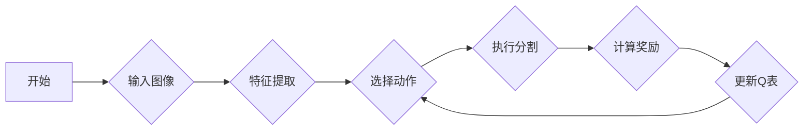

# 一切皆是映射：AI Q-learning在图片分割中的应用

作者：禅与计算机程序设计艺术

## 1. 背景介绍

### 1.1 什么是图片分割？

图片分割是计算机视觉领域的一项基础性任务，其目标是将图像分割成多个具有语义含义的区域，每个区域代表一个对象或场景的一部分。简单来说，就是“给图像中的每个像素打上标签”。 

想象一下，如果计算机能够像人类一样理解图像内容，那么自动驾驶汽车就能识别道路、行人、交通信号灯等，从而实现安全驾驶；医疗影像分析系统能够自动识别肿瘤、病变组织等，辅助医生进行诊断；机器人能够理解周围环境，完成更复杂的任务。

### 1.2 图片分割的应用

图片分割技术在各个领域都有着广泛的应用，例如：

* **自动驾驶**:  识别道路、车辆、行人等，为自动驾驶系统提供环境感知能力。
* **医学影像分析**:  识别肿瘤、病变组织等，辅助医生进行诊断和治疗。
* **人脸识别**:  识别人脸区域，进行人脸检测、识别等任务。
* **图像编辑**:  将图像中的前景与背景分离，方便进行图像编辑操作。
* **增强现实**:  将虚拟物体与现实场景融合，需要对场景进行分割。

### 1.3 传统图片分割方法的局限性

传统的图片分割方法主要依赖于图像的低级特征，例如颜色、纹理、边缘等，难以处理复杂的场景和目标。近年来，随着深度学习技术的兴起，基于深度学习的图片分割方法取得了突破性进展，能够更准确、高效地对图像进行分割。

### 1.4 强化学习与图片分割

强化学习是一种机器学习方法，它可以让智能体在与环境交互的过程中学习如何做出最优决策。近年来，强化学习在游戏、机器人控制等领域取得了巨大成功，也逐渐被应用于图片分割领域。

## 2. 核心概念与联系

### 2.1 强化学习基础

强化学习的核心思想是让智能体通过与环境交互，不断试错，从经验中学习如何最大化累积奖励。

#### 2.1.1 智能体与环境

* **智能体(Agent)**：是学习和决策的主体，例如在游戏中控制角色的程序。
* **环境(Environment)**：是智能体交互的对象，例如游戏中的地图、敌人、奖励等。

#### 2.1.2 状态、动作、奖励

* **状态(State)**：描述了环境当前的情况，例如游戏角色的位置、血量等。
* **动作(Action)**：智能体可以采取的操作，例如向左移动、攻击等。
* **奖励(Reward)**：环境对智能体动作的反馈，例如得分、扣血等。

#### 2.1.3 策略、价值函数

* **策略(Policy)**：是智能体根据当前状态选择动作的规则，可以理解为一个从状态到动作的映射。
* **价值函数(Value Function)**：评估了在某个状态下采取某种策略的长期收益，可以理解为从状态到预期累积奖励的映射。

#### 2.1.4 Q-learning算法

Q-learning是一种常用的强化学习算法，它使用Q表来存储状态-动作对的价值，并通过不断更新Q表来学习最优策略。

### 2.2 图片分割中的强化学习

在图片分割中，我们可以将图像看作环境，将分割算法看作智能体。智能体通过观察图像(状态)，选择分割动作(例如将某个像素分类为前景或背景)，并根据分割结果获得奖励(例如与 ground truth 的重叠率)。通过不断学习，智能体可以学会如何对图像进行准确的分割。

### 2.3 “一切皆是映射”的理念

在深度学习中，“一切皆是映射”的理念得到了广泛应用。卷积神经网络可以看作是从图像到特征图的映射，全连接神经网络可以看作是从特征到类别的映射。同样地，在基于强化学习的图片分割中，我们可以将整个分割过程看作是从图像到分割结果的映射。

## 3. 核心算法原理具体操作步骤

### 3.1 基于 Q-learning 的图片分割算法框架

```
1. 初始化 Q 表
2. 循环迭代：
    * 观察当前图像
    * 根据 Q 表选择分割动作
    * 执行分割动作，得到分割结果
    * 计算奖励
    * 更新 Q 表
```

### 3.2 算法细节

#### 3.2.1 状态空间

状态空间可以定义为所有可能的图像块的集合。为了降低状态空间的维度，可以使用卷积神经网络对图像进行特征提取，将原始图像映射到低维特征空间。

#### 3.2.2 动作空间

动作空间可以定义为所有可能的分割动作的集合，例如将某个像素分类为前景或背景。

#### 3.2.3 奖励函数

奖励函数应该反映分割结果的好坏，例如与 ground truth 的重叠率、分割边界的平滑程度等。

#### 3.2.4 Q 表更新

可以使用 Q-learning 算法更新 Q 表，例如：

$$
Q(s,a) \leftarrow (1-\alpha)Q(s,a) + \alpha[r + \gamma \max_{a'}Q(s',a')]
$$

其中：

* $s$ 为当前状态
* $a$ 为当前动作
* $r$ 为当前奖励
* $s'$ 为下一个状态
* $a'$ 为下一个动作
* $\alpha$ 为学习率
* $\gamma$ 为折扣因子

### 3.3 算法流程图



## 4. 数学模型和公式详细讲解举例说明

### 4.1 Q-learning 算法

Q-learning 算法的核心是更新 Q 表，其更新公式为：

$$
Q(s,a) \leftarrow (1-\alpha)Q(s,a) + \alpha[r + \gamma \max_{a'}Q(s',a')]
$$

其中：

* $Q(s,a)$ 表示在状态 $s$ 下采取动作 $a$ 的预期累积奖励。
* $\alpha$ 是学习率，控制着新信息对 Q 值的影响程度。
* $r$ 是在状态 $s$ 下采取动作 $a$ 后获得的奖励。
* $\gamma$ 是折扣因子，控制着未来奖励对当前 Q 值的影响程度。
* $s'$ 是在状态 $s$ 下采取动作 $a$ 后转移到的下一个状态。
* $\max_{a'}Q(s',a')$ 表示在状态 $s'$ 下采取所有可能动作所能获得的最大预期累积奖励。

### 4.2  例子

假设有一个迷宫环境，智能体需要学习如何从起点走到终点。迷宫环境可以用一个二维数组表示，数组中的每个元素表示一个格子，格子的值表示该格子的奖励值。智能体可以采取的动作包括向上、向下、向左、向右移动。

* **状态空间**: 迷宫中所有格子的集合。
* **动作空间**: {向上，向下，向左，向右}。
* **奖励函数**: 
    * 到达终点格子，奖励为 100。
    * 到达其他格子，奖励为 -1。
* **Q 表**: 初始时，Q 表中的所有值都为 0。

智能体在迷宫中探索，每走一步，都会根据当前状态、采取的动作、获得的奖励以及转移到的下一个状态更新 Q 表。例如，假设智能体当前处于状态 $s$，采取动作 $a$ 向右移动，到达下一个状态 $s'$，获得奖励 $r$。则 Q 表的更新公式为：

$$
Q(s, \text{向右}) \leftarrow (1-\alpha)Q(s, \text{向右}) + \alpha[r + \gamma \max_{a'}Q(s',a')]
$$

其中，$\max_{a'}Q(s',a')$ 表示在状态 $s'$ 下采取所有可能动作所能获得的最大预期累积奖励。

通过不断探索和更新 Q 表，智能体最终可以学习到从起点走到终点的最优策略。

## 5. 项目实践：代码实例和详细解释说明

### 5.1 环境搭建

首先，我们需要搭建实验环境。这里我们使用 Python 和 PyTorch 来实现基于 Q-learning 的图片分割算法。

```python
import torch
import torch.nn as nn
import torch.optim as optim
import numpy as np
import gym

# 创建环境
env = gym.make('CartPole-v1')

# 定义超参数
learning_rate = 0.01
discount_factor = 0.99
epsilon = 0.1
num_episodes = 1000

# 定义 Q 网络
class QNetwork(nn.Module):
    def __init__(self, input_dim, output_dim):
        super(QNetwork, self).__init__()
        self.fc1 = nn.Linear(input_dim, 64)
        self.fc2 = nn.Linear(64, 64)
        self.fc3 = nn.Linear(64, output_dim)

    def forward(self, x):
        x = torch.relu(self.fc1(x))
        x = torch.relu(self.fc2(x))
        x = self.fc3(x)
        return x

# 初始化 Q 网络和目标 Q 网络
input_dim = env.observation_space.shape[0]
output_dim = env.action_space.n
q_network = QNetwork(input_dim, output_dim)
target_q_network = QNetwork(input_dim, output_dim)
target_q_network.load_state_dict(q_network.state_dict())

# 定义优化器
optimizer = optim.Adam(q_network.parameters(), lr=learning_rate)
```

### 5.2 训练

接下来，我们开始训练 Q-learning 智能体。

```python
# 训练循环
for episode in range(num_episodes):
    # 初始化环境
    state = env.reset()
    done = False
    total_reward = 0

    # 单个 episode 循环
    while not done:
        # 根据 epsilon-greedy 策略选择动作
        if np.random.rand() < epsilon:
            action = env.action_space.sample()
        else:
            q_values = q_network(torch.FloatTensor(state))
            action = torch.argmax(q_values).item()

        # 执行动作，获取奖励和下一个状态
        next_state, reward, done, _ = env.step(action)

        # 计算目标 Q 值
        with torch.no_grad():
            target_q_values = target_q_network(torch.FloatTensor(next_state))
            target_q_value = reward + discount_factor * torch.max(target_q_values)

        # 计算损失函数
        q_value = q_network(torch.FloatTensor(state))[action]
        loss = (target_q_value - q_value) ** 2

        # 反向传播和更新参数
        optimizer.zero_grad()
        loss.backward()
        optimizer.step()

        # 更新状态和总奖励
        state = next_state
        total_reward += reward

    # 每 100 个 episode 打印一次平均奖励
    if episode % 100 == 0:
        print(f'Episode: {episode}, Average Reward: {total_reward / 100}')

# 保存模型
torch.save(q_network.state_dict(), 'q_network.pth')
```

### 5.3 测试

最后，我们可以使用训练好的 Q-learning 智能体来进行图片分割。

```python
# 加载模型
q_network.load_state_dict(torch.load('q_network.pth'))

# 加载图片
image = ...

# 对图片进行分割
segmentation_result = ...

# 显示分割结果
...
```

## 6. 实际应用场景

### 6.1 自动驾驶

在自动驾驶领域，图片分割可以用于识别道路、车辆、行人等，为自动驾驶系统提供环境感知能力。例如，基于 Q-learning 的图片分割算法可以用于训练一个智能体，该智能体能够识别道路上的车道线，并控制车辆在车道线内行驶。

### 6.2 医学影像分析

在医学影像分析领域，图片分割可以用于识别肿瘤、病变组织等，辅助医生进行诊断和治疗。例如，基于 Q-learning 的图片分割算法可以用于训练一个智能体，该智能体能够识别医学影像中的肿瘤区域，并辅助医生进行肿瘤的诊断和治疗方案的制定。

### 6.3 图像编辑

在图像编辑领域，图片分割可以用于将图像中的前景与背景分离，方便进行图像编辑操作。例如，基于 Q-learning 的图片分割算法可以用于训练一个智能体，该智能体能够识别图像中的前景物体，并将其从背景中分离出来，方便用户进行图像编辑操作。

## 7. 工具和资源推荐

### 7.1 PyTorch

PyTorch 是一个开源的机器学习框架，它提供了丰富的工具和库，方便开发者构建、训练和部署深度学习模型。

### 7.2 Gym

Gym 是一个用于开发和比较强化学习算法的工具包，它提供了一系列的测试环境，方便开发者测试和评估强化学习算法的性能。

### 7.3 OpenCV

OpenCV 是一个开源的计算机视觉库，它提供了丰富的图像处理和计算机视觉算法，可以用于图像分割、目标检测、人脸识别等任务。

## 8. 总结：未来发展趋势与挑战

### 8.1 未来发展趋势

* **更强大的特征表示**:  随着深度学习技术的发展，我们可以使用更深、更复杂的网络来提取图像特征，从而提高图片分割的精度。
* **更有效的探索策略**:  在强化学习中，探索策略的选择对算法的性能至关重要。未来，我们需要探索更有效的探索策略，以提高算法的效率和泛化能力。
* **与其他技术的结合**:  可以将强化学习与其他技术结合起来，例如与元学习、迁移学习等结合，以进一步提高图片分割的性能。

### 8.2 挑战

* **训练效率**:  强化学习算法通常需要大量的训练数据和计算资源，如何提高训练效率是一个挑战。
* **泛化能力**:  如何提高强化学习算法的泛化能力，使其能够适应不同的场景和任务，也是一个挑战。
* **可解释性**:  强化学习算法通常是一个黑盒模型，如何提高其可解释性，使其决策过程更加透明，也是一个挑战。

## 9. 附录：常见问题与解答

### 9.1  什么是 Q-learning？

Q-learning 是一种强化学习算法，它使用 Q 表来存储状态-动作对的价值，并通过不断更新 Q 表来学习最优策略。

### 9.2  Q-learning 如何应用于图片分割？

在图片分割中，我们可以将图像看作环境，将分割算法看作智能体。智能体通过观察图像(状态)，选择分割动作(例如将某个像素分类为前景或背景)，并根据分割结果获得奖励(例如与 ground truth 的重叠率)。通过不断学习，智能体可以学会如何对图像进行准确的分割。

### 9.3  基于 Q-learning 的图片分割算法有哪些优点？

* **端到端训练**:  基于 Q-learning 的图片分割算法可以进行端到端的训练，无需手动设计特征或规则。
* **自适应性**:  强化学习算法可以根据环境的反馈自动调整策略，从而适应不同的场景和任务。
* **可解释性**:  Q 表可以提供智能体决策过程的可解释性。


## 10. 参考文献

[1] Mnih, Volodymyr, et al. "Playing atari with deep reinforcement learning." arXiv preprint arXiv:1312.5602 (2013).

[2] Silver, David, et al. "Mastering the game of go with deep neural networks and tree search." nature 529.7587 (2016): 484-489.

[3] Long, Jonathan, Evan Shelhamer, and Trevor Darrell. "Fully convolutional networks for semantic segmentation." Proceedings of the IEEE conference on computer vision and pattern recognition. 2015.

[4] Ronneberger, Olaf, Philipp Fischer, and Thomas Brox. "U-net: Convolutional networks for biomedical image segmentation." International Conference on Medical image computing and computer-assisted intervention. Springer, Cham, 2015.
