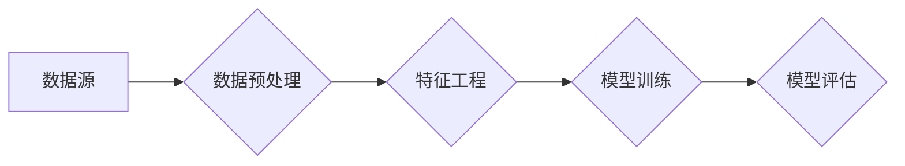

# 从数据到洞察：AI代理工作流中的分析引擎

作者：禅与计算机程序设计艺术

## 1. 背景介绍

### 1.1  AI代理与数据分析的融合趋势
近年来，人工智能(AI)技术发展迅速，各种类型的AI代理在各个领域得到广泛应用，例如聊天机器人、智能助手、推荐系统等。这些AI代理通常需要处理大量的数据，并根据数据做出智能决策。因此，数据分析在AI代理工作流中扮演着至关重要的角色，它能够将原始数据转化为有价值的洞察，帮助AI代理更好地理解环境、做出更精准的决策。

### 1.2  分析引擎在AI代理工作流中的地位和作用
分析引擎是AI代理工作流中负责数据分析的核心组件，它通常由多个模块组成，例如数据采集、数据预处理、特征工程、模型训练、模型评估等。分析引擎的目标是从海量数据中提取有价值的信息，并将其转化为AI代理可以理解和使用的形式。

### 1.3 本文的研究目标和意义
本文旨在深入探讨AI代理工作流中的分析引擎，分析其核心概念、关键技术以及未来发展趋势。通过本文的介绍，读者可以了解分析引擎的工作原理、实现方法以及实际应用，从而更好地设计和开发高效、智能的AI代理系统。

## 2. 核心概念与联系

### 2.1 数据源与数据采集
#### 2.1.1 结构化数据、半结构化数据和非结构化数据
#### 2.1.2  数据采集方法：API、数据库连接、网络爬虫等
### 2.2 数据预处理
#### 2.2.1 数据清洗：缺失值处理、异常值处理、重复值处理
#### 2.2.2 数据转换：数据标准化、数据归一化、独热编码
#### 2.2.3 数据降维：主成分分析(PCA)、线性判别分析(LDA)
### 2.3 特征工程
#### 2.3.1 特征选择：过滤法、包裹法、嵌入法
#### 2.3.2 特征提取：主成分分析(PCA)、线性判别分析(LDA)
#### 2.3.3 特征构造：根据业务场景和领域知识，人工设计新的特征
### 2.4 模型训练与评估
#### 2.4.1 机器学习模型：监督学习、无监督学习、强化学习
#### 2.4.2 模型评估指标：准确率、精确率、召回率、F1值、AUC值
### 2.5  核心概念之间的联系
下图展示了数据源、数据预处理、特征工程、模型训练与评估等核心概念之间的联系：



## 3. 核心算法原理与操作步骤

### 3.1 数据预处理算法
#### 3.1.1 缺失值处理
*   **均值/中位数/众数填充:** 使用特征的均值、中位数或众数来填充缺失值，适用于数值型特征。
*   **KNN填充:** 使用K近邻算法找到与缺失值样本最相似的K个样本，并用这K个样本对应特征的均值来填充缺失值，适用于数值型和类别型特征。
*   **模型预测填充:**  使用机器学习模型来预测缺失值，例如使用线性回归模型预测数值型特征的缺失值。
#### 3.1.2 异常值处理
*   **删除异常值:**  将异常值所在的样本直接删除，适用于异常值较少且对模型影响较大的情况。
*   **替换异常值:** 将异常值替换为正常值，例如使用上下四分位数之外的值替换异常值。
*   **将异常值视为特殊类别:** 将异常值视为一个新的类别，并将其作为模型的输入特征。
#### 3.1.3  重复值处理
*   直接删除重复值
### 3.2 特征工程算法
#### 3.2.1  主成分分析(PCA)
主成分分析是一种常用的数据降维方法，其基本思想是将高维数据投影到低维空间中，并尽可能保留原始数据的variance。
**算法步骤：**
1.  对原始数据进行标准化处理。
2.  计算数据的协方差矩阵。
3.  对协方差矩阵进行特征值分解，得到特征值和特征向量。
4.  选择前k个最大的特征值对应的特征向量，构成一个新的特征空间。
5.  将原始数据投影到新的特征空间中，得到降维后的数据。
#### 3.2.2 线性判别分析(LDA)
线性判别分析是一种监督学习的降维方法，其目标是找到一个投影方向，使得不同类别的数据在投影后的空间中尽可能分开。
**算法步骤：**
1.  计算每个类别的均值向量和总体的均值向量。
2.  计算类内散度矩阵和类间散度矩阵。
3.  计算类间散度矩阵和类内散度矩阵的特征值和特征向量。
4.  选择前k个最大的特征值对应的特征向量，构成一个新的特征空间。
5.  将原始数据投影到新的特征空间中，得到降维后的数据。

### 3.3 机器学习算法
#### 3.3.1 监督学习
*   **线性回归:** 用于预测连续值，例如预测房价、股票价格等。
*   **逻辑回归:** 用于二分类问题，例如预测邮件是否为垃圾邮件、用户是否会点击广告等。
*   **决策树:**  用于分类和回归问题，其基本思想是通过一系列的判断条件将数据集划分成不同的子集。
*   **支持向量机(SVM):** 用于分类和回归问题，其基本思想是找到一个最优的超平面将不同类别的数据分开。
#### 3.3.2  无监督学习
*   **K均值聚类:**  用于将数据划分成不同的簇，使得同一个簇内的样本尽可能相似，不同簇之间的样本尽可能不同。
*   **DBSCAN聚类:**  用于发现任意形状的簇，其基本思想是根据样本的密度进行聚类。
#### 3.3.3 强化学习
*   **Q-learning:**  一种基于值函数的强化学习算法，其目标是学习一个最优的动作值函数，使得智能体在任何状态下都能选择最优的动作。
*   **SARSA:**  一种基于策略的强化学习算法，其目标是学习一个最优的策略，使得智能体在任何状态下都能选择最优的动作。

## 4. 数学模型和公式详细讲解与举例说明

### 4.1  线性回归
线性回归模型假设目标变量与特征之间存在线性关系，其数学模型如下：

$$
y = w_0 + w_1x_1 + w_2x_2 + ... + w_nx_n + \epsilon
$$

其中，$y$ 是目标变量，$x_1, x_2, ..., x_n$ 是特征，$w_0, w_1, w_2, ..., w_n$ 是模型参数，$\epsilon$ 是误差项。

**举例说明：**
假设我们想预测房价，我们收集了房屋面积、卧室数量、浴室数量等特征，并使用线性回归模型进行预测。假设模型参数为：

*   $w_0 = 100$
*   $w_1 = 500$
*   $w_2 = 200$
*   $w_3 = 100$

则房屋面积为100平方米、卧室数量为3个、浴室数量为2个的房屋的预测价格为：

$$
y = 100 + 500 \times 100 + 200 \times 3 + 100 \times 2 = 50800
$$

### 4.2 逻辑回归
逻辑回归模型用于二分类问题，其数学模型如下：

$$
P(y=1|x) = \frac{1}{1 + e^{-(w_0 + w_1x_1 + w_2x_2 + ... + w_nx_n)}}
$$

其中，$P(y=1|x)$ 是样本$x$ 属于类别1的概率，$w_0, w_1, w_2, ..., w_n$ 是模型参数。

**举例说明：**
假设我们想预测邮件是否为垃圾邮件，我们收集了邮件长度、邮件中是否包含特定关键词等特征，并使用逻辑回归模型进行预测。假设模型参数为：

*   $w_0 = -2$
*   $w_1 = 0.1$
*   $w_2 = 1$

则邮件长度为100个字符、包含特定关键词的邮件属于垃圾邮件的概率为：

$$
P(y=1|x) = \frac{1}{1 + e^{-(-2 + 0.1 \times 100 + 1 \times 1)}} \approx 0.73
$$

### 4.3 主成分分析(PCA)
主成分分析(PCA)是一种常用的数据降维方法，其目标是找到一个新的坐标系，使得数据在新的坐标系下的方差最大化。

**数学模型：**
假设我们有n个样本，每个样本有m个特征，则数据矩阵X可以表示为：

$$
X = \begin{bmatrix}
x_{11} & x_{12} & \cdots & x_{1m} \\
x_{21} & x_{22} & \cdots & x_{2m} \\
\vdots & \vdots & \ddots & \vdots \\
x_{n1} & x_{n2} & \cdots & x_{nm}
\end{bmatrix}
$$

PCA的目标是找到一个k维的子空间，使得数据在该子空间上的投影方差最大化。

**算法步骤：**
1.  对数据矩阵X进行中心化处理，即每个特征减去其均值。
2.  计算数据矩阵X的协方差矩阵C。
3.  对协方差矩阵C进行特征值分解，得到特征值矩阵Λ和特征向量矩阵W。
4.  选择前k个最大的特征值对应的特征向量，构成一个新的坐标系。
5.  将原始数据投影到新的坐标系中，得到降维后的数据。

## 5. 项目实践：代码实例和详细解释说明

### 5.1 数据集介绍
我们使用UCI机器学习库中的Iris数据集进行演示。Iris数据集包含150个样本，每个样本有4个特征：萼片长度、萼片宽度、花瓣长度、花瓣宽度。样本属于3个类别：山鸢尾、变色鸢尾、维吉尼亚鸢尾。

### 5.2 代码实例
```python
import pandas as pd
from sklearn.model_selection import train_test_split
from sklearn.preprocessing import StandardScaler
from sklearn.linear_model import LogisticRegression
from sklearn.metrics import accuracy_score

# 加载数据集
df = pd.read_csv('https://archive.ics.uci.edu/ml/machine-learning-databases/iris/iris.data', header=None)
df.columns = ['sepal_length', 'sepal_width', 'petal_length', 'petal_width', 'class']

# 将类别型特征转换为数值型特征
df['class'] = pd.factorize(df['class'])[0]

# 将数据集划分为训练集和测试集
X_train, X_test, y_train, y_test = train_test_split(
    df.drop('class', axis=1), df['class'], test_size=0.3, random_state=42)

# 对数据进行标准化处理
scaler = StandardScaler()
X_train = scaler.fit_transform(X_train)
X_test = scaler.transform(X_test)

# 创建逻辑回归模型并进行训练
model = LogisticRegression()
model.fit(X_train, y_train)

# 对测试集进行预测
y_pred = model.predict(X_test)

# 计算模型的准确率
accuracy = accuracy_score(y_test, y_pred)
print('Accuracy:', accuracy)
```

### 5.3 代码解释
1.  首先，我们使用pandas库加载Iris数据集，并将类别型特征转换为数值型特征。
2.  然后，我们将数据集划分为训练集和测试集，并使用`StandardScaler`类对数据进行标准化处理。
3.  接下来，我们创建`LogisticRegression`模型，并使用训练集对模型进行训练。
4.  训练完成后，我们使用测试集对模型进行预测，并计算模型的准确率。

## 6. 实际应用场景

### 6.1 智能客服
智能客服系统可以使用分析引擎来分析用户的历史对话记录、购买记录等数据，从而更好地理解用户的需求，提供更精准的服务。

### 6.2 金融风控
金融机构可以使用分析引擎来分析用户的信用记录、交易记录等数据，从而识别潜在的风险用户，降低金融风险。

### 6.3 电商推荐
电商平台可以使用分析引擎来分析用户的浏览记录、购买记录等数据，从而推荐用户感兴趣的商品，提高用户体验和平台收益。

## 7. 总结：未来发展趋势与挑战

### 7.1  未来发展趋势
*   **实时分析:**  随着数据量的不断增加，实时分析的需求越来越强烈。未来的分析引擎需要具备实时处理海量数据的能力。
*   **自动化机器学习(AutoML):**  AutoML可以自动进行特征工程、模型选择、参数调优等工作，从而降低机器学习的门槛，提高模型开发效率。
*   **可解释人工智能(XAI):**  随着人工智能技术的不断发展，人们越来越关注人工智能的可解释性。未来的分析引擎需要提供可解释的分析结果，帮助人们理解模型的决策过程。

### 7.2  挑战
*   **数据质量:**  数据质量是影响分析结果准确性的重要因素。如何保证数据的准确性、完整性和一致性是分析引擎面临的一大挑战。
*   **数据安全:**  随着数据量的不断增加，数据安全问题日益突出。如何保证数据的安全性是分析引擎面临的另一大挑战。
*   **模型泛化能力:**  模型的泛化能力是指模型在未见过的数据上的表现。如何提高模型的泛化能力是分析引擎面临的一大挑战。

## 8. 附录：常见问题与解答

### 8.1  什么是AI代理？
AI代理是指能够感知环境并采取行动以最大程度地提高成功机会的自主实体。

### 8.2  什么是分析引擎？
分析引擎是AI代理工作流中负责数据分析的核心组件，它能够将原始数据转化为有价值的洞察，帮助AI代理更好地理解环境、做出更精准的决策。

### 8.3  分析引擎有哪些核心算法？
分析引擎的核心算法包括数据预处理算法、特征工程算法、机器学习算法等。

### 8.4  分析引擎有哪些应用场景？
分析引擎的应用场景非常广泛，例如智能客服、金融风控、电商推荐等。
