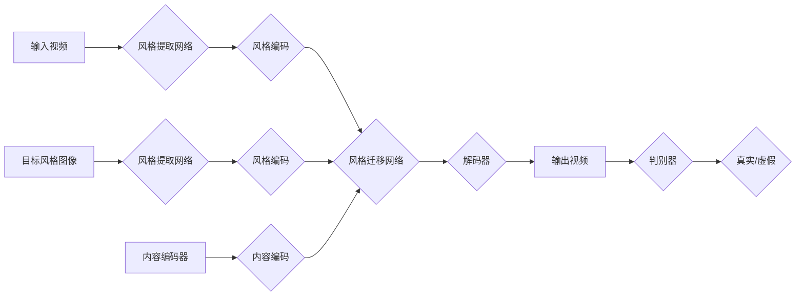

##  基于生成对抗网络的实时视频风格迁移系统设计

作者：禅与计算机程序设计艺术

## 1. 背景介绍

### 1.1 视频风格迁移概述

视频风格迁移是指将一种视频的艺术风格转移到另一种视频内容中，生成既保留原始视频内容又呈现目标风格的新视频的技术。这项技术近年来发展迅速，并在电影制作、短视频创作、游戏娱乐等领域展现出巨大的应用潜力。

### 1.2  研究现状与挑战

传统的视频风格迁移方法通常基于图像风格迁移技术，逐帧对视频进行处理。然而，这种方法存在一些问题：

* **时间一致性问题:**  由于缺乏对视频时序信息的考虑，生成的视频帧之间可能出现风格不一致、画面闪烁等问题。
* **计算效率问题:**  逐帧处理视频需要巨大的计算资源和时间成本，难以满足实时应用的需求。

### 1.3  生成对抗网络（GAN）的优势

生成对抗网络 (GAN) 是一种强大的深度学习技术，在图像生成、风格迁移等领域取得了显著成果。GAN 的主要优势在于：

* **能够生成高质量、高分辨率的图像:**  GAN 通过对抗训练的方式，可以学习到数据分布的复杂特征，从而生成逼真的图像。
* **可以实现端到端的训练:**  GAN 不需要手动设计特征提取器或损失函数，可以直接从数据中学习，简化了模型训练过程。

### 1.4  本文目标

本文旨在设计并实现一个基于生成对抗网络的实时视频风格迁移系统，以解决传统方法存在的问题。该系统将具备以下特点：

* **实时性:**  能够实时地对视频进行风格迁移，满足用户对视频处理速度的需求。
* **时间一致性:**  生成的视频帧之间风格一致，画面流畅自然。
* **高质量:**  生成的视频画面清晰、风格鲜明，具有较高的视觉质量。

## 2. 核心概念与联系

### 2.1 生成对抗网络（GAN）

#### 2.1.1 基本原理

GAN 由两个神经网络组成：生成器 (Generator) 和判别器 (Discriminator)。生成器的目标是生成尽可能逼真的假数据，而判别器的目标是区分真实数据和假数据。这两个网络在训练过程中相互对抗，不断提高自身的性能。最终，生成器可以生成以假乱真的数据，而判别器无法区分真假。

#### 2.1.2  网络结构

GAN 的网络结构灵活多样，常用的有：

* **全连接神经网络 (FCN):**  适用于低分辨率图像生成。
* **卷积神经网络 (CNN):**  适用于高分辨率图像生成，能够捕捉图像的空间特征。

#### 2.1.3  训练过程

GAN 的训练过程是一个迭代优化的过程，主要步骤如下：

1. **训练判别器:**  使用真实数据和生成器生成的假数据训练判别器，使其能够区分真假数据。
2. **训练生成器:**  固定判别器的参数，使用生成器生成假数据，并根据判别器的反馈更新生成器的参数，使其生成的数据更逼真。
3. **重复步骤 1 和 2，** 直到生成器生成的假数据能够骗过判别器。

### 2.2  视频风格迁移

#### 2.2.1  图像风格迁移

图像风格迁移是将一幅图像的艺术风格转移到另一幅图像内容中的技术。常用的图像风格迁移方法有：

* **基于神经网络的方法:**  使用神经网络提取图像的风格和内容特征，并将其融合生成新的图像。
* **基于优化的方法:**  通过迭代优化的方式，找到既保留内容信息又呈现目标风格的图像。

#### 2.2.2  视频风格迁移

视频风格迁移是在图像风格迁移的基础上，增加了对视频时序信息的考虑，以保证生成的视频帧之间风格一致。常用的视频风格迁移方法有：

* **基于光流的方法:**  使用光流信息对齐相邻帧之间的特征，以保证风格的连续性。
* **基于循环神经网络 (RNN) 的方法:**  使用 RNN 建模视频的时序信息，并将其融入到风格迁移网络中。

### 2.3  实时性优化

为了实现实时视频风格迁移，需要对模型进行优化，以提高其推理速度。常用的优化方法有：

* **模型压缩:**  使用模型剪枝、量化等技术减小模型的尺寸和计算量。
* **模型加速:**  使用 GPU 并行计算、模型蒸馏等技术加速模型的推理过程。

## 3. 核心算法原理具体操作步骤

### 3.1 系统架构

本系统采用基于生成对抗网络的视频风格迁移方法，其架构如下图所示：



系统主要模块包括：

* **风格提取网络:**  用于提取视频帧和目标风格图像的风格特征。
* **内容编码器:**  用于提取视频帧的内容特征。
* **风格迁移网络:**  将内容特征和风格特征进行融合，生成具有目标风格的视频帧。
* **解码器:**  将风格迁移网络的输出解码成图像。
* **判别器:**  用于区分真实视频帧和生成视频帧。

### 3.2  算法流程

1. **风格提取:**  使用风格提取网络分别提取输入视频帧和目标风格图像的风格特征，并将其编码成风格向量。
2. **内容编码:**  使用内容编码器提取输入视频帧的内容特征，并将其编码成内容向量。
3. **风格迁移:**  将内容向量和风格向量输入到风格迁移网络中，生成具有目标风格的特征图。
4. **解码:**  使用解码器将特征图解码成图像，得到风格迁移后的视频帧。
5. **对抗训练:**  将生成的视频帧和真实视频帧输入到判别器中，进行对抗训练，以提高生成视频帧的质量。

### 3.3  关键技术

#### 3.3.1  风格损失函数

为了保证生成的视频帧具有目标风格，需要设计合适的风格损失函数。常用的风格损失函数有：

* **Gram 矩阵损失:**  计算生成图像和目标风格图像的特征图 Gram 矩阵之间的差异。
* **风格感知损失:**  使用预训练的图像分类网络提取图像的风格特征，并计算生成图像和目标风格图像的风格特征之间的差异。

#### 3.3.2  时间一致性损失

为了保证生成的视频帧之间风格一致，需要引入时间一致性损失。常用的时间一致性损失有：

* **光流损失:**  计算相邻帧之间的光流信息，并将其作为损失函数的一部分，以惩罚风格不连续的情况。
* **循环一致性损失:**  将视频帧序列输入到风格迁移网络中，并要求生成的视频帧序列能够循环回到原始视频帧序列，以保证风格的连续性。

#### 3.3.3  实时性优化

为了提高系统的推理速度，可以采用以下优化方法：

* **模型压缩:**  使用模型剪枝、量化等技术减小模型的尺寸和计算量。
* **模型加速:**  使用 GPU 并行计算、模型蒸馏等技术加速模型的推理过程。

## 4. 数学模型和公式详细讲解举例说明

### 4.1  风格损失函数

#### 4.1.1  Gram 矩阵损失

Gram 矩阵可以用来表示图像的风格特征，其计算公式如下：

$$
G_{i, j}=\sum_{k} F_{i k} F_{j k}
$$

其中，$F$ 表示图像的特征图，$i$ 和 $j$ 表示特征图的通道索引。

Gram 矩阵损失函数定义为生成图像和目标风格图像的 Gram 矩阵之间的均方误差：

$$
L_{style}=\frac{1}{C H W} \sum_{i=1}^{C} \sum_{j=1}^{C}\left\|G_{i j}^{g}-G_{i j}^{s}\right\|_{F}^{2}
$$

其中，$G^g$ 表示生成图像的 Gram 矩阵，$G^s$ 表示目标风格图像的 Gram 矩阵，$C$ 表示特征图的通道数，$H$ 和 $W$ 表示特征图的高度和宽度。

#### 4.1.2  风格感知损失

风格感知损失函数使用预训练的图像分类网络提取图像的风格特征，并计算生成图像和目标风格图像的风格特征之间的差异。

假设预训练的图像分类网络为 $VGG-19$，其第 $l$ 层的特征图为 $F^l$，则风格感知损失函数定义为：

$$
L_{style}^{l}=\frac{1}{C_{l} H_{l} W_{l}}\left\|G^{l}\left(F^{l}(g)\right)-G^{l}\left(F^{l}(s)\right)\right\|_{F}^{2}
$$

其中，$G^l$ 表示第 $l$ 层的 Gram 矩阵计算函数，$C_l$、$H_l$ 和 $W_l$ 分别表示第 $l$ 层特征图的通道数、高度和宽度。

### 4.2  时间一致性损失

#### 4.2.1  光流损失

光流表示视频帧中像素点的运动信息，可以使用光流信息对齐相邻帧之间的特征，以保证风格的连续性。

光流损失函数定义为相邻两帧之间光流的平滑性：

$$
L_{flow}=\frac{1}{H W} \sum_{i=1}^{H} \sum_{j=1}^{W}\left\|\nabla I_{t}(i, j) \cdot\left(u_{t}(i, j), v_{t}(i, j)\right)+I_{t}(i, j)-I_{t+1}(i, j)\right\|_{2}^{2}
$$

其中，$I_t$ 和 $I_{t+1}$ 分别表示第 $t$ 帧和第 $t+1$ 帧的图像，$u_t$ 和 $v_t$ 分别表示第 $t$ 帧的水平方向和垂直方向的光流。

#### 4.2.2  循环一致性损失

循环一致性损失要求生成的视频帧序列能够循环回到原始视频帧序列，以保证风格的连续性。

循环一致性损失函数定义为生成视频帧序列和原始视频帧序列之间的均方误差：

$$
L_{cycle}=\frac{1}{T H W} \sum_{t=1}^{T} \sum_{i=1}^{H} \sum_{j=1}^{W}\left\|I_{t}(i, j)-\hat{I}_{t}(i, j)\right\|_{2}^{2}
$$

其中，$T$ 表示视频帧序列的长度，$I_t$ 表示原始视频帧序列的第 $t$ 帧，$\hat{I}_t$ 表示生成视频帧序列的第 $t$ 帧。

## 5. 项目实践：代码实例和详细解释说明

### 5.1  环境搭建

本项目使用 Python 语言和 PyTorch 深度学习框架实现。

首先，需要安装 PyTorch 和其他依赖库：

```bash
pip install torch torchvision numpy opencv-python
```

### 5.2  数据准备

本项目使用 WikiArt 数据集进行训练和测试。WikiArt 数据集包含了大量的艺术作品图像，可以用来训练风格迁移模型。

### 5.3  模型训练

```python
import torch
import torch.nn as nn
import torch.optim as optim
from torchvision import transforms
from torch.utils.data import DataLoader

# 定义风格提取网络
class StyleExtractor(nn.Module):
    # ...

# 定义内容编码器
class ContentEncoder(nn.Module):
    # ...

# 定义风格迁移网络
class StyleTransferNetwork(nn.Module):
    # ...

# 定义解码器
class Decoder(nn.Module):
    # ...

# 定义判别器
class Discriminator(nn.Module):
    # ...

# 定义风格损失函数
def gram_matrix(input):
    # ...

def style_loss(input, target):
    # ...

# 定义时间一致性损失函数
def optical_flow_loss(input1, input2, flow):
    # ...

def cycle_consistency_loss(input, target):
    # ...

# 定义模型
style_extractor = StyleExtractor()
content_encoder = ContentEncoder()
style_transfer_network = StyleTransferNetwork()
decoder = Decoder()
discriminator = Discriminator()

# 定义优化器
optimizer_G = optim.Adam(list(style_transfer_network.parameters()) + list(decoder.parameters()), lr=0.0002)
optimizer_D = optim.Adam(discriminator.parameters(), lr=0.0002)

# 定义损失函数
criterion_style = style_loss
criterion_cycle = cycle_consistency_loss
criterion_gan = nn.BCELoss()

# 数据预处理
transform = transforms.Compose([
    transforms.ToTensor(),
    transforms.Normalize((0.5, 0.5, 0.5), (0.5, 0.5, 0.5))
])

# 加载数据
train_dataset = WikiArtDataset(root='./data', transform=transform)
train_loader = DataLoader(train_dataset, batch_size=16, shuffle=True)

# 训练模型
for epoch in range(num_epochs):
    for i, (content_images, style_images) in enumerate(train_loader):
        # ...

        # 训练判别器
        # ...

        # 训练生成器
        # ...

        # 打印训练信息
        # ...

# 保存模型
torch.save(style_transfer_network.state_dict(), 'style_transfer_network.pth')
torch.save(decoder.state_dict(), 'decoder.pth')
```

### 5.4  模型测试

```python
import torch
from torchvision import transforms
from PIL import Image

# 加载模型
style_transfer_network = StyleTransferNetwork()
decoder = Decoder()
style_transfer_network.load_state_dict(torch.load('style_transfer_network.pth'))
decoder.load_state_dict(torch.load('decoder.pth'))

# 加载图像
content_image = Image.open('content_image.jpg')
style_image = Image.open('style_image.jpg')

# 数据预处理
transform = transforms.Compose([
    transforms.ToTensor(),
    transforms.Normalize((0.5, 0.5, 0.5), (0.5, 0.5, 0.5))
])
content_image = transform(content_image).unsqueeze(0)
style_image = transform(style_image).unsqueeze(0)

# 风格迁移
with torch.no_grad():
    output = style_transfer_network(content_image, style_image)
    output = decoder(output)

# 保存结果
output = output.squeeze(0).permute(1, 2, 0)
output = (output * 0.5 + 0.5).clip(0, 1)
output = Image.fromarray((output.numpy() * 255).astype(np.uint8))
output.save('output.jpg')
```

## 6. 实际应用场景

* **电影制作:**  将经典电影的艺术风格迁移到现代电影中，可以创造出独特的视觉效果。
* **短视频创作:**  为短视频添加不同的艺术风格，可以提升视频的趣味性和观赏性。
* **游戏娱乐:**  将游戏场景的风格迁移到现实世界中，可以增强游戏的沉浸感。
* **虚拟现实:**  为虚拟现实场景添加不同的艺术风格，可以提升用户的体验。

## 7. 工具和资源推荐

* **PyTorch:**  开源的深度学习框架，提供了丰富的工具和库，方便进行深度学习模型的开发和训练。
* **WikiArt 数据集:**  包含了大量的艺术作品图像，可以用来训练风格迁移模型。
* **Papers with Code:**  提供了大量的机器学习论文和代码实现，可以用来学习和参考。

## 8. 总结：未来发展趋势与挑战

### 8.1  未来发展趋势

* **更高质量、更高分辨率的视频风格迁移:**  随着深度学习技术的发展，未来将会出现更高质量、更高分辨率的视频风格迁移技术。
* **更精准的风格控制:**  未来将会出现更精准的风格控制技术，可以实现对视频风格的精细调整。
* **更广泛的应用场景:**  随着视频风格迁移技术的不断发展，其应用场景将会越来越广泛。

### 8.2  挑战

* **实时性:**  实时视频风格迁移需要巨大的计算资源，如何提高模型的推理速度是一个挑战。
* **时间一致性:**  如何保证生成的视频帧之间风格一致是一个挑战。
* **风格控制:**  如何实现对视频风格的精细控制是一个挑战。

## 9. 附录：常见问题与解答

### 9.1  如何提高视频风格迁移的质量？

* 使用更大规模的数据集进行训练。
* 使用更深的网络结构。
* 设计更合理的损失函数。

### 9.2  如何保证视频风格迁移的实时性？

* 使用模型压缩技术减小模型的尺寸和计算量。
* 使用模型加速技术加速模型的推理过程。

### 9.3  如何实现对视频风格的精细控制？

* 使用条件生成对抗网络 (CGAN) 等技术，将风格信息作为条件输入到网络中，以控制生成的视频风格。